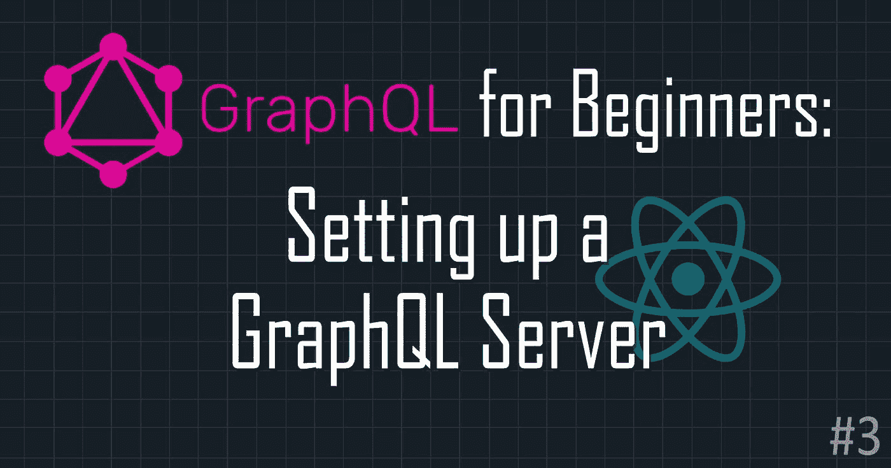
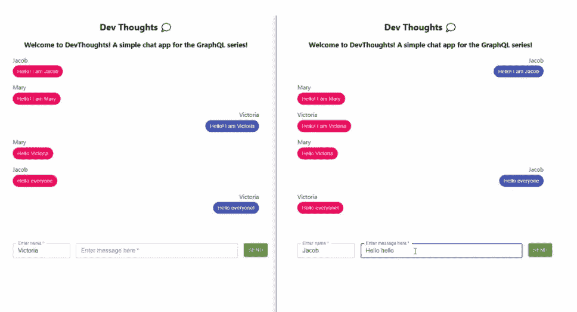
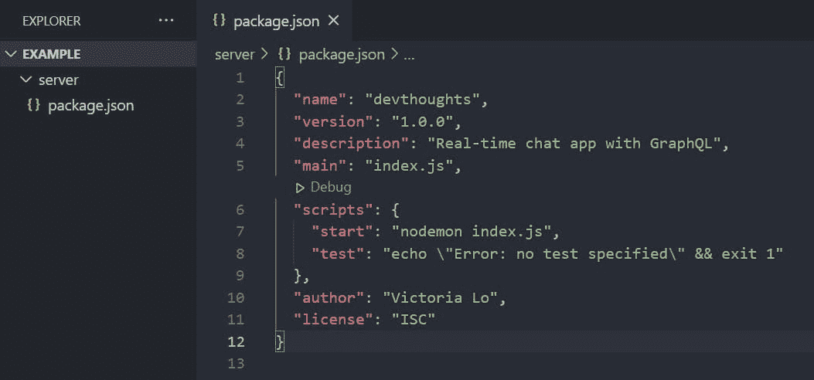
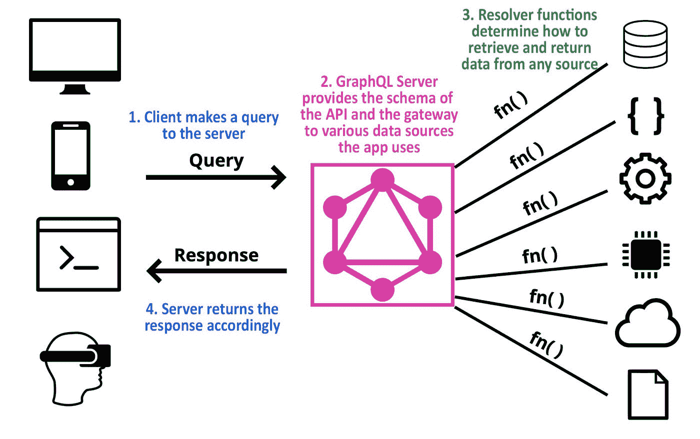
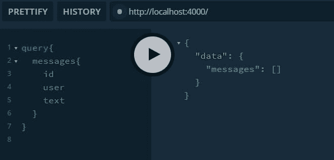
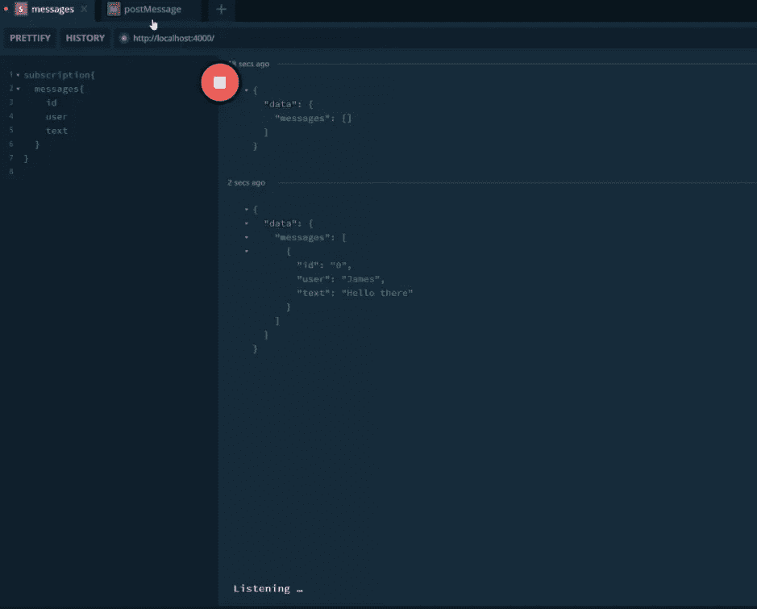

# GraphQL 初学者:设置 GraphQL 服务器

> 原文：<https://javascript.plainenglish.io/graphql-for-beginners-setting-up-graphql-server-ba48a3cbc184?source=collection_archive---------13----------------------->

## GraphQL 初学者友好系列🔰让我们开始构建我们的应用程序吧！第 3 部分:设置 GraphQL 服务器



欢迎回到 [GraphQL 初学者](https://lo-victoria.com/series/graphql)！这是一个对初学者友好的系列，介绍了 GraphQL 的基本概念，以及如何将其连接到前端框架，如使用 Apollo 的 React。

在这一部分中，我们将开始使用 React 和 Apollo 客户端为一个简单的聊天应用程序构建一个 GraphQL 服务器。

*先睹为快:*



> 如果你没有看过前面的部分，请在这里看一下[。](https://victoria2666.medium.com/graphql-for-beginners-subscriptions-schemas-and-servers-c4b440e3b2aa?sk=0141fe163f173af76e407e8688c3fa8f)

# 设置 GraphQL 服务器

首先，我们需要一个 GraphQL 服务器来接收和发送查询给我们的客户机。

要回顾 GraphQL 服务器，请随意阅读本系列的第 2 部分。

# 步骤 1:初始化项目

确保您的计算机上安装了 Node.js。如果没有，在这里安装[。](https://nodejs.org/en/)

然后，在终端中使用以下命令创建一个新项目:

```
mkdir project   // create project folder
mkdir project/server    // create server folder
cd project/server    // move to server folder
npm init    // create package.json in the server folder
```

您当前的项目文件夹应该如下所示:



如截图所示，我继续在`scripts`下添加了`"start": nodemon index.js`命令。这样我就可以通过运行`npm start`来运行带有 nodemon 的服务器。

# 步骤 2:安装软件包

在本教程中，我们将使用 graphql-yoga 设置一个 GraphQL 服务器。

它很容易设置，并包括内置的 Websockets 订阅支持，我们将需要我们的聊天应用程序。

确保我们当前的目录是`server`文件夹。让我们用以下命令安装它:

```
npm install graphql-yoga
```

# 步骤 3: index.js 和 Schema

然后，在`server`文件夹中创建一个`index.js`文件。

```
touch index.js
```

这是我们将在中设置 GraphQL 服务器的入口点。在顶部的`index.js`上，让我们导入之前安装的`graphql-yoga`包。

```
const { GraphQLServer } = require("graphql-yoga");
```

接下来，我们可以通过创建类型定义来定义我们的 GraphQL 模式:

```
const typeDefs = `
  type Message {
    id: ID!
    user: String!
    text: String!
  }
  type Query {
    messages: [Message!]
  }
  type Mutation {
    postMessage(user: String!, text: String!): ID!
  }
  type Subscription {
    messages: [Message!]
  }
`;
```

> 如果您需要对模式进行回顾，请随意阅读本系列的第 2 部分。

在上面的模式中，我们有一个名为 Message 的对象类型，带有`id`、`user`和`text`字段。这个对象类型将是我们在这个应用程序上发送和接收的消息。`id`是每条消息的唯一标识符。`user`只是发送者的名字，而`text`是消息的内容。

接下来，我们有一个查询类型来获取所有消息。查询`messages`将返回消息类型的数组，如方括号所示。

在我们的查询类型下面，我们有一个突变类型，允许用户在应用程序中发送消息。`postMessage`变异接受两个必需的参数:`user`和`text`，然后返回新发布消息的`id`。

最后，我们有一个订阅类型，它监听`messages`中的变化，并在发生变化时返回所有消息类型的数组。这让我们可以在新消息发送后实时更新 UI。

# 第四步:发布订阅

`graphql-yoga`包含 PubSub，一个公开简单发布和订阅 API 的类。这是实现我们的订阅类型所必需的。

首先，让我们将它包含在`index.js`的顶部，然后创建一个新的 PubSub 实例。

```
const { GraphQLServer, PubSub /*add this*/ } = require("graphql-yoga");//create new instance
const pubsub = new PubSub();
```

# 步骤 5:解析函数

正如在本系列的[前一部分](https://lo-victoria.com/graphql-for-beginners-subscriptions-schemas-and-servers)中提到的，解析器函数是决定模式如何检索和返回数据的逻辑。您可以将模式视为 GraphQL API 的结构，而解析器函数实现 API 的行为。



我们需要为每个查询、变异和订阅类型编写一个解析器函数，以便指示服务器如何获取、发布和侦听数据中的更改。

首先，让我们创建一些变量来存储我们的`messages`和`subscribers`数据。

```
const messages = []; //stores all the messages sent
const subscribers = []; //stores any new messages sent upon listening//to push new users to the subscribers array
const onMessagesUpdates = (fn) => subscribers.push(fn);
```

接下来，我们创建包含所有解析器函数的`resolver`对象。

```
const resolvers = {
  //add all the resolver functions here
}
```

# 解析旋变函数

让我们写我们的第一个解析器函数！在我们继续之前，让我们来谈谈解析器函数的结构。它可以接受 4 个参数:

```
resolver_name: (parent, args, context, info) => {
          return something;
        },
```

## 1.`parent`

解析器函数中的第一个参数是`parent`(有时称为`root`)。这个`parent`指的是操作的根或前一个解析器执行。这是什么意思？

> 如果您需要对 GraphQL 查询的语法进行回顾，请阅读本系列的第 1 部分。

正如您可能注意到的，GraphQL 查询是嵌套的。解析函数是在每个嵌套级别从上到下执行的。`parent`返回上一次执行函数的结果。如果查询只有一个级别，它将返回 null。

## 2.`args`

`args`指的是为执行我们的查询而传入的参数。例如，我们的`postMessage`变异接受`user`和`text`作为参数。我们将把这些传递到解析器函数中，稍后我们会写这个函数。

## 3.`context`

它允许每一级的解析器能够共享它们可以读取和写入的信息。

## 4.`info`

包含所有查询信息的抽象语法树(AST)对象。它不在本系列的讨论范围之内。点击阅读更多详细信息[。](https://www.prisma.io/blog/graphql-server-basics-demystifying-the-info-argument-in-graphql-resolvers-6f26249f613a)

# 编写我们的第一个解析器

现在让我们开始为我们的查询`messages`编写一个解析器函数。确保解析器返回的类型与步骤 3 中模式中定义的类型相同是很重要的。

所以我们的查询类型`messages`返回一个消息对象数组。因此，它的解析器功能应该如下:

```
//add inside the resolvers object
  Query: { //gets all messages
    messages: () => messages, //returns the messages array
  },
```

这个解析器函数非常简单。我们不需要传递任何参数。我们只需要返回包含所有消息对象的消息数组。让我们用我们的突变类型尝试一个更难的。

# 突变分解器

我们的突变被定义为:

```
//in our schema
  type Mutation {
    postMessage(user: String!, text: String!): ID!
  }
```

变异`postMessage`接受两个必需的字符串(即用户和文本)作为参数，并返回一个 ID 类型。因此，它的解析器函数如下所示:

```
//add this below the Query resolver Mutation: { //post new message and returns id
    postMessage: (parent, { user, text }) => {
      const id = messages.length; //create the id for new message
      messages.push({id, user, text}); //push Message object to messages array
      return id; //return the id
    },
  }
```

因此，我们将`user`和`text`作为解析器函数的`args`传入。然后，我们为新消息创建一个新的`id`，它将是消息数组的长度。我们将一个新的消息对象及其所有相关字段:id、用户和文本推送到消息数组中。最后，如我们的模式中所定义的，我们只返回 id。

到目前为止还好吗？让我们在这个项目中编写最后也是最复杂的解析器函数。

# 订阅:最终解析功能

我们名为`messages`的订阅类型监听我们的消息数组中的变化(也就是说，当一个新消息被推入数组时)并返回更新后的消息数组。

订阅的解析器在 3 个方面与查询和变异略有不同:

1.  它返回一个`AsyncIterator`，服务器用它将新的事件数据推送到客户端。
2.  它是一个带有`subscribe`方法的对象(即`messages`)。
3.  它使用`pubsub`实例作为`context`(解析器函数的第三个参数)来访问处理订阅所需的方法(即 pubsub.publish()和 pubsub.asyncIterator())

> 简而言之，订阅解析器不是一个函数，而是一个具有 subscribe 方法的对象，它返回 AsyncIterable。

总而言之，我们的订阅解析器功能将是:

```
Subscription: {
    messages: {
      subscribe: (parent, args, { pubsub }) => {
        //create random number as the channel to publish messages to
        const channel = Math.random().toString(36).slice(2, 15); //push the user to the subscriber array with onMessagesUpdates function and 
        //publish updated messages array to the channel as the callback
        onMessagesUpdates(() => pubsub.publish(channel, { messages })); //publish all messages immediately once a user subscribed
        setTimeout(() => pubsub.publish(channel, { messages }), 0); //returns the asyncIterator
        return pubsub.asyncIterator(channel);
      },
    },
  },
};
```

现在，我们只需要在突变解析器函数中添加一行代码。这提醒我们的订阅在每次新消息被推送到变异下时调用回调函数。

```
Mutation: { 
    postMessage: (parent, { user, text }) => {
      const id = messages.length;
      messages.push({ id, user, text });
      subscribers.forEach((fn) => fn()); //add this line
      return id;
    },
  },
```

# 步骤 6:创建服务器

在这个脚本的底部，我们用我们的 typeDefs(即模式)、解析器函数和 pubsub 作为上下文来初始化`server`。

```
const server = new GraphQLServer({ typeDefs, resolvers, context: { pubsub } });
server.start(({ port }) => {
  console.log(`Server on http://localhost:${port}/`);
});
```

# 结果

如果一切正常，我们应该能够使用以下命令运行我们的服务器:

```
node index.js
```

默认情况下，GraphQL playground 将在`http://localhost:4000`加载。我们可以尝试一个简单的查询，如下图所示。



# 试验

我们可以进行测试查询来获取、发布和订阅消息！让我们在订阅消息的同时发布一个简单的消息。

首先，创建一个订阅查询，如下图所示。当我们运行查询时，它最初应该返回一个空数组。现在，它正在监听新消息的到来。

因此，让我们发布一个带有突变查询的新消息。在操场上打开一个新标签，运行变异。

太好了，新消息已经发布。如果我们返回到我们的 subscription 选项卡，我们会看到它已经成功地返回了新数据。



如上图所示，每次发送新消息时，订阅都将返回新的消息数组。这将是我们如何使用订阅来实现我们的实时聊天应用程序的最后一部分。是不是很酷？

# 敬请关注

非常感谢你阅读这篇长文。希望到目前为止已经很有见地了。请随时查看下面的“阅读更多”部分，以了解更多有关今天用于构建我们的服务器的概念。

剩下的就是让客户端去做这些查询，而不是在操场上做。这将出现在下一个也是最后一部分，所以请保持关注！干杯！

点击这里阅读[第 4 部分:用 GraphQL 和 Apollo React 构建实时聊天应用](https://victoria2666.medium.com/graphql-for-beginners-build-real-time-chat-app-with-apollo-client-and-react-278d22e1d135?sk=73e5b7107a3ae303284936b3c194a470)！

# 阅读更多

*   [第 1 部分:GraphQL 简介](https://victoria2666.medium.com/graphql-for-beginners-introduction-90c78a56a96e?sk=ee4885321344329d8af3096f9074427b)
*   [第 2 部分:模式、订阅和服务器](https://victoria2666.medium.com/graphql-for-beginners-subscriptions-schemas-and-servers-c4b440e3b2aa?sk=0141fe163f173af76e407e8688c3fa8f)
*   GitHub 回购项目:[https://github.com/victoria-lo/devthoughts](https://github.com/victoria-lo/devthoughts)

# 参考

*   [graphql-yoga GitHub](https://github.com/prisma-labs/graphql-yoga)
*   [发布订阅](https://www.apollographql.com/docs/graphql-subscriptions/setup/)
*   [解析器功能](https://www.howtographql.com/graphql-js/2-a-simple-query/)
*   [关于解析器的信息参数](https://www.prisma.io/blog/graphql-server-basics-demystifying-the-info-argument-in-graphql-resolvers-6f26249f613a)
*   [关于订阅](https://github.com/apollographql/graphql-subscriptions)