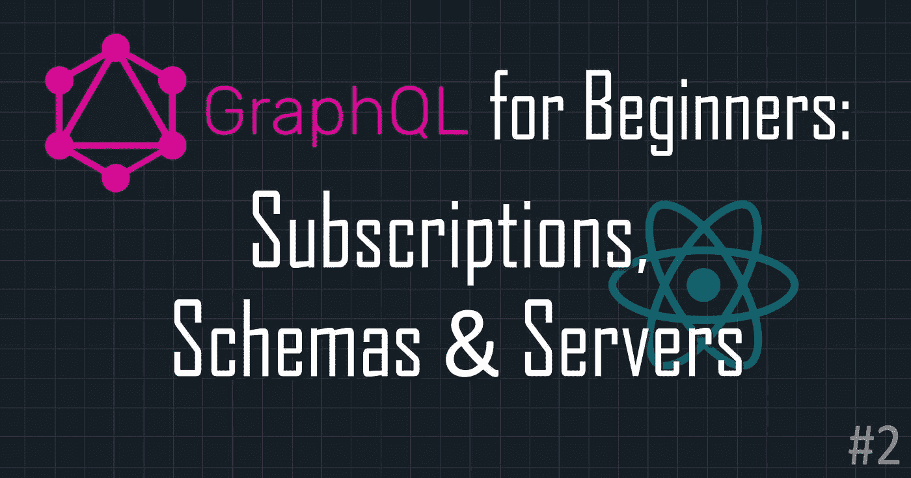
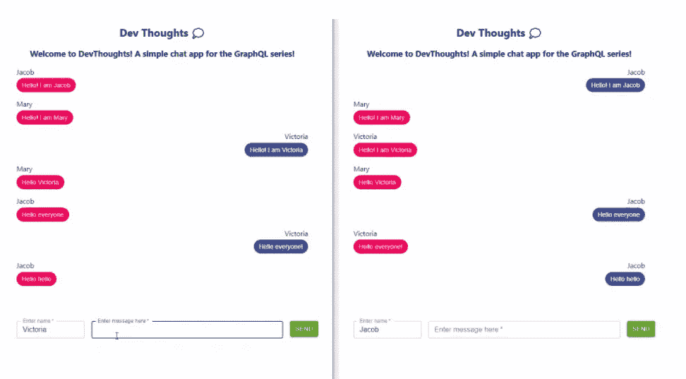
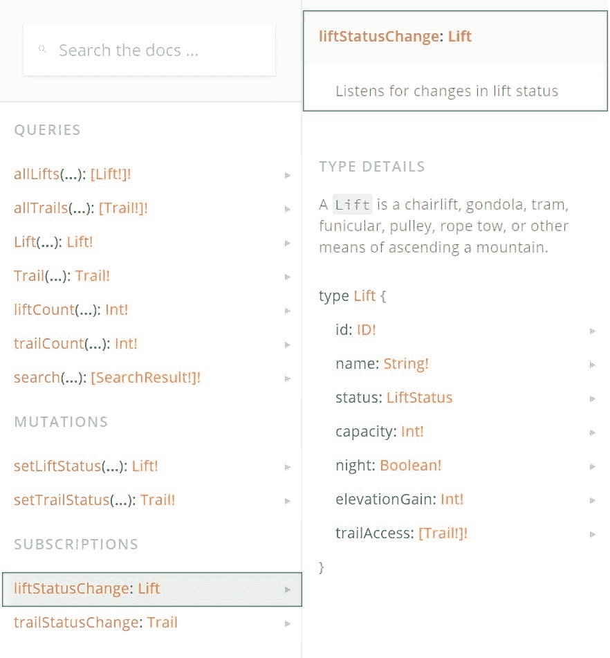
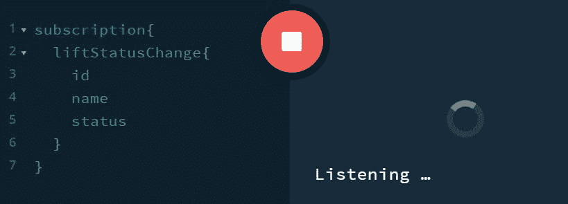
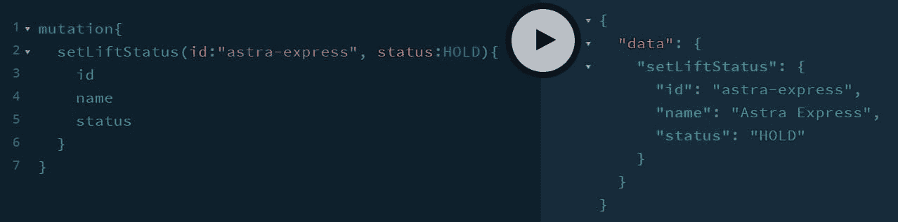
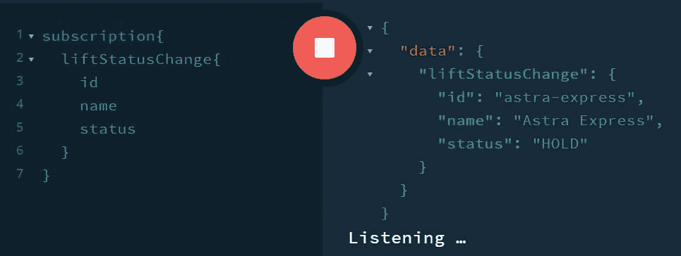
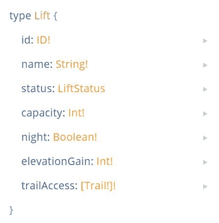
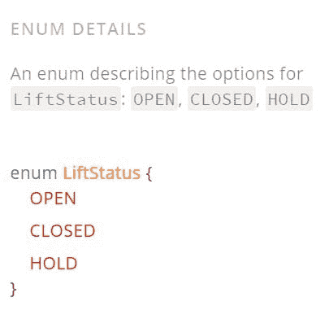
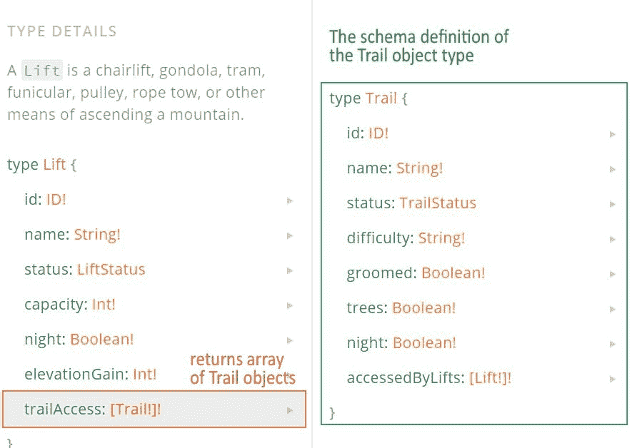
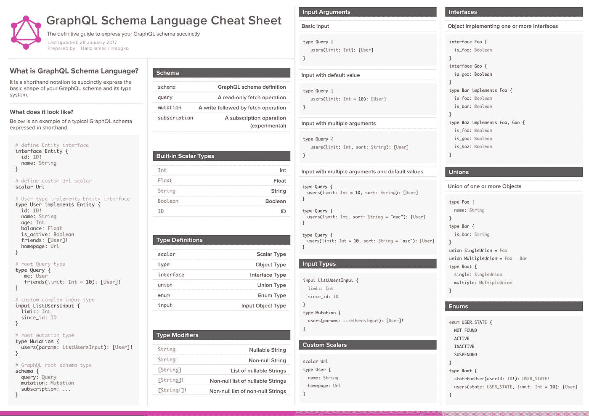

# 面向初学者的 GraphQL:订阅、模式和服务器

> 原文：<https://javascript.plainenglish.io/graphql-for-beginners-subscriptions-schemas-and-servers-c4b440e3b2aa?source=collection_archive---------16----------------------->

## GraphQL 初学者友好系列🔰让我们从停止的地方继续！第 2 部分:GraphQL 模式、订阅和服务器



欢迎回到 [GraphQL 初学者](https://lo-victoria.com/series/graphql)！这是一个对初学者友好的系列，介绍了 GraphQL 的基本概念，以及如何将其连接到前端框架，如使用 Apollo 的 React。在本系列结束时，您将能够使用 GraphQL、React 和 Apollo 构建一个简单的聊天应用程序。

*先睹为快:*



如果您还没有阅读第 1 部分，请在这里阅读[。](https://victoria2666.medium.com/graphql-for-beginners-introduction-90c78a56a96e?sk=ee4885321344329d8af3096f9074427b)

# 捐款

在第 1 部分中，我们了解了 GraphQL 支持的两种操作:查询和突变。第三种类型被称为订阅。

订阅是用于在指定事件时将数据从服务器推送到客户端的操作。像查询一样，它们获取数据并返回数据，但只在发生特定变化时。因此，订阅通过与 GraphQL 服务器的活动连接(即通过 WebSocket)来工作，它将侦听特定的事件，并在事件被触发时返回数据。

# 它是如何工作的

让我们回到我们的雪牙滑雪场 API 示例，位于:[snowtooth.moonhighway.com](https://snowtooth.moonhighway.com/)。

在 Docs 面板中的 Subscriptions 下，我们可以看到这个 API 有两个可用的订阅操作。让我们点击`LiftStatusChange`，它监听 Lift 中的状态变化并返回 Lift 对象。



让我们首先订阅这个操作，然后更改一个电梯的状态，看看订阅是如何工作的。

在下图中，我们可以看到，单击执行按钮时，操作继续运行，单词“Listening”显示在底部，表示订阅现在正在积极等待一个`LiftStatusChange`事件。



现在让我们用变异`setLiftStatus`来改变升降机的状态。

> 阅读[第 1 部分](https://victoria2666.medium.com/graphql-for-beginners-introduction-90c78a56a96e?sk=ee4885321344329d8af3096f9074427b)了解更多关于突变的细节



在这个例子中，我将 id 为`astra-express`的电梯更改为 HOLD 状态。回到 subscription 选项卡，您将看到一个数据对象已经返回，因为侦听器检测到了一个 Lift 状态更改。



并正确返回电梯状态改变的数据:`astra-express`。

# 为什么使用订阅？

订阅是有用的，这样我们可以实时更新数据给我们的客户。

在我们将要构建的聊天应用程序的上下文中，使用查询意味着我们需要在每次用户发布消息时获取并返回聊天数据。相反，订阅将允许新发布的消息在侦听器检测到新消息发布时自动返回。

# 计划

到目前为止，我们已经从现有的 GraphQL APIs(如 [hashnode API](https://api.hashnode.com/) 和 [Snow Tooth Ski Resort API](https://snowtooth.moonhighway.com/) )中了解了 GraphQL 查询、变异和订阅。

对于我们的聊天应用程序，我们需要从头开始构建自己的 GraphQL API。为此，我们需要定义一个模式。模式是 GraphQL API 的蓝图。它定义了组成 API 的类型和它们之间的交互。学习模式定义语言(SDL)将允许您为 GraphQL APIs 创建健壮的类型系统。

# 这都是关于类型的

为了构建模式，我们首先需要定义类型的类别。类型可以是以下类别之一:

## 1.标量类型

回顾本系列的第 1 部分，标量类型有 ID、Float、Int、String 或 Boolean。

## 2.对象类型

有自己属性(字段)的类型，每个字段也有自己的类型。

## 3.查询类型

入口点进行查询，并定义从该查询返回的数据。

## 4.突变类型

创建或更新数据的入口点，然后返回指定的数据。

## 5.订阅类型

允许订阅特定事件或特定数据更改的入口点。

## 6.枚举类型

类型值的预定义和受限选项列表。

## 7.输入类型

允许传递一个对象作为查询/变异的参数。

## 8.工会类型

允许字段返回一个或多个对象类型。

## 9.接口类型

可以由一个或多个对象类型实现的一组属性(字段)。

# 一个例子

我们的雪牙滑雪场 API 有一个 Lift 对象类型。它的类型将在模式中定义。“文档”面板显示了该类型的外观。



我们可以看到它的一些属性像`id`和`name`是标量类型。而其他的像`status`返回`LiftStatus`，一个枚举类型。



方括号表示返回值将是一个数组。所以`trailAccess`返回一组踪迹类型。并且踪迹类型是具有其自身属性的对象类型。



# SDL 小抄

在本系列的下一部分，我们将学习如何为我们的聊天应用程序项目构建我们自己的模式。现在，你可以简单浏览一下这个有用的 SDL 小抄。



# 服务器

为了让客户端从 GraphQL API 查询数据，GraphQL 服务器将是一个简单且常见的解决方案。它由两件事组成:

1.  GraphQL 模式
2.  解析器功能

如前所述，模式描述了 API 中的类型(即类型名称、其属性和每个属性的类型)。

解析器函数告诉 API 在该类型的每个属性中返回什么以及如何返回数据。因此，模式中的每个属性(字段)都由一个解析器函数支持，该函数负责返回该字段中的数据。


# 一个例子

在 Snow Tooth API 中，有一个查询类型`allLifts`返回一个 Lift 对象数组。类型模式看起来像这样:

```
type Query {
   allLifts: [Lift!]!
}
```

字段`allLifts`将有一个解析函数，如下所示:

```
allLifts: () =>{
  return lifts;
}
```

在构建聊天应用程序时，我们将学习如何更详细地构造解析器函数。这只是 GraphQL 服务器及其解析器功能如何工作的一般概念。

# 选择您的 GraphQL 服务器

设置 GraphQL 服务器有许多选项。这篇[文章](https://dev.to/yeeiodev/differences-between-express-graphql-apollo-and-graphql-yoga-3m82)比较了 GraphQL 服务器的 3 种最常见选择:

1.  快速+快速-图表 ql +图表 ql
2.  apollo-server + graphql
3.  graph QL-瑜伽

在本系列的下一部分中，我们将使用`graphql-yoga`来设置聊天应用程序的 GraphQL 服务器。但是你可以自由探索不同的选择，在你的空闲时间亲自尝试。

# 待续

感谢阅读这篇文章。希望到目前为止有所帮助。现在我们终于了解了这个项目所需的关于 GraphQL 的所有概念，在下一部分，我们将开始构建我们的聊天应用程序！

点击这里阅读[第 3 部分:设置 GraphQL 服务器](https://victoria2666.medium.com/graphql-for-beginners-setting-up-graphql-server-ba48a3cbc184?sk=330d2a07f119d5734ae2424a417eecd1)！

同时，如果您想更深入地探索本文中的概念，请查看下面的阅读更多部分。敬请期待！

# 阅读更多

*   [第 1 部分:GraphQL 简介](https://victoria2666.medium.com/graphql-for-beginners-introduction-90c78a56a96e?sk=ee4885321344329d8af3096f9074427b)
*   [第 3 部分:设置 GraphQL 服务器](https://victoria2666.medium.com/graphql-for-beginners-setting-up-graphql-server-ba48a3cbc184?sk=330d2a07f119d5734ae2424a417eecd1)
*   [第 4 部分:用 GraphQL 和 Apollo React 构建一个实时聊天应用](https://lo-victoria.com/graphql-for-beginners-build-real-time-chat-app-with-apollo-client-and-react)
*   [订阅](https://www.apollographql.com/docs/react/data/subscriptions/)
*   [关于模式的更多信息](https://www.apollographql.com/docs/apollo-server/schema/schema/)
*   [不同 GraphQL 服务器对比文章](https://dev.to/yeeiodev/differences-between-express-graphql-apollo-and-graphql-yoga-3m82)
*   GitHub 回购项目:【https://github.com/victoria-lo/devthoughts T3