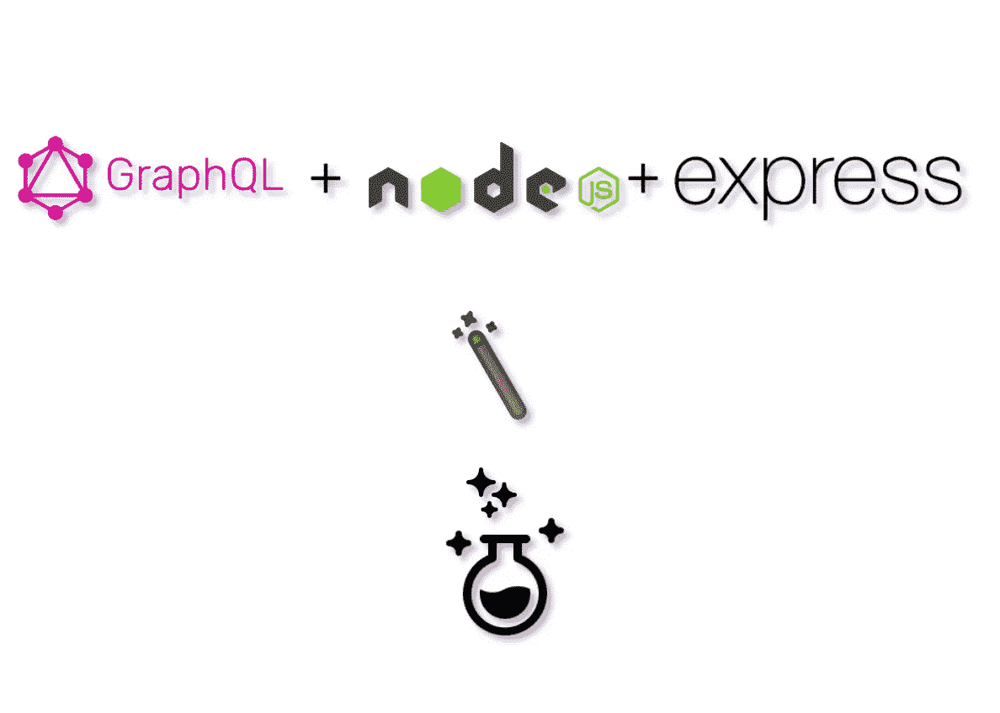
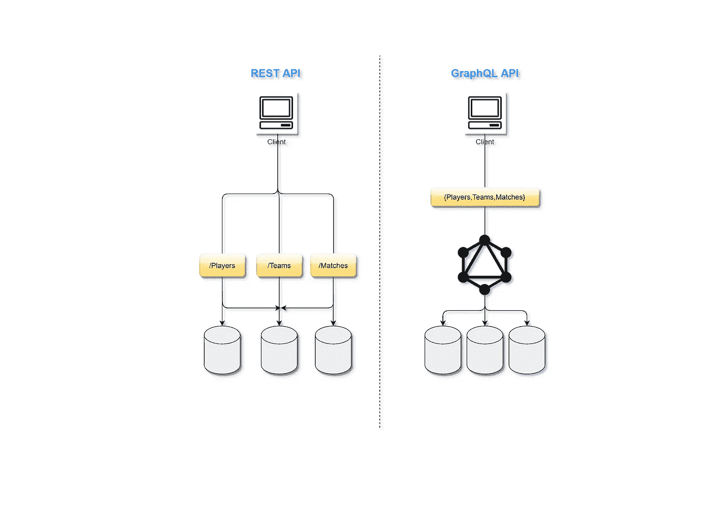
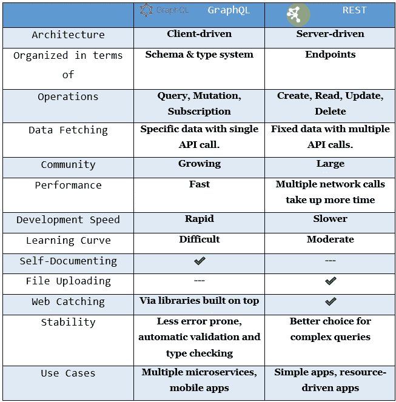

# 如何使用 Node.js 和 Express 创建 GraphQL API

> 原文：<https://javascript.plainenglish.io/graphql-with-node-js-express-js-51f94ad752ad?source=collection_archive---------6----------------------->

## 具有关于 Node.js 和 Express.js 的 GraphQL 的中级知识

## **简介**

本文的目的是提供关于 GraphQL 及其在 Node.js 中的用法的完整见解，并讨论它的显著特性及其一些优点和缺点。



GraphQL’s Magic

## **graph QL 是什么？**

GraphQL 是一种 API 查询语言，也是一种用现有数据完成这些查询的运行时语言。GraphQL 为 API 中的数据提供了完整且易于理解的描述，使客户能够准确地要求他们需要的东西，使 API 更容易随时间发展，并支持强大的开发工具。

> GraphQL 通常被描述为前端导向的 API 技术，因为它允许前端开发人员以比以往更简单的方式请求数据。

这种查询语言的目标是以本能的和可调整的格式来制定客户应用程序，以描述它们的数据先决条件以及交互。最棒的是，这种语言不依赖于任何特定的数据库管理系统，并且实际上受您当前的数据和编码的支持。

## **谁开发的？**

GraphQL 的起源故事可以追溯到行业向移动的转变。当时，脸书的移动战略(即在移动设备上采用 HTML5)由于网络使用率高的问题而未能奏效。因此，脸书决定使用本地技术从头开始重建 iOS 应用程序。

脸书的*新闻提要*在手机上实现的主要问题。这不仅仅是检索一个故事，谁写的，它说了什么，评论列表，以及谁喜欢这个帖子这么简单。每个故事都是相互联系、嵌套和递归的。现有的 API 并不允许开发人员在移动设备上展示丰富的、类似新闻提要的体验。它们没有层次结构，不允许开发人员选择他们需要的内容，也不具备显示异构提要故事列表的能力。

2012 年，脸书决定他们需要建立一个新的新闻订阅 API 来构建脸书移动应用。这是 GraphQL 开始成形的时候，8 月中旬，iOS 5.0 版的脸书发布了新的 GraphQL 技术。它允许开发者通过利用其数据获取能力来减少网络使用。在接下来的一年半时间里，GraphQL API 的应用范围扩大到了脸书 iOS 应用的大部分，除了新闻提要。2015 年，GraphQL 规范与 JavaScript 中的参考实现一起首次发布。

> GraphQL 规范于 2015 年开源。它现在由 GraphQL 基金会监管。

## **graph QL 和 REST 的区别**



API calls differences between GraphQL and REST.



Difference between GraphQL and REST.

## **让我们使用 GraphQL** 创建一个简单的“课程 API”

**1。首先让我们创建一个 Node.js 项目并安装一些包。**

```
npm init -ynpm install express express-graphql graphql nanoid
```

> 我们使用 nanoid 来生成随机 id，因为我们不使用任何数据库。

**2。安装 basic Express 服务器。**

索引. js

**3。创建 schema.js 并定义查询类型和变异。**

schema.js

如您所见，您可以创建不同类型的结构，GraphQL 提供了更多的类型。对于突变，我们使用输入。

这里的`!`是用来使那个特定的字段在突变时成为必需的。

**4。为查询和变异创建 resolver.js。**

resolver.js

**5。返回 index.js 并进行 get '/graphql '路由。**

索引. js

**6。让我们从 API 中获取数据，看看 GraphQL 的魔力。**

访问您的 localhost:port，您将看到 GraphQL 提供的 Graphiql GUI。

在这里，您可以通过变异插入数据，并通过查询获取数据。

就这样，您已经创建了您的第一个 GraphQL API😁。

## **graph QL 的缺点**

*   GraphQL 为熟悉 REST APIs 的开发人员提供了一条学习曲线。
*   GraphQL 将大部分数据查询工作转移到了服务器端，这增加了服务器开发人员的复杂性。
*   根据实现方式的不同，GraphQL 可能需要与 REST APIs 不同的 API 管理策略，尤其是在考虑速率限制和定价时。
*   缓存比 REST 更复杂。
*   API 维护人员还有一项额外的任务，就是编写可维护的 GraphQL 模式。

## **结论**

尽管 GraphQL 解决了许多问题，但它仍然存在缺陷和不足。例如，验证或策略以及缓存只是其中的几个例子。因为它本质上是不自信的，它不会指导用户如何应用这些层。除此之外，后端服务器和您的客户端之间的非具体层的存在可能会非常令人不安。

但好消息是，你可以在一个项目中同时使用 REST 和 GraphQL，下面给出的 checkout 链接可以帮助你在这个方向上做进一步的学习。

许多开发人员对使用 Apollo 的 GraphQL 给出了积极的评价，所以也来看看这个吧。

## **进一步了解的一些有用链接**

GraphQL

[](https://graphql.org/learn/) [## GraphQL 简介

### 一种用于 API 的查询语言——graph QL 提供了 API 中数据的完整描述，为客户提供了…

graphql.org](https://graphql.org/learn/) 

GraphQL 和 REST 在一起。

[](https://medium.com/swlh/graphql-api-or-rest-api-why-not-have-both-c4171e68900a) [## GraphQL API 还是 REST API？为什么不两者兼得呢？

### GraphQL2REST:从现有的 GraphQL API 自动生成 RESTful API

medium.com](https://medium.com/swlh/graphql-api-or-rest-api-why-not-have-both-c4171e68900a) 

查询、变异和订阅。

[](https://graphql.org/learn/queries/) [## 查询和突变

### 一种用于 API 的查询语言——graph QL 提供了 API 中数据的完整描述，为客户提供了…

graphql.org](https://graphql.org/learn/queries/) 

教程项目 GitHub 资源库。

[](https://github.com/JAYDIPSINH27/GraphQL_BasicCourseApi) [## GitHub-jaydipsinh 27/GraphQL _ Basic Course Api:使用 graph QL、Nodejs 和…

### 使用 GraphQL、Nodejs 和 Expressjs 创建了基础课程 Api-GitHub-jaydipsinh 27/graph QL _ BasicCourseApi:创建了…

github.com](https://github.com/JAYDIPSINH27/GraphQL_BasicCourseApi) 

阿波罗的 GraphQL。

[](https://www.apollographql.com/) [## 阿波罗图表

### Apollo 数据图平台——将 API、微服务和数据库统一到一个数据图中，您可以使用 GraphQL 进行查询

www.apollographql.com](https://www.apollographql.com/) 

**创作人:**[马吉夫·阿明](https://medium.com/u/fe629f884f0?source=post_page-----51f94ad752ad--------------------------------)[巴提克·苏达尼](https://medium.com/u/8bd2a16d04d6?source=post_page-----51f94ad752ad--------------------------------)[卡兰戈斯瓦米](https://medium.com/u/281dabc361c3?source=post_page-----51f94ad752ad--------------------------------)[布瓦·萨希尔](https://medium.com/u/c09f44b89eac?source=post_page-----51f94ad752ad--------------------------------)

*更多内容请看*[***plain English . io***](http://plainenglish.io)