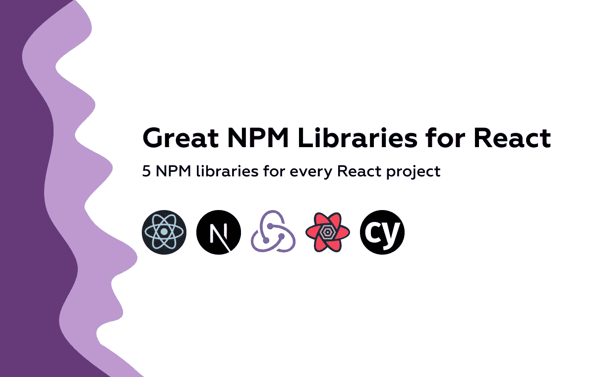
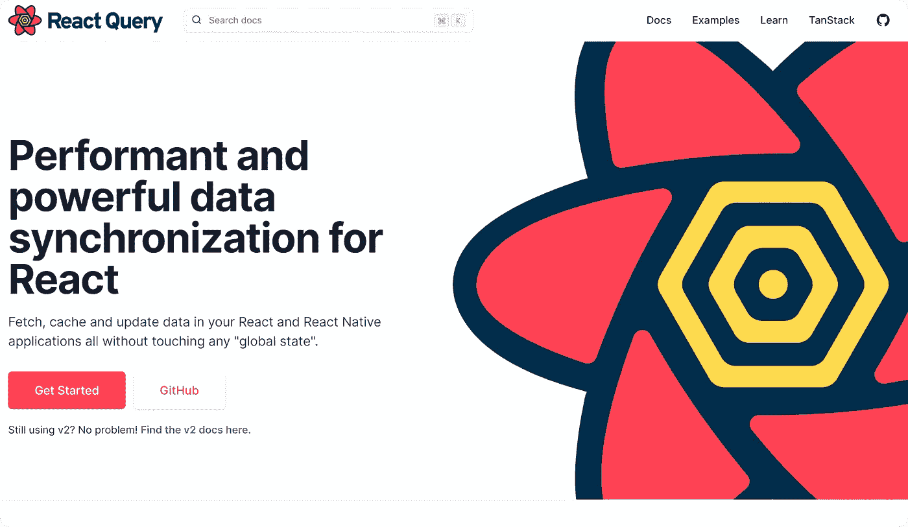

# React 的大 NPM 图书馆

> 原文：<https://javascript.plainenglish.io/great-npm-libraries-for-react-355efb720c96?source=collection_archive---------23----------------------->

## 每个 React 项目有 5 个 NPM 图书馆

如今，每个项目都有大量的依赖项，像 [React](https://reactjs.org/) 这样的前端库是黑洞大小的 **node_modules** 文件夹的完美候选。有了 [NPM](https://www.npmjs.com/) ，你可以轻松下载库并保持版本更新，这多少有点麻烦。

让我们直接跳到我认为最酷的库，大多数 React 项目都会从中受益匪浅。

# [1。Next.js](https://nextjs.org/docs/getting-started)

使用 spa 的一个不幸的缺点是缺乏 SEO。大多数抓取网站的 SEO 机器人不运行 JS，因此它们会看到一个空页面，这极大地影响了评级。Next.js 和其他框架为您的 React 应用程序提供了现成的 SSR(服务器端呈现)/ SSG(静态站点生成)。

要用包含的 TypeScript 初始化 Next.js 项目，让我们运行:

迎接我们的将是一个不同于 CRA 的文件夹结构，但它非常简单。默认情况下，Next.js 通过映射 pages 目录中的文件来管理路由。

假设我们想要显示一个随机的狗图片，我们更新 pages/index.ts
如下:

Next.js 包含路由，因此不需要其他第三方依赖，如 react-router 或其他。如果我们想要使用映像，我们可以使用针对 SSR 和有效负载大小进行优化的映像组件(要使用当前域之外的主机，您可能需要配置 [next.config.js](https://github.com/vercel/next.js/discussions/20953) )。

# [2。Redux](https://redux.js.org/)

不管您喜不喜欢，Redux 是一个健壮且非常受欢迎的状态管理库，大多数大中型项目都使用它。它很大程度上被认为是复杂和难学的，因为它有一个由 redux-saga、redux-thunk 等软件包组成的大型生态系统。

要检查 Redux，让我们使用 CRA 与 Redux 模板:

我不会解释 Redux 的基础知识，因为这需要单独写一篇文章😢。

# [3。反应查询](https://react-query.tanstack.com/)

开发人员必须在前端实现的最困难的任务可能是缓存，三个 w(何时、何地和做什么)以及如何做是相当复杂的问题。react-query 附带了一组工具(钩子),它们提供了一个简单的 API 来缓存查询和执行突变，不再需要通过 fetch 请求在 mount 上求助于 useEffect，手动设置和处理错误和加载状态。

我们需要首先用 react-query 中的 ContextProvider 更新根应用程序组件

在另一个组件中:

在这篇[文章](https://alexstreza.hashnode.dev/data-fetching-with-react-query-and-axios)中可以看到关于 react-query 的更深入的教程。

# [4。柏树](https://www.cypress.io/)

端到端 rnd 测试在最好的情况下，Cypress 是用 JavaScript 创建组件、流和事件 API 端点测试的最先进的框架，它具有与其他 JavaScript 测试库相似的语法，并且可以很容易地与 CI-CD 工具(如 Circle CI)集成。

我们可以编写一个测试来检查狗的图像是否像这样显示

# [5。反应三纤维](https://docs.pmnd.rs/react-three-fiber/getting-started/introduction)

这是我个人的最爱，也是最近在 3D 世界的一次尝试。这是一个用于[three js]([https://threejs.org/](https://threejs.org/))的 React 渲染器，允许使用组件和钩子来创建你选择的复杂的 3D 体验。设置场景，加载 3D 模型，动态更新帧上的网格等等，它是 WebGL 神奇世界中任何交互体验的首选。

作为一个例子，让我们展示两个球形网格(3D 对象俚语)，它们在悬停时改变颜色，在单击时缩放。

> 我希望你喜欢这个令人惊叹的 NPM 套餐的简短列表，如果你把💜这就去。

*更多内容请看*[***plain English . io***](http://plainenglish.io/)