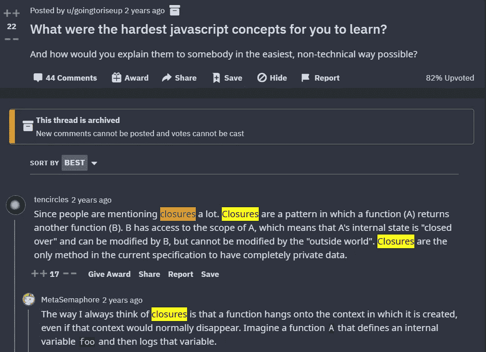
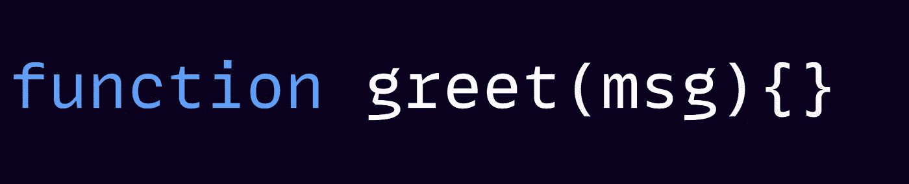
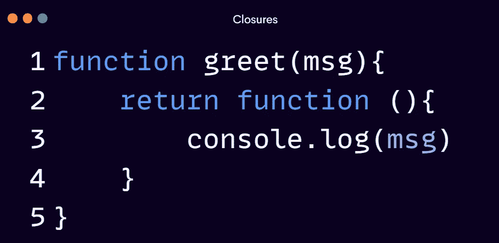
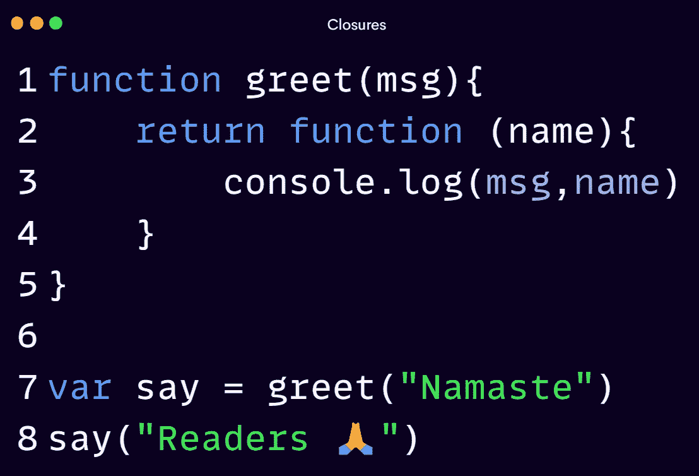
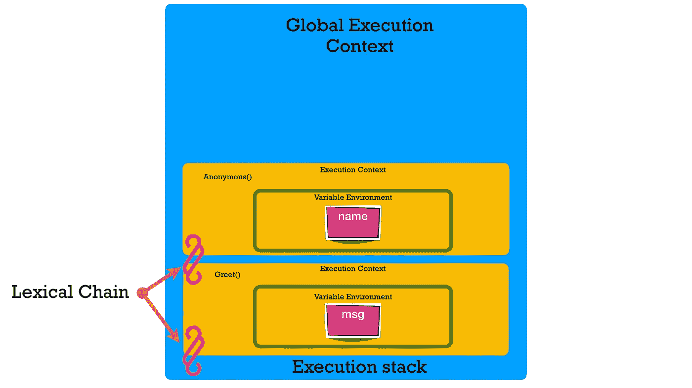
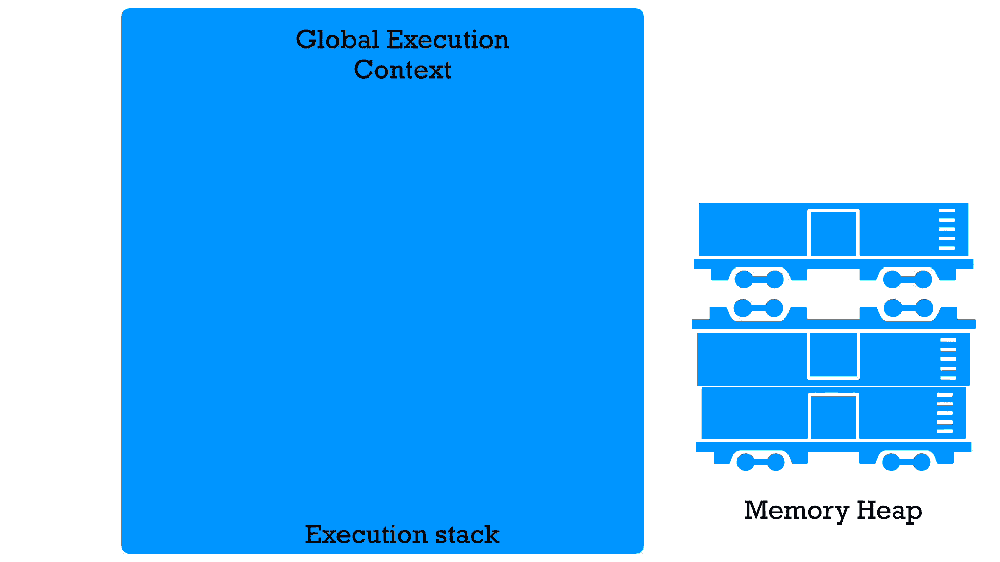
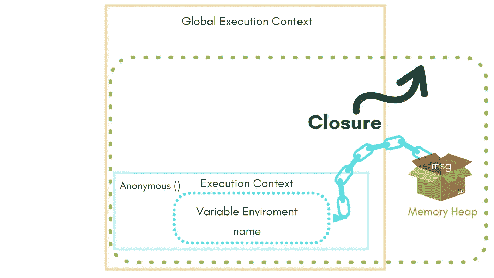

# JavaScript 中的闭包

> 原文：<https://javascript.plainenglish.io/grokking-closure-in-javascript-7e8194924398?source=collection_archive---------19----------------------->

## 用简单的英语理解闭包

[🎨](https://www.twitter.com/tweetsbysoma)

> 本文是系列文章的第二部分，我们将探讨闭包的起源、幕后工作、现实生活中的用法以及与闭包相关的面试问题。

欢迎阅读本文的第二部分——我们将探究闭包以及它们如何工作的内在机制。许多人觉得闭包的概念很难理解。但是一旦你知道引擎盖下发生了什么，事情就不一样了。

理解闭包会对你编写和理解代码的方式产生重大影响。*在我们开始之前，请确保您对 JavaScript 如何工作有一些基本的了解。*

# 让我们在 JavaScript 中寻找闭包，

为此，让我们创建一个`greet`函数。

我将接受一个参数，我们把它命名为“`***msg***`”。我将返回一个 ***函数，而不是在`greet`函数中工作。*** 我打算利用范围链来包含`msg`，

好好看看这个。我有一个返回函数 的 ***函数。所以当我调用`greet()`时，我将得到值，但不是一个字符串，或一个数字，或类似的东西，我将得到一个我可以再次调用的 ***函数*** ！***

因为函数是 JavaScript 中的对象，所以我可以把它作为一个值返回。现在，`greet()`返回一个函数。那么，我如何调用这个函数呢？

为了调用它，我们需要再放一个`()`

看起来有点奇怪，对吧？但是我们调用一个函数(`greet()`)，它返回一个匿名函数，然后我们调用这个匿名函数。

有意义吗？仔细看，不寻常的事情已经发生了！为了理解这有多不寻常，让我们换一种方式来做这件事。让我们设置函数`greet()`等于一个变量。

所以现在`say`，将是一个通过调用`greet`返回的函数。当我调用`say()`时，

Passing “Readers 🙏" as an argument

还能用！

让我们停下来想一想这个问题。`say()`函数怎么还知道`msg`变量？因为`msg`变量是在第 7 行创建的，当`greet()`被调用时，它完成了执行并从执行堆栈中弹出。

然而，当我调用`say(“Readers 🙏”)`时，它仍然有正确的值`msg`，也就是`Namaste`。

这怎么可能呢？因为闭包所以有可能。

# 让我们来看看引擎盖下发生了什么！

当执行这段代码时，`greet()`结束，当我调用由`greet()`返回的函数时，看起来好像那个`greet()`函数还在附近，因为`msg`变量还在那里。

发生了什么事？当代码开始执行时，我们有了我们的全局执行上下文，即 `greet()`和 `anonymous()`的执行上下文。

当我们到达这条线时

它调用`greet`函数，创建一个 greet 执行上下文，传递给的`msg`变量存储在其变量环境中。它返回一个新的匿名函数。在返回之后，`greet`执行上下文被弹出堆栈。

**但问题来了！**

我们知道，每个执行上下文在内存中都有一个空间，其中存放着所创建的变量和函数。当 ***执行上下文离开*** 时， ***那个内存空间*** 会发生什么变化？

我们的`msg`变量会发生什么？

在正常情况下，JavaScript 引擎最终会通过一个叫做 [***垃圾收集的过程来清除它。***](https://developer.mozilla.org/en-US/docs/Web/JavaScript/Memory_Management#garbage_collection)

然而，当垃圾收集器来了，看到我们的`msg` 变量，它说哦！这里有一个闭包，我无法清理它，因为有东西在引用`msg`。JavaScript 已经把它放到了特殊的闭包里！

在 JavaScript 中，任何东西只有在没有引用时才会被垃圾收集。

还记得我们在[第一站](https://medium.com/p/5b139e1e170f/edit?source=your_stories_page-------------------------------------)离开的地方吗？我们离开了为什么关闭要花这么长时间？
一旦函数离开执行堆栈，我们就有丢失变量的问题？这就是那个问题的解决方案！

不要将变量或激活记录保存在执行堆栈中，而是将它们保存在**内存堆中，**像我们上面讨论的那样设计一个好的垃圾收集器！

在上面的代码中，匿名执行上下文仍然有一个对其外部环境的内存空间的变量的引用。即使`greet()`已经结束。在它内部创建的函数，当它们被调用时，仍然有一个对`greet()` 执行上下文和内存空间的引用。

JavaScript 引擎确保我们的函数仍然可以沿着作用域链向下，在**内存堆**中找到`msg`，即使它已经不在执行堆栈中。

🦅 eye view of whole picture

这样，我们说执行上下文在其外部变量中是封闭的，这些变量通常会被引用，即使那些执行上下文已经不存在了。*这种现象，在函数应该可以访问的所有变量中，被称为* ***闭包。***

要记住的一件重要的事情是，结束不是你创造的。闭包只是 JavaScript 编程语言的一个特性。当你说，哦，我创建了一个闭包，那么，某种程度上，JavaScript 引擎创建了闭包，我们只是在利用它！

既然我们已经学习了闭包的引擎盖机制，是时候看看它在现实生活中的威力了，在下一篇文章中我们将看到程序员如何使用闭包来解决各种问题。

# 如果你错过了这个系列，这里有链接。😊

## [1。编程语言中最重要的特性](/most-important-feature-ever-put-in-a-programming-language-5b139e1e170f?sk=baff3bd18de9be10a66bb27eb2d265d4)

## [2。在 JavaScript 中寻找闭包](/grokking-closure-in-javascript-7e8194924398?sk=0f6e01511d6400590608f10f0ea85017)

## [3。闭包的实际用法](/practical-usage-of-closures-in-javascript-b3203770ba2?sk=dc404a83106d791c943d16b6b389e26c)

## [4。终极 JavaScript 面试问题—结束](/ultimate-interview-questions-on-javascript-closures-8dd12a210677?sk=4d15f7e3756b76a9e2886b97515975b1)