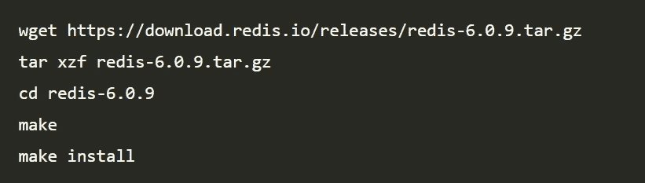
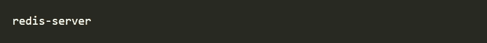
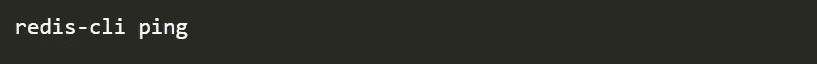

# 使用 Node.js 的 Redis 缓存

> 原文：<https://javascript.plainenglish.io/guide-to-redis-caching-with-node-js-e50356b06c1c?source=collection_archive---------11----------------------->

## Node.js 中的 Redis 缓存入门

没有最低限度的性能，现代应用程序就无法运行。随着时间的推移，随着应用程序的复杂性和请求数量呈指数级增长，这种需求也会增加。因此，缓存应运而生。**缓存**指的是将数据存储在临时位置的过程，这样应用程序可以更快地访问和检索数据。缓存的目的是通过加速数据访问操作来减少网络上发送数据的带宽成本和应用程序的响应时间。

## Redis 是什么？

Redis 是一种功能强大、用途广泛的内存缓存机制，速度惊人。我们称之为“多功能”是因为它是处理缓存、类似数据库的特性、会话管理、实时分析、事件流、队列管理等的完美选择。

## 安装 Redis

在这里，我们将一步一步地使用 Node.js 应用程序构建 *Redis* 缓存。

首先，我们需要将 *Redis* 的二进制文件下载到您的目录中，并使用以下命令进行编译。

安装后，使用以下命令启动 *redis* 服务器。

您也可以使用下面的命令来测试连接是否仍然有效。

对于上面的命令，应该收到的响应为`***pong***` ，这意味着我们的 *Redis* 服务器正在成功运行。

欲了解更多详情，请阅读[官方快速入门指南](https://redis.io/topics/quickstart)。

## 设置 Node.js 应用程序

在本教程中，我们使用`**axios**` 从外部 API 访问数据。我们还使用了`**redis**` ,它是 Node 的标准 Redis 客户端。我们可以使用`**npm**.`安装上述两个软件包，如下所示

我们可以使用下面的代码片段来设置节点服务器。

之后，我们使用来自 https://openweathermap.org 的公开 API 来获取任何给定城市的天气细节。

您可以将任何城市名称作为要查找的字符串传递给 API，并检索 json 格式的天气详细信息数组。对 API 的示例请求如下所示。在这里用 xxx 替换您的 API 密钥以供使用。

https://api.openweathermap.org/data/2.5/weather?q=London 的 appid=xxx

在我们的节点应用程序之上，我们定义了一个名为`/weather`的路由，它从 API 中检索任何城市的天气细节，并将它们发送回客户端。这里我们使用了`axios` *获取*请求来达到这个目的。

## Redis 缓存

现在让我们转到最重要的部分，将 *redis* 缓存应用到应用程序。首先，我们需要通过我们的节点应用程序连接到 *redis* 服务器。我们可以通过以下方式来实现，

这里需要提到的是 **6379** 是*Redis*服务器的默认端口号。之后，我们可以使用上面创建的 *Redis 客户端*来处理我们的节点应用程序中的缓存。

首先，我们需要从请求查询参数中提取城市名称。然后我们需要将那个城市名作为 ***键*** 传递到缓存中，以检查天气详细信息是否已经在其中。

这里需要提到的是， *Redis* 缓存将数据存储为 ***键值对*** 。因此，您需要一个键来检索相关的值。由于 Redis 包没有对承诺的本地支持，我们必须传递一个回调来处理检索到的数据。

我们如何知道 *Redis* 缓存中是否有与传递的城市名称相关的天气细节？

如果从 *Redis* 返回的值是 ***而不是 null*** ，则意味着相关数据存在于缓存中，因此很容易在响应中返回该数据。只要确保将字符串转换回 JSON 就行了。

否则，如果返回值为 ***null*** ，我们必须向外部 API 发送请求来检索相关的天气数据。从 API 获取天气数据后，我们将它存储在缓存中，以便下次向节点服务器发送相同的请求时，它可以用存储在缓存中的数据进行响应，而不是从 API 请求它们。

这里我们使用了`**setex**` 函数来代替通常的`**set**` 函数，因为我们可以为存储的键-值对设置一个 ***到期时间*** 。在我们为到期时间设置了一个值之后，Redis 将在经过的时间到期时自动从缓存中删除这个键-值对。

上述实现的完整源代码如下:

现在，我们已经完成了本文主要关注的主题。但是我想简单介绍一下 **Redis** 缓存。

Redis 缓存有一些操作，我们可以使用它们来轻松地处理它，如下所示。

*   ***检查密钥是否存在*** :该方法用于检查一个密钥是否已经存在，并据此进行处理。为此，您可以使用`**exists**()`功能。
*   ***从任意值中删除键*** :有时，你需要清除一些键并重新初始化它们。要清除按键，可以使用`**del**` 命令。

还需要提到的是 *Redis* 支持不同的数据类型而不是使用一个字符串比如 ***hashes，list*和 *sets*** 。您可以使用这些类型将数据存储到 R *edis* 缓存中。

## 结论

在本文中，我们介绍了如何使用外部 API 作为数据源，使用 **Redis** 作为缓存，在 Node.js REST API 上实现缓存。希望你能通过这个获得知识。

编码快乐！

*更多内容请看*[***plain English . io***](http://plainenglish.io)