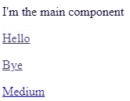
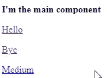
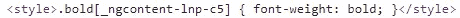
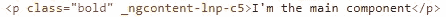

# 使用 Angular 处理动态注入 HTML 中的 CSS 和链接

> 原文：<https://javascript.plainenglish.io/handle-css-and-links-in-dynamically-injected-html-using-angular-74c074ca2fd7?source=collection_archive---------5----------------------->

Photo by [Jackson So](https://unsplash.com/@jacksonsophat?utm_source=medium&utm_medium=referral) on [Unsplash](https://unsplash.com?utm_source=medium&utm_medium=referral)

使用 Angular 在组件中注入 HTML 可以通过使用容器的“innerHTML”属性(通常是“div”或“p”)来完成。然而，这种方法有两个问题:

*   如果组件定义了一些 CSS 样式(并使用默认的视图封装)，它们将不会应用到插入的 HTML 中。
*   如果 HTML 包含一些内部链接，这些链接将重新加载整个应用程序，而不是使用路由器导航。

我开发了[这个角度应用](https://stackblitz.com/edit/angular-rxe6rp)来演示这些问题。该应用程序的主要部分包括:

*   它包含通过路由器配置加载的三个组件("/home "，"/hello "和"/bye ")
*   “main”组件是为“/home”路径加载的，它只是在“div”中注入一些 HTML。
*   “hello”和“bye”组件简单地显示他们的名字和返回“/home”路线的返回链接。

如您所见，主组件使用的 HTML 使用了组件样式中声明的“bold”CSS 类。此外，它包含三个环节:两个内部环节(一个相对和一个绝对)和一个外部环节。

在组件中显示该 HTML 的正常方式是 StackBlitz 中默认使用的方式:“innerHTML”属性。如果这样做，结果如下:

Using “innerHTML”

如您所见，第一个问题是“bold”类不适用于第一段。此外，如果您单击前两个链接，整个应用程序会重新加载，因为使用了浏览器导航而不是 Angular router。

这两个问题可以通过使用[的“html”指令](https://stackblitz.com/edit/angular-rxe6rp?file=src%2Fapp%2Fhtml.directive.ts)来解决。

您可以通过使用它而不是“innerHTML”来测试它，以查看以下结果:

Using the “html” directive

这次你可以看到，第一段现在是粗体的。此外，如果你点击链接，Angular 路由器就会启动，应用程序不会重新加载(当然外部的除外)。

该指令的整个逻辑在“ngOnChanges”钩子中定义，以便在“html”输入的值改变时立即应用它。我们可以为“html”输入使用一个 setter，但是因为只有一个输入，所以变化不大。

我们做的第一件事是检索组件的惟一 id。事实上，当使用默认的视图封装时，CSS 样式实际上是用一个后缀来修改的，以便将它们的范围扩大到组件。例如，“bold”CSS 类在页面的源代码中实际上是这样定义的:

这就是为什么使用“innerHTML”对 CSS 不起作用。事实上，插入的段落不会应用“_ngcontent-lnp-c5”属性，因此该类不会应用。这就是为什么我们在指令中做的第一件事是检索该指令所应用到的元素的这个属性的名称，并将其存储到“_uniqueId”变量中。

然后，我们简单地更新元素的“innerHTML”属性来插入 HTML。请注意，我们没有对其进行消毒，因此可能存在一些注射风险，这取决于您自己。我没有检查，但我猜想，它不应该是那么复杂，使用消毒剂的角度，以确保指令。

现在我们有了属性的名称，我们检索对元素的所有后代的引用，并将该属性添加到它们中。这样，段落现在将与“bold”类的 CSS 查询相匹配:

这解决了 CSS 的问题，但是没有解决链接的问题。这部分由检查后代标签名是否为“A”的条件来处理。如果是这样，我们检索它的“href”属性的值。注意，我们不使用“getAttribute”函数，因为这将返回原始值。我的意思是“getAttribute”函数返回相对链接的相对 URL，而“href”属性返回所有链接的绝对 URL。因此，使用属性而不是属性可以确保 URL 始终是绝对的。

因为我们只想对内部链接使用角度路由器，所以我们检查“href”属性是从页面的原点开始的。如果是这样，我们在“a”元素上定义一个“click”事件来重定向使用路由器的用户，并防止默认行为，以确保浏览器不会在事后将用户重定向到该 URL。

请注意，在将 URL 传递给路由器的“导航”功能之前，我们将它设为相对 URL，因为它不支持绝对 URL。

在这里，您现在可以将 HTML 插入到组件中，这些组件:

*   支持组件范围的样式
*   将角度路由器用于内部链路
*   绕过对 HTML 的净化(这可能是好事也可能是坏事，取决于你)。

如果您看到了改进该指令的方法，请不要犹豫发表评论。

*更多内容看*[***plain English . io***](http://plainenglish.io/)