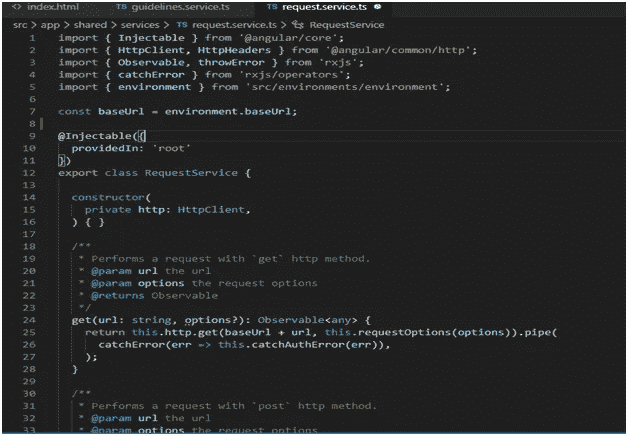
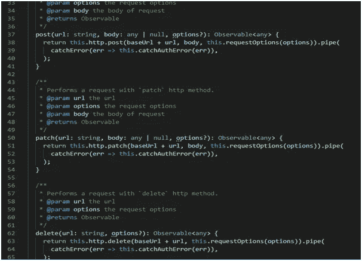
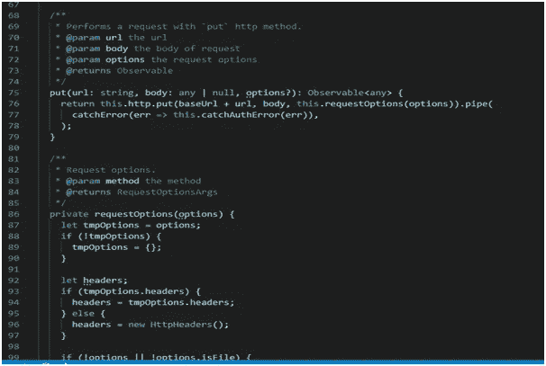
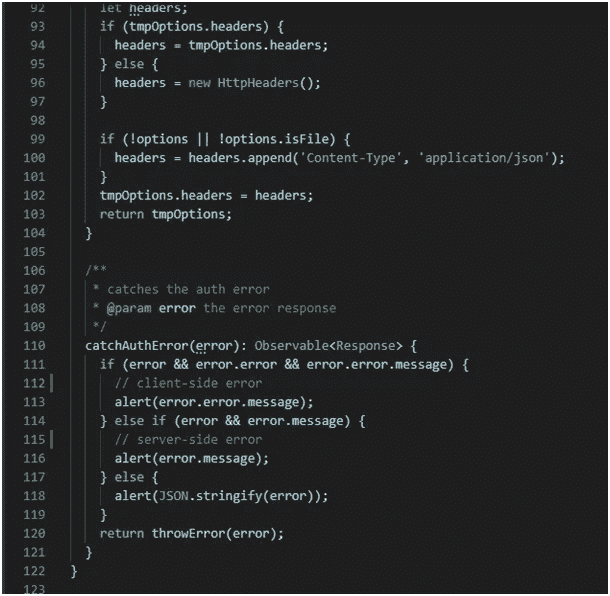
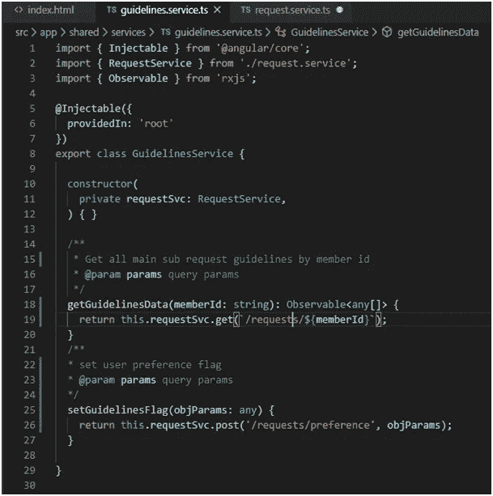
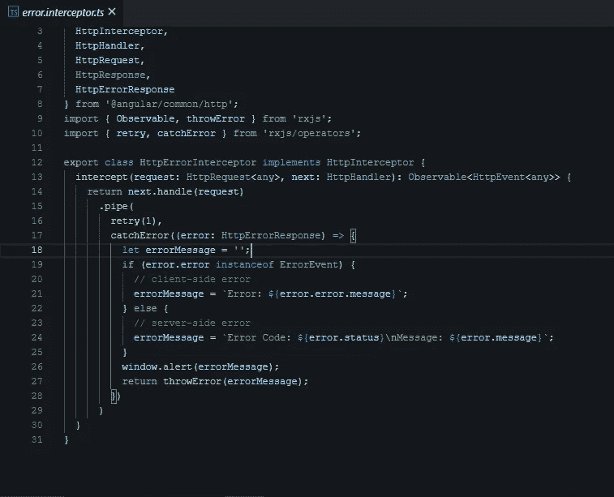
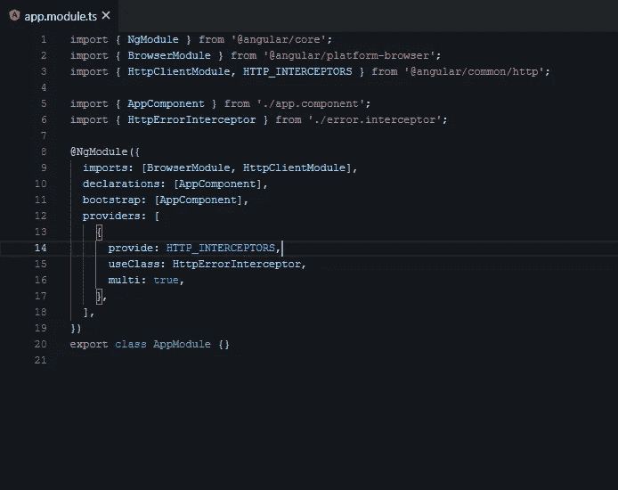

# 用 HttpClient、RxJS、HttpInterceptor 处理 Angular 中的错误

> 原文：<https://javascript.plainenglish.io/handle-errors-in-angular-with-httpclient-and-rxjs-34cf631e29a6?source=collection_archive---------0----------------------->

Photo by [Elisa Ventur](https://unsplash.com/@elisa_ventur?utm_source=medium&utm_medium=referral) on [Unsplash](https://unsplash.com?utm_source=medium&utm_medium=referral)

先来看看 **HttpClient** 。我们可以通过 RxJS catchError/catchError 操作符来处理错误。在 Angular 中处理错误的基本方法是使用 Angular 的 HttpClient 服务以及 RxJS 操作符`throwError`和`catchError.`。发出 HTTP 请求后，它返回带有响应的数据。如果发生任何错误，它将返回带有错误状态代码的错误对象。

下面是我使用 **catchAuthError()** 函数处理 Angular 中的错误的服务。这是一个单一的服务，所有的 HTTP 请求都将通过这个服务。如果出现任何错误，它将处理它并向用户显示一条用户友好的消息。

**request.service.ts**

有两类错误需要进行不同的处理:

**客户端:**网络问题和前端代码错误。使用`HttpClient`，这些错误返回`ErrorEvent`个实例。**服务器端:** AJAX 错误、用户错误、后端代码错误、数据库错误、文件系统错误。使用`HttpClient`，这些错误返回 HTTP 错误响应。

通过验证`error.error`下是否有错误，我们可以找出我们有哪种类型的错误并相应地处理它。

将此 **request.service.ts** 注入所有其他服务:

现在让我们来看看用 **HttpInterceptor 处理错误的最佳方式。**

它是与 Angular 4.3.1 一起推出的。它为我们提供了截取 HTTP 请求和响应的选项，以便在将它们传递给服务器之前对它们进行转换或处理。

我们现在可以编写一个非常干净的服务，所有的错误都将由 **HttpInterceptor 自动处理。**我们甚至可以使用**重试**方法在所有请求失败之前重试它们。

在发送给服务器之前，我们可以修改任何报头、认证令牌、请求体等。

# 结论

我希望这篇文章能帮助你理解在 Angular 12 中用 RxJS 操作符和 HttpInterceptor 处理错误的基本方法。

编码快乐！:)

*更多内容请看*[***plain English . io***](http://plainenglish.io/)