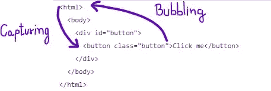

# 像专家一样处理 JavaScript 事件

> 原文：<https://javascript.plainenglish.io/handle-javascript-events-like-a-pro-8bfd67e6b684?source=collection_archive---------1----------------------->

Photo by [Ferenc Almasi](https://unsplash.com/@flowforfrank?utm_source=medium&utm_medium=referral) on [Unsplash](https://unsplash.com?utm_source=medium&utm_medium=referral)

处理事件是任何现代 web 应用程序的关键部分。每个希望编写更好代码的开发人员都应该深入了解事件如何工作，什么是事件冒泡，以及如何使用事件委托来优化应用程序中的事件处理。

# 事件

在深入潜水之前，让我们先搞清楚基本知识。每个人都喜欢点击那个按钮，看到神奇的事情发生，但是在 JavaScript 的深处，**点击**是一个事件，类似于当用户与页面交互时，他们的动作被捕获为事件。

为了让一个按钮监听一个事件，你需要注册一个**监听器**或者**处理程序** *(无论哪个术语最适合你)*。假设我们有一个按钮点击，我们想在按钮上注册一个事件来测量按钮被点击的次数。这就是我们要做的。

在这个例子中，我们使用了 id 为`querySelector` 的按钮元素，并使用`addEventListener`为其附加了一个事件

# 事件传播

现在我们知道了什么是事件以及如何将 **eventListener** 附加到一个元素。让我们看看它是如何工作的，以及当一个按钮被点击时有多少事件被触发*(可能会让很多人吃惊)*。

*你怎么看？如果我点击上面的按钮，有多少个元素触发了点击事件？*

毫无疑问，它将是按钮本身，但也将是所有**按钮的祖先**，甚至是**文档**和**窗口**对象。

这是为什么呢？让我们找出答案。

一个事件基本上分三个阶段传播:

1.  **捕获阶段**:事件从窗口开始，记录并深入目标元素的所有祖先。
2.  **目标阶段**:事件找到它的目标元素，并在用户交互时被触发。
3.  **冒泡阶段**:事件以类似的方式在层次结构中上升，在捕获阶段下降，直到到达文档和窗口。

# 事件冒泡

事件冒泡是事件从其源头向根元素的传播。这意味着如果一个事件发生在一个按钮上，那么它也将被它的父节点和它的父节点的父节点触发，以此类推，直到 HTML 元素。

现在让我们来看看事件冒泡的实际情况。

现在，如果你已经与上面的笔进行了交互，那么通过查看控制台，你会意识到一些事情。

1.  当你点击白色部分时，什么也没有发生。
2.  当点击绿色时，祖父事件被触发。
3.  单击黄色图标时，会触发 parent 和 GrandParentevent。
4.  当点击蓝色时，所有三个父母、祖父母和孩子事件都被触发。

现在你一定已经意识到了，所有的事件无论是发生在某个边线按钮上还是发生在你想让所有人都看到的按钮上，都将在包装它们的元素上触发一个事件。

# 事件委托

现代应用程序严重依赖事件来为用户提供交互界面。在网页上有大量的事件处理程序是很常见的，在这种情况下，事件委托真的会大放异彩。

你会惊讶于有多少事件可以有一些简单的网站。

事件委托的一个很好的例子是构建一个调色板，并为每种颜色附加一个事件监听器，因为我们想对它进行一些操作。一种方法是给每个颜色元素附加一个事件监听器，这样当用户点击它时，操作就完成了。如下图所示。

虽然我们采用的方法是可行的，但还没有优化到应有的程度。我们的调色板有 150 种颜色，因此，我们附加了 150 个侦听器来处理所有这些颜色。此外，如果我们的组件有一个允许用户添加自定义颜色的特性，我们将需要为添加到调色板中的每种新颜色添加侦听器。

但是更好的方法是，正如你所想的那样，利用我们之前所学的知识，并将其应用于此。为了解决上一节中提到的问题，我们将把迄今为止我们所学的所有东西放在一起，利用一种叫做**事件委派**的技术。

当每个事件都冒泡时，也许我们不需要将每个颜色元素附加到事件上，我们可以做的是将该事件附加到父元素上，这样每当颜色元素被单击时，它就会冒泡到父元素，然后父元素触发我们想要的功能。

# 结论

在我们的例子中，了解一个简单的事件委托概念可以将 150 个事件减少到一个事件，当应用程序变得复杂时，这些小事情就变得很重要，并对性能产生真正的影响。

现在你已经知道了这个概念，你将能够构建复杂的，交互式的，同时不牺牲性能的应用程序。

感谢阅读和下面的任何反馈意见。