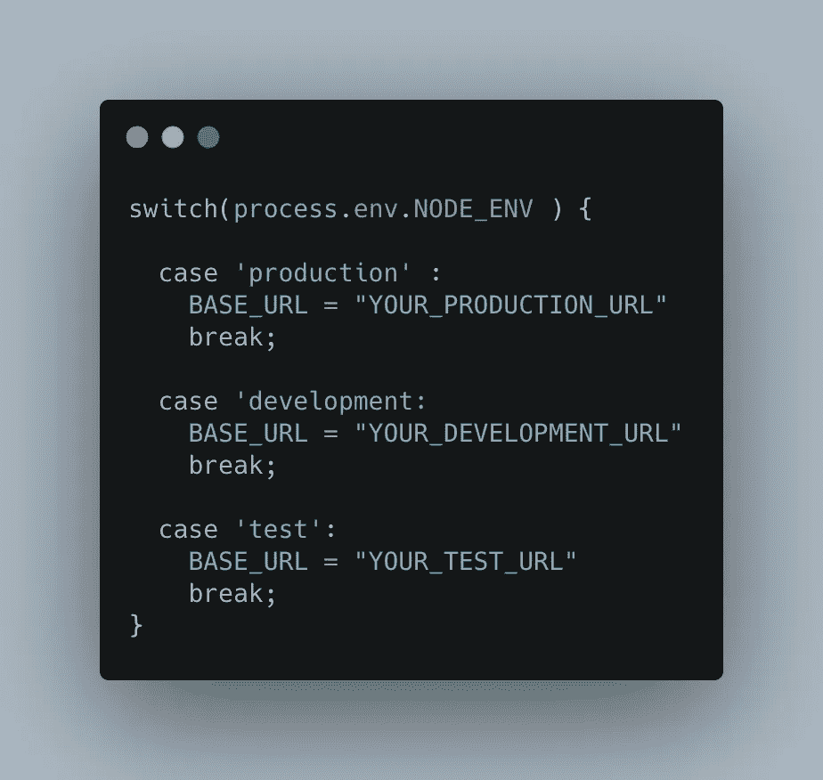
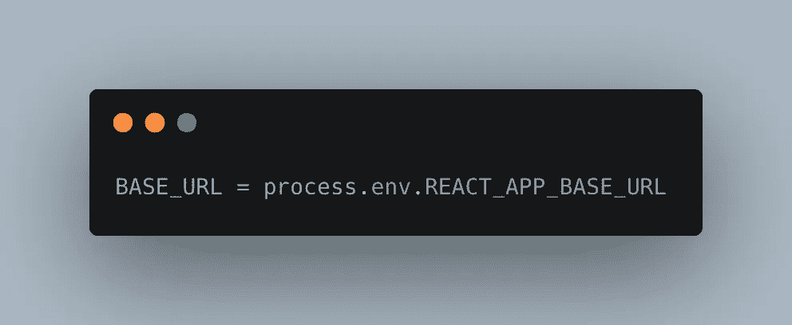

# 在 React 中处理多种环境

> 原文：<https://javascript.plainenglish.io/handle-multiple-environments-in-react-d3d05b2c4248?source=collection_archive---------4----------------------->

## 简单而优雅的解决方案


Photo by [John Mark Arnold](https://unsplash.com/@johnmarkarnold?utm_source=unsplash&utm_medium=referral&utm_content=creditCopyText) on [Unsplash](https://unsplash.com/s/photos/blocks?utm_source=unsplash&utm_medium=referral&utm_content=creditCopyText)

当处理一个 react 项目时，我们通常需要存储一些关于我们正在处理的特定环境的信息。例如，我们可以为`development`、`test`和`production`服务器使用单独的 BASE_URL。

但是，当我们需要为单独的环境部署应用程序时，每次都在代码中手动更改端点是不现实的。如果有人忘记更改生产端点，并且我们的生产应用程序与开发端点一起部署，这可能会造成灾难。

# 有什么解决办法？

我们必须为不同的环境维护不同的变量。在 ReactJS 中，我们可以访问名为`NODE_ENV`的默认环境变量。

当我们运行下面的命令时,`NODE_ENV`的默认值是…

```
**npm start      // NODE_ENV = ** development
**npm run build  // NODE_ENV =** production
**npm run test   // NODE_ENV =** test
```

我们可以在运行时使用 **process.env.NODE_ENV** 从项目内部的任何地方访问这些变量，并决定访问哪个变量。

因此，对于我们的场景，一个解决方案可能是这样的…



这是一个可能的解决方案，但是不可扩展。如果我们有数百个配置变量，那么这些值将分散在整个项目中，很快就会变得一团糟。

# 让我们改进这一点

React 提供了一种处理这种情况的简洁方法。我们希望所有的环境变量都存储在一个地方。为此，我们需要在根文件夹中创建一个名为`.env`的文件。

在该文件中，我们将放置所有的环境变量。但是我们需要小心命名。

> 所有变量都应该以前缀 REACT_APP_ 开头

所以对于我们的基本 URL，我们可以写

```
REACT_APP_BASE_URL = “MY_BASE_URL_FOR_PRODUCTION”
```

然后，我们可以通过简单的



优雅对吗？

我们可以随心所欲地增加价值。

好吧，但是我们的其他环境呢？为此，我们将创建另一个名为`**.env.development**` 的文件，并将我们的开发变量放在那里。在`**.env.development**`文件内

```
REACT_APP_BASE_URL = “MY_BASE_URL_FOR_DEVELOPMENT”
```

类似地，我们可以通过创建另一个名为 **.env.test** 的文件来创建另一个测试文件

现在我们准备好了。请注意，我们没有创建任何名为`**.env.production**`的文件，因为默认情况下，如果 react 没有找到任何带有适当后缀的文件，它会选择`**.env**`文件。所以按照惯例，`.env`文件用于生产构建。但是你当然可以创建一个`**.env.production**`文件，它会工作得很好。

现在，当您运行命令 **npm start** 时，基本 URL 将是您在`.env.development`文件中给出的 URL，并且在为生产构建时，它将是您的生产 URL。

# 需要更多的环境吗？

现在很容易了。如果你需要另一个环境。比如`*staging*` *。*然后在您的启动脚本中，您必须像这样指定`NODE_ENV`变量…

```
"start:staging": "NODE_ENV=staging react-scripts start",
```

并创建一个相应的. env.staging 文件来存放您的环境变量。当你跑步的时候

```
npm start:staging
```

现在将从`**.env.staging**`文件中读取数值。

## 结论

这就是我们如何在 React 应用中处理多种环境。

祝您愉快！:D

**通过**[**LinkedIn**](https://www.linkedin.com/in/56faisal/)**或我的** [**个人网站**](https://www.mohammadfaisal.dev/) **与我取得联系。**