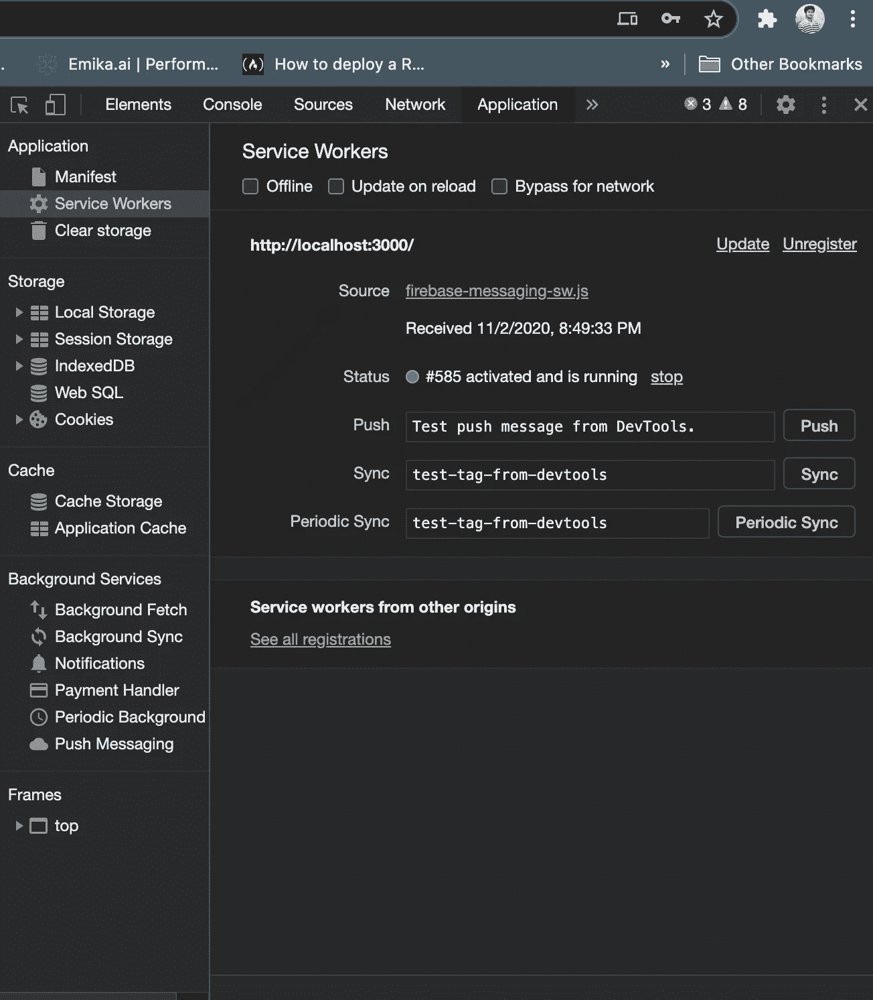

# 在 React 中处理推送通知

> 原文：<https://javascript.plainenglish.io/handle-push-notifications-in-react-eba1dce496db?source=collection_archive---------9----------------------->

## 使用 Firebase 的 5 个步骤


Photo by [Max Kukurudziak](https://unsplash.com/@maxkuk?utm_source=unsplash&utm_medium=referral&utm_content=creditCopyText) on [Unsplash](/?utm_source=unsplash&utm_medium=referral&utm_content=creditCopyText)

通知是良好用户体验的重要组成部分。通过正确使用通知，您可以让您的用户随时了解您的产品和优惠。

今天，我们将了解如何在 ReactJS web 应用程序中接收通知。我假设您已经有了一个基本的 react 应用程序。我们将使用 **firebase** 作为通知部分。

# 第一步。安装 Firebase

您应该安装所需的依赖项

```
yarn add firebase
```

现在转到您的 firebase`console`->-`create a project`->获取您的 firebase 项目配置详细信息。你可以从[这里](https://firebase.google.com/docs/web/setup#config-object)了解更多

# 第二步。将服务人员添加到项目

为了接收通知，我们需要在我们的应用程序中有一个服务工作者。

一个`*service worker*`是你的浏览器在后台运行的脚本，独立于网页，为不需要网页或用户交互的功能打开了大门。

因为我们希望在没有任何用户交互的情况下接收通知，所以我们需要一个服务人员。去创造一个。。。

*   进入你的公共文件夹(里面有 index.html 文件的文件夹)
*   创建一个名为`**firebase-messaging-sw.js**`的新文件
*   添加以下代码，并用您的配置值替换 config 对象的值

firebase-messaging-sw.js

# 第三步。注册服务人员

在呈现应用程序之前，在 App.js(或任何其他组件/钩子)中添加以下代码。它将注册服务人员来处理后台通知。

运行应用程序后，您可以从浏览器进入您的开发工具，在应用程序>服务人员下查看服务人员是否已激活。



Browsers dev tools

# 第四步。添加实用功能

现在我们已经准备好在浏览器中接收通知了。但是我们需要更多的东西。

*   用户是否希望查看通知的许可
*   标识我们设备的设备令牌(我们必须将其保存在某个地方)

现在，在 App.js 文件中添加以下代码来获取用户权限和设备令牌

User Permission

但是如果你想保持代码的整洁，你可以创建一个定制的钩子，包含通知所需的所有逻辑，名为`useFirebaseNotification.js` ，就像这样。。。

这个钩子将注册您的服务人员，请求许可并为您获取设备令牌。

从你的 App.js 调用这个钩子

App.js

干净多了吧。

# 第五步。从后端发送通知

我们已经为在前端接收通知做好了准备。无论我们的应用程序是否在前台，我们都会收到通知。

如果您有一个后端应用程序表单，可以在其中处理通知，那么您可以从前面获取设备令牌并发送通知。

或者您也可以从 firebase 控制台发送通知。

从您的后端(也应该连接到 firebase，但不在本教程的范围内)您可以使用以下代码发送通知。来自 NodeJS

Index.js

希望您能在浏览器中看到通知。您现在可以在收到通知后做各种定制工作。

今天就到这里。我希望你已经发现这很有用。祝你有愉快的一天！

[](/20-essential-parts-of-any-large-scale-react-app-ee4bd35436a0) [## 任何大规模反应应用的 20 个关键部分

### 如果您正在编写企业级代码，您需要知道这一点

javascript.plainenglish.io](/20-essential-parts-of-any-large-scale-react-app-ee4bd35436a0) [](https://betterprogramming.pub/the-7-traits-of-a-rock-star-react-developer-747fbb001c05) [## 摇滚明星反应型开发者的 7 个特征

### 有所不同的习惯

betterprogramming.pub](https://betterprogramming.pub/the-7-traits-of-a-rock-star-react-developer-747fbb001c05)