# 使用 Axios 处理刷新令牌

> 原文：<https://javascript.plainenglish.io/handle-refresh-token-with-axios-1e0f45e9afa?source=collection_archive---------1----------------------->

## 使用 Axios 处理刷新令牌的指南。


Photo by [Shawn Lee](https://unsplash.com/@shawn99lee?utm_source=unsplash&utm_medium=referral&utm_content=creditCopyText) on [Unsplash](https://unsplash.com/s/photos/old-fashioned?utm_source=unsplash&utm_medium=referral&utm_content=creditCopyText)

刷新访问令牌并不是一个新话题，我们有许多关于它的文章。爱情也是一样，它也不是一个新话题。但是作曲家仍然日复一日地创作新的爱情歌曲。这就是为什么我写了一篇关于如何用 Axios 刷新令牌的小文章。

# 概述此案例

在编码之前，我们需要了解当前的任务和目标。在一个流行的系统中，为了在多个服务之间进行通信，我们需要一个“密钥”来确保安全性。在本文中，我将把这个密钥称为令牌。该令牌通常在规定的时间后过期。过了这个时刻，这个令牌就不能访问任何东西了。客户端必须获得新令牌才能继续使用其他服务。我们有许多自动获取新令牌的解决方案。其中之一是为客户省一个刷新令牌。当访问令牌过期时，我们可以向身份验证服务发送刷新令牌，以获得新的访问令牌(和刷新令牌)。下面我为这个概念做了一张简单的照片:

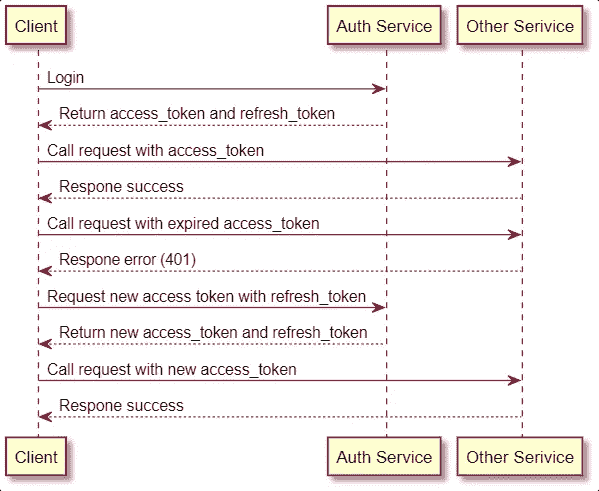

有了这张照片，我们可以通过一些步骤来定义处理请求的基础。

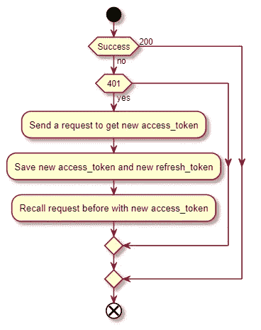

在上面的照片中，我们需要采取一些措施来确保当当前的访问令牌过期时，我们可以获得一个新的访问令牌。使用新访问令牌在先前请求失败的地方继续。在本文中，我将在 Axios 的前端应用这个概念。

# 制作用于测试的服务器

为了准备在本文中使用 Axios，我们需要花一点时间来制作一个示例 API。这个 API 将帮助我们的测试更加容易。我们有两个 API。一个用于访问资源，一个用于刷新令牌。使用 API 来访问资源，如果我们在头中调用这个错误的访问令牌，它将响应一个状态代码为 401 的错误。关于第二个 API，那个 API 只是用一个新的访问令牌来响应我们(来访问第一个 API)。

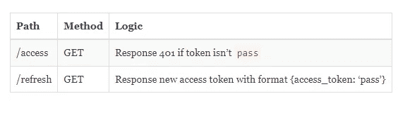

我会用 [Express](https://expressjs.com/) 来制作这个 API，你可以用任何其他语言或者方式来制作这个 API。按照上面给出的要求做两个 API 就行了。回到 API，因为我用的是 Express，所以我们需要先安装这个包。

```
yarn add express
```

下一步，我们只需要创建文件 **server.js** 。在这个文件中，我们将制作一个简单的 API 服务器来支持我们的测试。这个内容会这样。

要启动这个服务器，我们只需要运行**节点 server.js** 。为了确定这个 API，我将通过调用一些请求对它进行一个简单的测试。

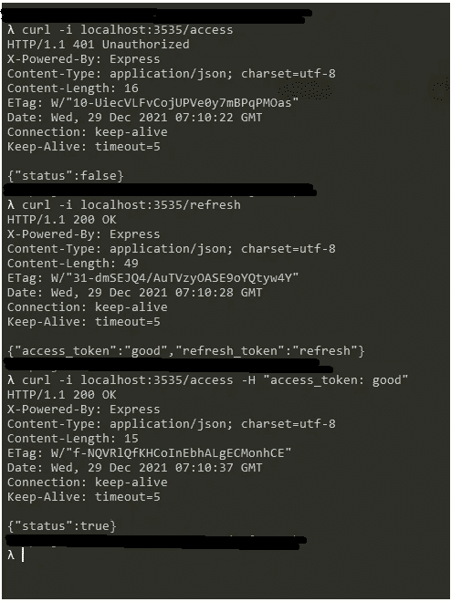

我已经调用了这个 API 的一些请求，它工作得很好。除了 CURL，还可以用 Postman 或者其他任何工具来检查。现在，我们可以从现在开始用 Axios 编写代码了。

# 使用 Axios 处理过期令牌

在写第一行之前，我们需要安装 Axios。只需一个简单的命令就可以安装这个包。

```
yarn add axios
```

安装这个包之后，我将创建一个文件 **client.js** 。在这个文件中，我们将举例说明如何使用 Axios 处理过期的令牌。首先，我们需要创建一个 Axios 实例，并为其配置一些默认设置(baseURL，header…)，然后创建一个函数，用我们创建的这个实例向 API 发出请求。这是我在这一步的代码。

在这个文件中，我用从 Axios 创建的方法**创建了一个 Axios 实例。在函数**请求**中，我们将使用 **axios_instance** 调用 API 访问请求，并记录来自 API 的状态代码和数据。现在，我将使用命令 **node client.js** 运行这个文件。**

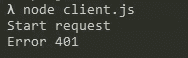

它抛出一个错误！因为我们还没有在这个请求的头中设置访问令牌。我们可以在函数请求中设置它。但我认为这不是一个好方法，因为我们需要在每个函数中编写相同的内容(如果我们需要在未来制作一个新功能)。为了支持这种情况，Axios 提供了一个很棒的方法，即**拦截器**，它帮助我们拦截请求和响应。我将在我们的客户端文件中再添加一个变量 is **access_token** ，并将该变量的值传递给头部。我们只是在函数请求上面添加了这段代码。

```
let access_token = 'good';axios_instance.interceptors.request.use((config) => {
    config.headers['access_token'] = access_token;
    return config;
});
```

再打一次。这就是结果。

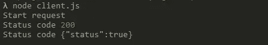

成功了！但这不是本文的主要任务。这就是为什么我将把 **access_token** 的默认值修改为“坏”，而我们的工作就是让它变得“好”。为此，我们需要处理来自 API 的案例 401。我拍了一张照片，上面是我们将要处理的步骤。现在，我们只需要使用方法**拦截器的**响应来处理它。下面是处理它的图表和代码。


在上面的代码中，如果响应是一个错误，我们需要一些步骤来处理它。

*   第一步是从在**配置**中输入的请求中获取**配置**。在下一步中，我们需要检查来自服务器的状态代码。如果状态代码是 401，我们将调用 API“/refresh”请求来获取新的 access_token (good)。我让函数 **refresh_token** 来做这件事。这个函数将返回 **Axios.get(…)** 。我们只需要在 Axios 拦截器内部调用它。
*   之后，我们只需要从 API 传递一个新值给变量 **access_token** 。
*   在最后一步中，我们只需要返回一个新的 Axios 实例，带有之前请求的配置。对于其他情况，我们通过 return**promise . reject(error)**来处理，它会像其他错误一样抛出那个错误。

现在，我们可以再次尝试调用回调代码。下面是我得到的结果:

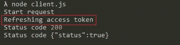

最后，在我们刷新了访问令牌之后，我们的请求成功了。这是用 Axios 处理过期令牌的基本方法。这里全是我们在 **client.js** 里做的东西。

但这只是一个基本的代码。我们还需要处理一些糟糕的案例。在下一部分，我们将一起处理它。

# 优化一些不好的案例


Photo by [Jackson Simmer](https://unsplash.com/@simmerdownjpg?utm_source=unsplash&utm_medium=referral&utm_content=creditCopyText) on [Unsplash](https://unsplash.com/s/photos/broken?utm_source=unsplash&utm_medium=referral&utm_content=creditCopyText)

在真实的案例中，我知道我们会处理很多不好的案例。在这里，我只写了两个糟糕的例子，分别是无限循环和处理多个刷新 API 的调用。

## **无限循环**

在当前代码中，我们假设我们的代码(客户机和服务器)总是运行良好。我们调用 API，我们得到错误 401，我们调用服务器来获得一个新的访问令牌，我们使用这个访问令牌来调用请求，它成功了！但是…当我们调用刷新令牌时，除了返回新的刷新令牌 API 之外，还继续给我们一个错误 401。发生了什么事？我将像这样用状态 401 稍微修改刷新 API。

```
app.get('/refresh', (req, res) => {
    res.status(401);
    res.json({
        access_token: 'good',
        refresh_token: 'refresh'
    })
});
```

让我们看看我们从 **client.js** 得到了什么

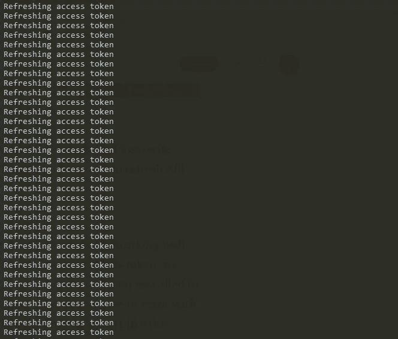

Boom!

这是我说的无限循环问题。要解决这个问题，我们只需要为请求配置添加一个标志。当我们得到状态代码为 401 的错误时，除了当前条件之外，我还需要为检查重试标志添加一个条件。如果这个标志不在配置中，我们将为配置设置这个标志，并继续调用刷新令牌 API。以下是编辑后的自定义拦截器:

这是我用新代码得到的结果。不再有无限循环了。

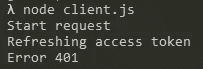

**同时有多个令牌过期的请求**

在解决了无限循环的问题之后，我们现在要处理另一个麻烦— **同时有多个请求**。这是什么？当我们用一个过期的令牌同时调用多个请求时，就会出现这个问题。它将发出多个刷新令牌请求。我们可以多次调用函数**请求**，看看我得到了什么。

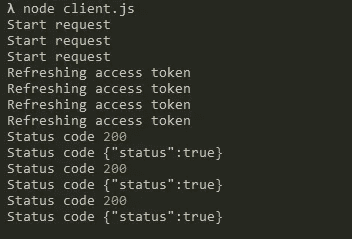

这确实是一个大问题，因为我们在这个案子上至少有三个问题:

*   第一个问题是性能，在正常情况下，我们只需要一个请求来刷新一个新令牌，之后的请求可以使用这个新令牌。但是在这种情况下，我们调用许多请求来做同样的事情。
*   第二个问题是同步数据。对刷新令牌之类的特殊事情调用相同的请求会产生一些关于同步数据的问题。因为在应用程序中，除了更新数据之外，我们还可以做其他事情(调度一些事件……)
*   第三个问题是导致我们的应用程序崩溃的重要问题之一。在实际项目中，每个刷新令牌认证一次刷新访问令牌服务。如果我们同时有许多刷新令牌的请求。服务器只处理一个第一请求。其余的请求将失败，因为每个刷新令牌服务器只处理一次。它将使所有其他请求失败。这些东西可能会让我们的应用程序抛出一些错误(无法提交数据，获取数据……)。或者更糟的是，如果我们的应用程序不能获得新的令牌，即使我们获得了令牌，我们也可能会强迫用户注销！

对于这个问题，我们有很多解决方案。在这篇文章中，我只是建议一个简单的方法。这将创建一个请求刷新令牌的变量。当我们需要一个刷新令牌时，除了直接调用 Axios 请求之外，我们只需要检查这个变量。如果这个变量为空，我们将调用函数 **refresh_token** 并为这个变量分配 **Axios.get** 。如果这个变量不为空，我们只需要等待它获得一个访问令牌。之后，我们只需要再做一步就是将这个变量设置为 null。让我们看看下面这段代码。

在第 1 行，我添加了一个新变量 **refreshing_token** ，默认值为 **null。**从第 10 行到第 12 行，我用三个新行替换了“let res = await refresh_token()”。在第 10 行，我检查了 **refreshing_token** 的值，如果它的值为 **null** ，我将为它分配函数 refresh_token。在下一行，我们只是在等待结果。之后，我们可以在第 12 行将这个变量的值设置为空值。这是我应用这个改动后得到的结果。

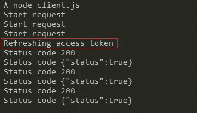

只有一个获取新访问令牌的请求，并且所有请求都使用新令牌成功。

下面是 **client.js 的完整代码:**

# 结论

在本文中，我们了解了如何使用 Axios 处理刷新令牌。与此同时，一些糟糕情况的解决方案(比如无限循环和同时多个请求)。希望这篇文章对你有帮助。如果你有其他的解决方法和其他不好的案例，请告诉我。你可以在他们的文档中了解更多关于 Axios 的信息

 [## 截击机

### 您可以在请求或响应被 then 或 catch 处理之前拦截它们。如果您需要移除拦截器…

axios-http.com](https://axios-http.com/docs/interceptors) 

我的 Github 中的全部源代码。

[](https://github.com/tasynguyen3894/refresh_token_with_axios) [## GitHub-tasynguyen 3894/refresh _ token _ with _ axios

### 通过在 GitHub 上创建帐户，为 tasynguyen 3894/refresh _ token _ with _ axios 开发做出贡献。

github.com](https://github.com/tasynguyen3894/refresh_token_with_axios) 

感谢阅读。


Photo by [Annie](https://unsplash.com/@xnnxxmx?utm_source=unsplash&utm_medium=referral&utm_content=creditCopyText) on [Unsplash](https://unsplash.com/s/photos/jorney-new-year?utm_source=unsplash&utm_medium=referral&utm_content=creditCopyText)

通过 [Linkedin](https://www.linkedin.com/in/thaisangnguyen3894/) 或 [Twitter](https://twitter.com/tasyit) 与我联系

*更多内容看* [*说白了. io*](http://plainenglish.io/) *。报名参加我们的* [*免费每周简讯*](http://newsletter.plainenglish.io/) *。在我们的* [*社区*](https://discord.gg/GtDtUAvyhW) *获得独家写作机会和建议。*