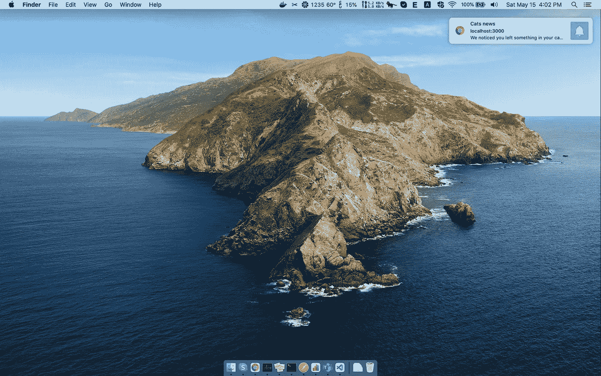
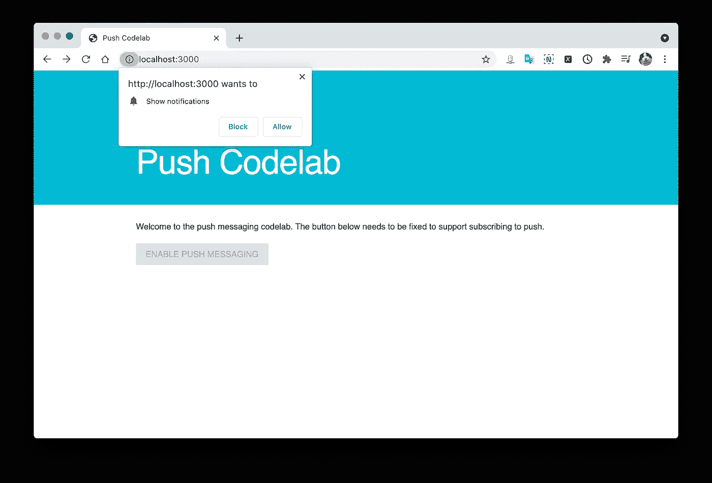
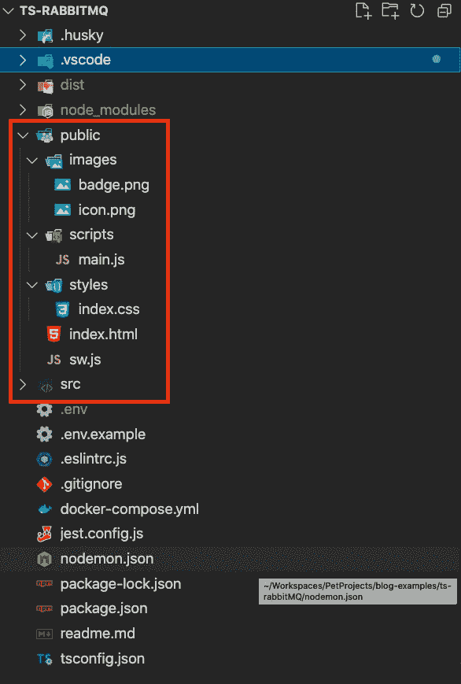
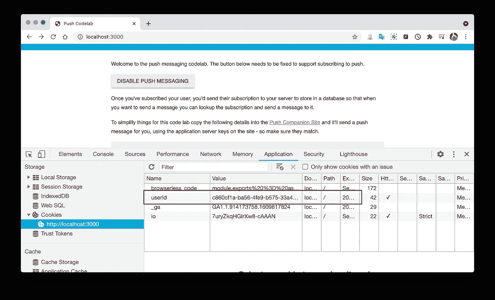
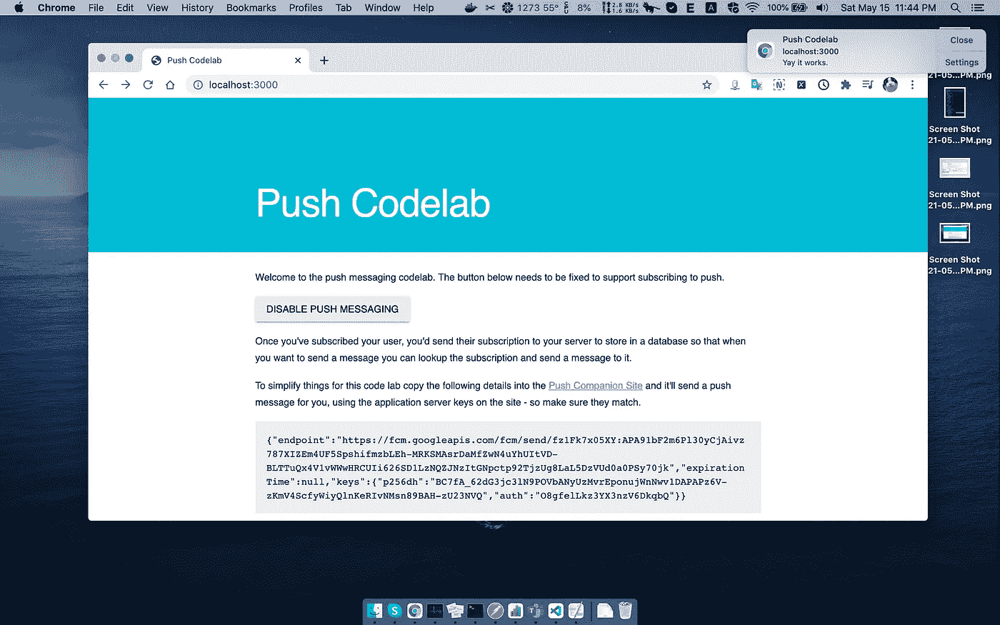

# 异步处理任务:使用 RabbitMQ 的 Web 推送通知系统

> 原文：<https://javascript.plainenglish.io/handle-tasks-asynchronously-web-push-notification-system-with-rabbitmq-dabab19d4652?source=collection_archive---------13----------------------->



异步可能是一件复杂的事情。但是它绝对值得你花时间去了解，也就是说，如果你想构建一个可伸缩的后端系统。并创建一个促进良好用户体验的前端。

通知系统就是一个很好的例子。当您想要向所有用户发送通知时，可能该任务会花费很多时间。不需要等到任务完成了，那个时候还想做别的。能够异步处理任务的系统将解决您的问题。

本文将向您展示如何构建一个简单的 [web 推送通知](https://developers.google.com/web/fundamentals/push-notifications/how-push-works)系统。该系统可以向订阅该系统的客户端用户的浏览器发送推送通知。

# 初始化项目

本文的源代码是基于 [TDD 和 TypeScript 和 Jest:Url shorter](https://levelup.gitconnected.com/tdd-with-typescript-and-jest-url-shortener-6956e2387ce8)story 的源代码。用 Express、MongoDB、Mongoose 和 TypeScript 构建 HTTP 服务器很容易。

克隆项目:

```
$ git clone [https://github.com/hoangsetup/url-shortener.git](https://github.com/hoangsetup/url-shortener.git) ts-rabbitMQ
$ code ts-rabbitMQ
```

带`ts-rabbitMQ`的是我们的项目文件夹。

更新项目信息:可以更新`package.json`中的项目名称和项目信息，也可以删除多余的文件( */urls* API 和相关文件)。

在这个项目中，我们使用`mongodb`作为数据库来存储订阅数据。并使用 [RabbitMQ](https://www.rabbitmq.com/) 作为消息代理。然后我们需要安装它们进行开发，最简单的方法之一就是使用 docker。

`docker-composer.yml`

您可以向您的终端提供`RABBITMQ_USERNAME`和`RABBITMQ_PASSWORD`或将其设置在`.env`文件中(从`.env.example`复制)。

`.env`

```
PORT=3000
MONGO_URI="mongodb://localhost:27017/cats_news_push"RABBITMQ_USERNAME=rabbitmq
RABBITMQ_PASSWORD=r@bb1tmq
```

启动 mongo 服务和 RabbitMQ:

```
$ docker-compose up -d
```

# 简单的客户端用户界面

客户端将在用户浏览器中请求推送通知，并向服务器发送订阅 id。



您可以通过完成[向 web 应用添加推送通知](https://codelabs.developers.google.com/codelabs/push-notifications)教程来获取客户端源代码。您可以从以下位置获取客户端源代码:

[](https://github.com/GoogleChromeLabs/web-push-codelab/tree/master/completed/07-unsubscribe) [## Google chrome labs/web-push-code lab

### 在 GitHub 上创建一个帐户，为 Google chrome labs/we b-push-code lab 开发做贡献。

github.com](https://github.com/GoogleChromeLabs/web-push-codelab/tree/master/completed/07-unsubscribe) 

让我们将客户端文件复制到我们项目的`public`文件夹中:



我们使用[网络推送](https://www.npmjs.com/package/web-push)来生成 VAPIDKeys 和推送通知。

```
$ npm install web-push -S
$ npm install @types/web-push -D# Generate VAPID keys
$ npx web-push generate-vapid-keys
```

输出:

```
=======================================Public Key:
BHCrHXuxQaiH8rApE67U_YM0P7kg31S_a9jojfSd4WX9yCapq7q_PG698P4KrOd8qoFFpdl99vM25nUyBl7YXz0Private Key:
GVr1jsYqkvOFIbiluiIJQpik9-QNOxElPl3bTLexjG8=======================================
```

为客户端保存密钥并更新公钥值:

*   `./public/scripts/main.js`(第 25 行):`applicationServerPublicKey`变量值。
*   `./public/sw.js`(第 27 行):`applicationServerPublicKey`变量值。

提供静态文件并处理用户会话。我们想控制哪些用户订阅系统，然后我为每个客户端创建一个唯一的 id(您可以使用您的用户 id 代替)。

更新`ApiApp.ts`

带`CookieHelper.ts`

我们还需要更新`package.json`文件:

最后，启动开发服务器:

```
$ npm run dev
```

进入`[http://localhost:3000](http://localhost:3000)`。客户端到`ENABLE PUSH MESSAGING`并接受推送通知权限，那么您的订阅就应该已经出现了。`userId`饼干也可以被创造出来。



# 商店预订

在这一部分，我们将创建 2 个新的 API。

*   `POST /subscriptions`将用户订阅保存到系统数据库中。
*   `DELETE /subscriptions`删除系统数据库中的用户订阅。

## 服务器端

客户端订阅将如下所示:

```
{
  "endpoint": "[https://fcm.googleapis.com/fcm/send/fz1Fk7x05XY:APA91xxxx](https://fcm.googleapis.com/fcm/send/fz1Fk7x05XY:APA91xxxx)",
  "expirationTime": null,
  "keys": {
    "p256dh": "BC7fA_62dG3jc3lN9POVbANyUzMvrEponujWnNwv1DAPAPz6V-zKmV4ScfyWiyQlnKeRIvNMsn89BAH-zU23NVQ",
    "auth": "O8gfelLkz3YX3nzV6DkqbQ"
  }
}
```

然后`SubscriptionModel`将被设计用于处理该数据:

`./src/models/SubsriptionModel.ts`

`./src/controllers/SubscriptionController.ts`

`./src/routers/SubscriptionRoute.ts`

最后申请`SubscriptionRoute`申请:

`./src/ApiApp.ts`

## 客户端

更新`./public/scripts/main.ts`中的`updateSubscriptionOnServer`功能订阅/取消订阅:

保存所有文件并重新加载浏览器。那就试着看看 MongoDB 的`cats_news_push`收藏吧。

```
$ docker compose exec mongodb# In docker container
$ mongo
> use cats_news_push
> db.subscriptions.find({}).pretty()
```

输出如下所示:

```
{
        "_id" : ObjectId("609f926c591101f7ed1a020e"),
        "userId" : "c860cf1a-ba56-4fe9-b575-33a43b40dd6c",
        "endpoint" : "[https://fcm.googleapis.com/fcm/send/fz1Fk7x05XY:x](https://fcm.googleapis.com/fcm/send/fz1Fk7x05XY:APA91bF2m6Pl30yCjAivz787XIZEm4UF5SpshifmzbLEh-MRKSMAsrDaMfZwN4uYhUItVD-BLTTuQx4V1vWWwHRCUIi626SD1LzNQZJNzItGNpctp92TjzUg8LaL5DzVUd0a0PSy70jk)xxx",
        "expirationTime" : null,
        "keys" : {
                "p256dh" : "BC7fA_62dG3jc3lN9POVbANyxx",
                "auth" : "O8gfelLkzxxx"
        },
        "createdAt" : ISODate("2021-05-15T09:20:44.288Z"),
        "updatedAt" : ISODate("2021-05-15T09:20:44.288Z"),
        "__v" : 0
}
```

# 推送通知

我们将创建一个允许通过用户 id 向客户端浏览器发送通知的 API。

首先，创建一个使用`web-push`向订阅发送通知的功能。

`./src/libs/WebPush.ts`

功能`pushtoSubscription`接收`subscription`、`data`作为参数。

Web-push 的 [sendNotification](https://gist.github.com/hoangsetup/f6a84f3851560afb5d2b6bde288869ce) 函数将被调用，其中的选项包括`publicKey`和`privateKey`——我们在上一步中生成的密钥。

`.env`

```
PORT=3000
MONGO_URI="mongodb://localhost:27017/cats_news_push"RABBITMQ_USERNAME=rabbitmq
RABBITMQ_PASSWORD=r@bb1tmqVAPID_PUBLIC_KEY=BPUJMX4Zxxxx
VAPID_PRIVATE_KEY=kKY_b2jGGxxx
```

`./src/NotificationController.ts`

`./src/routers/NotificationRoute.ts`

然后，为我们的应用注册`NotificationRoute`:

`./src/ApiApp.ts`

现在，让我们尝试通过调用`POST /notifications/:userId`向用户推送通知

```
curl --location --request POST '[http://localhost:3000/notifications/c860cf1a-ba56-4fe9-b575-33a43b40dd6c'](http://localhost:3000/notifications/c860cf1a-ba56-4fe9-b575-33a43b40dd6c') \
--header 'Content-Type: application/json' \
--data-raw '{
    "title": "Cats news",
    "message": "We noticed you left something in your cart!"
}'
```



它仍然显示带有默认标题和正文新通知。因为我们还没有处理推体。

更新`./public/sw.js`

# 异步处理推送任务

如您所见，一个用户可以有多个订阅(针对每个浏览器、每个设备)，我们的系统将有多个用户。当我们想要通知所有用户一个通知时，发送过程将在我们的主过程上花费大量时间，并且 API 超时应该被延长。

让我们将任务分配给另一个人——消费者，而不是在主流程中处理发送任务。我们使用 RabbitMQ 作为消息代理，在主流程(生产者和消费者)之间进行通信。

我们使用 [amqp](https://www.npmjs.com/package/amqp) 与 RabbitMQ 合作。

```
$ npm install amqp -S
$ npm install @types/amqp -D
```

在`.env`文件中设置默认连接信息和队列名称:

```
PORT=3000
MONGO_URI="mongodb://localhost:27017/cats_news_push"RABBITMQ_USERNAME=rabbitmq
RABBITMQ_PASSWORD=r@bb1tmqRABBITMQ_HOST=localhost
RABBITMQ_PORT=5672
RABBITMQ_PUSH_QUEUE=push_notification_taskVAPID_PUBLIC_KEY=BPUJMX4ZNDRv0GwxE-uU5mmTIo6ntzPZz1RVgm67bxC-wJJnX_Nux27YAG_Ilz9_BgH__snMhL4cGDJnTTcURks
VAPID_PRIVATE_KEY=kKY_b2jGG3NmfaWKYwI_0oNExScO1nO2YpdHXJtcM80
```

## 生产者

`./src/libs/RabbitMQHelper.ts`

更新`NotificationController.ts`以更新`pushNoticationToUser`函数并创建`pushAll`函数。

只需向队列发送数据并完成 HTTP 请求。使用`pushAll`功能，如果订阅数量超过 100，我们会将数据拆分成许多项。

## 消费者

消费者进程将独立于主进程运行。**我们可以运行多个消费者实例。**

`./src/RabbitMQConsumer.ts`

从`.env`文件加载配置。监听队列，从消息内容中获取`subscriptions`列表和通知正文，并推送通知。

在新的终端窗口中，让我们启动消费者进程:

```
$ node ./dist/RabbitMQConsumer.js
[*] Waiting for messages in push_notification_task. To exit press CTRL+C
```

调用`POST /notifications` API 向所有用户发送通知:

```
curl --location --request POST '[http://localhost:3000/notifications'](http://localhost:3000/notifications') \
--header 'Content-Type: application/json' \
--data-raw '{
    "title": "Cats news",
    "message": "We noticed you left something in your cart!"
}'
```

在消费者终端窗口中，将出现一条日志消息:

```
[x] Received {"subscriptions":[{"keys":{"p256dh":"BC7fA_xxx","auth":"O8xxx"},"_id":"609f926c591101f7ed1a020e","userId":"c860cf1a-ba56-4fe9-b575-33a43b40dd6c","endpoint":"[https://fcm.googleapis.com/fcm/send/fz1Fk7x05XY:APA91bFx](https://fcm.googleapis.com/fcm/send/fz1Fk7x05XY:APA91bF2m6Pl30yCjAivz787XIZEm4UF5SpshifmzbLEh-MRKSMAsrDaMfZwN4uYhUItVD-BLTTuQx4V1vWWwHRCUIi626SD1LzNQZJNzItGNpctp92TjzUg8LaL5DzVUd0a0PSy70jk)","expirationTime":null,"createdAt":"2021-05-15T09:20:44.288Z","updatedAt":"2021-05-15T09:20:44.288Z","__v":0},{"keys":{"p256dh":"BC7fA_xxxx","auth":"O8gfexxxx"},"_id":"609fde12bd09d43761cba485","userId":"a041cc76-bac7-4a51-bc2c-920ad9ab6f60","endpoint":"[https://fcm.googleapis.com/fcm/send/fz1Fk7x05XY:APx](https://fcm.googleapis.com/fcm/send/fz1Fk7x05XY:APA91bF2m6Pl30yCjAivz787XIZEm4UF5SpshifmzbLEh-MRKSMAsrDaMfZwN4uYhUItVD-BLTTuQx4V1vWWwHRCUIi626SD1LzNQZJNzItGNpctp92TjzUg8LaL5DzVUd0a0PSy70jk)x","expirationTime":null,"createdAt":"2021-05-15T14:43:30.072Z","updatedAt":"2021-05-15T14:43:30.072Z","__v":0}],"body":{"title":"Cats news","message":"We noticed you left something in your cart!"}}
```

确保您的客户端浏览器仍能收到通知。

仅此而已！

# 摘要

我们完成了一个使用异步系统的例子。希望我的文章能为你提出一些“关键词”，你能更好的在你的系统中实现事情。

该项目的完整代码已经发布在 [Github](https://github.com/codetheworld-io/ts-rabbitMQ) 上。

感谢您的阅读！

*更多内容尽在*[plain English . io](http://plainenglish.io/)