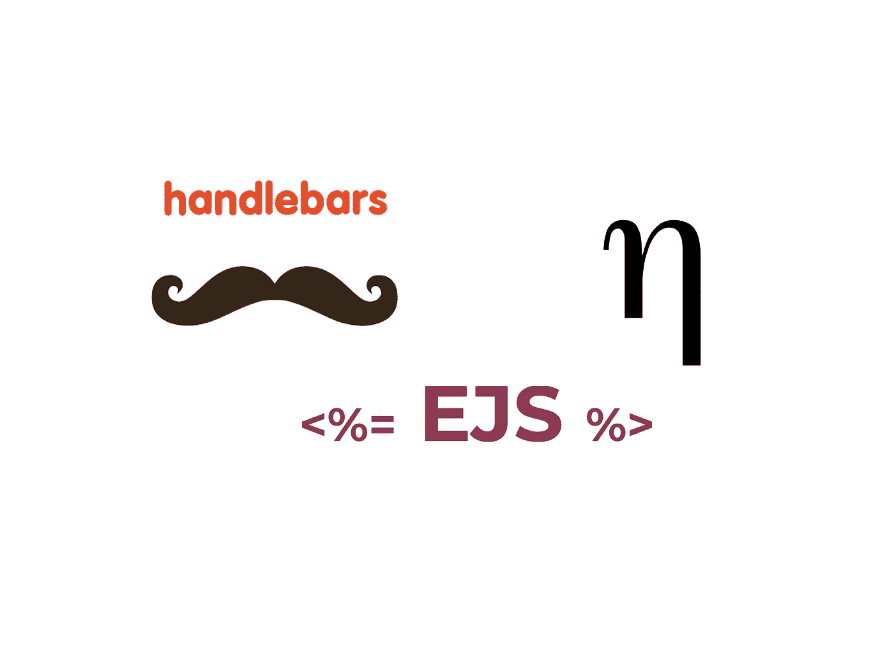
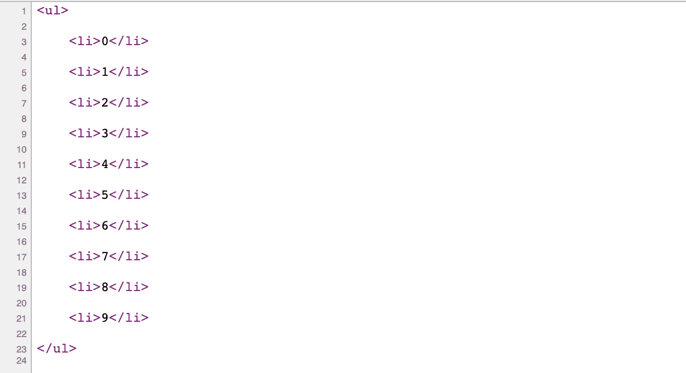

# Express.js 模板引擎之战——哪个最快？

> 原文：<https://javascript.plainenglish.io/handlebars-eta-ejs-1623a6140e56?source=collection_archive---------2----------------------->

## 车把 vs 埃塔 vs. Eta



Source: the author

我们不断地比较 JavaScript 框架。但是 Node.js 模板语言呢？是的，那些帮助我们在服务器上呈现 HTML 的东西——像手柄或 EJS 这样的模板语言。

为了做一个小小的比较，我找出了我能找到的最相关的——首先，把手和 EJS，这可能是最常用的模板引擎，尤其是对于 Express。

作为挑战者，我选择了 Eta，它号称是最快的模板引擎之一。所以，我们走吧！

# 比较

为了比较模板引擎，我用这三个引擎构建了同一个小网站。然后，我运行一个 HTTP 基准测试，它向所有三个应用程序发出大量 HTTP 请求，并列出每个模板引擎可以处理的请求数量。

最初，我希望模板引擎对我们从 Express 实例传递的数字执行数学运算，如下所示:

```
*<% it.numbers.forEach(function(number){ %>
  <li><%= number * 100%> </li>
<% }) %>*
```

然而，Handlebars 不允许您直接在模板中运行像加减这样的操作。

因此，所有模板将呈现的是一个小的条目列表，通过我们从 Express 传递给模板的数组来呈现:



让我们来看看每个模板:

车把模板:

Eta 模板:

EJS 模板:

如你所见，埃塔和 EJS 使用几乎相同的代码。事实上，相同的语法。

让我们对所有模板进行基准测试！

# 基准测试结果

对于所有不同的模板引擎，我运行了几次 HTTP 基准测试。我收集了所有结果，以下是平均结果:

## 把手

每秒请求数:2618
请求延迟:149 毫秒

## 希腊语字母的第七字

每秒请求数:4396
请求延迟:90 毫秒

## EJS

每秒请求数:4258
请求延迟:92 毫秒

我非常震惊。埃塔和 EJS 都拆除了车把。由于 Eta 号称是最快的模板引擎，它甚至比 EJS 还快。所以，我们的赢家很明显。

但是在这种情况下使用模板引擎有意义吗？

## 让普通的 JavaScript 来完成这项工作。

不要误解我的意思，服务器端的模板引擎很棒，也有它们的用途。然而，对于这样一个最小的用例，比如基于一组数字呈现一个列表 HTML-list，我们可以使用其他的东西:Vanilla JS。

正如许多人没有意识到的那样，我们有很大的能力自己编写逻辑驱动的模板。这里不是让模板引擎来完成这项工作，而是用 JavaScript 来呈现数字列表:

这样，我们得到的 HTML 列表与我们之前使用的模板引擎得到的相同。那么，性能呢？

嗯，香草 JS，谁会想到它，击败了模板引擎的 sh*t:

每秒请求数:9623
请求延迟:41.27 毫秒

# 我们从中学到了什么？

让我们总结一下我们的主要经验:

1.  Handlebars 不允许你运行模板内的数学表达式。
2.  埃塔比 EJS 和车把快。
3.  普通 JS 比模板引擎快得多。我从来没想过性能差别会这么大。因此，对于需要在服务器上渲染/计算的较小模板，用普通 JS 编写代码更有意义——至少在性能方面。

感谢您的阅读！

Node.js 世界中的更多比较:

[](/fastify-express-benchmark-4c4aebb726d6) [## 我用 Fastify，Express & Bare Node.js 构建了相同的 API，区别如下。

### 让我们看看 Fastify 快了多少

javascript.plainenglish.io](/fastify-express-benchmark-4c4aebb726d6) [](/i-built-the-same-api-with-without-express-here-are-the-differences-83bbeb7ddad) [## 我用&不用 Express 构建了相同的 API。以下是不同之处。

### 运行了一个基准测试

javascript.plainenglish.io](/i-built-the-same-api-with-without-express-here-are-the-differences-83bbeb7ddad) 

*更多内容看*[***plain English . io***](http://plainenglish.io/)