# 用 Cypress 处理 API

> 原文：<https://javascript.plainenglish.io/handling-api-with-cypress-911d4cc012a2?source=collection_archive---------13----------------------->

自从自动化被引入以来，每个采用它的组织的质量保证部门都获得了许多好处。由于自动化的各种优势，软件测试已经走过了漫长的道路，例如节省时间、早期的错误捕获等。随着时间的推移，各种测试框架已经被引入不同的平台。其中一个就是 Cypress，它用于 web 应用程序测试用例的自动化。

Cypress 帮助 QA 工程师以更快、更可靠的方式编写测试用例，并且它的设置也非常简单快捷。凭借其用户友好的框架，Cypress 在许多方面使自动化变得更加容易，并且在开始编写测试之前几乎不需要配置。几乎所有传统框架要求用户自己编写的任务都有一个插件。

Cypress 主要关注 Web 应用程序的自动化，但也支持在需要时处理 API 命令。由于我们不能用 Cypress 直接自动化移动应用程序，当我们需要用后端 API 代替移动命令时，这就派上了用场。

本文档将简要概述如何使用 Cypress 处理项目的 API。作为先决条件，您必须熟悉 Cypress 框架的结构以及如何设置它。

## **入门**

将 API 引入 Cypress 测试非常简单。

对于 HTTP 请求，使用函数 **cy.request()** 。这可以在 spec 文件的 **it()** 函数下调用，或者在 **commands.js** 中调用，以便有更多的可重用性。

这个函数需要的参数是 method 和 url，这两个参数是强制的；和主体，它们是附加的。

语法:

> cy.request(方法，url)

例如，我们将使用来自 https://reqres.in/的免费测试 API

下面的例子展示了如何在 Cypress 测试中调用一个简单的 get API。

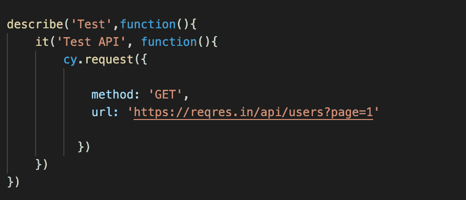

执行上述测试将显示成功，如下所示:

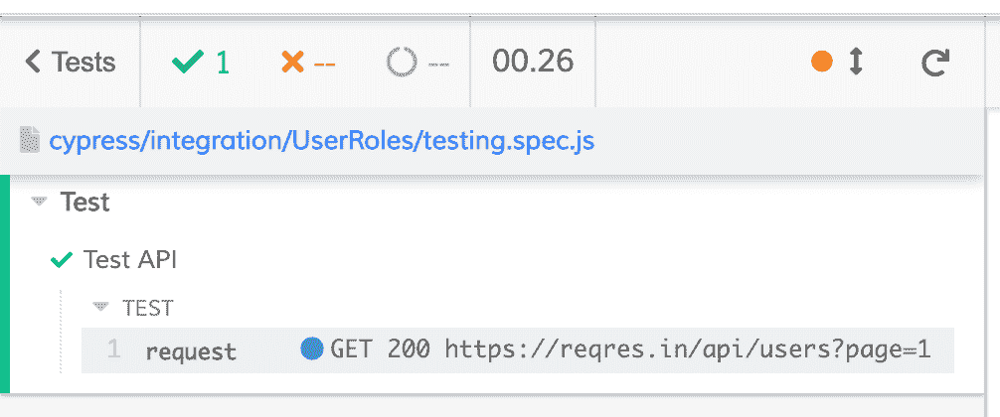

## **查看响应**

然而，上面的例子仅仅显示了 API 已经被执行。我们看不到结果。为了看到这一点，我们使用如下所示的 **should()** 函数:

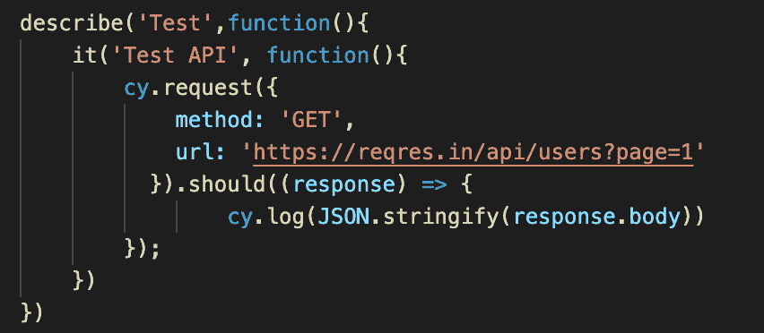

这里，我们只是显示响应体，并使用 Stringify 将返回的对象转换成 string。

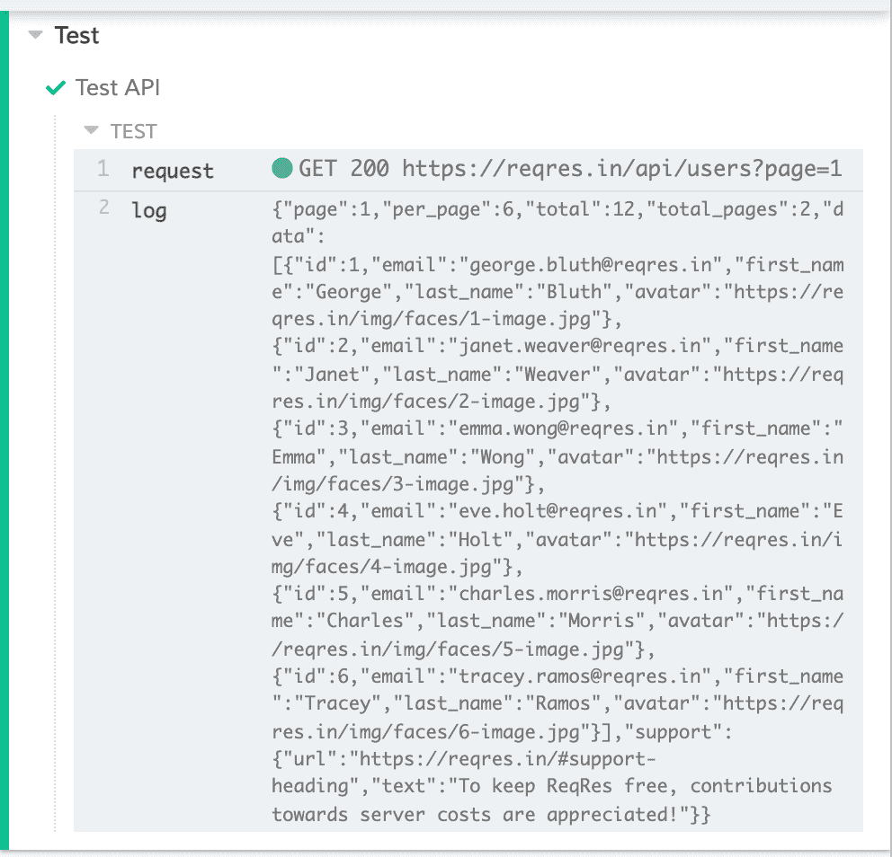

## **添加断言**

在许多情况下，您需要操作结果或断言任何值或状态代码。为此，我们使用 expect()函数。

API 最基本的断言是状态代码。这可以用下面的方法来完成。

语法:

> expect(response . status). to . eq(200)

这里，我们断言状态代码应该等于 200。

除了状态代码之外，您可以断言在您的响应中发现的任何数据，例如测试中的 API 正在返回用户列表，我们可以根据测试的需要以多种方式验证该数据。

例如，您可以断言响应存在、响应中某个字段的值等。

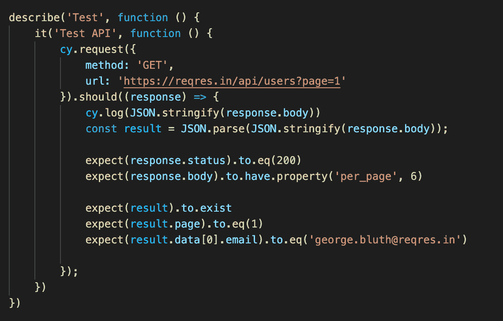

此外，您还可以将响应中的值存储在环境变量中，以便在其他测试中使用。为此，将增加以下步骤:

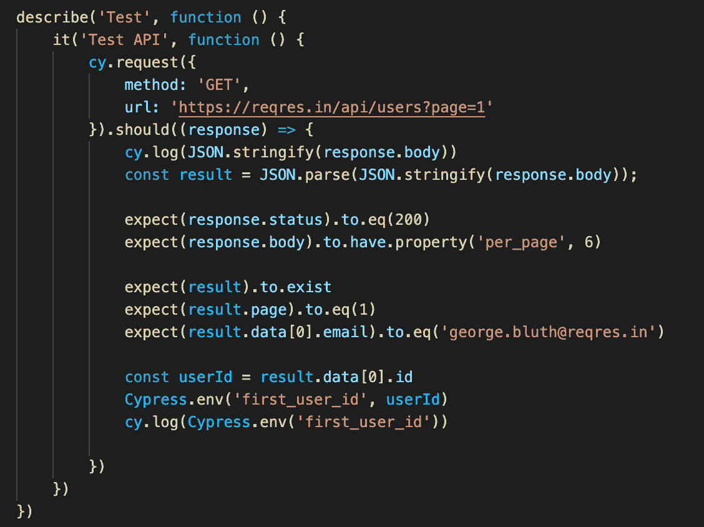

当您执行上述代码时，结果将显示如下。

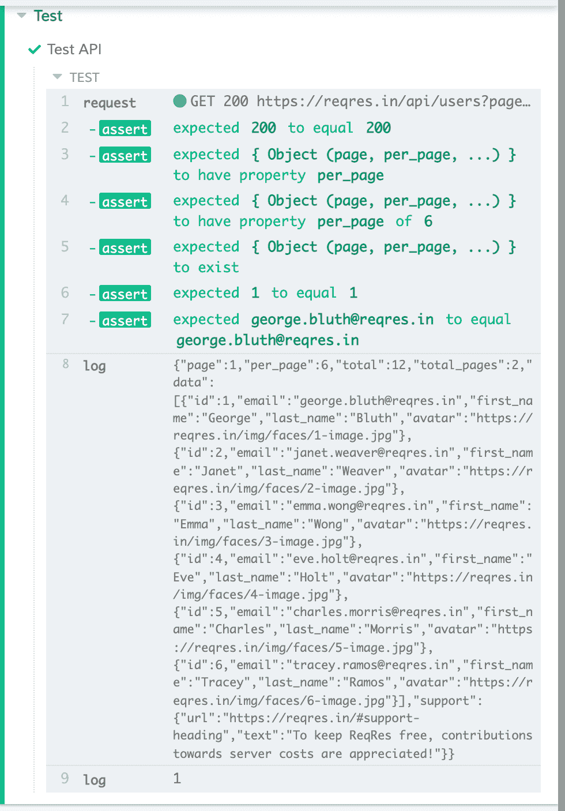

## 提高可重用性

祝贺您学习如何在 Cypress 中使用 API！

现在假设你需要在几次测试中多次调用这个 API。复制和粘贴相同的代码行被认为不是一个好的做法。相反，更明智的做法是将它存储在一个文件中，这样您可以方便地修改它，并在需要时调用它。

这样做的一种方法是使用 commands.js 文件。

只需复制请求并将其粘贴到 commands.js 文件中，然后用以下内容包装它:

语法:

> 柏树。Commands.add('APITest '，()=> { })

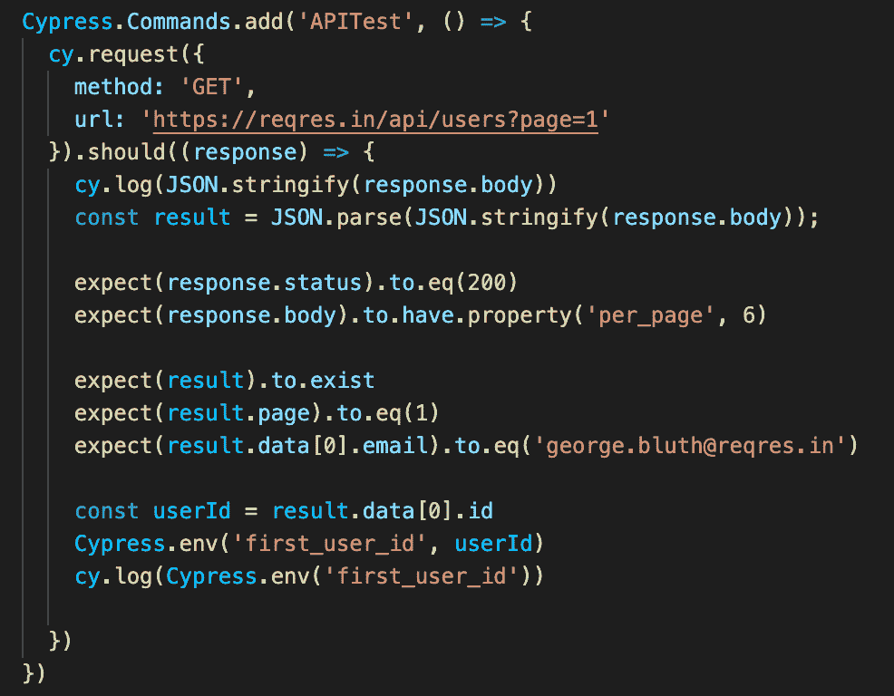

现在，这些步骤可以在任何测试中以下面的方式调用，不需要重新编写相同的代码。

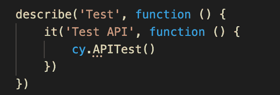

## 链接 API 请求

假设您需要一步一步地调用 API，并且需要一个 API 在进入下一个 API 之前完成执行。这可以通过使用 then()函数来实现。它允许您在回调函数中使用生成的主题。

为了在我们的测试中引入它，我们将进行以下更改，并添加带有一些断言的第二个 API。

假设测试要求您更新第一个用户。为此，您将首先获取第一个用户的 id，并将其与第二个 API 的 URL 一起使用，以便更新所述用户。这里，我们还添加了 body。

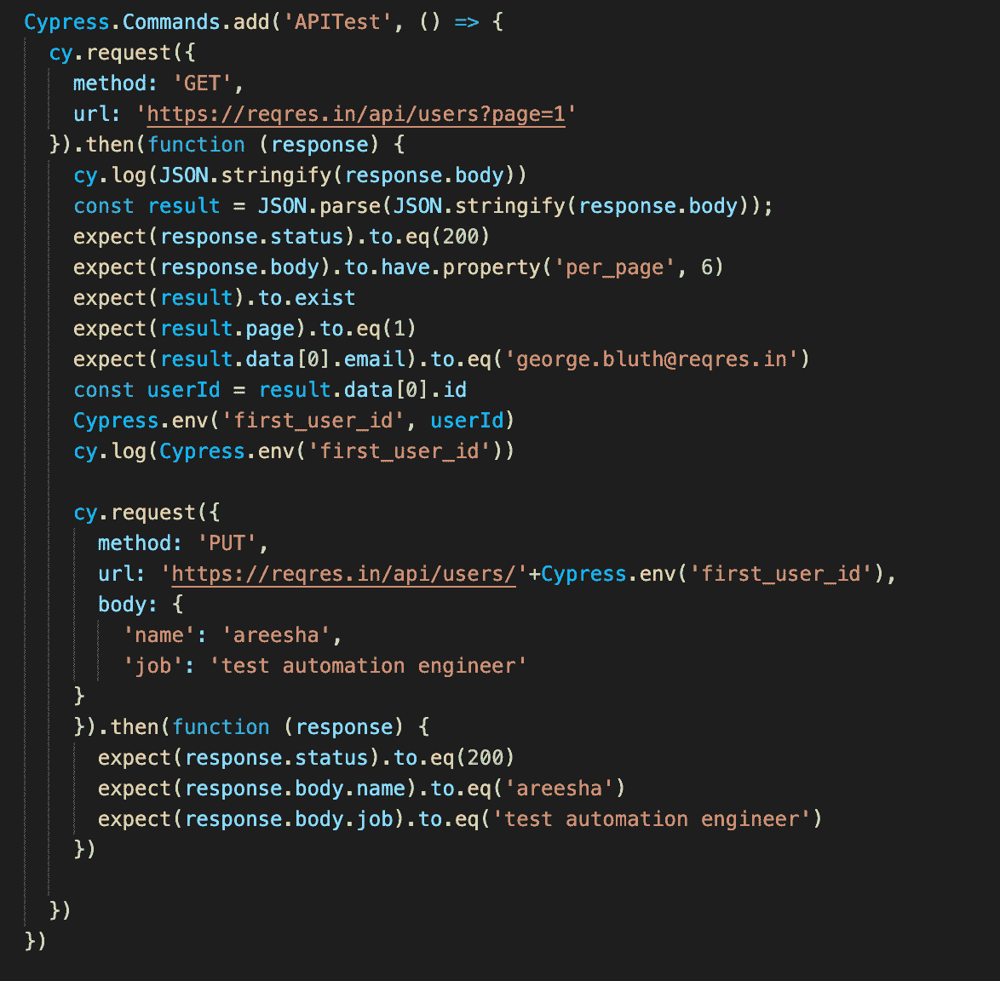

执行此操作将产生以下结果。

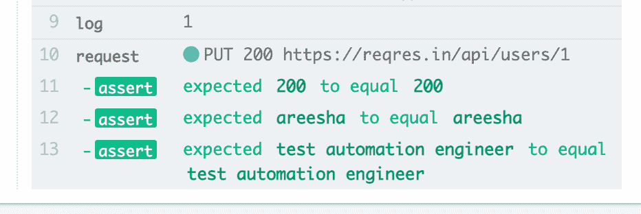

## 进一步的改进

通过本文，您将学会如何处理 API，如何修改它们以便在多个测试中使用它们，以及如何链接请求以便进行额外的操作。

您还可以将基本 URL 存储在 cypress.json 文件下的“base URL”中。

还有很多方法可以改进你的工作，使之更有活力。比方说，您需要在特定请求中每次发送不同的值，或者您需要从 fixtures 调用大量数据。您不能为不同的数据多次创建相同的请求；相反，您应该修改一个请求来处理多个值。

例如，您需要更新职务字段。要解决这个问题，您可以使用以下更改。

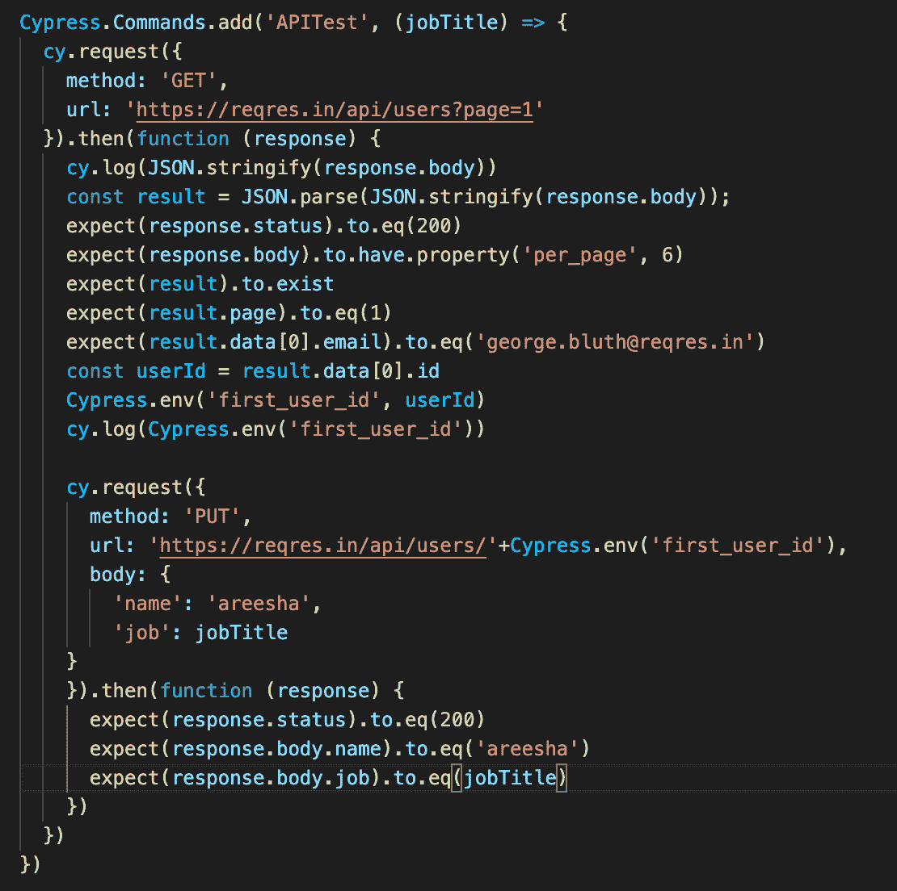

此外，您还需要将作业作为参数添加到规范文件中。

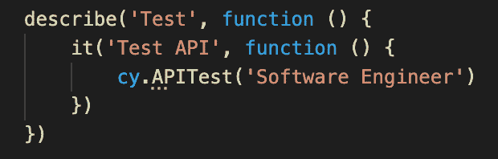

然后执行您的测试。

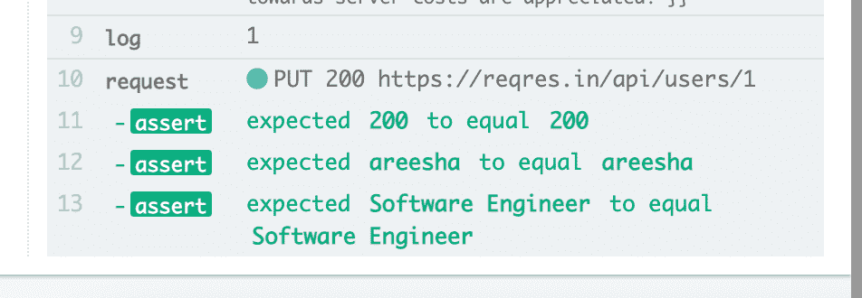

## Cypress 应该用于 API 测试吗？

Cypress 提供了许多好处，另外还支持在必要的地方使用 API。从根本上说，使用它进行 UI 自动化测试更有意义，但是在 UI 测试过程中，在必要的地方执行 API 调用以使它们更快也是有用的。

## 更多内容请访问 [PlainEnglish.io](https://plainenglish.io/) 。

*报名参加我们的* [***免费周报***](http://newsletter.plainenglish.io/) *。关注我们关于*[***Twitter***](https://twitter.com/inPlainEngHQ)，[***LinkedIn***](https://www.linkedin.com/company/inplainenglish/)***，***[*YouTube****，以及***](https://www.youtube.com/channel/UCtipWUghju290NWcn8jhyAw)*[***不和***](https://discord.gg/GtDtUAvyhW) *

## *希望扩大你的科技创业公司的知名度和采用率吗？检查[电路](https://circuit.ooo/?utm=publication-post-cta)。*