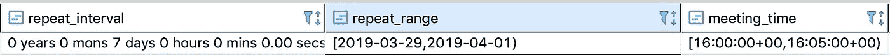
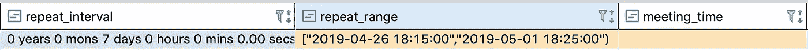

# 使用时区时处理常见的 JavaScript 问题

> 原文：<https://javascript.plainenglish.io/handling-common-javascript-problems-when-using-timezone-76e419aee6e?source=collection_archive---------2----------------------->

## 我用 JavaScript，Moment.js 和 PostgreSQL 实现日历预约系统后的心得。


自从我继承并完成一个 Javascript 预订系统项目已经有一年了，但是在这段时间里它一直给人惊喜。在这篇文章中，我想和你分享一些处理日期时应该考虑的最佳实践。

使用 JavaScript 日期时可能遇到的 3 个主要问题是时区、UTC 和 DST，让我们仔细看看每个问题。

## **常见时区问题**

输出您所在时区的日期似乎非常简单。然而，可能第一个问题会出现在这个项目上:**我应该保存用户时区的日期吗？**所以，这取决于你的项目，但我的建议是**永远不要用用户的时区保存日期。我发现总是将日期转换成 UTC 并将转换后的值保存到数据库中是一个好习惯。还要确保在数据库中有一个单独的列来存储事件**时区**(在我的例子中，它是创建事件的用户的时区)。从数据库中提取 UTC 约会日期时，将此日期转换回事件本地时区，例如:**

```
//good
moment().utc().format(); // Convert date into UTC and save value
moment.tz('2021-02-13T05:31:18Z', 'America/New_York').format(); // Convert back to user's timezone and display on frontend
```

## **UTC 常见问题—“时间旅行”**

我很确定你有这样的情况，当你在晚上 8 点或 9 点后在线提交订单或申请时，你会看到提交日期显示为明天的日期。我们内部称之为**“时间旅行”**问题。如果您执行以下操作，通常会出现此问题:

1.  将数据库中的 UTC 日期保存为`YYYY-MM-DD`，而不是在`UTC`中保存完整的时间戳。例如

```
// wrong
'2021-02-13'// good
'2021-02-13T05:31:18Z'
```

如果您将时间戳转换为`UTC`，并且只获得`date`部分，而没有`time` ( `YYYY-MM-DD`)，则日期将变为第二天(+1 天偏移)，这将导致错误的日期插入数据库，例如尝试`console.log()`这样:

```
// bad
moment('2021-02-13T19:15:18-05:00').utc().format('YYYY-MM-DD');
// output will be '2021-02-14' instead of '2021-02-13' we can see +1 day offset// good
moment('2021-02-13T19:15:18-05:00').utc().format();
```

2.另一个用例是，如果您以 UTC 格式保存完整的时间戳，但是当从数据库读取时，您截断了时间部分(通常在前端)。结果将与上一个示例相同，您的日期偏移+ 1 天，但是这次错误位于您的前端环境中。

**解决方案:**总是将带有时间戳的完整日期保存到数据库中，并将`UTC`日期转换回用户的时区，然后截断`time`部分，例如:

```
// good
moment('2021-02-14T00:27:58Z').tz('America/New_York').format('YYYY-MM-DD'); // output is 2021-02-13 - converted back to user's timezone
```

## **夏令时问题—夏令时**

我们在没有太多时间进行测试的情况下就上线了，这总是会让你失望。一旦夏令时(进一步夏令时)到来，我们就有一个大问题了。所有定期约会都被推迟了 1 小时，哎呀。我开始调试，下面是我的发现:

**范围**



example of wrong ranges without timestamp

当我查看数据库时，我意识到`startDate`和`endDate`在数据库中被保存为范围`repeat_range`，但主要问题是它们被保存为没有`time`的只有`date`的字符串。然而在另一列中，他们将`meeting_time`存储为字符串。当我们从数据库中提取数据时，这两个字符串被连接在一起，在不知道实际时区的情况下，DST 的变化并不适用于它们，这导致了+-1 小时的偏差。为了保持帖子的简短，我将只发布在乞讨时应该做些什么来避免这种情况，而不是经历我采取的所有步骤来修复数据。

```
// bad
['2010-01-01','2021-01-01')// good
['2010-01-01T14:45:00Z','2021-01-01T15:45:00Z') //yyyy-MM-dd’T’HH:mm:ssZ
```

**解决方案**:始终将完整日期与时间戳和时区信息一起保存到数据库中。例如



we cannot see timezone info here since DBeaver converts automatically into a human readable date

## **总结**

我想用一个最佳实践列表来总结这篇文章中的所有要点。如果你同意/不同意他们或者你有类似的问题，请在评论中告诉我。

**最佳做法:**

*   我强烈建议使用一个`UTC`时间戳来表示一个特定的时间点。
*   总是存储在数据库用户的时区中，稍后用于以用户的本地时间转换事件。
*   从不保存没有时间的日期(`YYYY-MM-DD`)(`HH:mm:ss`)，使用完整的时间戳`yyyy-MM-dd’T’HH:mm:ssZ`
*   使用范围时，使用完整的时间戳`yyyy-MM-dd’T’HH:mm:ssZ`，不要将日期(`YYYY-MM-DD`和时间(`HH:mm:ss`)放在不同的列中，以避免`DST`问题。

即使一开始看起来很有挑战性。我想概述的是保持事情简单，总是使用 UTC 时间，直到显示给用户之前。

黑客快乐！