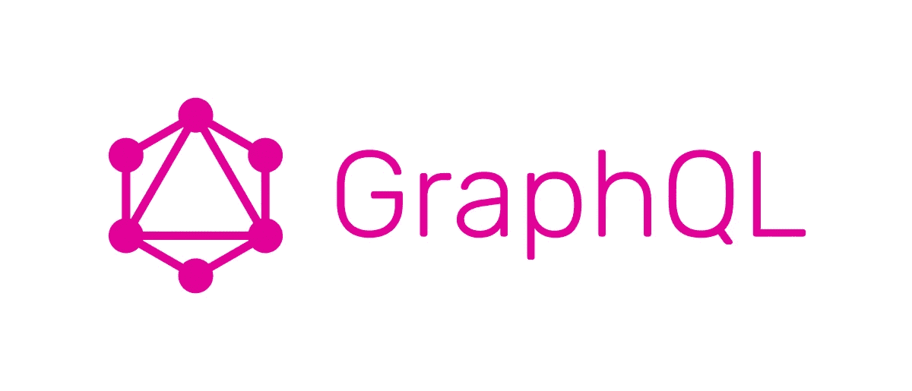
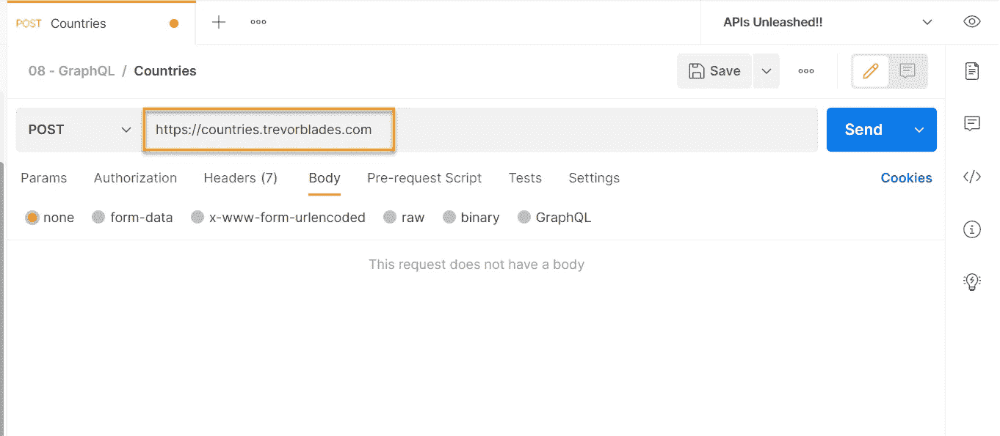
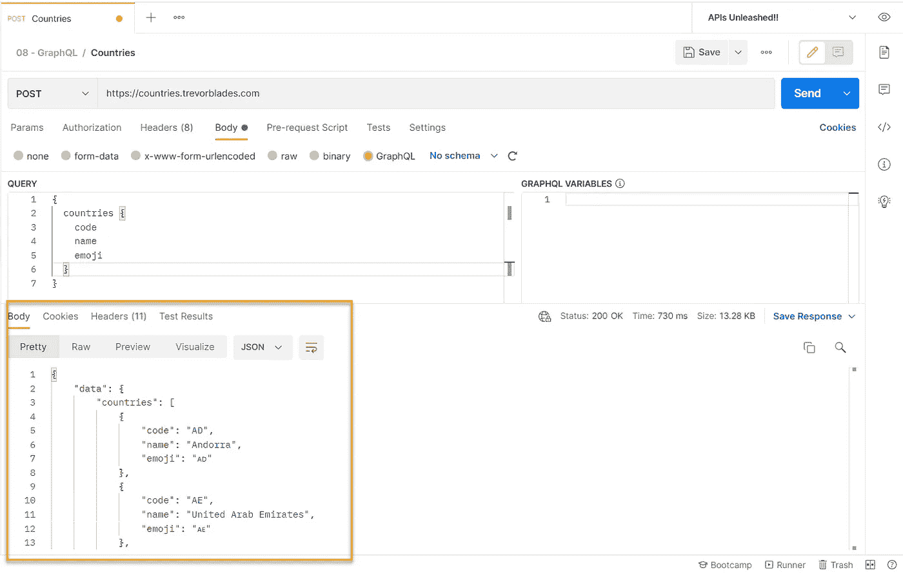
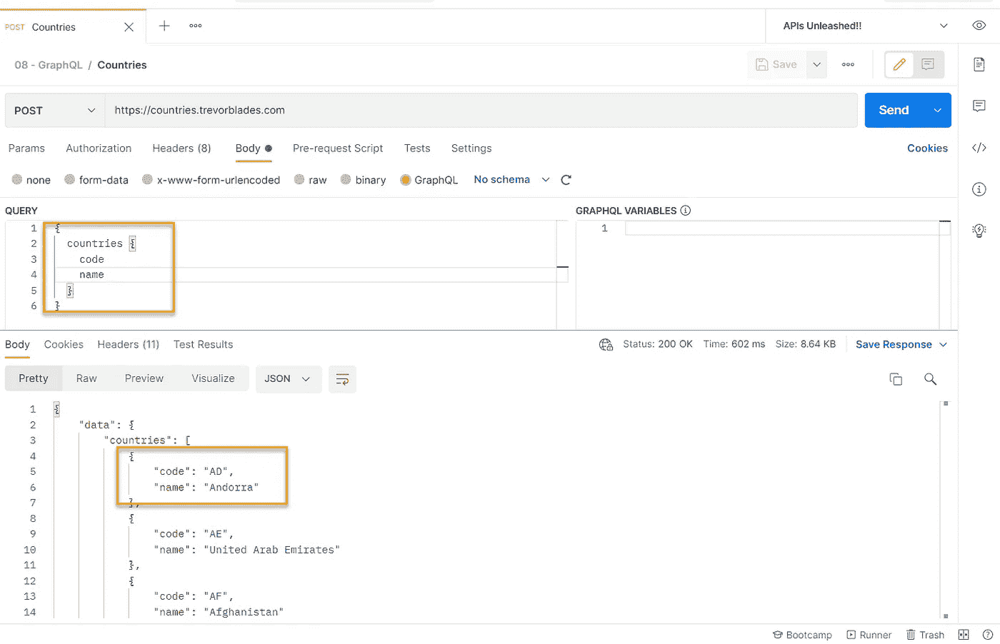
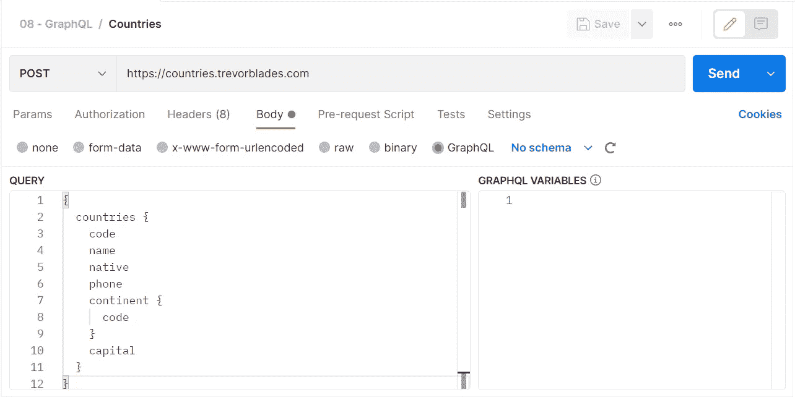
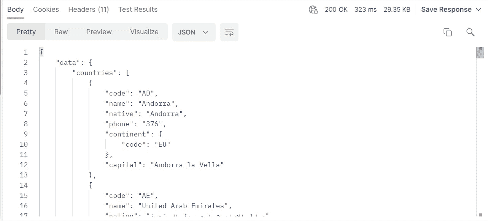
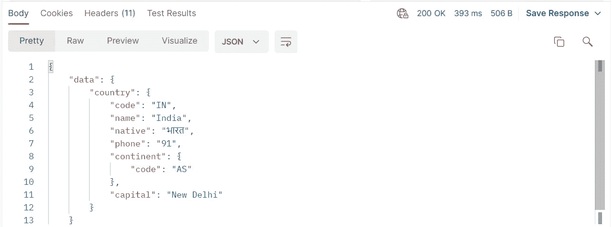

# 在 Postman 中处理 GraphQL

> 原文：<https://javascript.plainenglish.io/handling-graphql-in-postman-6391c767928b?source=collection_archive---------8----------------------->



## 如何在 postman 中创建 GraphQL 请求？

# GraphQL 是什么？

GraphQL 是一种用于应用编程接口(API)的查询语言和服务器端运行时，它优先向客户端提供它们所请求的数据，而不是更多。

GraphQL 是由脸书开发的。GraphQL 规范于 2015 年开源，现在由 GraphQL 基金会监管。

GraphQL 旨在使 API 快速、灵活且对开发人员友好。它甚至可以部署在一个称为 GraphiQL 的集成开发环境(IDE)中。作为 REST 的替代方案，GraphQL 允许开发人员在一个 API 调用中构造从多个数据源提取数据的请求。开发人员可以用他们喜欢的任何方法构建 API，GraphQL 规范将确保它们以对客户端可预测的方式运行。

更多详情请点击此处: [https://graphql .或](https://graphql.or)

Postman 从 7.2 版本开始提供对 GraphQL 的内置支持

在 Postman 中处理 GraphQL 有四个选项:

1.  使用 JSON 主体请求进行查询
2.  同上，但是我们可以用文本模式代替 JSON，只需要添加标题"*内容类型:应用程序/图表 ql*
3.  我们可以将代表 GraphQL 查询的 cURL 请求导入到 Postman 中
4.  在 Postman 中使用对 GraphQL 的内置支持。

为了便于说明，我们将使用第四种方法:

让我们看几个查询格式的例子以及它们是如何工作的。

复制 URL(【https://countries.trevorblades.com】T4)并创建一个帖子请求



# 样本 1:

选择正文为“GraphQL ”,然后粘贴下面的查询

```
{
  countries {
    code
    name
    emoji
  }
}
```

保存并点击“发送”



在这里，您可以选择要显示的按键。

# 样本 2:

我们可以从查询中删除“表情符号”,并基于它过滤整个响应。



# 样本 3:

您还可以根据文档添加其他几个字段。

```
{
  countries {
    code
    name
    native
    phone
    continent {
      code
    }
    capital
  }
}
```



这将给出以下响应:



# 样本 4:

您可以过滤特定的国家，如下所示:

```
{
  country (code: "IN") {
    code
    name
    native
    phone
    continent {
      code
    }
    capital
  }
}
```

回应是，



挺有意思的吧？对于单个端点，我们可以根据自己的需求定制请求。没错，这也是现在很多开发者偏爱 GraphQL 的原因。

由于响应是 JSON 格式的，解析过程类似于处理 REST APIs JSON 响应。

欲了解更多详情和示例，请访问以下页面。

[https://code traveler . io/2019/01/12/how-to-use-postman-with-a-graph QL-API/](https://codetraveler.io/2019/01/12/how-to-use-postman-with-a-graphql-api/)

[https://www.postman.com/devrel/workspace/graphql-examples](https://www.postman.com/devrel/workspace/graphql-examples)

[https://learning . postman . com/docs/sending-requests/supported-API-frameworks/graph QL/](https://learning.postman.com/docs/sending-requests/supported-api-frameworks/graphql/)

注意:

只有 Postman v7.2 或更高版本支持以下功能:

*   将请求正文中的 GraphQL 查询作为 POST 请求发送
*   GraphQL 变量
*   使用 GraphQL 模式类型在 Postman 中创建 API
*   与用户定义的 GraphQL 模式集成的查询自动完成

希望你学习了一些 GraphQL 的基础知识，以及如何在 Postman 中使用 GraphQL。尝试使用更多的示例，以便清楚地了解 GraphQL 以及它在 API 测试工具中是如何处理的。

*原帖*[*https://synapse-QA . com/2021/09/21/APIs-unleashed-08-handling-graph QL/*](https://synapse-qa.com/2021/09/21/apis-unleashed-08-handling-graphql/)

*更多内容请看*[***plain English . io***](http://plainenglish.io)