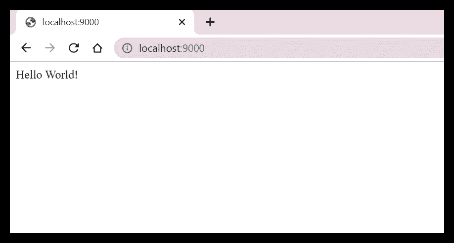
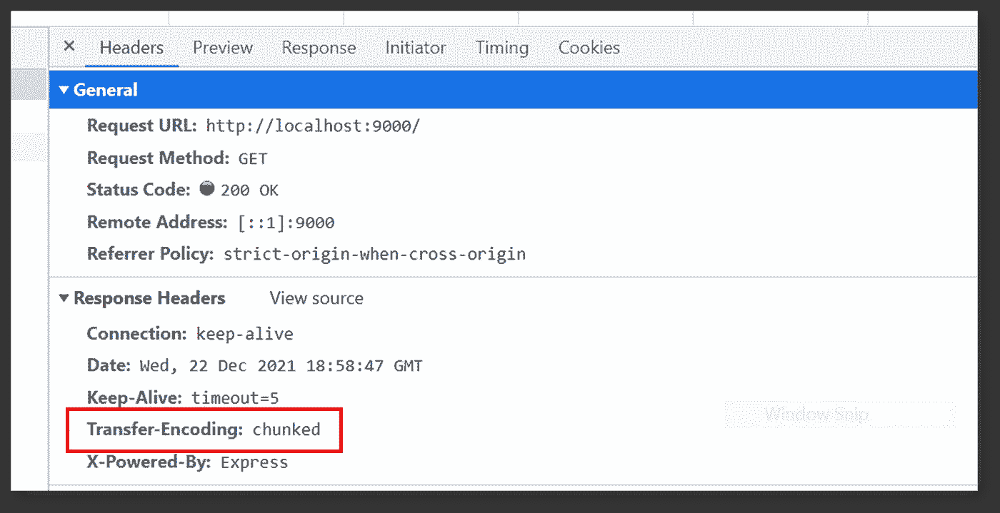

# 如何在 Node.js 中处理流数据请求

> 原文：<https://javascript.plainenglish.io/handling-stream-data-requests-in-nodejs-91746427c103?source=collection_archive---------0----------------------->

## 完整的代码实现和用例。


Photo by [Markus Spiske](https://unsplash.com/@markusspiske?utm_source=medium&utm_medium=referral) on [Unsplash](https://unsplash.com?utm_source=medium&utm_medium=referral)

[Express Node.js 模块](https://expressjs.com/)使 Node.js web 开发人员能够以最少的麻烦设置 web 应用和 REST APIs。然而，在浏览网页时，我注意到不仅有许多关于数据流/缓冲区(例如音频、图像&视频二进制数据)的查询，而且许多提议的解决方案也倾向于包括额外的实用程序，例如 [got](https://www.npmjs.com/package/got) 和 [Axios](https://www.npmjs.com/package/axios) 。

> 虽然这些额外的节点模块可以在大规模项目中实现更易维护的代码，但是在开发人员试图创建小规模应用程序的场景中，具有最少插件的轻量级解决方案可能更合适、更理想。

因此，我决定发布这篇文章，希望它能对其他 NodeJS 开发人员有用，他们正在寻找一个在实现中只需要最少安装的解决方案。

## 先决条件—使用 [Express 模块](https://expressjs.com/)设置一个最小的 Node.js 服务器

**第一步。**初始化工作区文件夹(根文件夹)。在该文件夹中，打开一个终端并继续运行以下命令:

```
npm init -y
npm i express --save
```

上面创建了一个 **package.json** 文件，并将 [Express NodeJS 模块](https://expressjs.com/)分别安装到应用中。

**第二步。创建一个名为 **server.js** 的文件，并添加以下几行:**

```
const express = require('express');
const app = express();
const port = 9000;
app.get('/', (req, res) => {
 res.send('Hello World!');
});
app.listen(port, () => {
 console.log(`App is listening at http://localhost:${port}`);
});
```

**第三步。**在同一终端中，运行`node server.js`并继续导航至 [http://localhost:9000/](http://localhost:9000/)

**输出:**单词“Hello World！”应呈现如下所示



Screenshot by Author

> 至此，我们已经使用 Node.js 的 [*Express 模块*](https://expressjs.com/) *建立了一个运行在端口****9000****上的极简 web 服务器。*

# 用例:返回一个图像文件流响应

## **注意:**完整源代码可从我的 [GitHub Repo](https://github.com/incubated-geek-cc/node-api-stream-demo) 获得

**参考消息:**在 **server.js** 文件中，向客户端返回响应并呈现页面内容的代码块，即“Hello World！”如下所示:

```
app.get('/', (req, res) => {
  res.send('Hello World!');
});
```

> 在假设的场景中，商业用户坚持展示一幅图像，而不是呈现单词“Hello World！”相反，在 web 页面上，需要考虑 ExpressJS 服务器应该向客户机浏览器返回什么类型的响应数据，因为所需的内容不再是普通的 HTML 文本。

首先，重要的是首先要确定这个用例的目标是返回一个嵌入了图像的二进制文件数据的**响应对象**。因此，在下一节中，我将继续演示如何渲染一个图像，例如地址为 [http://localhost:9000/](http://localhost:9000/) 的[leaf.png](https://github.com/incubated-geek-cc/node-api-stream-demo/raw/main/leaf.png)。

为了实现这一点，只需参考前面提到的代码行，并在下面的 **server.js** 中进行以下更改:

```
const express = require('express');
const app = express();
const port = 9000;
const fs = require('fs');
const path = require('path');
app.get('/', (req, res) => {
   var filepathToStream=path.join(__dirname, 'leaf.png');
   var readStream = fs.createReadStream(filepathToStream);
   readStream
   .on('open', () => {
       readStream.pipe(res);
   })
   .on('error', (err_msg) => {
       console.log(err_msg);
       res.end(err_msg);
   });
});
app.listen(port, () => {
 console.log(`App is listening at http://localhost:${port}`)
});
```

继续重新运行应用程序。预期输出应为:


Screenshot by Author | The leaf image has been rendered onto the same local address on port 9000 after changes were made to server.js

**附注:**在检查元素时，值得注意的是 Transfer-Encoding 属性被声明为“chunked”



Screenshot by Author | Transfer-Encoding is chunked in this case as outlined by the red box.

## **解释传输编码=分块的基本原理**

在服务器无法确定响应实体的总大小*(字节数)*的情况下，响应数据的缓冲区数组将因此被成批返回，以防止服务器在传输完成时或之前过载。

***—*** 这在服务器应用程序需要从外部分页 API 连续传输数据的用例中尤其常见。

由于在这个特定的演示中，我们很清楚作为响应实体返回到客户端的本地文件映像没有超出服务器的处理能力，因此本能的选择是实现**管道**以减少所需的代码行。

```
readStream
   .on('open', () => {
       readStream.pipe(res);
   })
   .on('error', (err_msg) => {
       console.log(err_msg);
       res.end(err_msg);
   });
```

> *或者，如果我们坚持按块传输数据的传统方式，那么检索缓冲区数组的方法将不同于上面的方法，如下面的****server . js****文件中的替代解决方案所示(其中所需的输出可以通过地址链接*[*http://localhost:9000/leaf*](http://localhost:9000/leaf)*访问)*

```
const express = require('express');
const app = express();
const port = 9000;
const fs = require('fs');
const path = require('path');
app.get('/', (req, res) => {
   var filepathToStream=path.join(__dirname, 'leaf.png');
   var readStream = fs.createReadStream(filepathToStream);
   readStream
   .on('open', () => {
       readStream.pipe(res);
   })
   .on('error', (err_msg) => {
       console.log(err_msg);
       res.end(err_msg);
   });
});
app.get('/leaf', (req, res) => {
  var filepathToStream=path.join(__dirname, 'leaf.png');
  var readStream = fs.createReadStream(filepathToStream);
  readStream
  .on('data',(chunk) => {
    res.write(chunk);
  })
  .on('error', (err_msg) => {
    console.log(err_msg);
    res.end(err_msg);
  })
  .on('end', () => {
      res.end();
  });
});
app.listen(port, () => {
 console.log(`App is listening at http://localhost:${port}`)
});
```


Screenshot by Author | The leaf image has been rendered onto the same local address on port 9000 with the suffix ‘leaf’ after changes made to server.js

虽然我已经完成了以上关于如何使用**管道**功能和/或通过**块**读取来处理流和缓冲区的演示，但还有一点我想分享，因为它通常与相关用例密切相关。

## 额外材料:为图片提供一个下载链接

对 **server.js** 文件进行修改后，可在[http://localhost:9000/download _ leaf](http://localhost:9000/download_leaf)访问下载链接；

```
const express = require('express');
const app = express();
const port = 9000;
const fs = require('fs');
const path = require('path');
app.get('/', (req, res) => {
   var filepathToStream=path.join(__dirname, 'leaf.png');
   var readStream = fs.createReadStream(filepathToStream);
   readStream
   .on('open', () => {
       readStream.pipe(res);
   })
   .on('error', (err_msg) => {
       console.log(err_msg);
       res.end(err_msg);
   });
});
app.get('/leaf', (req, res) => {
  var filepathToStream = path.join(__dirname, 'leaf.png');
  var readStream = fs.createReadStream(filepathToStream);
  readStream
  .on('data',(chunk) => {
    res.write(chunk);
  })
  .on('error', (err_msg) => {
    console.log(err_msg);
    res.end(err_msg);
  })
  .on('end', () => {
      res.end();
  });
});
app.get('/download_leaf', (req, res) => {
  var allChunks=[];
  var filepathToStream=path.join(__dirname, 'leaf.png');
  var readStream = fs.createReadStream(filepathToStream);
  readStream
  .on('data', (chunk) => {
    allChunks=allChunks.concat(chunk);
  })
  .on('error', (err_msg) => {
    console.log(err_msg);
    res.end(err_msg);
  })
  .on('end', () => {
      var b64URI = 'data:image/png;base64,' + Buffer.from(allChunks[0]).toString('base64');
      var downloadLink="<a href='"+b64URI+"' download='leaf.png' target='_blank'>Download leaf.png</a>";
      res.send(downloadLink);
  });
});
app.listen(port, () => {
  console.log(`App is listening at http://localhost:${port}`)
});
```


Screen Capture by Author | Upon navigating to [http://localhost:9000/download_leaf](http://localhost:9000/download_leaf) the download link is generated. Image is then saved successfully.

*我关于如何在 ExpressJS 中处理缓冲区数组和流数据的文章到此结束！非常感谢你坚持到这篇文章的结尾！❤希望本指南对您有用，如果您想了解更多 GIS、数据分析& Web 应用相关的内容，请随时* [*关注我的 Medium*](https://medium.com/@geek-cc) *。*非常感谢😀

如果你忘记了，完整的源代码在这里[可以找到](https://github.com/incubated-geek-cc/node-api-stream-demo)如果有人想检索它作为参考。

[](https://geek-cc.medium.com/membership) [## 通过我的推荐链接加入灵媒——李思欣·崔

### 获得李思欣·崔和其他作家在媒体上的所有帖子！😃您的会员费直接…

geek-cc.medium.com](https://geek-cc.medium.com/membership) 

*更多内容请看*[*plain English . io*](http://plainenglish.io/)*。报名参加我们的* [*免费周报在这里*](http://newsletter.plainenglish.io/) *。*