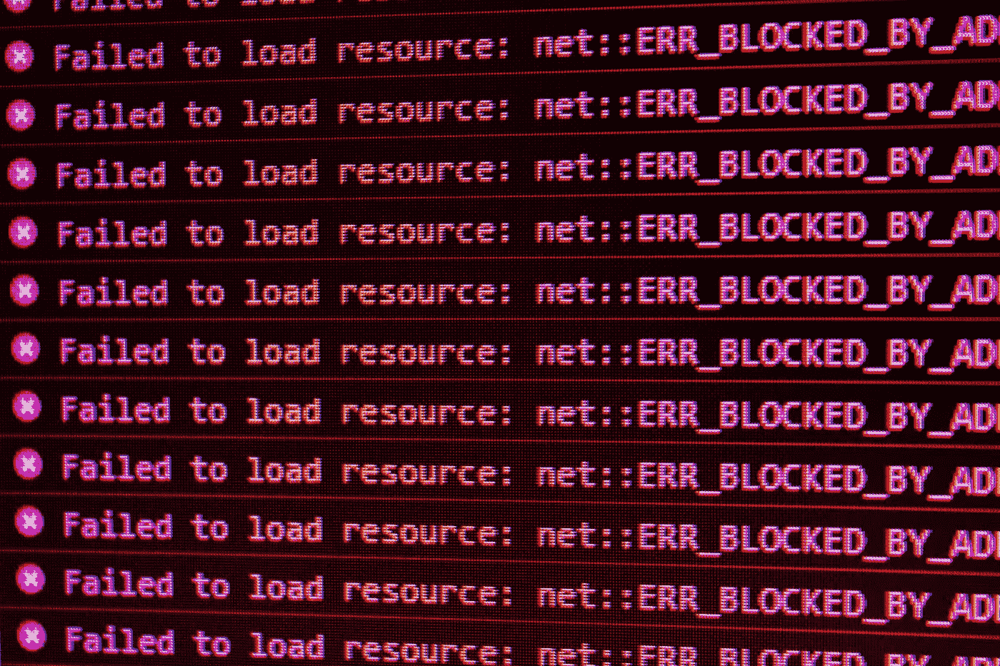
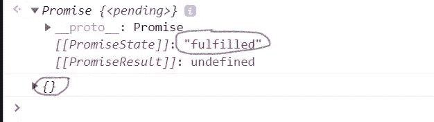
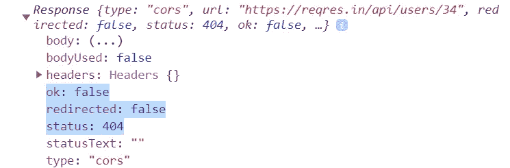
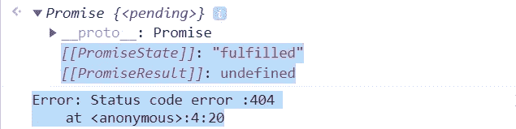
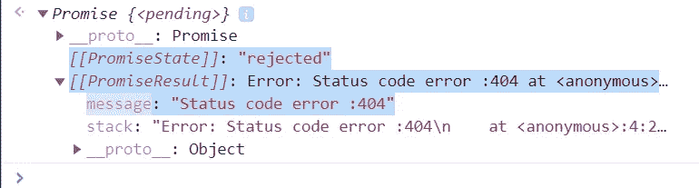
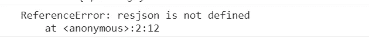
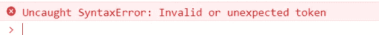

# 如何在 JavaScript 中处理不成功的获取 API 调用

> 原文：<https://javascript.plainenglish.io/handling-unsuccessful-calls-of-fetch-api-7eef551b74c8?source=collection_archive---------2----------------------->



Photo by [David Pupaza](https://unsplash.com/@dav420?utm_source=unsplash&utm_medium=referral&utm_content=creditCopyText) on [Unsplash](https://unsplash.com/s/photos/404-error?utm_source=unsplash&utm_medium=referral&utm_content=creditCopyText)

所以，在[之前的帖子](https://mohithgupta.medium.com/all-you-need-to-know-about-the-fetch-api-6929930572a8)中，我们看到了 fetch(url，{options})所有可能的事情(错误处理除外)。如果你还没看过，在这里读一下[。](https://mohithgupta.medium.com/all-you-need-to-know-about-the-fetch-api-6929930572a8)

今天，我们将学习如何处理`fetch()`发出的错误或任何不成功的呼叫。我们将使用与前一篇文章相同的网址。没有任何进一步的麻烦，让我们开始吧！

在之前的帖子中，我提到了一个观点:

> *除非出现某种网络错误，否则获取总是成功或得到响应。*

如果语法错误或 URL 无效，它也会失败，这些都是显而易见的情况。记住这些作为第一点。现在，让我们看看`catch()`的语法:

```
fetch("[https://reqres.in/api/users/1](https://reqres.in/api/users/1)")
.then( response => response.json() )
.then( data => console.log(data) )
.catch( error => console.log(error) )
```

它位于`.then()`之后，用于处理被拒绝的承诺。
记住这是第 2 点→ **“它处理被拒绝的承诺”**

首先，让我们看看当我们访问一个不存在的用户的详细信息时会发生什么。据我们所知，我们应该得到一个' **404** '错误，说没有找到，对吗？

```
fetch("[https://reqres.in/api/users/34](https://reqres.in/api/users/34)")  
.then(res=>res.json())
.then(data=>console.log(data))
```



我们既没有看到错误，也没有看到任何数据，但是承诺实现了。因此，您可能认为在末尾有一个`catch()`块是可行的，但是:

```
fetch("[https://reqres.in/api/users/34](https://reqres.in/api/users/34)")  
.then(res=>res.json())
.then(data=>console.log(data))
.catch( error => console.log(error) )
```


看到了吗？没有变化。如果没有抛出错误，catch 如何处理错误？现在，想想我希望你记住的第一点。据此， **404 错误**对`fetch()`来说不是错误，所以成功返回承诺。从这个意义上来说，这个承诺是不被拒绝的。根据要记住的第二点，`catch()`块处理对承诺的拒绝，因此它不处理这个错误，因为这里返回了一个承诺。在上图中，您可以看到承诺状态为“已履行”。

为了处理这样的错误，fetch 为它返回的响应对象提供了一个“ **ok** ”属性。我们可以打印 res 对象来查看这些细节:

```
fetch("[https://reqres.in/api/users/34](https://reqres.in/api/users/3432)")
.then(res=>console.log(res))
```



在返回响应对象之前，我们可以检查“ok”是否设置为 **true 或 false。**它代表获取调用的状态代码。如果状态代码为`**2xx**`形式，则‘ok’将被设置为真，否则将被设置为假(对于`**4xx**` 和`**5xx**` 状态代码)。

```
fetch("[https://reqres.in/api/users/34](https://reqres.in/api/users/34)")
.then((res)=>{ 
        if(res.ok) return res.json(); 
        else throw new Error("Status code error :" + res.status) 
})
.then(data=>console.log(data))
.catch(err=>console.log(err))
```



承诺状态是“履行”，但我们现在处理了错误。
现在我们可以看到承诺被拒绝的证据，因此由`catch()`块处理。要查看被拒绝的承诺状态，移除`catch()` 块。还有数据打印块，因为如果响应块没有返回任何东西，就没有用了，对吗？(不删除数据块会产生相同的结果)

```
fetch("[https://reqres.in/api/users/34](https://reqres.in/api/users/34)")
.then((res)=>{ 
        if(res.ok) return res.json(); 
        else throw new Error("Status code error :" + res.status) 
})
```



如您所见，承诺状态被拒绝，因此 catch 块可以处理这个错误。您可以打印响应而不是返回它，但是您将得到相同的结果。

`catch()`块可以处理语法错误，因为如果语法错误:
fetch 不能成功→所以 promise 不返回→所以 error 转到 catch
这里，语法错误，所以 catch 获取错误并打印出来:

```
fetch("[https://reqres.in/api/users/34](https://reqres.in/api/users/3432)")
.then(res=>resjson())
.catch(error=>console.log(error))
```



类似地，网络错误:没有网络→获取无法成功→所以承诺没有返回→所以错误被捕获

```
fetch("[https://reqres.in/api/users/4](https://reqres.in/api/users/4)")
.then(res=>res.json())
.catch(err=>console.log(err))
```


但无效 URL 直接抛出错误“无效或意外令牌”，因为如果 URL 错误，fetch 甚至无法启动进程，更不用说返回承诺:

```
fetch("https://reqres.in/api/users/34\")  
.then(res=>res.json())
.then(data=>console.log(data))
.catch(error=>console.log(error))
```



最后，你坚持到了最后。关于处理`fetch()`呼叫不成功，你就知道这么多了。

希望你喜欢这篇文章。如果你有，考虑在评论区提供反馈或建议。请确保不要错过我未来的任何帖子。期待前方更多有趣的文章。

如果你太高兴，你可以请我喝杯咖啡😉


你可以看看我其他的一些帖子:

[只需点击一下](https://python.plainenglish.io/play-youtube-videos-in-vlc-with-just-1-click-2baca84c03f3)
[【转换你的】,即可在 VLC 上播放 YouTube 视频。py '到 a '。我编写了一个脚本来下载 Google Drive 的“下载受限”文件](https://python.plainenglish.io/convert-your-py-to-exe-with-just-2-commands-4c6cefe9af4c)

*如有疑问或其他问题，您可以在 mohithguptak@gmail.com ping 我或在*[*Twitter*](https://twitter.com/tobeawebdev)*上找到我。*

*更多内容请看*[***plain English . io***](http://plainenglish.io/)