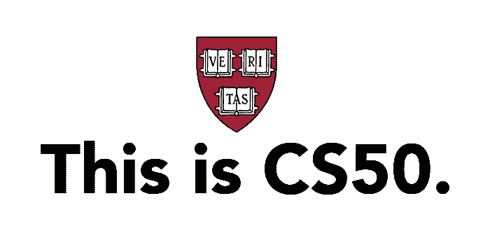
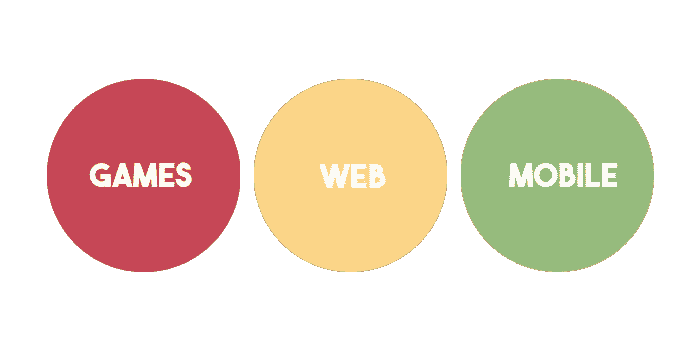

# 哈佛 CS50 评论

> 原文：<https://javascript.plainenglish.io/harvard-cs50-review-bec3af5eb62d?source=collection_archive---------0----------------------->

这是任何学生(无论自学状态/训练营/计算机科学学位如何)都可以参加的计算机科学(CS)课程的***精粹*。我可以有把握地说，没有这门课，我就不会有今天。对于那些还不知道的人来说(真可耻)，这门课是由哈佛的 edX 组织开设的，最重要的是它是免费的*。***

***是大卫·j·马兰教授教的。CS50 以一种更“noob 友好的方式”接近计算机科学，而不是直接潜入错综复杂的语法，它被分成 8 周，有一个最终项目。***

# ***第 0 周***

***CS50 从 Scratch 开始，Scratch 是一种可视化/精灵编程语言，它在某种程度上强调了低级编程的基本概念。我实际上花了比要求更多的时间来完成[项目](https://scratch.mit.edu/projects/391385165/)，因为我想让它看起来漂亮。可悲的是，这是课程中唯一“轻松的一周”,紧接着他们就开始钻研 C 语言了。CS50 的核心理念是培养像计算机科学家一样思考和解决问题的计算机科学家。理解和应用概念的人，而不是仅仅记住如何循环 x，y 次的人，因为核心概念最终比仅仅记住语法重要得多。***

# ***第 1–5 周***

***这种情况持续了 1 到 5 周(相当长)，就我个人而言，我在这段时间里挣扎得很厉害。话虽这么说，完全正常。对于这个级别的人来说，给定的任务是相当困难的，这几周的重点是实际上确定在编程的世界中，你会一直碰壁，遇到你完全不知道的事情，根本不知道从哪里开始。但是主要的收获是:***

> ****每个问题都只是一系列更小的问题。****
> 
> ***重复这一过程，直到你能够分解这一系列问题，最终你将能够解决它们。***
> 
> ***如果你解决了足够多的小问题，最终大问题会迎刃而解。***

# ***第六周***

***这是事情变得“更容易”的地方，但这只是因为你在过去的几周里不知疲倦地工作(我希望)试图解决 C 中的问题。在第 6 周，你将了解 Python，一种与 C 相比更新得多的编程语言。在这里，如果你以正确的方式完成工作，你实际上可以轻松完成问题集，因为在 Python 中，你不必太担心像内存分配/哈希表这样的事情，这些东西在 C 和 Python 中是不能免费获得的。Python 是一种很棒的编程语言，因为它的通用性和简单的语法。当教授展示一行 Python 代码与 10 行 C 代码所能实现的效果时，这绝对是一个有趣的时刻。***

# ***第 7 周***

***当涉及到编程时，数据库是最重要的，当然，CS50 从来不会错过它的“综合课程”。在这一周，你将了解一种叫做 SQL 的查询语言。SQL 是最常用的数据库，因为它在存储复杂级别的数据方面非常强大。就个人而言，这一周非常有趣，你将面临许多新学到的 SQL 技能的挑战。当您真正需要逻辑地思考如何查询您需要的特定数据块时，挑战变得越来越困难。我有一整页的插图来刺激我的大脑思考如何才能真正把这些点联系起来。耐心点，一旦把点点滴滴串联起来，就值了。***

# ***第 8 周***

***我们现在差不多要结束这门课程了。给自己一个鼓励，因为这是一个重要的里程碑。您现在可以选择:***

******

***根据你选择的道路，你会看到不同的演讲视频和相应的挑战。由于我选择了网络之路，我的评论不会涵盖游戏和移动的挑战。然而，你和我*强烈*向你推荐 web 路线是明智的，因为开发人员就业市场由 Web 平台主导，向这个方向发展将拓宽你的视野，而不是在你旅程的早期阶段将你自己限制在一个有限的角色中。在另一篇文章中会有更多的介绍。***

***此 web 路径有两个部分。首先介绍基本的 **HTML/CSS JavaScript** 。这些是前端 web 开发的三位一体和最基本的要素。虽然课程的这一部分没有其他部分做得好，但我可以证明他们可能有时间限制，因为这一部分只有一周的时间，而 web 开发是一个太多样化的主题，无法在一周内涵盖。但是要感谢他们在这一周内挤出了这么多的内容和信息。这一周的挑战很简单，只需要一个基本的网站开发任务。***

***第二部分介绍 Flask，它是 Python 中的一个 web 框架(万岁，你已经知道 Python 了！).同样，这一部分也不像其余部分那样全面，可能也是由于时间限制。***

***这项任务很酷，你必须使用 Flask 和 SQL 数据库来构建一个股票购买模拟器应用程序。这个项目将需要一些时间，因为它们可能是你自己的研究和堆栈溢出填补的许多空白，但我个人认为这是 web 开发的一个很好的品味，它建立了一个很好的脚手架，将你的技能过渡到最终的项目。***

# ***最终方案***

***最终项目包括***

*   ***一个基于 web 的应用程序，使用 JavaScript、Python 和 SQL，部分基于 web track 的分发代码***
*   ***使用 Swift 的 iOS 应用程序***
*   ***一个使用 Lua 和 love 的游戏***
*   ***使用 Java 的 Android 应用程序***
*   ***使用 JavaScript 的 Chrome 扩展***
*   ***使用 C 的命令行程序***
*   ***一个基于硬件的应用程序，你为它编写一些设备***

***好吧，别担心，我在开玩笑。你不必完成所有的(虽然你可以)，但本质上你应该根据你第八周的决定选择一个。自然地，基于网络的应用程序将是最相关的，因为它的设计方式是无论你在第 8 周做了什么都将是你期末项目的延续。***

***我花了将近一周的时间在这里建立了一个巴士到达 ETA 应用程序。当时没有数据库(因为我当时并不知道它们是什么)，但我开发了一个 Flask 应用程序，可以使用开源 API。我的应用程序很丑，但本质上它可以准确地显示公交时间，而且运行得相当不错。最重要和令人惊讶的是，这个想法实际上是为了解决我的*日常问题之一。****

****这很有趣，因为我非常喜欢这个想法，几个月后我冒昧地用 React 重构了它，并将其部署在 Heroku ( [点击这里](https://thebusetaapp.herokuapp.com))上。****

# ****最后的想法****

****总而言之，CS50 的名字已经遍布 Reddit 和编码论坛，这是有充分理由的。我个人对它的评价是，它的结构非常好，给人一种很好的实际开发的感觉(很多起伏)，教授基础和核心概念，而不是单纯的记忆语法。****

****我引用一个好朋友的话来结束我的演讲:****

> *****“听起来很老套，但有了 CS50，我真正学会了如何学习”。*****

****下次再见，保重。****

****定时（timing 的缩写）****

******附言******

****我看到很多贴子的人在许多问题集上挣扎，但是让我向你保证— *这是完全正常的！这些问题集旨在刺激你的大脑，它们极具挑战性，但并非不可能。记住，一个问题接一个问题，解决一个问题，然后继续下一个问题。*****

*****更多内容请看*[*plain English . io*](http://plainenglish.io/)****