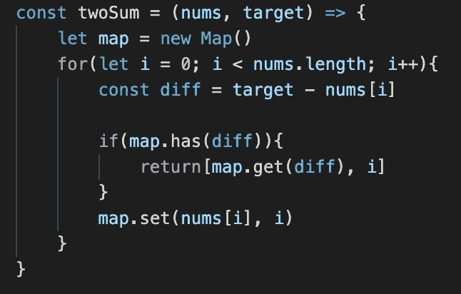

# 改善时间复杂度的散列映射

> 原文：<https://javascript.plainenglish.io/hash-maps-to-improve-time-complexity-bc7ca692fcc?source=collection_archive---------4----------------------->

解决数据结构和算法问题时，即使数据集变得越来越大，提出高效且持续有效的解决方案也很重要。这意味着有很大的时间复杂度，对于某些问题集，一种方法是使用散列映射。

Photo by [Agê Barros](https://unsplash.com/@agebarros?utm_source=medium&utm_medium=referral) on [Unsplash](https://unsplash.com?utm_source=medium&utm_medium=referral)

哈希映射存储 Javascript 中的键值对。哈希映射可以是 JavaScript 对象或 JavaScript 的内置映射对象。其他语言也有自己的版本，例如在 Python 中它是一个字典，在 Ruby 中，它是一个散列，尽管使用了键值对，但主要思想是相同的。那么，这如何有助于提高我们的大 O 呢？在大多数情况下，搜索、插入和删除一个哈希映射需要很长的时间(这是最好的运行时间)。还必须指出的是，散列映射最糟糕的情况是大的 O(n)线性时间(这并不可怕)。

在哪里使用哈希映射？在研究编码算法时，如果你注意到问题中存在存储的键-值对，你可以从中提取或搜索来帮助得出答案。那么也许值得尝试利用散列图。举个实际的例子，Leetcode.com 的第一个问题是“两个和”。这个问题给你一个整数数组和一个目标整数。从这个数组中，通过将两个整数相加，我们可以得到目标数并返回这两个数的索引，每个输入只有一个解。

简单的强力方法是建立一个嵌套循环来遍历数组中的所有数字(一个循环遍历一个数字，第二个循环遍历下一个数字)，然后从目标数字中减去其中一个数字，看它是否等于另一个数字。用 JavaScript 写的话应该是这样的:

嵌套循环的时间复杂度为 O(n)二次时间。在这种情况下，我们可以使用哈希映射来改进这一点。我们只需要一个循环来查找目标数字减去循环中的数字，并在哈希映射中查找该值(哈希映射用于将数组中的数字存储为键，将它们的索引存储为值)。然后使用条件语句从映射中找到我们想要的值及其索引。这将我们的时间复杂度降低到 O(n ),其中一个循环和我们的散列映射的插入/查找是 O(1)。使用对象作为哈希映射的 JavaScript 代码如下所示:

就像我之前提到的，我们也可以使用 JavaScript Map 对象来达到类似于使用 JavaScript 对象作为地图的效果。我们只需要使用正确的语法并调用 Map 对象的函数 has、get 和 set(还有很多，这只是我们使用的三个函数)。因此，使用 map 对象时，基本上与上面相同的代码如下所示:

最后，这只是可以使用散列映射的一个例子，还有许多其他问题也可以使用散列映射。重要的是知道什么时候使用它们，什么时候它们可以帮助你的代码更有效地运行。

通过 Udemy 课程 [JavaScript 算法和数据结构大师班](https://www.udemy.com/course/js-algorithms-and-data-structures-masterclass/) & [掌握编码面试:数据结构+算法](https://www.udemy.com/course/master-the-coding-interview-data-structures-algorithms/)帮助我理解和使用哈希映射。

*在* [***获取更多内容***](https://plainenglish.io/)