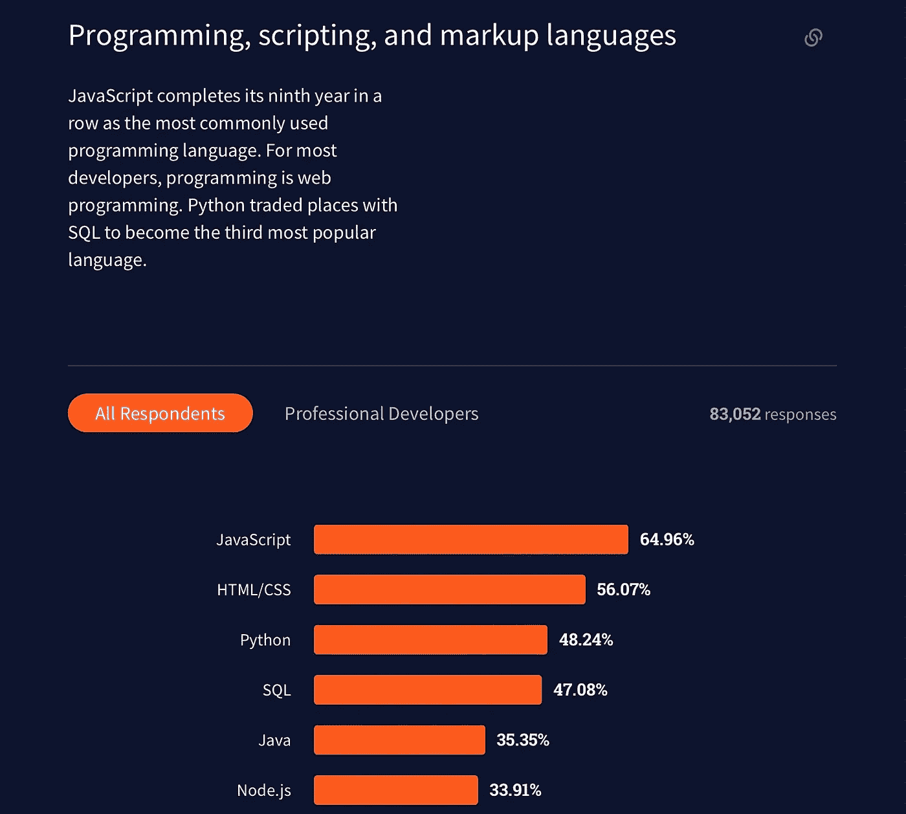
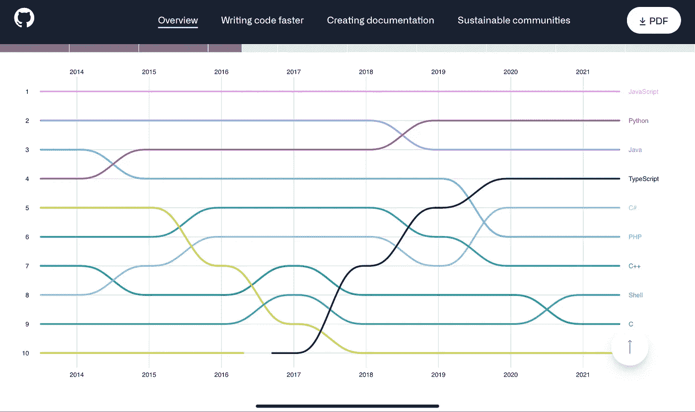

# 数字时代是否让我们失去了“优秀”的开发人员？

> 原文：<https://javascript.plainenglish.io/have-we-lost-good-developers-c7505c3f65ae?source=collection_archive---------4----------------------->

## 我们是否因为信息的易获取性而失去了优秀的问题解决者？

Photo by [Hannah Vorenkamp](https://unsplash.com/@hankamp?utm_source=medium&utm_medium=referral) on [Unsplash](https://unsplash.com?utm_source=medium&utm_medium=referral)

到底谁被认为是好的开发人员？一个能自己想出解决办法的人？懂得何时寻求帮助的人？知道如何使用谷歌的人？复制粘贴者？或者我们应该解决“好”的定义到底意味着什么？

我从计算机在万维网出现之前开始席卷全球的时代的角度来探讨这个话题，另一种观点是从今天的角度来看，信息在我们的口袋里是如此容易获取。

# 在万维网出现之前

第一所提供计算机科学学位课程的大学是 1953 年的剑桥大学计算机实验室，万维网直到 1989 年才由蒂姆·伯纳斯·李引入。那么在 1989 年之前，计算机科学的学生和开发人员是如何想出复杂问题的解决方案的呢？

我花了一些时间采访了一些 80 年代初毕业的工程师，以下是我的发现。

过去的应用程序不像我们今天看到的那些可以在手机上访问的应用程序，也不像那些可以在台式机或笔记本电脑上下载的应用程序。所有应用程序都是大型机或穿孔卡应用程序，主要用于银行、航空公司、铁路等。

那时计算机还不容易使用，类似于图书馆，有专门的建筑来存放这些计算机。Fortran 和 COBOL 是学校教授的流行语言。

当开始做作业时，它不像只是“谷歌”解决方案那么简单。大多数学生拥有的资源包括他们的课本、教授和助教，以及少数高年级学生。与今天的虚拟助手相比，学生的资源非常“本地”，比如 StackOverflow。

那时终端还不普遍，所以在你收集的穿孔卡片中，没有什么能告诉你错误发生在哪里。此外，有时会有一队学生需要让他们的穿孔卡通过机器，所以等待出错可能比扔掉所有的穿孔卡压力要小。

# 今天

自 20 世纪 90 年代以来，技术呈指数级增长，从带数字键盘的手机到触摸屏智能手机，从网站应用到移动应用，从物理邮件到电子邮件，最近又从面对面教育到虚拟教育。

今天，几乎每个人都拥有某种类型的个人电脑(包括智能手机)，它可以为你做很多日常工作。你可以在网上购买杂货，订购外卖，以玩视频游戏为生，在社交媒体上宣传你的业务，甚至虚拟地与一群朋友一起看电影。

需要一些信息吗？“谷歌 it”是人们用来搜索某样东西的最常用术语。这就像在手机、平板电脑或电脑上输入一个问题一样简单。或者，如果你像我一样懒，我只是口头问 Siri 或者 Google。

作为一名开发人员，当我在大学做作业的时候，我发现自己在网上寻找解决方案的次数比从其他人那里寻找更多。像 Geeks4Geeks，StackOverflow，有时甚至是 GitHub 这样的网站，都有我正在寻找的所有答案，有时也可以在那里找到作业的解决方案(如果你现在还在上学，不要复制粘贴，我是通过艰苦的努力才学会的)。

业内的一些开发人员有时会开玩笑说自己是专业的“谷歌人”，而不是开发人员。有些开发人员在找到解决方案时也陷入了复制粘贴的陷阱。

事实是，我们周围技术的发展已经将我们置于一个信息如此容易获得的位置，如果你能在网上找到解决方案，依靠自己或他人可能就没有必要了。

如果我不能解决一个问题，我会在考虑向同事寻求帮助之前在谷歌上搜索。

技术栈也呈指数级增长，尤其是网络应用。在过去 20 年左右的时间里，React、React Native、Flutter、Angular 等更多的产品诞生了。最近，今年发布了像 [Remix](https://remix.run/) 和 [Hydrogen](https://hydrogen.shopify.dev/) 这样的新框架。

# 优秀的开发者

到底谁是更好的开发者或者优秀的开发者？老派，主要通过人脑的智慧来解决问题？或者新学校，在网上可以找到解决方案？

我认为这个问题无法根据时间周期的差异和由于那个时间周期我们可用的工具来回答。但最重要的问题是:今天的行业对我们的要求是什么？

如今，这个行业的发展速度比过去快得多。专业知识的分支比以前多了。今天，开发者可以选择专攻 20 年甚至 30 年前不存在的领域。有些开发人员从事 React 开发人员、移动开发人员、Ruby 开发人员、DevOps 工程师、云工程师、系统架构师、软件架构师、Azure 工程师等职业。有专门针对编程语言的职业，如高级 Python 开发人员，也有全面发展的职业，如全栈工程师或开发人员。

20 年或 30 多年前，每个人都会从初级开发人员、初级程序员或初级软件工程师做起。

Photo from[Stack Overflow](https://insights.stackoverflow.com/survey/2021)

根据[栈溢出](https://insights.stackoverflow.com/survey/2021#section-most-popular-technologies-programming-scripting-and-markup-languages)和 [JetBrains](https://www.jetbrains.com/lp/devecosystem-2021/) ，Javascript、HTML/CSS、Python 和 SQL 是最常用的编程语言。

Photo from [Github](https://octoverse.github.com)

据 [Github](https://octoverse.github.com/#top-languages-over-the-years) 报道，似乎现在的行业对开发者的高级编程语言要求越来越高。

仍然有公司仍然需要 COBOL、Fortran 或汇编程序员，但是行业的大多数人似乎需要更多的开发人员来开发更加“虚拟有形”的服务和产品。

我认为久而久之和技术在变化和进步，优秀的问题解决者会适应行业对他们的要求。

我出生于 97 年，但我们会说 98 年，因为我出生在 97 年的末尾。直到 2000 年代末，我才意识到与互联网或万维网相关的任何事情，所以也许我的思维过程和判断可能有点天真，但这一直是一个不断戳中我内心深处的问题。我希望我已经把这个话题开放给所有人阅读。

# 资源:

*   [八边形](https://octoverse.github.com)
*   [2021 年开发者调查](https://octoverse.github.com)
*   [2021 年开发者生态系统状况](https://www.jetbrains.com/lp/devecosystem-2021/)
*   [计算机科学—维基百科](https://en.wikipedia.org/wiki/Computer_science)
*   [蒂姆·伯纳斯·李—维基百科](https://en.wikipedia.org/wiki/Tim_Berners-Lee)

非常感谢我的父亲和约翰·汤姆，他们在我出生前就给了我对科技世界的洞察力。

*更多内容请看* [***说白了就是***](http://plainenglish.io/) *。报名参加我们的* [***免费每周简讯这里***](http://newsletter.plainenglish.io/) *。*