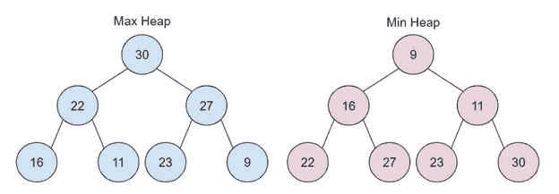
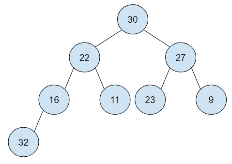
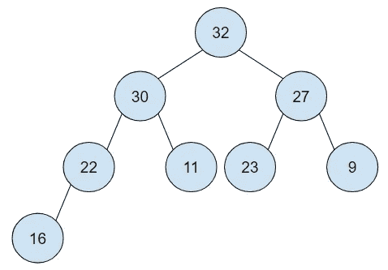
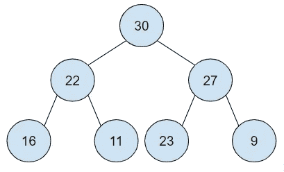
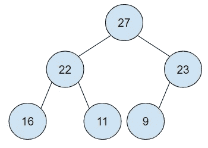

# 如何在 JavaScript 中创建堆数据结构

> 原文：<https://javascript.plainenglish.io/heap-heap-heap-d423320a4997?source=collection_archive---------8----------------------->

欢迎来到垃圾堆。堆有一个二叉查找树式的结构。每个父节点都有两个子节点，它们都源自一个根。可以通过两种方式对堆进行排序:

**最大堆:**最大堆的最大值将作为根，并且每个父节点的值总是大于其子节点。

**最小堆:**最小堆的根节点值最小，每个父节点的值总是小于其子节点。



Max and Min Heap

堆在兄弟之间没有隐含的顺序。较大的一个可以是左子节点或右子节点，这并不重要。堆越紧凑越好。每个节点的所有子节点都已满，剩下的子节点先被填满。

# **实施**

在本文的其余部分，我们将重点讨论最大堆。我们可以使用数组来实现上面的最大堆。

```
[30,22,27,16,11,23,9]
```

我们可以看到我们的根位于索引 0，它的子节点位于索引 1 和 2。我们如何知道哪些索引是索引 1 和 2 处节点的子节点？

对于数组的任何第 I 个索引:

*   左子级存储在 2 * i + 1 索引中。
*   右子级存储在 2 * i + 2 索引中。
*   对于索引 I 处的任何子节点，其父节点位于 floor((i-1)/2)索引处。

# 插入

我们将使用之前的堆，并尝试插入一个值为 32 的新节点。



Inserting a node

```
[30,22,27,16,11,23,9,32]
```

我们的新节点被添加到数组的末尾。这与我们希望的节点位置相去甚远。该节点是整个阵列中最大的节点。我们可以使用泡沫技术将我们的新价值带到正确的地方。我们将 32 与其父节点 16 进行比较。我们看到 32 比 16 大得多，所以我们想交换两个节点的位置。我们的阵列现在看起来像:

```
[30,22,27,32,11,23,9,16]
```

我们继续这种比较和交换我们的节点和父节点的模式，直到我们找到一个比我们的节点大的父节点。这个过程叫做**冒泡**。我们的最终堆看起来像:



Organized Max Heap

```
[32,30,27,22,11,23,9,16]
```

这在代码中是什么样子的:

# 移除最大的元素

在最大堆中，最大的元素是根。我们必须向上移动整棵树来恢复我们的堆。让我们回到最初的最大堆:



Initial Max Heap

我们取出根，并将其与堆中的最后一个值(最右边的节点)交换。9 是新根。我们的新阵列看起来像:

```
[9,22,27,16,11,23]
```

我们必须通过**冒泡**来定顺序。我们将节点与左右子节点进行比较，看哪一个最大。9 明显小于 22 和 27。27 是两者中较大的一个，所以我们想用 9 和 27 交换位置。该阵列现在看起来像:

```
[27,22,9,16,11,23]
```

我们的 9 号节点还没就位。我们一直比较和交换我们的节点，直到它的子节点比它小。我们的最终堆看起来像:



Organized Max Heap

```
[27,22,23,16,11,9]
```

这在代码中是什么样子的:

有一些方法可以递归地重新组织堆，我的一些资源会用到这些方法。

# 大 O

插入— O(对数 N)

移除-O(log N)

搜索-O(N)

在下一篇文章中，我们将讨论优先级队列。优先级队列是堆最有用的实现之一。对于一个小的潜峰，优先级队列是一个数据结构，其中每个元素都有一个优先级。优先级较高的元素优先于优先级较低的元素。

# 资源

关于堆的更多资源，我建议查看这些有用的链接。

***酷显一堆:***[https://visualgo.net/en/heap](https://visualgo.net/en/heap)

[https://medium.com/swlh/data-structures-heaps-b039868a521b](https://medium.com/swlh/data-structures-heaps-b039868a521b)

[https://media . com/base cs/learning to love-heps-cef 2b 273 a 238](https://medium.com/basecs/learning-to-love-heaps-cef2b273a238)

[https://media . com/basecs/heap ify-with-heap-sort-55ee 1c 93 af82](https://medium.com/basecs/heapify-all-the-things-with-heap-sort-55ee1c93af82)

[ude my . com/course/js-算法与数据结构-master class/lean/讲座/8344810 #概述](https://www.udemy.com/course/js-algorithms-and-data-structures-masterclass/learn/lecture/8344810#overview)