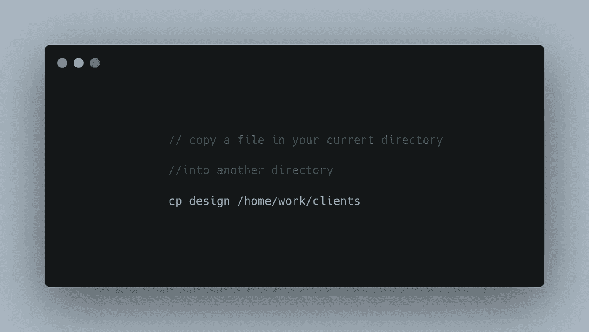

# 这里是每个开发人员都应该知道的 10 个终端命令

> 原文：<https://javascript.plainenglish.io/here-are-10-terminal-commands-every-developer-should-know-52bbdb03242b?source=collection_archive---------11----------------------->

## 改善工作流程和日常使用的有用命令

Photo by [hannah joshua](https://unsplash.com/@hannahjoshua?utm_source=medium&utm_medium=referral) on [Unsplash](https://unsplash.com?utm_source=medium&utm_medium=referral)

命令行界面(CLI)已被证明在自动化各种任务方面非常有用和高效。尽管图形用户界面(GUI)的使用越来越多，命令行界面(CLI)在提供更好的开发人员体验方面仍然非常重要和有用。

同样，使用控制台命令被证明执行速度很快。使用命令行界面可能会让人不知所措，但是一旦你掌握了其中的窍门，你会发现使用这些命令非常快，而且你不会想回去。命令行界面(CLI)也可用于自动执行重复性任务。

本文将概述一些最常见的终端命令，您可以使用它们来简化日常开发体验并改进您的工作流程。

## **1。列表**

list (ls)命令用于列出给定目录中包含的所有目录和文件。list (ls)命令可以与各种标志链接在一起，这取决于您希望列出的内容。您可以使用各种标志，如下面的代码片段所示。

## **2。改变目录(光盘)**

通常，您会希望同时从一个目录切换到另一个目录。运行命令 cd 总是会将您的工作环境从一个目录改变到另一个目录。

您还可以使用以下命令从一个目录转到您的工作目录。Cd 可以在各种情况下使用，这取决于您要导航到的目录。

## **3。打印工作目录(PWD)**

打印工作目录(pwd)是用来获取并打印你当前所在的目录。此命令打印您当前正在处理的目录详细信息。PWD 命令有两个标志，可以根据您的喜好使用。

默认的 PWD 命令对于 PWD -l 是一样的

## **4。触摸**

touch 命令用于在当前工作目录中创建一个没有任何内容的新文件。您需要提供文件类型扩展名，以便在当前工作目录中创建新文件。

## **5。制作目录(mkdir)**

mkdir 命令用于创建新目录。您可以使用此命令创建一个或多个目录。

mkdir 命令要求您提供一个参数，该参数将被填充到您正在创建的目录名中。

## **6。删除目录(rmdir)**

rmdir 命令用于移除或删除目录中的子目录。该命令永久删除给定的目录。

该命令接受一个参数，即要删除的目录/文件夹的名称。您需要在想要执行命令的给定目录中拥有写保护。

## **7。清除**

Clear 命令用于清除命令提示符屏幕。顾名思义，清空终端屏幕。它清除终端上的命令和打印细节，并因此将其带到计算机终端的顶部。

与其他终端命令不同，clear 命令不接受任何参数或标志。因此，它会忽略与它一起传递的任何命令行参数。

## **8。Npm**

NPM 对于开发人员来说是非常基础的，尤其是对于 JavaScript 开发人员。Npm 充当安装、卸载和更新 Nodejs 包的包管理器。

npm 命令可以与各种标志和参数一起使用，以安装和处理软件包。出于不同的目的，您还可以使用各种标志来链接 npm。

## **9。移动文件(mv)**

Mv 命令用于无缝地将文件和目录从一个目录移动到另一个目录。这个命令非常强大，在处理文件和目录时执行速度非常快。

当您将文件从一个目录移动到另一个目录时，mv 命令也可用于重命名文件。它可以像下面的命令片段所示的那样使用。

**10。复制文件(cp)命令**

cp 命令用于将文件或目录从一个目录递归地复制到另一个目录。您可以使用下面代码片段中所示的命令。

## **出发前**

这些是我最常用的一些命令，它们改善了我的日常工作流程。第一次尝试使用命令可能会很烦人，但是坚持使用，你会发现自己会很自然地使用它们。

感谢您花时间阅读这篇文章，希望对您有所帮助。

## **更多阅读内容**

 [## 软件开发人员求职的 10 个最佳实践

### 软件开发人员求职最佳实践和技巧

javascript.plainenglish.io](/10-job-hunting-best-practices-for-software-developers-c06f2cb09548)  [## 写文章如何让我获得比我想象的更多的工作机会

### 写文章帮助我获得了各种工作机会

javascript.plainenglish.io](/how-writing-articles-got-me-more-job-opportunities-than-i-ever-imagined-2d27e464944e) 

*更多内容看* [***说白了。报名参加我们的***](http://plainenglish.io/) **[***免费每周简讯点击这里***](http://newsletter.plainenglish.io/) ***。*****