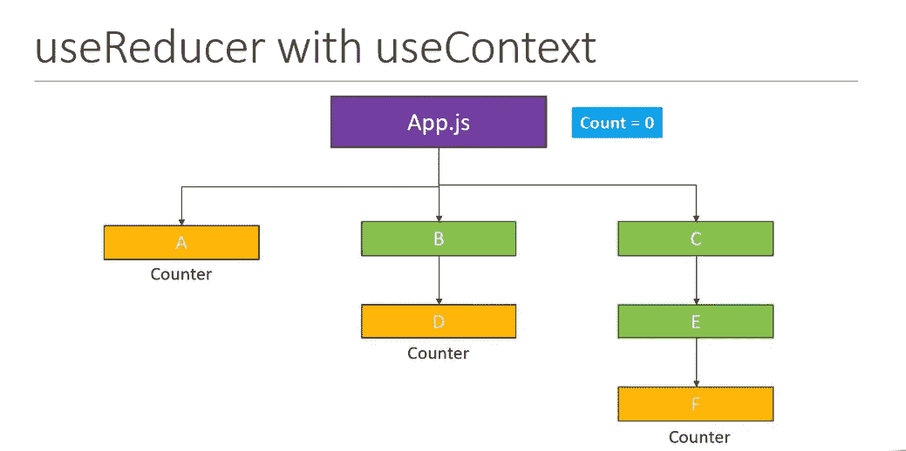

# 下面是如何一起应用 useReducer + useContext 挂钩

> 原文：<https://javascript.plainenglish.io/here-is-how-to-apply-usereducer-usecontext-hooks-together-f8f7b51f7bcc?source=collection_archive---------8----------------------->

## 使用代码示例和代码沙箱


在组件之间传递道具和共享状态是每个 react 应用的主干。但是使用道具传递几级深的道具并不是一个好的做法。



通过上面的图片，你可以看到我们是否需要通过 props 从 app.js 向组件 F 传递一个值，我们需要通过 C - > E ->来传递它。但是 C，E 组件可能不使用 prop 值，但是必须维护 props，因为它被子组件使用。

> 如果你愿意支持我成为一名作家，考虑注册[成为](https://freelancingcult.medium.com/membership)的媒体成员。这样我就可以花更多的时间来分享知识。每月只需 5 美元，你就可以无限制地使用 Medium。

解决上述行为的一种方法是将`useContext`与 useReducer 一起使用。

[](https://levelup.gitconnected.com/learn-react-usestate-hook-a09ccf955537) [## 学习反应使用状态挂钩

### 有例子和练习

levelup.gitconnected.com](https://levelup.gitconnected.com/learn-react-usestate-hook-a09ccf955537) [](/react-useeffect-hook-tutorial-for-beginners-30626402b739) [## React useEffect Hook 初学者教程

### React useEffect 初学者教程，提供真实示例和日常使用模式。

javascript.plainenglish.io](/react-useeffect-hook-tutorial-for-beginners-30626402b739) 

1-在 app.js
中使用`useReducer`创建一个计数器 2-然后我们可以在必要的组件中使用上下文来提供和使用计数器函数

**工作沙箱**

想象一个简单的购物车场景。您可能已经看到，购物车中的商品编号显示在每个页面上。

您可以从主页、相关产品页面或任何相关组件中添加项目，并增加项目数量。

为了实现这一点，我们应该能够共享单个状态值和一个公共函数，以便在每个组件之间添加项目。

> 如果你愿意支持我成为一名作家，请考虑注册[成为一名灵媒](https://freelancingcult.medium.com/membership)。这样我就可以花更多的时间来分享知识。每月只需 5 美元，你就可以无限制地使用 Medium。

下面是一个简单的概念证明，展示了如何共享和操作不同组件内部的状态，这些组件位于其他子组件的内部。我们要用`useReducer`钩配合`useContext`钩

[](https://levelup.gitconnected.com/i-started-learning-the-usereducer-hook-4b0b86be5b49) [## 我开始学习 useReducer 钩子

### 以下是我所学到的和我的代码操场-第 1 部分

levelup.gitconnected.com](https://levelup.gitconnected.com/i-started-learning-the-usereducer-hook-4b0b86be5b49) 

让我们从 App.js 文件开始

像往常一样，我们将在 app.js 中定义我们的 reducer 函数，这将是一个简单的计数器 reducer。

我们从 react 进口`useReducer`

```
import React, { useReducer } from "react";
```

然后我们使用`useReducer`与减速器功能，我们创造了早期

```
const [count, dispatch] = useReducer(reducer, initialState);
```

关于初始化`useReducer`的更多细节，你可以看看我之前的博文

现在我们要做的是，我们必须将 count 变量和 dispatch 函数传递给 react 应用程序中的所有子组件。

为此，我们使用 react 上下文挂钩

让我们创建一个上下文挂钩，如下所示

```
export const CountContext = React.createContext();
```

然后，我们可以使用上下文提供者包装我们的组件，并将计数和分派函数传递给所有组件

参见下面的完整代码

你可以看到我们已经使用`CountContext.Provider`传递了`count`和`dispatch`函数

## 在不同的组件中使用传递的值

我们可以使用`useContext`钩子在其他组件和子组件中使用传递的值。

让我们看看如何使用`useContext`钩子在其他组件中获得`count`和`dispatch`函数。

下面是我们如何使用 app.js 中定义的`CountContext`

首先，我们从 react 导入了使用上下文

```
import React, { useContext } from "react";
```

然后从 app.js 导入`CountContext`

```
import { CountContext } from "../App";
```

然后将导入的`CountContext`传递到`useContext`钩子中并创建`countContext`常量

```
const countContext = useContext(CountContext);
```

然后我们可以使用 countContext 常量来使用`count`和`dispatch`函数，如下所示。

> 我希望你喜欢读这篇文章。如果你愿意支持我作为一个作家和我花在分享知识上的时间，考虑注册[成为一个媒体成员](https://freelancingcult.medium.com/membership)。每月只需 5 美元，你就可以无限制地使用 Medium。

*更多内容请看* [***说白了就是***](http://plainenglish.io/) *。报名参加我们的* [***免费每周简讯这里***](http://newsletter.plainenglish.io/) *。*