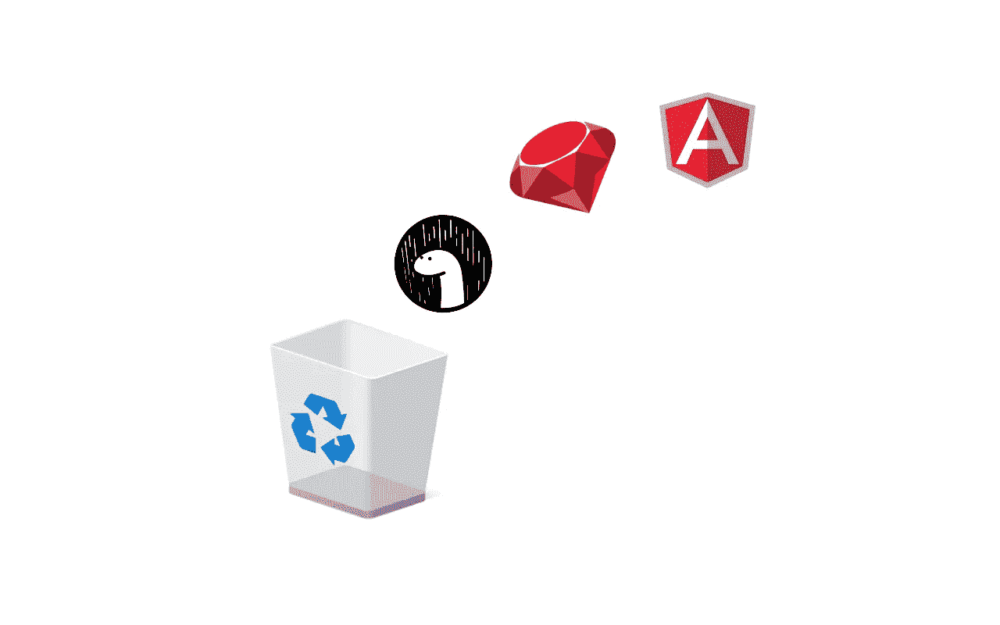

# 以下是我作为一名网络开发人员浪费时间学习的一系列技术

> 原文：<https://javascript.plainenglish.io/heres-a-list-of-technologies-i-wasted-my-time-learning-as-a-web-developer-e427d0bfafc3?source=collection_archive---------0----------------------->

## 不要犯和我一样的错误。

当我在 2015 年开始学习 Web 开发时，我浪费了大量时间学习我在在线文章和教程中遇到的任何技术。

在一个技术、库和框架数量不断增长的行业中，高效学习是关键。因此，无论你是 Web 开发新手，还是已经有了一些经验，这里有一个列表，列出了我浪费时间学习但在职业生涯中从未真正使用过的东西，或者是 2021 年不再相关的东西(也就是说，你可以不知道)。

## Ruby / Ruby-on-rails

Ruby-on-Rails 在 2000 年代末非常流行。我浪费了几个月的时间试图用 Ruby-on-Rails 构建应用程序。虽然一些大型科技公司的代码库中仍然会有一些 Rails 代码，但我近年来很少见到任何公司使用它。事实上，在我职业生涯的六年中，我从未使用过 Rails。更何况，我也不想。

## 安古拉吉斯

不要和棱角混淆。从版本 2 开始，AngularJS 被 Angular 取代。不要因为这个原因浪费你的时间去学习 AngularJS，你会发现今天很少有公司使用它。

## jQuery

jQuery 仍然是最受欢迎的 JavaScript 库，但这更多的是一个技术问题，而不是相关性(即许多 10-15 年前制作的旧网站仍然在使用它)。近年来，许多大型科技公司已经放弃使用 jQuery 编写代码，转而使用普通的 JavaScript。jQuery 过去提供的许多好处已经不像过去那样重要了(比如编写可以在所有类型的浏览器上工作的代码——这在浏览器有非常不同的规范的时候是一个更大的问题)。

## 余烬

烬的火很久以前就熄灭了。如果你需要一个 JavaScript 库，可以使用 React(或者 Vue.js)。

## 反应类组件

如果您在工作中使用 React，您可能仍然会发现一些 React 类组件。因此，理解它们是如何工作的以及它们的生命周期方法可能还是不错的。但是如果你正在编写新的 React 组件，你应该使用带有 React 钩子的功能组件。

## 服务器端编程语言（Professional Hypertext Preprocessor 的缩写）

上帝给我力量。公平地说，PHP 并没有那么糟糕。在我的第一份 web 开发工作中，我确实不得不经常使用它(和 Laravel 一起)。但是现在，web 开发人员应该通过使用 Node.js 来提高学习效率。如果你已经在学习 JavaScript，为什么要在上面添加一个服务器端语言，比如 PHP，当你现在可以在服务器上使用 JavaScript 时？

## 德诺

Deno 是新的，在未来几年可能会很大。然而，现在还不要被炒作所迷惑。如今很少有公司在使用 Deno。因此，如果您是 Web 开发的新手，就继续学习 Node.js(也称为服务器端 JavaScript)。Deno 可能是你在未来几年选择学习的东西。

## 还有很多！

# 结论

因此，这是我的技术名单，我今天不会打扰。我敢肯定还有很多可以添加到列表中——欢迎在评论中留下你的想法。我确信对于这里列出的技术也会有一些争论——Ruby 开发者很容易感到沮丧。你也可以在评论中讨论这个问题。都是观点而已，对吧？

*更多内容请看*[***plain English . io***](http://plainenglish.io/)*。报名参加我们的* [***免费周报***](http://newsletter.plainenglish.io/) *。在我们的* [***社区***](https://discord.gg/GtDtUAvyhW) *获得独家获得写作机会和建议。*