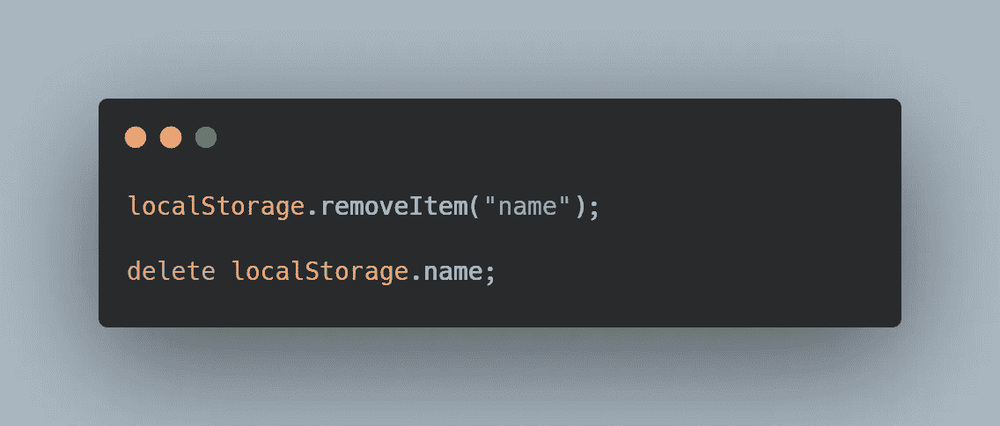
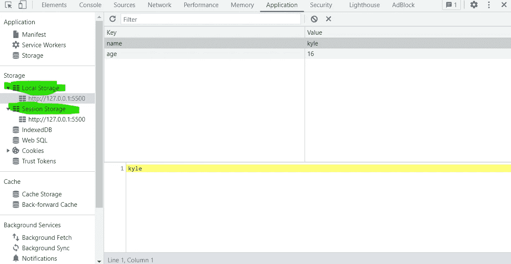

# 这里有一个不用 Cookies 保存用户数据的快速方法(使用 JavaScript)

> 原文：<https://javascript.plainenglish.io/heres-a-quick-way-to-save-user-data-without-cookies-43da04327f3?source=collection_archive---------1----------------------->

学会用几行简单的 JavaScript 保存用户数据！


Photo by [Szabo Viktor](https://www.instagram.com/szvinsta/)

如果你有一个网站，你可能会很快意识到你想收集网站访问者的数据。他们是如何使用你的网站的？他们在使用什么功能？他们有什么偏好？或者甚至像用户的名字是什么这样的基本问题？

通过收集这些数据，您可以个性化用户的体验，根据他们的需求定制网站，并使整体体验变得非常棒，令人难忘。此外，您还可以更好地确定在您的站点上可以展示哪些类型的功能或内容是您的用户真正想要的。

例如，想象你构建了一个有二十个不同关卡的网页游戏。如果你的网页存储了用户已经完成的级别，那不是很好吗？因此，如果用户再次访问，他们将不必重新开始？

或者，如果你使用 GitHub、脸书或 Twitter 等平台，用户可以选择亮模式或暗模式。如果网页能记住你的个性化选择，那就太好了，这样你就不必每次访问网站时都调整它们。

幸运的是，开发人员有一些工具可以做到这一点:cookies、localStorage 和 sessionStorage。今天，我们将讨论本地存储和会话存储。

# 什么是 localStorage 和 sessionStorage？

localStorage 和 sessionStorage 是 Web 存储 API 提供的非常简单的工具。这个 API 允许 web 应用程序在用户的浏览器中存储数据，而无需使用服务器或 cookies。

使用 localStorage，web 应用程序可以在开发人员定义的一段延长的时间内存储高达 10mb 的数据。因此，如果用户关闭浏览器窗口或标签，重新启动计算机，或关闭计算机，收集的数据将继续存在。只有到了到期日期、浏览器缓存被清除或者 web 应用程序本身清除了数据，这些数据才会被删除。

相比之下，sessionStorage 最多可以存储 5 兆字节的数据，并且只要选项卡打开，数据就会存在。因此，如果您关闭标签，即使窗口仍然存在，您也会丢失数据。

# 你需要知道的重要细节

在进入实际实现之前，强调这一点很重要:

> 这个 API 允许 web 应用程序在用户的浏览器中存储数据，而无需使用服务器或 cookies

localStorage 和 sessionStorage 关心您正在使用的浏览器。他们正在你的浏览器中保存数据。因此，如果你用不同的浏览器访问同一个网站，比如 Google Chrome 和 Mozilla Firefox，这个网站将不会访问相同的本地存储对象。对吗？换句话说，例如 Firefox 无法访问谷歌 Chrome 浏览器收集的数据。

此外，在讨论浏览器时，重要的是要注意 localStorage 和 sessionStorage 并不与每个浏览器的每个版本兼容。在 [W3Schools](https://www.w3schools.com/html/html5_webstorage.asp) 上检查兼容性。

最后，了解收集的数据在属于特定领域的所有网页之间共享也是必要的。例如，即使数据是在主页上收集的，属于该域的所有网页都可以访问该数据。

# 履行

实现非常简单。不需要导入或链接任何东西。只需创建一个 JavaScript 文件就可以开始了。

所以存储数据的方式是使用键值对。键本质上是定义数据的可读名称，值就是数据。例如，关键字可以是“姓名”、“年龄”和“操作系统”。并且这些值分别可以是“凯尔”、“21”和“视窗”。当然，您可以创建任何想要的键和值。只要确保你收集的数据是有意义的，并且是有目的的。

## 创建条目


上面的示例代码提供了三种不同的方法来创建数据条目——所有这些都用键值对来表示。在这个示例代码中，我们创建了一个名为“name”的键，并赋予它值“Kyle”。

在前两种方法中，我们使用函数 setItem()来创建数据条目。在创建数据条目的第一种方法中，我们将变量传递给函数。在第二个方法中，我们传递字符串文字。两者的工作方式完全相同。

在第三种方法中，我们没有使用 setItem()函数。这是它的一般格式:

```
localStorage.keyName = keyValue;
```

在第三种方法中，我们使用点符号。记住，localStorage 是一个 JavaScript 对象，这就是为什么它是可能的。更多关于物体的信息，请查看 [FreeCodeCamp](https://www.freecodecamp.org/learn/javascript-algorithms-and-data-structures/basic-javascript/build-javascript-objects) 。

同样，这三种不同的方法将以键值对的格式创建数据条目。然而，以上三种方法不仅仅可以创建数据条目。他们还可以更新数据条目。

事情是这样的:当你创建一个数据条目时，你需要一个键。例如，让我们假设您的键是“name”。如果该键已经存在并且有一个值，它将简单地覆盖以前的值。如果键不存在，它将简单地创建一个新的键-值对。

现在，在继续阅读数据条目之前，我们必须快速强调键和值是字符串这一事实。它们不能是整数、浮点数、布尔值或任何类似的东西。它们必须是字符串。

## 读取条目


在上一节中，我们讨论了 setItem()函数。现在，我们有了 getItem 函数。这个函数接受一个参数，这个参数是键，它返回键的值。

在上面的例子中，我们想要获得“name”键的值，并将该值存储在变量名中。上面的示例代码展示了两种不同的方法。

## 删除条目



这里，我们介绍 removeItem()函数。removeItem 函数接受一个参数—也就是键。如果该项存在，它将被删除。

在第二行代码中，我们引入了另一种方法。我们使用删除操作符来删除“name”。同样，这是允许的，因为 localStorage 是一个对象，“name”是一个属性，delete 操作符专门用于从对象中删除属性。在 MDN Web 文档上阅读关于[删除操作符](https://developer.mozilla.org/en-US/docs/Web/JavaScript/Reference/Operators/delete)的更多信息。

如果您想删除所有数据条目，您可以使用:


## 会话存储

在本教程中，可以看到所有的例子都使用了 localStorage。如果您想使用 sessionStorage，只需换出 localStorage。

# 谷歌开发工具

既然您已经知道如何在 localStorage 和 sessionStorage 中保存数据，您可能希望看到 JavaScript 代码实际工作的可见确认。我们可以使用谷歌开发工具做到这一点。

**首先，右键点击检查**。


**在顶部面板中找到应用程序选项卡。**


**在左侧面板的“存储”部分，您应该会看到“本地存储”和“会话存储”。**点击您使用的任何一个。



您应该会看到保存的数据以键值对的形式组织起来。

*更多内容请看**[***说白了. io***](http://plainenglish.io/) *。报名参加我们的* [***免费周报在这里***](http://newsletter.plainenglish.io/) *。**