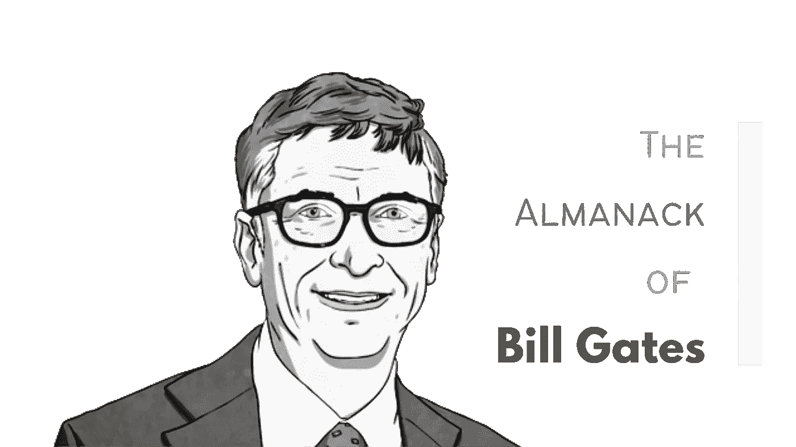

# 这是比尔·盖茨给新程序员的建议。它不应该被忽视。

> 原文：<https://javascript.plainenglish.io/heres-bill-gates-s-advice-to-new-programmers-it-should-not-be-ignored-33e31378f0ae?source=collection_archive---------1----------------------->

来自微软幕后老板的最佳编程建议。

[📸](http://Made by the Author)

程序员的旅程是令人着迷的。这是一个漫长而艰难的过程，充满了考验和磨难。

当你刚刚开始的时候，你肯定会遇到一些障碍。学习你的第一门编程语言可能会很难，如果你不确定自己在做什么，很容易就会气馁。

然而，如果有一个人对编程略知一二，那就是比尔·盖茨。

比尔·盖茨是微软的创始人，也是世界上最富有的人之一。他是技术领域的标志性人物。

当他有话要说的时候，行业就停下来听。这就是为什么他给新程序员的建议不应该被忽视。

他在许多层面上激励了我，我希望你也能从他睿智的见解中受益。

这是著名程序员之一比尔·盖茨的一些建议。

# 不要想太多，只管投入进去

***盖茨:*** *准备【成为程序员】最好的方法就是写程序，去研究别人写过的伟大的程序。就我而言，我去了计算机科学中心的垃圾桶，找出了他们的操作系统列表。*

在计划时要果断，但在执行这些计划时要积极进取。

没有完美的程序员。每个人都会犯错。每个人都有缺点。我们都编写错误的软件。没有完美的代码。所以不要被吓倒。你的项目永远不会成为杰作。

在 2-3 年内，它很可能会过时。即使代码并不完美，也要构建可以工作的东西。

犯错是可以的，也是被鼓励的，这是最好的学习方式。即使是你学习编码的人也不是完美的，会写出糟糕的代码。

所以，是的，你应该停止等待完美，开始申请工作，完成项目，或者开始你想做的项目。

做事和发布代码的人总是会赢过等待的人。

# 非常了解您的工具——非常了解

如果你曾经和一个伟大的程序员交谈过，你会发现他了解他的工具就像一个艺术家了解他的画笔一样。看到伟大的程序员在他们的开发方式上有如此多的共同点是令人惊讶的——他们如何获得反馈，以及他们如何发展出如此精炼的纪律意识，知道什么是马虎的，什么是不马虎的。当你让这些人看某段代码时，你会得到非常非常普遍的反应。

我们不再生活在所有东西都制作精良的时代。但是在程序的核心，你会发现关键的内部代码是由少数真正知道他们在做什么的人完成的。

你开始学习编程，你读到你需要学习 React、GraphQL、Node.js、MongoDB、Storybook、React Hooks、AWS 等等……你开始学习库，却不知道它们是做什么的，也不知道它们为什么流行。

你所能做的最糟糕的事情就是在不了解趋势能解决什么问题的情况下就去追随它。

这有什么好的？如果你不能向你的朋友解释这一点，那么你应该在随大流之前先学会它。

som——TypeScript 是 JavaScript 的静态类型超集，现在我们的代码中将会有更少的错误——耶！我会在任何地方使用它。

酷，在这种情况下，你最好知道动态类型语言和严格类型语言之间的区别，知道它们的优缺点。

不要因为有人告诉你就盲目地使用某样东西。

从来没有完美的解决方案。

此外，请记住，大多数库都会随着时间的推移而发展和变化。没有什么是一成不变的，所以重点在于掌握基本面。

# 善于阅读代码。

盖茨: *我认为在 1975 年到 1980 年间，作为一名程序员，我取得了巨大的进步。在 75 年，我会说，“嘿，小心点，我无所不能。”我真的以为我可以，因为我读了那么多代码，从来没有发现一段代码我读得不是很快。我仍然认为测试编程能力的最好方法之一是交给程序员大约 30 页的代码，看他能多快通读和理解。*

你必须愿意阅读别人的代码，然后写你自己的代码，然后让别人审查你的代码。

你必须想进入这个不可思议的反馈循环，让世界级的人告诉你哪里做错了。

这就是开源的意义所在。通过这种方式学习，你会比自己一个人成长得更快。

***盖茨:*** *这可是个人才，那还用说。这有点像纯粹的智商测试。你必须专注于代码，并与你编写的程序联系起来。很多人会说，“我想一天又一天地读这本书。”一个真正优秀的程序员会说，“让我把它带回家吧。今晚我就花一个小时把整个事情过一遍。”那里的能力差异是巨大的。*

你不能让小癖好妨碍你获得反馈。一些世界级的人会喋喋不休地谈论一些纯粹特殊的细节，比如你如何评论这个项目。

你必须切断所有这些东西，因为在某种程度上，他们正试图以他们的形象创造程序员；他们试图让你像他们一样随心所欲。而且可能不涉及纯质量问题。

# 学会让事情尽可能简单

> 简单是最复杂的
> 
> —莱昂纳多·达芬奇

让事情变得简单是制作软件最难的部分。

***盖茨*** : *最难的部分是决定算法是什么，然后尽可能地简化它们。很难把事物简化成最简单的形式。你必须在头脑中模拟程序是如何运行的，你必须完全掌握程序的各个部分是如何协同工作的。*

就做事而言，我采用相当科学的方法来解释事情发生的原因和方式。我不知道是否有上帝，但我认为宗教原则是非常有效的。

> 用代码行来衡量编程进度就像用重量来衡量飞机制造进度一样。

最优秀的软件是那些一个人对程序如何工作有完整理解的软件。要做到这一点，你必须热爱这个项目，并专注于保持它的简单，到一个令人难以置信的程度。

# 学会在小组中工作

人们经常认为学习的唯一方法是独自做事，但在小组中工作是非常有益的。

与同龄人一起工作比你自己学习能学到更多的东西。

通过团队工作，你可以向其他成员学习，而单独工作，你只是向自己学习。

> 我的工作是确保聪明人能一起工作。愚蠢的人可以轻松合作，聪明的人不行。"
> 
> —马云

在保罗和比尔创办公司之前，他们已经参与了一些大规模的软件项目，这些项目是真正的灾难。

***盖茨:*** *他们只是不停地往里灌人，没人真正知道他们要怎么稳定项目。我们向自己发誓要做得更好。因此，花大量时间构建团队的想法一直非常重要。最好的想法是显而易见的:保持小组规模小，确保小组中的每个人都超级聪明，给他们很好的工具，并有一个共同的术语，这样每个人都可以非常有效地沟通。在小组之外，有一些非常有经验的资深人士在身边，他们可以对问题提出建议。*

在团队中工作让你有可能接触到很多比你聪明的大脑。它教会你很多关于沟通的东西。

你可以从他们身上汲取精华，成为更好的自己。有很多方法可以让你在一个团队中工作，包括移动性、结对编程、mob 编程、开源等等。

软件开发不仅仅是倒出大量代码并让它们工作。这很大程度上是关于团队合作和共同建设。

# 首先想象，然后创造它

***盖茨*** : *有些人只是一头扎进去开始编码，有些人在坐下来之前就想好了一切，但我想你会发现那些坐下来开始编码的程序员只是把它当作一个便笺本。他们脑子里在想什么才是最重要的。*

你必须有一个超级聪明的人。一个伟大的程序员，无论是开车还是吃饭，都在不停地思考程序。那种方法需要惊人的精神能量。

不要低估它——无论你看到你周围的什么——曾经在人类头脑中被可视化。

# 知道创造的快乐

> 计算机的诞生是为了解决以前不存在的问题。

虽然许多人认为软件是一个有利可图的行业，但比尔·盖茨建议将其视为一种用来实现变革的工具。

***盖茨*** : *虽然我没有别人应该做什么的处方，但我知道我一直很幸运，并感到有责任以一种非常重要的方式回报社会。很有趣，也很有收获。*

作为一名程序员，你有能力无中生有。

无中生有是一件神奇的事情。我希望你能体验这种魔力。

# 结论

我们学到的一些最好的编程经验来自我们自己的错误。我们从别人身上学到的一些最好的经验——我们是通过观察他们犯错误而学到的。

像比尔·盖茨这样的人已经学到了很多教训和错误，他学到的最大和最突出的教训之一是: ***【拥抱新技术】*** 。

作为企业家和商人，他获得了财富，但如果他不是一名程序员，他就不会获得这些财富。

编码本身是一种技能组合，可以应用于任何研究领域的深度知识，这个世界需要优秀的问题解决者— *就是这样的人。*

 [## 以下是唐纳德·克努特给新程序员的建议。它不应该被忽视。

### 当“算法分析”之父告诉你什么的时候，你最好听着。

javascript.plainenglish.io](/heres-donald-knuth-s-advice-to-new-programmers-it-should-not-be-ignored-6963c0aba7aa)  [## 以下是 Peter Norvig 给新程序员的建议。它不应该被忽视

### 前谷歌研究总监给你一些宝贵的建议——不要错过！

javascript.plainenglish.io](/heres-peter-norvig-s-advice-to-new-programmers-it-should-not-be-ignored-cba2735017a9) 

# 感谢信

我想利用这最后的机会说声谢谢。

感谢您的光临！如果没有像你这样的人跟随并带着信念阅读我的帖子，我将无法做我所做的事情。

我希望你能 [**加入我**](https://polymathsomnath.medium.com/subscribe) 的 [**我未来的博客文章**](https://polymathsomnath.medium.com/subscribe) 并留下来，因为我们这里有一些伟大的东西。

我希望在未来的许多年里，我能在你的职业生涯中帮助你！

下次见。再见！

*更多内容请看*[***plain English . io***](http://plainenglish.io/)*。报名参加我们的* [***免费每周简讯这里***](http://newsletter.plainenglish.io/) *。*