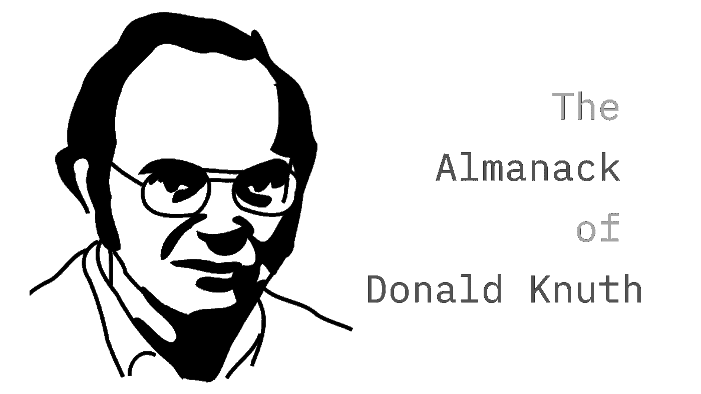
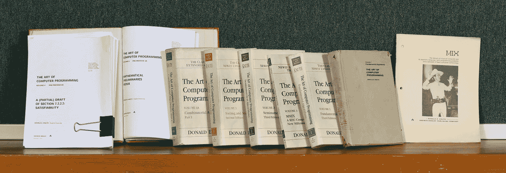
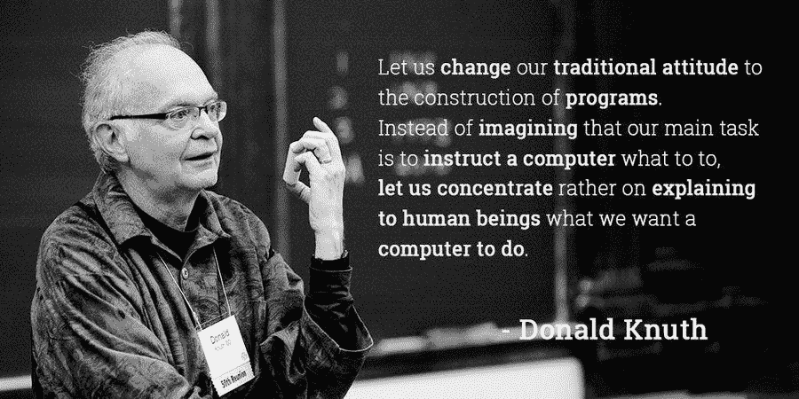

# 以下是唐纳德·克努特给新程序员的建议。它不应该被忽视。

> 原文：<https://javascript.plainenglish.io/heres-donald-knuth-s-advice-to-new-programmers-it-should-not-be-ignored-6963c0aba7aa?source=collection_archive---------1----------------------->

## 当“算法分析”之父告诉你什么的时候，你最好听着。

[📷](https://polymathsomnath.medium.com/)

唐纳德·克努特(Donald Knuth)的《计算机编程的艺术》(Art of Computer Programming)一书让许多人称他为“算法分析之父”，他对各个领域的问题解决者提出了一条宝贵的建议。

比尔·盖茨曾经说过，“如果你认为你是一个真正优秀的程序员……读读《计算机编程艺术》……如果你能读完整本《T2》，你绝对应该给我发一份简历。”

[📷](https://www-cs-faculty.stanford.edu/~knuth/taocp.html)

我第一次和他接触是在我青春期早期，通过他的作品。我不能阻止自己读它，因为这个名字太吸引人了。我当时对课文的理解程度是有争议的。

> “聪明人不需要建议。傻子都不会拿。”
> 
> — **本杰明·富兰克林**

Knuth 提供的不是一些建议，而是对他有用的东西。他的话与其说是忠告，不如说是智慧。

我可以在许多层面上与他沟通，我希望你也能从他睿智的见解中受益。

# 不要只相信某样东西是因为新潮才是好的。

Knuth 说的是我们在开发社区看到的一些事情，一些事情变得流行，每个人都开始朝那个方向发展。

他接着说“*我可能会走另一个极端，如果我发现太多人接受某个想法，我可能会认为它是错误的，或者如果你知道我的工作变得太受欢迎，我可能会认为我必须改变*。

关于人群的事情是，它会成功地做已经重复了一千次的事情。那些随大流的人通常会迷失在其中。加入人群并不需要什么，但独立却需要一切。

# 不要做社会的奴隶。

人们常常会违背自己的直觉去做一些事情，因为他们认为社区希望他们这样做。

人们需要更多地意识到自己的本能，不要试图遵从他们认为社会希望他们做的事情。

***克努特:*** *人们即使对某个主题不感兴趣，也会去研究它。他们认为他们会通过研究这些获得更高的声望——我认为你通过做好科学比做科普获得更高的声望。*

难道我们没有看到它一直在发生吗？以教育为例，大多数人的选择都是由大众做出的。

人群决定了什么是安全的，每个人都像羊群一样跟着它走。这实际上扼杀了所有形式的创新和创造力。

我认为独自行走比与一群走错方向的人同行要好。

> ***“每当你发现自己站在大多数人一边的时候，就该停下来反思了。”—马克·吐温***

以 web 框架为例:React、Angular 和 Vue 都是令人惊叹的技术，但它们只占互联网上所有网站的不到 1%。

一旦你开始学习与网络相关的东西，你就会被来自四面八方的人群包围，告诉你必须使用他们所说的内容，否则你将一无是处。

我并不是说这些框架和技术没有用，但是在不知道为什么需要它们的情况下把它们放在工具集中是浪费时间。

你会让自己负担过重，或者最糟糕的是，你会开始轻视这项特殊的技术。

我看到许多人对某个特定的框架或技术产生了强烈的鄙视。也许他们从来不需要它，只是简单地随大流。他们在这个过程中浪费了大量的时间，这些时间本可以用来发挥他们的能力。

# 拥抱你的独特。

计算机科学在当时是一个新事物。Knuth 发现很难向人们解释他属于什么领域——他在做什么工作——以前没有任何领域存在过！于是，他创造了一个自己的“算法分析”。

> 我们表达思想的语言对我们的思维过程有很大的影响。
> 
> —唐纳德·克努特

如果他一直停留在前人研究的课题上，他将无法完成他的工作。

[📷](https://twitter.com/CodeWisdom)

# 适用于所有人的可能不适合你！

Knuth 的朋友 Peter Wagner 在 60 年代告诉他，他应该搞清楚计算机编程，他不应该写整个系列，首先，他应该先写一个读者文摘，然后再扩展部分。

> 科学是我们理解得足以向计算机解释的东西；艺术是一切。

克努特 : *这对他来说可能更好，但我的工作方式完全不同。我必须看到我已经包围的东西。在我满怀信心地写出来之前，我已经完全理解了它。这就是我的工作方式。我不想写一个高层次的东西，除非我完全理解一个低层次的东西。*

# 投入时间深入理解事物

Knuth 写了一本关于圣经中几节经文的书。一旦他理解了这些经文，以及他能在图书馆找到的关于圣经一小部分的所有东西。突然之间，他有了牢固的钉子，可以在上面挂上关于它的其他知识。

> 很多时候，我不得不通读大量的材料，然后写出一句话，这样我的句子就会有感觉了。我会选择更有说服力的词语，而不是在我真的没有知识的情况下，在我的写作中含蓄地表达出来。

但是如果他一生都没有对任何部分有深入的了解，那么这一切都是脆弱的。这无论如何也不会丰富他的人生经历。

***【Knuth】***:*博雅教育中的经典用语是* ***对一切事物都有所了解*** ***以及对一切事物都有所了解*** *。而且，我喜欢这个想法:在你觉得足够之前了解一个领域的一切——如果你不知道，一些真正坚实的东西，那么你永远不会有足够的信心。*

这是来自一个永远改变了计算机科学面貌的人的至理名言。他的话当然引起了我的共鸣——你也有同感吗？请在评论区告诉我。

如果你喜欢这篇文章，你可能也会喜欢: [***FAANG to Farming:一个 25 岁的人的生活教训***](/faang-to-farming-life-lesson-from-a-25-year-old-66f56818f7b6)

# 感谢信

我想利用这最后的机会说声谢谢。

感谢您的光临！如果没有像你这样的人，我不可能做我现在做的事情。

我希望你能 [**加入我的**](https://polymathsomnath.medium.com/subscribe) **[**我的未来博客**](https://polymathsomnath.medium.com/subscribe) 中的** 并留下来，因为我认为我们这里有一些很棒的东西。我希望在未来的许多年里，我能在你的职业生涯中帮助你！

下次见。再见！

*更多内容请看*[*plain English . io*](http://plainenglish.io/)