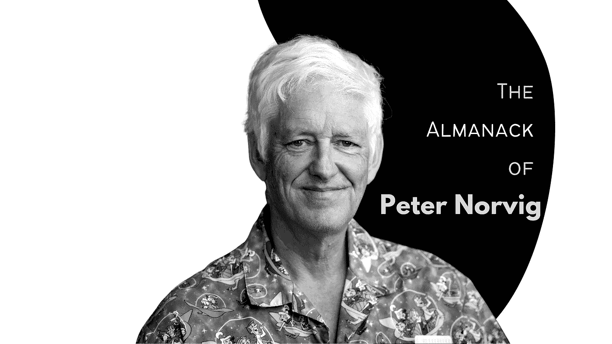

# 来自谷歌研究总监的永恒建议——不要错过！

> 原文：<https://javascript.plainenglish.io/heres-peter-norvig-s-advice-to-new-programmers-it-should-not-be-ignored-cba2735017a9?source=collection_archive---------0----------------------->

从谷歌的研究总监和人工智能专家那里你需要知道的关于编程的一切

[📷](http://Made By The Author)

他是关于人工智能的最广泛阅读的书的作者。

在过去的 20 年里，他一直担任谷歌的研究员和顾问。

他是他们的搜索引擎的主要设计者之一，这在当时被认为是最好的搜索引擎之一。

Peter Norvig 是美国计算机专家，最著名的是他在谷歌的研究和算法工作。他曾为美国宇航局工作，撰写过人工智能方面的权威书籍，并通过大规模开放在线课程(MOOCS)教授了数十万名学生。

如果我们能让任何人认真对待人工智能这个话题，那就是他。

他是一个经验丰富的人，不要错过他要对你说的话！

# 因为好玩所以去做

***诺维格:*** *对编程产生兴趣，做一些是因为好玩。确保它足够有趣，这样你就会愿意投入你的 10 年/10，000 小时。*

在 [*如何成为一名伟大的程序员*](/how-to-become-a-great-programmer-127148bcc858?gi=cc8c9e257aad) 中，我提到学习编码并不需要花费太多时间，但是精通它却需要！

从 ***零到精通*** 的旅程可能看起来很漫长，但如果你一路上都很开心，就不会如此。

> "生活要么是一次大胆的冒险，要么什么也不是。"
> 
> **――海伦·凯勒**

只为钱做任何事都不会带来满足感——只会让你沮丧。

确保你在做你喜欢的事情。你很享受，这不是钱的问题。

因为钱不会解决你所有的问题，它只会解决你所有的钱的问题。

你总有一天会死，这些都不重要了。所以尽情享受吧。做一些对你来说重要的事情——一路上要开心。

学习不是赛跑——书越好，吸收得越慢。更多的时间不一定会转化成更多的知识。

还不如把精力放在生产力上。

在块中分配主题，并尝试一次处理一个。

此外，记住学习编码并不是游戏的结束，生活中还会有更多的事情发生。

你的生命是黑夜中一闪而过的萤火虫。你在这里的时间很短。

一定要享受，因为没有遗产。没什么可留下的。我们都要走了。我们的孩子将会离开。我们的作品将化为尘土。

# 边做边学——有意识地练习

> "总有更多的东西要学，即使对于一个大师来说也是如此."
> 
> 师父。

***诺维格*** : *最好的一种学习是* [*边做边学*](http://www.engines4ed.org/hyperbook/nodes/NODE-120-pg.html) *。用更专业的话来说，“个人在某一领域的最高表现水平不会随着经验的增加而自动达到，但即使是经验丰富的个人也可以通过刻意的努力来提高表现水平。”*

如果你不刻意练习，你就是在浪费时间。就这么简单！

问问自己，“**为什么**我 ***在执行*** 这个任务？”而你的回答是，“为了完成任务”，那么你就不是在刻意练习。

没有一个人是靠看文章、看视频成为优秀程序员的。我们也许能够回忆起关于编程的事实，但我们将无法构建任何有趣的东西。

擅长编程的唯一方法是通过 ***刻意练习。***

[**想学习如何做 ***刻意练习就看这个*****](/how-to-become-a-great-programmer-127148bcc858?gi=cc8c9e257aad) 。

# 读，读，读！

> "一个好的旅行者没有固定的计划，也不急于到达目的地."
> 
> ― **老子**

***Norvig:*** *与其他程序员交谈；阅读其他程序。这比任何一本书或培训课程都重要。*

你不会相信仅仅通过阅读代码你会得到多少好处。

和其他程序员互动会教会你很多东西。

你必须愿意阅读别人的代码，编写自己的代码，然后让别人审查你的代码。

你必须想成为这个惊人的反馈循环的一部分，世界级的专业人士会告诉你哪里做错了。

这就是开源的精髓。如果你学会这种方式，而不是自己一个人做，你会成长得更快。

不和谐频道有的是，去看看吧！

# 做对你有用的事

如果你愿意，可以在大学里读四年(或者读更多的研究生)。这会让你接触到一些需要证书的工作，也会让你对这个领域有更深入的了解，但如果你不喜欢学校，你可以(通过一些奉献)在自己身上或工作中获得类似的经历。无论如何，光靠书本知识是不够的。

> “计算机科学教育不能使任何人成为专业程序员，就像学习画笔和颜料不能使人成为专业画家一样”
> 
> —埃里克·雷蒙德

***诺维格:*** *我雇佣过的最优秀的程序员之一只有高中学历；他制作了大量的* [*伟大的*](http://www.xemacs.org/)*[*软件*](http://www.mozilla.org/) *，拥有自己的* [*新闻组*](http://groups.google.com/groups?q=alt.fan.jwz&meta=site%3Dgroups) *，并在股票期权上赚足了购买自己的* [*夜总会*](http://en.wikipedia.org/wiki/DNA_Lounge) *。**

# *学会在小组中工作*

> *“如果每个人都在一起前进，那么成功就会自然而然地到来。”*
> 
> *—亨利·福特*

****Norvig*** *强调程序员和其他程序员一起做项目是多么重要。“在某些项目上成为最好的程序员”* ***他说*** *。“对其他人来说是最糟糕的。当你是最优秀的时候，你可以测试你领导项目的能力，并用你的愿景激励他人。当你最糟糕的时候，你会学到大师们是怎么做的。”**

*在团队中工作可以让你和很多比你聪明的人联系。它教会你很多如何沟通的知识。*

*你可以从他们身上汲取精华，成为更好的自己。有很多方法可以让你在一个团队中工作，包括移动性、结对编程、mob 编程、开源等等。*

****Norvig:*** *从事* ***项目后*** *其他程序员。理解别人写的程序。当最初的程序员不在身边时，看看需要什么来理解和修复它。想想如何设计你的程序，让那些在你之后维护它们的人更容易。**

*你看，软件开发不仅仅是写一堆代码并让它工作。这很大程度上是关于团队合作和一起建造东西。*

# *学习不同范例的编程语言*

****诺维格*** : *学习至少半打* ***编程语言*** *。包括一种强调类抽象的语言(如 Java 或 C++)，一种强调函数抽象的语言(如 Lisp 或 ML 或 Haskell)，一种支持语法抽象的语言(如 Lisp)，一种支持声明性规范的语言(如 Prolog 或 C++模板)，以及一种强调并行性的语言(如 Clojure 或 Go)**

*c 是我的第一语言。它的语法吸引了我。然后 LISP/Scheme 来了，一切都变了。一切！*

*在我看来，JavaScript 就是这样一种语言，它让你体验到了 C 和 Lisp 的味道。*

*学习在不同的范例中编码将使你更容易选择合适的工具和技术来完成任务。*

*否则你将会在所有事情上使用相同的工具。*

*这与木匠有几种不同类型的锤子没有什么不同，当简单的羊角锤可能更合适时，他不会使用大锤。*

# *专有技术在引擎盖下工作*

****Norvig:*** *记住“计算机科学”里面有一个“计算机”。了解计算机执行一条指令、从内存中取出一个字(缓存未命中和缓存未命中)、从磁盘中读取连续的字以及在磁盘上寻找新位置需要多长时间。**

*伟大的程序员是那些思路清晰的人。—他们对基本面有很好的理解。*

*你应该更好地理解基本原理，而不是死记硬背各种复杂的概念，这些概念你无法缝合在一起，也无法从基本原理重新推导出来。*

*牢牢把握住基本面将会阻止冒名顶替综合症。*

*如果你不能在需要的时候从基础中重新获得概念，你就迷失了。*

*你只是在记忆。*

*我发现《代码:计算机硬件和软件的隐藏语言》是一本了解计算机内部工作原理的好书。*

# *结论*

> *在我的第一个孩子出生之前，我读完了所有的入门书籍，但仍然觉得自己像个毫无头绪的新手。30 个月后，当我第二个孩子的预产期到来时，我是否又回到书本上复习了一遍？没有。相反，我依赖于我的个人经验，事实证明，对我来说，这些经验远比专家写的数千页文章更有用、更让人放心。*
> 
> **—彼得·诺威格**

**得到* ***需要时间更好的在*** ***编码*** *。**

**学* ***新*** ***语言*** *需要时间。**

**构建* ***应用*** *需要时间。**

**学习* ***最佳实践需要时间。****

*花时间*犯* ***错误*** *然后* ***从中吸取教训*** 。*

****失败*** *然后* ***从你的* ***失败*** *中学习*** *是需要时间的。**

****练*** 需要时间。 ***变好*** 需要时间。成为 ***伟大的程序员是需要时间的。****

***最需要记住的是，这需要*时间！****

*如果你刚刚开始，不要担心你学得有多快或多慢。*

*按照自己的节奏学习，并从中获得乐趣。*

*如果你需要帮助，那就开口。*

*寻求帮助不是软弱的标志，而是成长的标志。这表明你愿意超越目前的局限。*

# *感谢信*

*我想利用这最后的机会说声谢谢。*

*感谢您的光临！如果没有像你这样的人跟随并带着信念阅读我的帖子，我将无法做我所做的事情。*

*我希望你能 [**加入我的**](https://polymathsomnath.medium.com/subscribe) **[**我的未来博客**](https://polymathsomnath.medium.com/subscribe) 中的** 并留下来，因为我们这里有一些很棒的东西。*

*我希望在未来的许多年里，我能在你的职业生涯中帮助你！*

*下次见。再见！*

**更多内容请看*[***plain English . io***](http://plainenglish.io/)*。报名参加我们的* [***免费周报在这里***](http://newsletter.plainenglish.io/) *。**