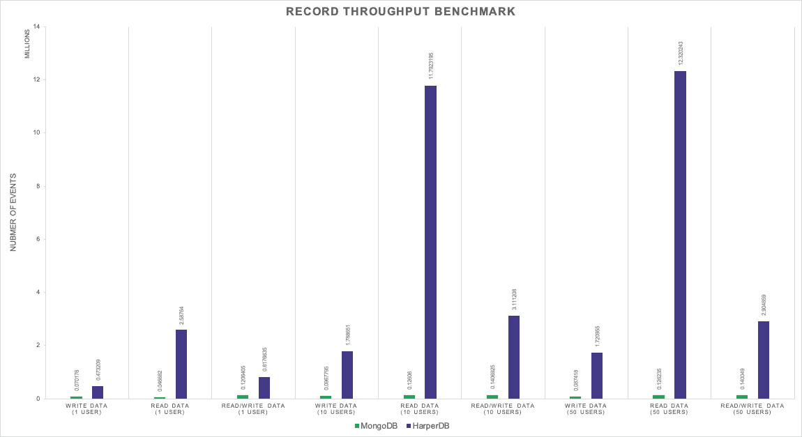
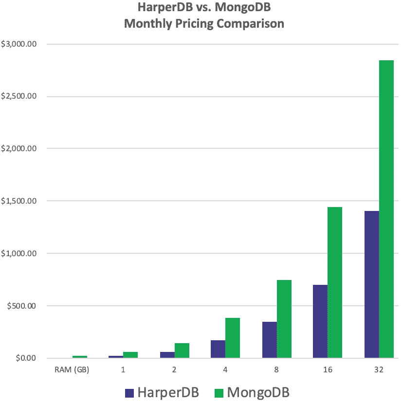

# 这就是为什么你应该选择 HarperDB 而不是 MongoDB

> 原文：<https://javascript.plainenglish.io/heres-why-you-should-chose-harperdb-over-mongodb-765e93557b00?source=collection_archive---------11----------------------->

## NoSQL、SQL、NewSQL — HarperDB 应有尽有

Photo by [JOSHUA COLEMAN](https://unsplash.com/@joshstyle?utm_source=medium&utm_medium=referral) on [Unsplash](https://unsplash.com?utm_source=medium&utm_medium=referral)

您正在为您的产品寻找合适的数据库吗？你是否对应该选择 SQL 还是 NoSQL 感到困惑？如果有一种两全其美的产品呢？你问的是什么产品？—是 **HarperDB** 。

# **为什么我会对哈泼德着迷？**

对于一个终生学习 SQL 并且大部分时间只使用 SQL 解决方案的人来说，最初很难理解 MongoDB。可以说我是守旧派，但是尽管它有很多优点，我总是想知道为什么读操作是昂贵的，如果有方法避免重复，如果有更容易的方法从复杂的查询中获得数据。不仅仅是 MongoDB，这些是大多数 NoSQL 解决方案的缺点。当我第一次读到 HarperDB 时，这是一个启示的时刻，我明白了我们可以有 NoSQL 解决方案，而没有任何其他通用 NoSQL 数据库中的所有开销和缺点。HarperDB 提供的表格结构有助于我更好地理解它，因为它连接回了陈腐的 SQL 数据库表结构的根。

# **什么是 HarperDB？**

HarperDB ，是一个完整的数据管理平台，为任何开发人员想到的每个问题提供解决方案。使用 HarperDB，可以执行传统的 SQL 操作，如连接、排序、分组等，还可以支持文档存储、无模式数据建模、基于 API 的查询执行等。

HarperDB 非常容易使用，只需很少的配置，任何水平的开发人员都可以使用。使用普通的 REST APIs，可以插入 JSON、CSV 或 via SQL 类型的数据。在这里，我们可以在单个存储引擎中利用 NoSQL 模式的灵活性和 RDBMS 的一致性、安全性和持久性。它还支持多种插件，如 ODBC、JDBC、Node-RED 等等。

这个产品让我大吃一惊，我忍不住将它与我能想到的其他最好的数据库解决方案— MongoDB 进行了比较。MongoDB 为 NoSQL 数据库制定标准奠定了基础。尽管 MongoDB 为许多其他数据库平台铺平了道路，但 HarperDB 在许多方面已经发展得更快更好。现在我们来比较和对比一下。

# **什么是 MongoDB 和 HarperDB？**

MongoDB 是一个面向文档的 NoSQL 数据库，使用带有可选模式的类似 JSON 的文档。

HarperDB 是一个分布式数据库，具有 REST API 和动态模式，支持 NoSQL 和 SQL，包括连接。

# **性能**

Image source: [HarperDB](https://harperdb.io/?utm_source=harshablog)

基准测试证明，HarperDB 平均比 MongoDB 快 37.9 倍，而价格却只有一半。更具体地说，读取速度提高了 98 倍，写入速度提高了 20 倍。MongoDB 的写操作比读操作更快，而在 HarperDB 中，我们的整体性能很高，因为它的数据存储算法是在 LMDB(闪电内存映射数据库)之上编写的。Lightning 内存映射数据库是一个软件库，它以键值存储的形式提供了一个高性能的嵌入式事务数据库，这反过来又有助于在 HarperDB 中进行更快的读写。

MongoDB 主要用 C、C++和 JavaScript 编程。HarperDB 用 Node.js 写(LMDB 用 C 写，安装过程用 Python)。MongoDB 使用 BSON(二进制 JavaScript 对象符号)来提高查询速度。当你打开你的收藏时，它会被翻译成 JSON 来阅读。HarperDB 不强制数据类型，以其本机格式存储数据，并且可以通过 SQL 和/或 NoSQL 查询数据。

# **数据存储和架构**

HarperDB 将数据存储在表中，默认情况下，所有顶级属性的行或对象都被编入索引。但是，MongoDB 将数据存储为单独的文档。HarperDB 有一个独特而高效的数据存储算法，它运行在 LMDB 之上，使 HarperDB 能够在一个产品中存储 JSON 文档和关系数据。存储数据时，HarperDB 将其映射到数据模型，无论数据是如何存储的，都可以通过 SQL 或 NoSQL 进行查询。

# **酸属性(原子性、一致性、孤立性、持久性)**

HarperDB 拥有企业级的 ACID SQL 事务，因此 HarperDB 中数据的有效性非常可靠。大多数 NoSQL 数据库采用最终一致性而不是 ACID 属性，MongoDB 也是如此。在 HarperDB 中，用户可以在 JSON 上执行复杂的、符合 ACID 的 SQL 查询，而无需任何数据复制。

# **成本**

Image source: [HarperDB](https://harperdb.io/?utm_source=harshablog)

HarperDB 的成本只有 MongoDB Atlas 的一半。由于 HarperDB 只需要很少的计算，因此扩展的成本更低。与 MongoDB 不同，它没有重复的数据，并且由于存储成本低，它本身支持 SQL 和 NoSQL。

# **原生 API**

HarperDB 本身是作为一组微服务构建的，这使得开发和集成变得简单而无缝。它还支持多种插件，如 ODBC、JDBC、Node-RED 等等。

HarperDB 对所有操作使用单端点。HarperDB 的 RESTful 特性使其无状态、稳定且可伸缩。

# **无障碍**

HarperDB 是一个全功能的数据管理平台，可以从边缘运行到云，以及两者之间的任何地方。同样的情况也适用于 MongoDB，它可以在任何地方运行，也就是说，在云中、本地、数据中心等等。

# **结论**

我们使用的任何产品都肯定有它自己的优点和缺点。如果您不介意使用一个写得更快、读得更慢、内存管理不好的数据库，那么 MongoDB 仍然是您的正确选择。但是，如果您决定使用一个能帮助您高效管理数据、读写速度更快且极具成本效益的数据库，那么 HarperDB 绝对是完美的数据库解决方案。我个人认为 HarperDB 的 SQL/NoSQL 功能是革命性的。如果你觉得 HarperDB 很有趣，这里有一个免费的注册链接供你尝试。

 [## Studio :: HarperDB

### HarperDB 是一个全功能的数据管理平台，可以从边缘运行到云，以及两者之间的任何地方。

studio.harperdb.io](https://studio.harperdb.io/sign-up?utm_source=harshablog) 

# 参考

 [## HarperDB |简单而不牺牲

### HarperDB 是一个 SQL/NoSQL 数据管理平台。它是完全索引的，不会重复数据，并且可以在任何设备上运行…

harperdb.io](https://harperdb.io/?utm_source=harshablog)  [## Harper db vs MongoDB vs PostgreSQL-DZone 数据库

### 许多人学习或理解新的东西相对于他们已经知道的东西。这很有道理，很可能是一个…

dzone.com](https://dzone.com/articles/harperdb-vs-mongodb-vs-postgresql) 

*更多内容尽在*[plain English . io](http://plainenglish.io/)