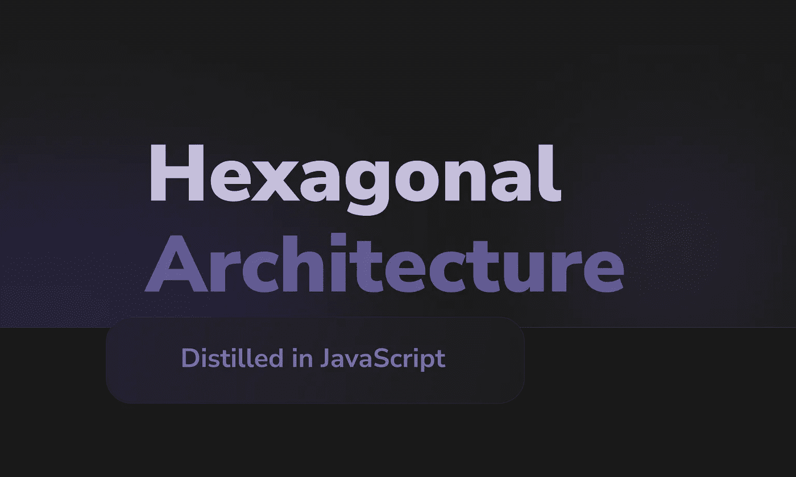
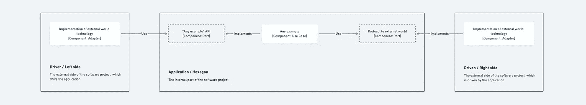
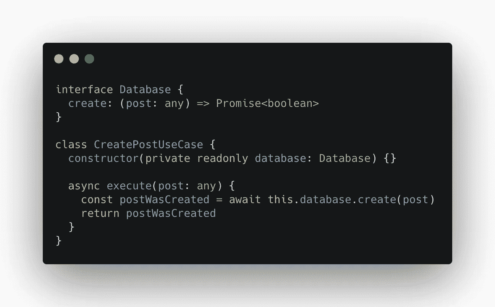
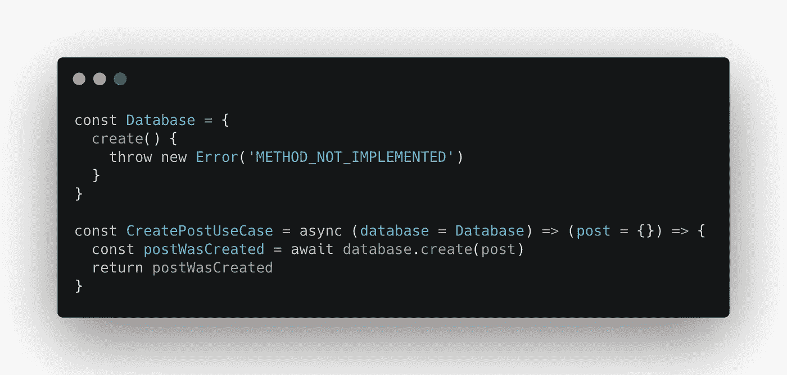
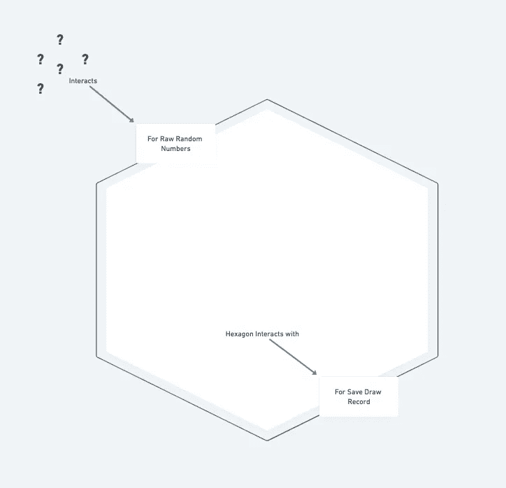
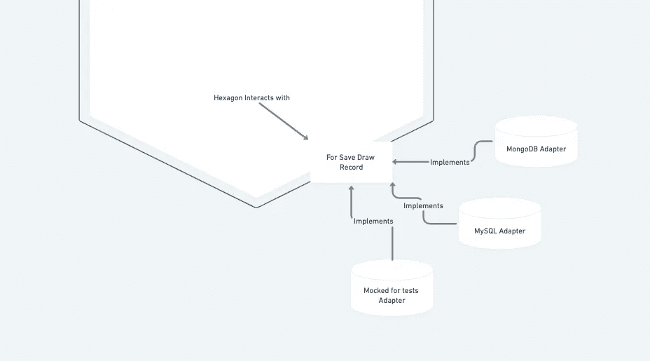

# JavaScript 中提炼的六边形架构

> 原文：<https://javascript.plainenglish.io/hexagonal-architecture-distilled-in-javascript-ultimate-guide-aac2eaa6726c?source=collection_archive---------4----------------------->



```
**This publication is currently being maintained. Topics that are under change will be indicated by [brackets].** ℹ️
```

我打算写这篇文章来清楚地分享如何理解和实现 **JavaScript** 中的**端口和适配器(六角形架构)**模式。

我选择以不同的格式创建此出版物。使用**六边形架构**开发了一个库，实际实现了一个**博客**。

这个库的目的是展示我将要解释的概念的具体例子。



1.0 — Component view of the pattern.

本文的研究工作如下:在这个页面上，我将呈现一个高层次的视图。 **JavaScript** 中的概念和实际例子的细节将在资源库中提供:

[](https://github.com/pedromoraisf/hexagonal-architecture-distilled) [## GitHub-pedromoraisf/hexagon-architecture-elisted:理解六边形的终极指南…

### 理解 JavaScript 六边形架构(也称为端口和适配器)的终极指南。这是一个简单的博客…

github.com](https://github.com/pedromoraisf/hexagonal-architecture-distilled) 

如果存储库中继续有任何概念，链接将位于主题的末尾。

# 摘要

*   ***简介***
*   ***想法和动机*** *为什么是六边形？*
*   ***可配置依赖*** *可配置依赖之上的概念层
    用 TypeScript
    反转和注入依赖现在，在 JavaScript*
*   ***六边形架构*** *六边形****【todo】*** *演员****【todo】*** *端口
    关于端口数量
    清晰的实现示例
    适配器
    用例****将被弃用***
*   *****结论*****
*   *****参考文献*****

# **想法和动机**

**由阿利斯泰尔·考克伯恩博士于 2005 年发布的****端口和适配器** **架构模式**提出了将应用程序从其技术中分离出来的想法——如框架、第三方实现或库等。****

**受**将业务逻辑渗透到用户界面代码**的启发，主要想法是定义应用程序的结构**，以在不同的驱动程序**上运行。因此，其中一个好处是可以更容易地测试我们的应用程序**，能够为给定的测试策略**隔离不必要的外部实现**。****

## ****为什么是六边形？****

****最初的想法移到了**的一侧，带来了围绕应用内部和应用外部的不对称概念**，而不是我们在分层架构方法中常见的上/下或左/右。****

****根据阿利斯泰尔·考克伯恩的说法，由于这些原因，正方形是不够的。像五边形或七边形这样的几何图形很难画——**所以就画六边形吧。******

********

****1.0 — The overrated Hexagon…****

****最后，在数字 6，或六边形的边，对概念有一些意义的地方，争论被去神秘化。****

# ****可配置依赖关系****

****在我们进入概念及其实现之前，我们应该对**可配置依赖模式**有一个清晰的理解。****

******可配置依赖**通过加入两个非常著名的行业模式来理解:**依赖注入和依赖反转**。在胡安·曼努埃尔·加里多·帕兹 的文章 ***端口和适配器模式(六边形架构)中，有一章专门讲述了这个主题:[https://jmgarridopaz . github . io/content/Hexagonal Architecture . html # tc3](https://jmgarridopaz.github.io/content/hexagonalarchitecture.html#tc3)。*******

****简而言之，我们将**可配置依赖**视为一个对象(或函数)对一个接口(或协议)的**依赖。**我在前一句中添加了“功能”和“协议”这两个词，因为我们在本出版物的实现示例中将或多或少地遵循这一思想。****

****当建立协议结构的依赖关系时，我们**将该对象的依赖关系** **转化为另一个具体对象**。然后，我们可以注入一些具体的结构，这些结构遵循协议提出的接口。****

## ****可配置依赖关系之上的概念层****

****在阿利斯泰尔·考克伯恩的原始出版物中，在“相关模式”部分，我们有最后一个(至少在撰写本文时)主题“依赖倒置(依赖注入)和 SPRING”。****

****一些更有经验的读者，即使他们还不知道端口和适配器的概念，仅仅通过添加模式的*思想和动机*信息，以及对可配置依赖性的简要解释，可能已经预测到，为了获得这样的独立于由阿利斯泰尔·考克伯恩提出的外部技术，解决方案将是我们反转和注入依赖性。**这些读者没有错。******

****显然，端口和适配器是由其他集合概念组成的，**但是我敢说它的坚实基础之一是可配置的依赖关系**。清楚了这一点后，我们接下来看一个在 TypeScript 和 JavaScript 中都适用的例子。****

## ****用 TypeScript 反转和注入依赖关系****

****让我们想象我们正在为一个博客实现一个用例——不要拘泥于这个概念的字面意思。****

****这个用例旨在创建一篇博客文章。**我将称之为“创造岗位”。******

****我们知道，为了实现这个目标，我们需要在某个数据库中持久化发布(我可以将它保存在文件系统上的一个文本文件中，但是我将使用数据库作为例子)。**为了反转直接的数据库依赖，我将这种依赖指向我正在开发的类中的一个属性。** **我姑且称之为“数据库”。******

********

****1.0 —Example of decoupling a Use Case from persistence code using TypeScript Interface.****

****这个属性是通过构造函数提供的，所以如果我运行用例的“execute”方法而没有给它赋值，什么都不会起作用。因此，当实例化示例类时，**我们需要给构造函数分配一个尊重“数据库”接口的对象。所以我们必须注入一个依赖项。******

## ****现在，在 JavaScript 中****

****在 TypeScript 中，利用面向对象语言中常见的特性，我们成功地对可配置依赖模式提供了流畅的支持。现在，如何在没有本机接口特性的语言中获得相同的结果呢？****

****在下面的例子中，我使用了**高阶函数**的概念，其中我们有一个更高级别的函数，它返回一个更低级别的子函数。****

****这里的策略是使用高阶函数作为类的“构造器”特性。在撰写本出版物时，ES2021 拥有原生类功能已经有一段时间了。然而，我决定使用这个例子来更接近大多数纯粹的 JavaScript 开发人员的代码编写。****

****请注意，我克服了“接口”特性的不足，**构建了一个名为“数据库”的对象，包含在图**的第一行中。这个对象有一个方法，当它被执行时，**抛出一个错误，通知在它的执行中没有实现。******

********

****1.1 — Example of decoupling a Use Case from persistence code using JavaScript function parameter.****

****这种格式包含许多问题。我将这个界面模拟归因于“数据库”参数的默认值。如果客户端注入一个不完全符合“数据库”中描述的结构的依赖项，**我们就不会得到该语言的编译错误警告。** **这是因为 JavaScript 是一种解释语言，而不是编译语言。******

****这不是模拟界面的最安全的方式，但这是我们目前在 JavaScript 中所拥有的。****

****考虑到这些警告，我在 TypeScript 中执行了与示例相同的两个步骤，不同之处仅在于缺少“this”引用。****

# ****六角形建筑****

## ****六角形[todo]****

## ****演员[todo]****

## ****港口****

****端口位于六边形的**边缘，是从外部世界到六边形以及从六边形到外部世界的通信手段。因此，端口可以被看作是承载交互**的**目的的东西。******

****因为它被描述为一个交互的目的，命名法的开头会有“for ”,表示**交互将服务于**。****

****举一个任意的例子，我们可以在应用程序的*“左侧”*有一个端口，指示与六边形外部接触的**目的。如果我们在谈论一个抽奖应用程序，访问六边形的端口可以是“原始随机数”。******

********

****1.0 — First macro view of the Hexagon with the Ports.****

****如果六边形内部的代码以绘制随机数为目的，需要与六边形外部的技术(例如数据库)建立连接，我们可以有一个“for-save-draw-record”端口。****

## ****关于端口的数量****

****在最初的出版物中，阿利斯泰尔·考克伯恩对此并不死板，他透露我们可以:****

*   ****一个端口用于所有外部世界与六边形的交互，一个端口用于六边形与外部世界的交互。****
*   ****用于与六边形的每次交互的不同和特定的端口，以及用于六边形与外部世界的每次交互的等效端口。****

****同样，这也表明**两种情况都不理想**。实际上，最终，这个**将取决于工程师/建筑师的直觉**。****

****在本出版物的示例存储库中，我使用了一个 web 端口(它更能代表外部世界与六边形的联系)，因为我们不能用 JavaScript 设计一个函数接口的模拟。也许，在不同的方法中，您可以将六边形内部的代码(在本例中是用例)编写为带有方法和属性的 JavaScript 对象，更接近于类方法。****

****我使用的另一个端口是**，用于管理帖子**。在这个港口，我收集了所有必要的操作。因为在实现中，我部分使用了*存储库模式*的概念。****

****我不能说 examples 应用程序只有两个端口。如果需要扩展，它将根据对更多储存库的需求，添加更多与外界的六边形接触端口。****

****然而，正如在原始出版物中所规定的，这是可以自由决定的。在另一个我在 GitHub 上开源的项目中，我遵循一种方法，在这种方法中，我为与 hexagon 的每次交互声明一个特定的端口，并在 hexagon 与外部世界的通信中进行等效。这个例子可以在下面找到:****

****[](https://github.com/pedromoraisf/lets-code-api/tree/main/src/hexagon/ports) [## let-code-API/src/hexagon/主通道端口

### 让我们来编写看板的代码。通过创建一个…

github.com](https://github.com/pedromoraisf/lets-code-api/tree/main/src/hexagon/ports) 

## 清晰的实施示例

通常，可以用面向对象语言中常见的接口特性来编写端口。

在这个例子中，我使用 JavaScript 对象，其中的属性是端口，而**实现抛出一个错误，表明那里没有具体的实现，只有一个端口分界**。

“可配置的依赖关系”一节描述了一个类似的例子。

详细阅读示例 **JavaScript** 实现，参见: [**端口——六边形架构精华→**](https://github.com/pedromoraisf/hexagonal-architecture-distilled/tree/main/src/hexagon/ports) 。

## 适配器

在讲授这个话题时，我喜欢用下面的比喻:

> 端口指定允许与六边形通信的语言。适配器用于将参与者的语言转换成端口指定的六边形所理解的语言。

在六边形体系结构的上下文中，适配器将是端口所指定的特定技术的实现。

给定一个名为“保存抽签记录”的端口，我们可以实现一个 MongoDB、MySQL 数据库和一个用于测试的模拟。



1.0 — View of the relationship between Hexagon, port and adapter.

**在实施六边形架构时，我们需要了解的一个重要观点是，每个端口至少必须有两个适配器**。

这是规则吗？如果我们假装不是，我们可以理解使用默认端口和适配器可能没有意义。也许你不小心制造了太多的复杂性，直接调用外部技术函数是有意义的。

**因此，无论何时我们设计适配器的实现，我们都可以连续地得到使用端口和适配器模式是否有意义的答案。这是提示。**

本主题指向 GOF 适配器模式，因此主要规范是相同的。

> 将一个类的接口转换成客户期望的另一个接口。该适配器允许接口不兼容的类一起工作，否则这是不可能的。”

在我们的 JavaScript 上下文中，我们也可以为此使用函数。

在本出版物的示例实现中，我使用了 JavaScript 的闭包功能和高阶函数技术将适配器注入到六边形内部的代码中。反过来，这些功能依赖于端口，端口由一个文字对象表示，没有具体的功能实现。

当我们以这种方式设计项目时，**我们可以根据上下文和意图注入适配器，隔离资源**。例如，如果我们的*六角形代码*需要使用网络协议来获得一些资源，在单元测试上下文中，我们可以隔离这个非常昂贵的资源，并注入一个**假适配器**，它返回一个与我们想要在代码中处理的内容兼容的结果。

关于示例 **JavaScript** 实现的详细阅读，请参见: [**适配器—六边形架构精华→**](https://github.com/pedromoraisf/hexagonal-architecture-distilled/blob/main/src/adapters/readme.md) 。

## 用例***将被弃用***

**在**阿利斯泰尔·考克伯恩的**原始出版物中，代码的**内部部分**的引用没有作为**用例**给出。**

**我决定在这本出版物中整合这个概念，因为作者自己已经有效地为我们今天对**用例**的定义做出了贡献——阅读:**编写有效的用例，作者阿利斯泰尔·考克伯恩**。**

**此外，这个概念的最初定义遵循了这样的陈述，即**用例**可以被描述为系统必须尊重的功能。你身份的塑造。**

**根据定义，我们拥有来自外部世界的**技术**，它们与通过**参与者**表示的**用例**进行交互。**

**这个观点在**用例**图概念中得到肯定，后来由 **Ivar Jacobson** 在声名狼藉的 **UML 符号语言**中提出。**

**很长一段时间以来(甚至今天)，软件行业一直保留着**用例**的写作，而**对它们的参与者**有不适当的了解。**

**因此，我们用**端口**来划分**参与者**在代码中的某一点应该做什么。使用**适配器**，我们指定如何操作。**

**如果我们仔细观察， **UML 用例图**的**参与者**将是一个**六边形架构**的**适配器**的一个很好的指示。**

**关于示例 **JavaScript** 实现的详细阅读，请参见: [**用例——六角形架构精华→**](https://github.com/pedromoraisf/hexagonal-architecture-distilled/blob/main/src/usecases/readme.md) 。**

# **结论**

**利用**端口和适配器架构模式**，我们开发出健康的、可维护的、职责明确的应用程序。**

**一个大提示:**不要在没有创建单元测试的情况下使用这种架构模式。****

**违背上面的判决几乎就像是死刑判决。**

**阿利斯泰尔·考克伯恩的动机之一是开发 ***【模拟】*外部技术的实现来创建**真正的单元测试**。测试单一概念性功能的测试。****

**软件工程和架构中的最佳实践受到更多最佳实践的指导。**

# **参考**

*   **六角形建筑—[https://alistair.cockburn.us/hexagonal-architecture/](https://alistair.cockburn.us/hexagonal-architecture/)**
*   **EEA 目录的 p—储存库[https://martinfowler.com/eaaCatalog/repository.html](https://martinfowler.com/eaaCatalog/repository.html)**
*   **设计模式:可重用面向对象软件的元素。**
*   **统一软件开发过程——Ivar Jacobson，Grady Booch 和 James Rumbaugh。**
*   **干净的架构:软件结构和设计的工匠指南**
*   **务实的程序员——戴维·托马斯和安德鲁·亨特。**
*   **面向对象软件工程:用例驱动的方法— Ivar Jacobson**
*   **撰写有效的用例—阿利斯泰尔·考克伯恩**
*   **http://xunitpatterns.com/SUT.html，xUnit 模式—**
*   **端口和适配器模式(六角形架构)，胡安·曼努埃尔·加里多·帕斯—[https://jmgarridopaz . github . io/content/Hexagonal Architecture . html](https://jmgarridopaz.github.io/content/hexagonalarchitecture.html#tc3)**
*   **Closures—[https://developer . Mozilla . org/en-US/docs/Web/JavaScript/Closures](https://developer.mozilla.org/en-US/docs/Web/JavaScript/Closures)**

***更多内容看*[***plain English . io***](http://plainenglish.io/)******