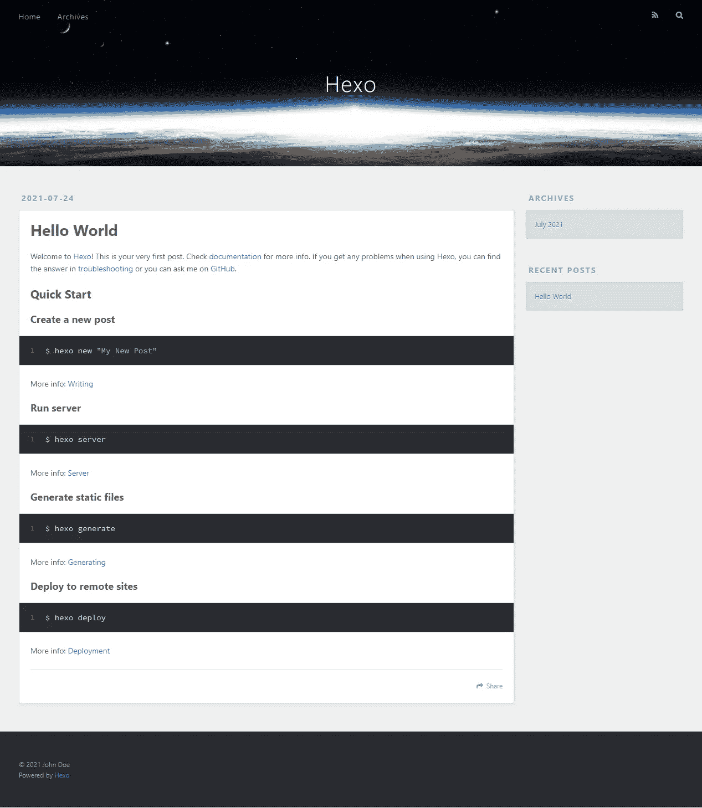

# 用 Hexo 在 5 分钟内建立一个博客

> 原文：<https://javascript.plainenglish.io/hexo-framework-build-a-blog-in-just-5-minutes-e416011ee576?source=collection_archive---------7----------------------->

## 我没开玩笑。使用 Hexo，你可以在 5 分钟内建立一个博客。


在这个故事中，你将学习到 [Hexo](https://hexo.io/) 框架的基础知识，并在不到 5 分钟的时间内为自己建立一个博客。

## 注意

即使 Hexo 很简单，自建的 React 网站通常会表现得更好，并且更具可定制性。你可以把 Hexo 想象成 React 生态系统的 WordPress。这当然并不意味着 Hexo 不好。很多博客都是用 Hexo 做的，而且效果相当好！

开始吧！

# 什么是 Hexo？

Hexo 是一个快速、简单而强大的博客框架。它用 Markdown 或另一个渲染引擎解析你的帖子，并生成带有漂亮主题的静态文件。所有这些只需要几秒钟。

Hexo 是一个非常棒的博客工具。它生成静态文件，并让您构建自定义主题或使用现有的社区制作的主题。

# Hexo 功能

## 速度极快

Node.js 提供的令人难以置信的生成速度。数百个文件只需几秒钟即可构建完成。

## 降价支持

支持 GitHub Flavored Markdown 的所有功能，包括大多数 Octopress 插件。

## 单命令部署

你只需要一个命令就可以将你的站点部署到 GitHub Pages、Heroku 或者其他平台上。

## 插件

具有强大的 API，具有无限的可扩展性。各种插件可用于支持大多数模板引擎(EJS，帕格，Nunjucks，和许多其他)。容易与现有的 NPM 软件包(Babel，PostCSS，Less/Sass 等)集成。

# 建立我们的博客

我们已经讨论过 Hexo 及其特性。现在是时候建立我们的博客了！

首先，我们全球安装 Hexo。

```
npm install -g hexo
```

这将基本上安装 Hexo 在你的机器上，你将能够随时使用它。

之后，我们必须生成一个新的 Hexo 博客。

```
hexo init <your-blog-name>
```

此命令使用您输入的名称创建一个新博客。我把我的博客命名为`alimblog`，但是你当然可以随意命名你的博客。

现在我们必须生成静态文件来启动我们的博客。

```
cd <your-blog-name>hexo generate
```

这个命令基本上会为你生成静态的 HTML，CSS 和 JavaScript 文件。

仅此而已。我们现在可以启动我们的博客服务器，看看它是什么样子的！

```
hexo server
```

这个命令将为您在 [http://localhost:4000/](http://localhost:4000/) 上的博客提供服务。

如果你现在访问这个网址，你会看到你的博客开始运行了！



Our blog

我是说，在我看来这很酷。而且不到 5 分钟就做好了！

# 定制我们的博客

我们的博客看起来很酷，但并不完美。让我们对它进行一点定制，使它可以部署。

打开`_config.yml`文件。这个文件包含了你博客的所有数据。你可以把`title`、`author`等东西改成你想要的任何东西！

在定制我们的博客配置后，我们可以安装一个更好看的主题，让我们的博客更酷。

## 注意

安装一个主题是完全可选的。如果你喜欢默认的主题，请随意使用。

有一个很酷的主题叫做[quiet](https://github.com/QiaoBug/hexo-theme-quiet)。我喜欢它，所以我将向你展示如何在你的项目中使用它。

你可以在 https://hexo.io/themes[看到所有可用的主题。并且它们的安装过程通常是相同的。确保正确阅读你正在安装的主题的说明。](https://hexo.io/themes/)

## 安装主题

安装一个主题实际上非常简单。你只需要将你想要的主题克隆到`themes/`文件夹中，然后添加到你的`_config.yml`文件中。

```
cd themes
git clone [https://github.com/QiaoBug/hexo-theme-quiet.git](https://github.com/QiaoBug/hexo-theme-quiet.git)
```

该命令将主题安装到主题文件夹中。

安装完主题后，转到你的`_config.yml`文件，在文件的扩展部分添加这一行。

```
theme: hexo-theme-quiet
```

瞧，现在你已经安装了一个漂亮的主题！


Our blog with the new theme installed

***注意:*** *很多配置数据会因为主题而改变。但是不用担心。只需转到* `*themes/hexo-theme-quiet*` *文件夹中的* `*_config.yml*` *并随意编辑即可。*

# 结论

真的很喜欢 Hexo，真的推荐尝试一下。

我希望这个故事对你有所帮助，并且让你对 Hexo 有了新的了解。

## 仅此而已。感谢您阅读这个故事！

如果你喜欢这个故事，一定要让我们在评论中知道，并随时问我你想问的任何问题。

在 Twitter 上关注我:

[](https://twitter.com/Re_allyedge) [## re _ ally 边缘

twitter.com](https://twitter.com/Re_allyedge) 

在 Patreon 上支持我:

[](https://www.patreon.com/allyedge) [## 阿里木阿尔斯兰卡亚是创造编程故事和教程。帕特里翁

### 今天就成为阿里木阿尔斯兰卡亚的赞助人:在世界上最大的…

www.patreon.com](https://www.patreon.com/allyedge) 

*更多内容看* [***说白了***](http://plainenglish.io)