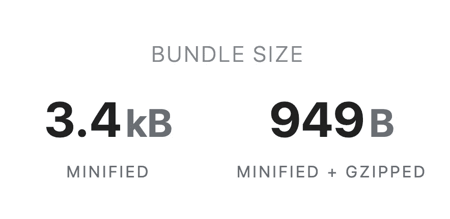

# 基于滚动隐藏 React 中的 DOM 元素

> 原文：<https://javascript.plainenglish.io/hiding-dom-elements-in-react-based-on-scrolling-d9a9ef1f1f5?source=collection_archive---------3----------------------->


Photo by [Sigmund](https://unsplash.com/@sigmund?utm_source=medium&utm_medium=referral) on [Unsplash](https://unsplash.com?utm_source=medium&utm_medium=referral)

在前端开发中，我们经常遇到需要根据滚动级别显示/隐藏元素的情况。在这里，我将讨论使用 React 实现这一点的两种方法。首先，我们自己实现它，其次使用已经可用的 npm 包。

# 1.履行

考虑这样一个 HTML 元素:

```
<div id="hide">Content hidden when scrolled beyond 1000px</div>
```

为了在 React 中隐藏这一点，我们需要根据滚动级别有条件地呈现这个 div，最合理的选择是使用一个 ***状态变量*** ，它跟踪元素是否可见。我们可以使用 ***useState*** 钩子来实现这一点。

```
const [isVisible, setIsVisible] = useState(true);
```

并使用这个变量 ***有条件地渲染*** 这个 div，就像这样:

```
{
   **isVisible 
      &&** 
   <div id="hide">Content hidden when scrolled beyond 1000px</div>
}
```

现在，剩下的就是创建变量，跟踪滚动级别，并找出元素是否必须显示或隐藏。我们可以通过添加一个 ***事件监听器*** 来跟踪滚动，这必须在组件安装时添加，在组件卸载时删除。

为此，我们使用 ***useEffect*** 钩子来添加事件监听器，带有一个空白的依赖数组，该数组返回一个函数，该函数在卸载期间执行我们的清理(即删除事件监听器)。

```
useEffect(() => {   
  window.addEventListener("scroll", **listenToScroll**);
  return () => 
     window.removeEventListener("scroll", **listenToScroll**); 
}, [])
```

现在，我们的挂载和卸载功能已经完成，可以添加和删除滚动事件监听器了。现在我们到了最后也是最重要的一步，就是定义***listenToScroll()***函数，它是我们在上一步中作为监听器函数添加的。

```
const listenToScroll = () => {
  let heightToHideFrom = 1000;
  const winScroll = document.body.scrollTop || 
      document.documentElement.scrollTop;

  if (**winScroll > heightToHideFrom**) { 
     **isVisible &&**      // to limit setting state only the first time         
       **setIsVisible(false);**
  } else { **setIsVisible(true);**
  }  
};
```

因此，现在我们的 isVisible 变量将跟踪是否必须显示或隐藏 div。整个事情看起来会像这样:

也可能有这样的情况，当一个元素到达一个 div 时，你可能想要隐藏它，为此你需要做的就是改变***heightToHideFrom***变量中的 ***listenToScroll()。***

```
const heightToHideFrom = 
      getOffset(document.querySelector("#**your-div-id**")
```

上面使用的 ***getOffset()*** 函数还没有定义，但是它的作用只是从你想要的 div 的包围矩形中获取顶部偏移量，可以这样实现:

```
const getOffset = (element) => {
  const rect = element?.getBoundingClientRect(),
    scrollTop = 
      window.pageYOffset ||  document.documentElement.scrollTop; return rect!.top + scrollTop;
};
```

对于任何给定的场景，您可以使用这些方法，轻松地隐藏/显示 React 中的任何元素！

# 2.NPM 套餐

实际上，为你工作的每个项目编写隐藏/显示元素的组件只是不必要的重复发明。这就是预构建包派上用场的地方。

这就是为什么我构建了这个包，[***react-hide-on-scroll***](https://www.npmjs.com/package/react-hide-on-scroll)，它有许多实用组件，为大多数场景提供功能，比如在特定高度范围之间、从特定高度、在特定 div 之间或从特定 div，或者基于滚动方向隐藏/显示，等等。

例如，为了在滚动超过 1000 像素时隐藏一个 div，而不是编写所有代码来实现我们在上一个示例中所做的，我们可以简单地这样做:

```
<HideOn atHeight height={1000}>
   <div id="hide">Content hidden when scrolled beyond 1000px</div>
</HideOn>
```



它的包大小只有 949b minified+gzipped，所以它也不会给你的项目增加很多开销！而且它还有清晰的说明和 API。

因此，通过运行以下命令下载这个包，开始构建您的项目，而不用担心构建隐藏/显示功能:

```
npm i react-hide-on-scroll
```

访问[***NPM***](https://www.npmjs.com/package/react-hide-on-scroll)***页面***:[](https://www.npmjs.com/package/react-hide-on-scroll)****。****

**如果你愿意，你也可以为这个项目做贡献！**

**感谢您的阅读。**

***更多内容请看*[*plain English . io*](http://plainenglish.io/)**