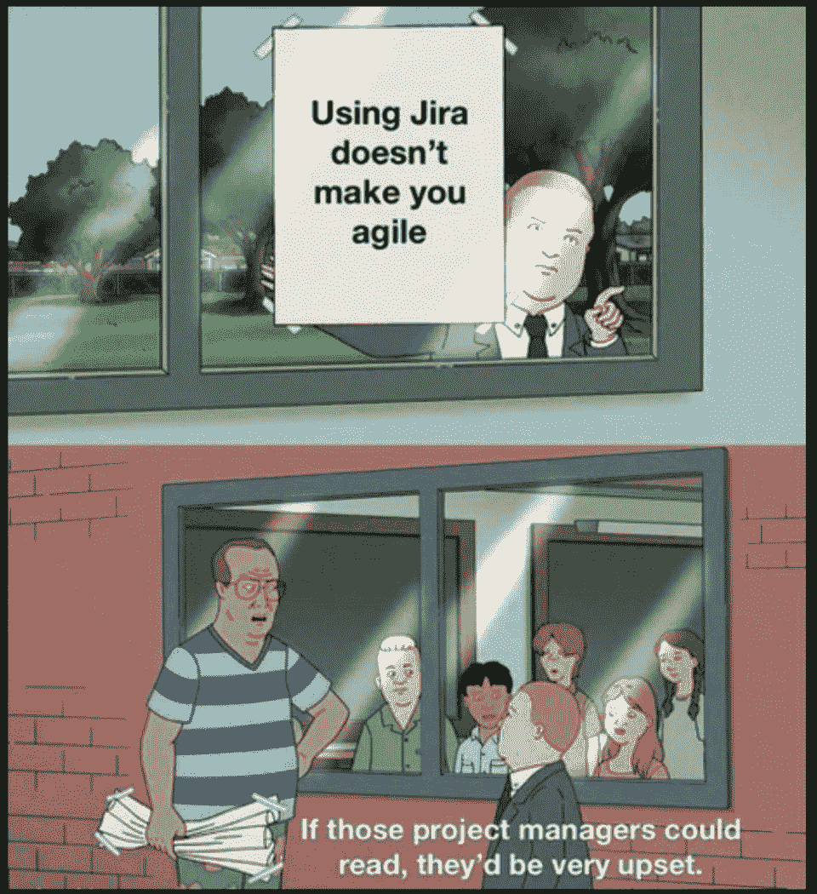
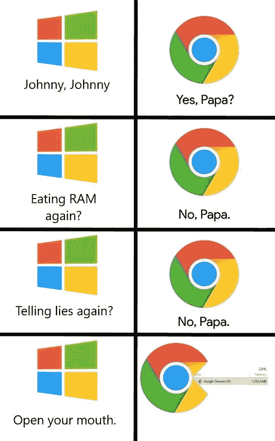
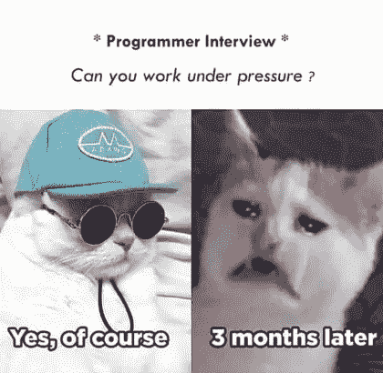
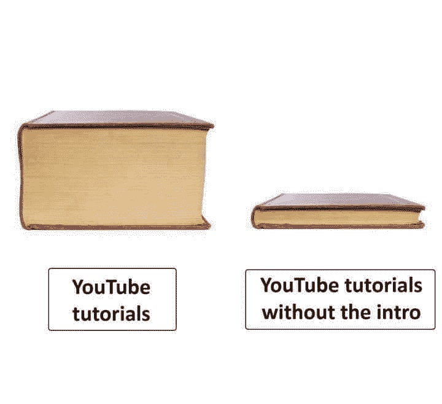
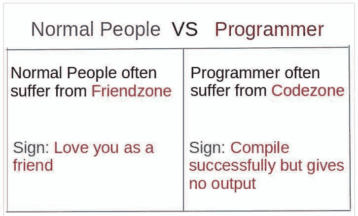
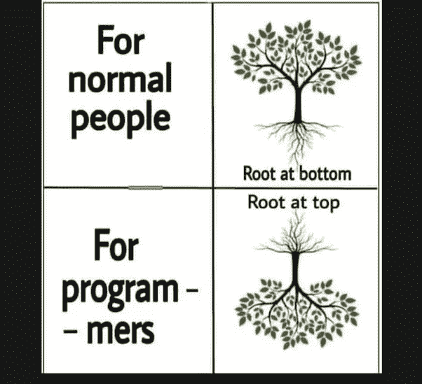
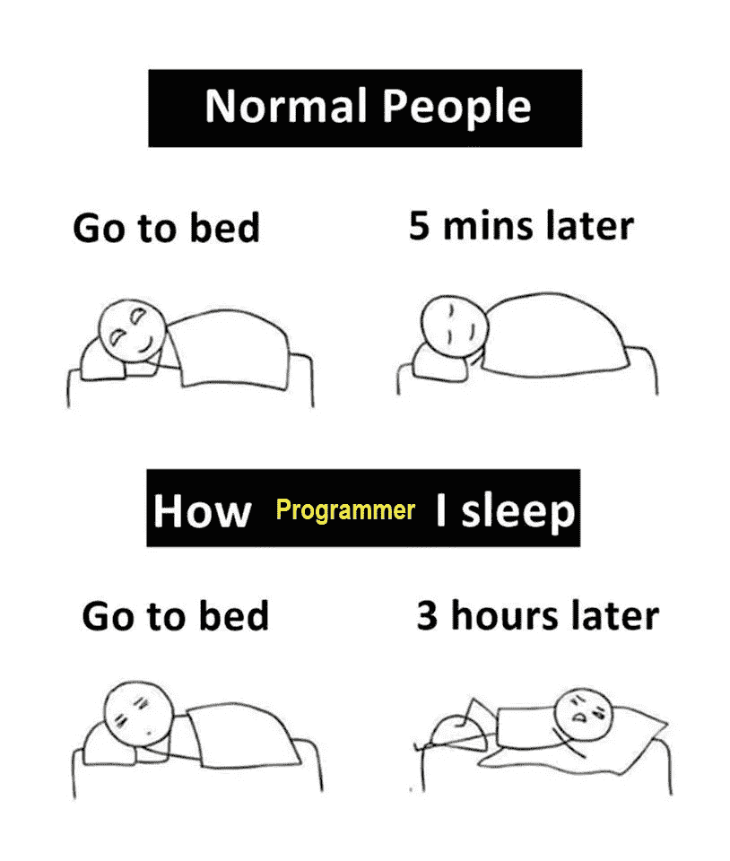
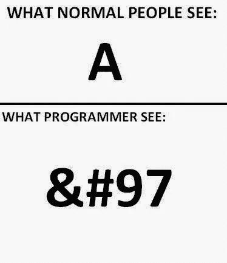

# 令人捧腹的编程幽默

> 原文：<https://javascript.plainenglish.io/hilarious-programming-humour-7f8587766fbd?source=collection_archive---------3----------------------->

## 最佳编程幽默汇编(第三部分)

Photo by [Abhidev Vaishnav](https://unsplash.com/@abhidevvaishnav?utm_source=medium&utm_medium=referral) on [Unsplash](https://unsplash.com?utm_source=medium&utm_medium=referral)

***笑话和快乐有什么联系吗？*** 如果你是我这种类型的人，那么你可能也爱在下班后查看手机。猜猜我在那里看到了什么？

我主要是在网上看到**的视频、抖音和笑话**。我不知道为什么，但这有助于我提神醒脑，减轻工作压力。

## 当有人问你是如何开始这个项目的…

[https://www.monkeyuser.com/2018/production-ready/?sc=true&dir=random](https://www.monkeyuser.com/2018/production-ready/?sc=true&dir=random)

**来源:**[https://www.monkeyuser.com](https://www.monkeyuser.com/2018/production-ready/?sc=true&dir=random)

## 添加功能…添加功能…等等…我们来重构一下

[https://www.monkeyuser.com/2020/features/?sc=true&dir=random](https://www.monkeyuser.com/2020/features/?sc=true&dir=random)

**来源:**[https://www.monkeyuser.com](https://www.monkeyuser.com/2018/production-ready/?sc=true&dir=random)

# 哈哈…有意思，但是我的非程序员朋友盯着我的屏幕问的时候我就用这个…

[https://www.reddit.com/r/ProgrammerHumor/comments/p5thip/my_secret_weapon/](https://www.reddit.com/r/ProgrammerHumor/comments/p5thip/my_secret_weapon/)

**来源:**[https://www.reddit.com/r/ProgrammerHumor/](https://www.reddit.com/r/ProgrammerHumor/comments/p5thip/my_secret_weapon/)

## 你不能抱怨用户…英雄联盟

[https://programmerhumor.io/programming-memes/page/4/](https://programmerhumor.io/programming-memes/page/4/)

**来源:【https://programmerhumor.io/programming-memes/】T22**

## 我也是这么想的…

[https://www.reddit.com/r/ProgrammerHumor/comments/p62a26/we_use_agile_but/](https://www.reddit.com/r/ProgrammerHumor/comments/p62a26/we_use_agile_but/)

**来源:**[https://www.reddit.com/r/ProgrammerHumor/](https://www.reddit.com/r/ProgrammerHumor/comments/p62a26/we_use_agile_but/)

## 用户界面设计器调色板…

[https://programmerhumor.io/programming-memes/%f0%9f%a4%94%f0%9f%91%a9%e2%80%8d%f0%9f%8e%a8/](https://programmerhumor.io/programming-memes/%f0%9f%a4%94%f0%9f%91%a9%e2%80%8d%f0%9f%8e%a8/)

**来源:**[https://programmerhumor.io/programming-memes/](https://programmerhumor.io/programming-memes/%f0%9f%a4%94%f0%9f%91%a9%e2%80%8d%f0%9f%8e%a8/)

## QA 如何看待测试过马路场景…

[https://www.reddit.com/r/ProgrammerHumor/comments/p67c54/qa/](https://www.reddit.com/r/ProgrammerHumor/comments/p67c54/qa/)

**来源:**[https://www.reddit.com/r/ProgrammerHumor](https://www.reddit.com/r/ProgrammerHumor/comments/p67c54/qa/)

## 哇…编程幽默也能给你关系建议…

[https://www.facebook.com/photo/?fbid=3918974688212255&set=gm.953267221898555](https://www.facebook.com/photo/?fbid=3918974688212255&set=gm.953267221898555)

**来源:**[https://www.facebook.com/groups/151139362111349](https://www.facebook.com/groups/151139362111349)

## 等等…我们稍后会用到它…

[https://programmerhumor.io/programming-memes/unused-variables-2/](https://programmerhumor.io/programming-memes/unused-variables-2/)

**来源:**【https://programmerhumor.io/】T42

> 奖金时间

# 最喜欢的诗？让我们做一个迷因。英雄联盟

[https://www.reddit.com/r/ProgrammerHumor/comments/ooi4ov/haha/](https://www.reddit.com/r/ProgrammerHumor/comments/ooi4ov/haha/)

# 我可以做任何事…我喜欢在压力下工作…等等…

[https://www.reddit.com/r/ProgrammerHumor/comments/oorx87/halp/](https://www.reddit.com/r/ProgrammerHumor/comments/oorx87/halp/)

# 让我们完成这个简单的问题，不会花太多时间…

[https://www.reddit.com/r/ProgrammerHumor/comments/oog2m0/in_and_out_20_minute_adventure/](https://www.reddit.com/r/ProgrammerHumor/comments/oog2m0/in_and_out_20_minute_adventure/)

# 选谁？如此多的选择…

[https://www.reddit.com/r/ProgrammerHumor/comments/oorx87/halp/](https://www.reddit.com/r/ProgrammerHumor/comments/oorx87/halp/)

# 我知道怎么解决问题...因为我知道如何搜索…

[https://www.reddit.com/r/ProgrammerHumor/comments/ooiodh/my_job_in_a_nutshell/](https://www.reddit.com/r/ProgrammerHumor/comments/ooiodh/my_job_in_a_nutshell/)

# 让我们一步一步来解决这个问题

[https://www.monkeyuser.com/2017/step-by-step-debugging/?sc=true&dir=random](https://www.monkeyuser.com/2017/step-by-step-debugging/?sc=true&dir=random)

# 为什么代码中有这么多问题？因为你不听我们的…

[https://www.facebook.com/yuva.krishna.memes/photos/a.105527467815845/376691704032752/](https://www.facebook.com/yuva.krishna.memes/photos/a.105527467815845/376691704032752/)

# 一旦你发出通知..没人关心你…

[https://www.facebook.com/MyTechUpdatez/photos/a.1538993499579197/2517427421735795/](https://www.facebook.com/MyTechUpdatez/photos/a.1538993499579197/2517427421735795/)

# 为什么介绍得太多了？

[https://www.facebook.com/photo/?fbid=884349669091127&set=gm.6440648632627533](https://www.facebook.com/photo/?fbid=884349669091127&set=gm.6440648632627533)

# 正常人设置闹钟是为了记住起床时间…而程序员…

[https://www.reddit.com/r/ProgrammerHumor](https://www.reddit.com/r/ProgrammerHumor)

# 我们在这个区域处于什么位置？

[https://www.reddit.com/r/ProgrammerHumor](https://www.reddit.com/r/ProgrammerHumor)

# 一些常见问题…

[https://knowyourmeme.com/](https://knowyourmeme.com/)

# 在 COVID 时间内…

[https://aprogrammerlife.com/](https://aprogrammerlife.com/)

# 你如何定义树根？

[https://www.semicolonworld.com/humor](https://www.semicolonworld.com/humor)

# 调试…

[https://twitter.com/webclipse/status/665260017600196608](https://twitter.com/webclipse/status/665260017600196608)

# 程序员如何睡觉…

[https://www.reddit.com/](https://www.reddit.com/)

# 你怎么看字母表？

# 就寝时间…

# 延伸阅读:

 [## 日常的编程笑话

### 最佳编程迷因汇编(第 4 部分)

javascript.plainenglish.io](/daily-dose-of-programming-jokes-6541eba98194)  [## 11 个让你笑死的编程笑话

### 2021 年最佳编程迷因

javascript.plainenglish.io](/11-programming-jokes-that-will-make-you-die-laughing-df41d5547f11)  [## 2021 年最佳编程幽默汇编

### 编程迷因可以减轻你的压力

blog.devgenius.io](https://blog.devgenius.io/best-programming-humor-compilations-2021-623473bfb0d)  [## 有趣的编程迷因会让你笑死

### 编笑话来点亮你的周五

blog.devgenius.io](https://blog.devgenius.io/funny-programming-memes-that-will-make-you-die-laughing-1ccd8e139040)  [## 编程迷因和幸福之间的联系

### 2021 年最佳编程迷因汇编

blog.devgenius.io](https://blog.devgenius.io/the-connection-between-programming-memes-and-happiness-d768ab85b83d)  [## 10 个能让你心情轻松的最佳编程笑话

### 你读过的关于编程迷因 2021 的最不可思议的文章

medium.com](https://medium.com/geekculture/10-best-programming-jokes-to-lighten-up-your-mood-8870dab2bff7)  [## 日常的编程笑话

### 最佳编程迷因汇编(第 1 部分)

javascript.plainenglish.io](/daily-dose-of-programming-jokes-cb9b74fcfa2e) 

*更多内容看*[***plain English . io***](http://plainenglish.io/)