# 爆笑的编程笑话保证让任何人发笑

> 原文：<https://javascript.plainenglish.io/hilarious-programming-jokes-guaranteed-to-make-anyone-laugh-1a048dc3a00b?source=collection_archive---------1----------------------->

## 有趣的编程笑话。

Photo by [Loan](https://unsplash.com/@l_oan?utm_source=medium&utm_medium=referral) on [Unsplash](https://unsplash.com?utm_source=medium&utm_medium=referral)

***模因和快乐有什么联系吗？*** 如果你是我这种类型的人，那么你可能也爱在下班后查看手机。猜猜我在那里看到了什么？

我主要是在互联网上看到**视频、抖音和模因**。我不知道为什么，但这有助于我提神醒脑，减轻工作压力。这就是为什么我相信 *laugher 是人类最好的刷新按钮。*

在这篇文章中，我收集了一些我喜欢的网络迷因。

# 肾上腺素激增…

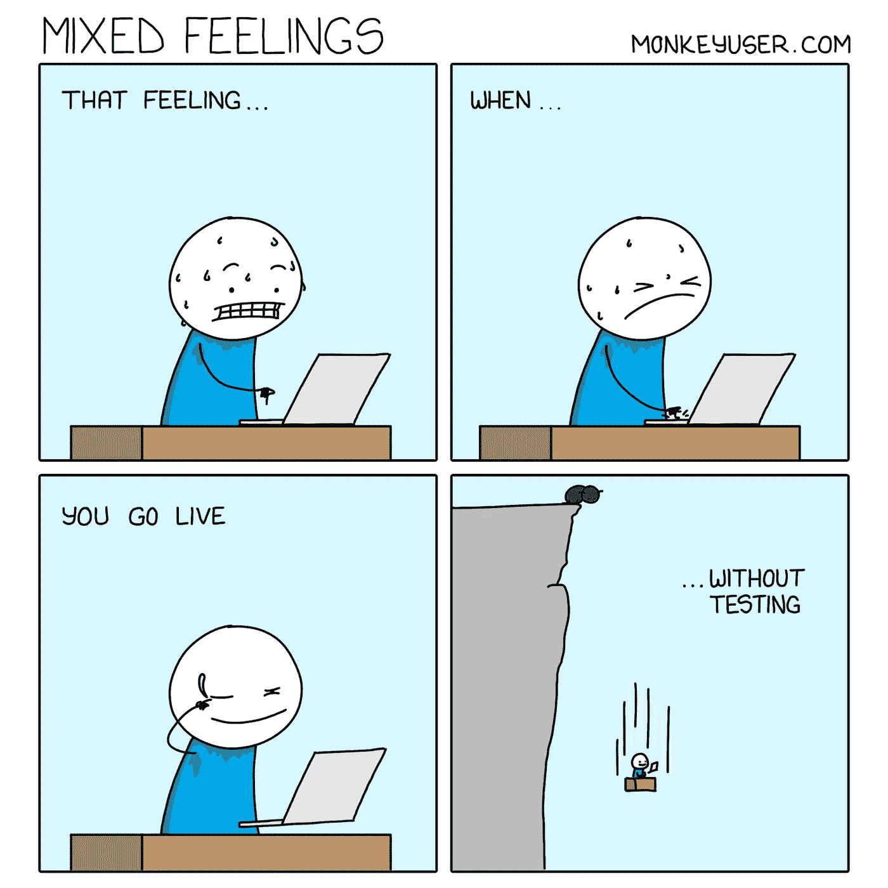

Picture Credit: [https://www.monkeyuser.com/](https://www.monkeyuser.com/)

# 这在我身上发生了很多…它总是藏起来。

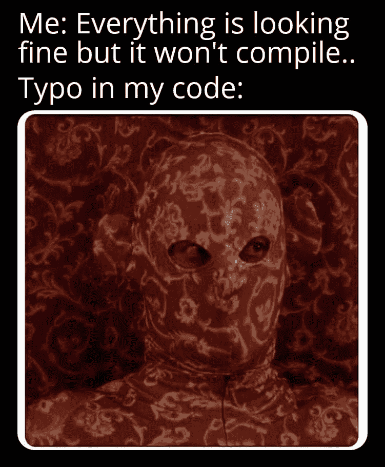

Picture Credit: [https://www.facebook.com/yuva.krishna.memes/photos/a.105527467815845/466010861767502/](https://www.facebook.com/yuva.krishna.memes/photos/a.105527467815845/466010861767502/)

# 指针…你还记得 C 语言吗？

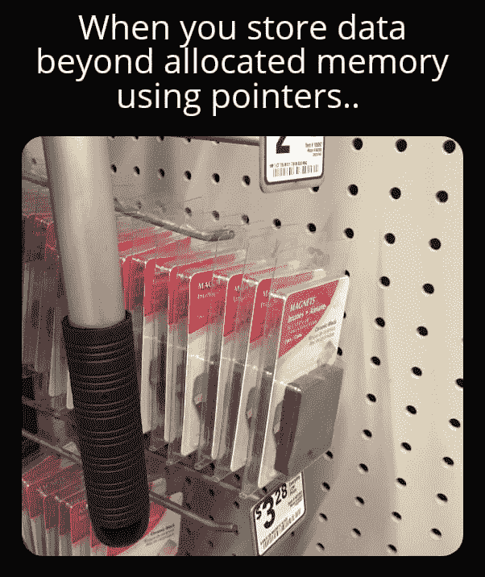

Picture Credit: [https://www.facebook.com/yuva.krishna.memes/](https://www.facebook.com/yuva.krishna.memes/photos/a.105527467815845/466010861767502/)

# 那种感觉，当你的构建失败时…

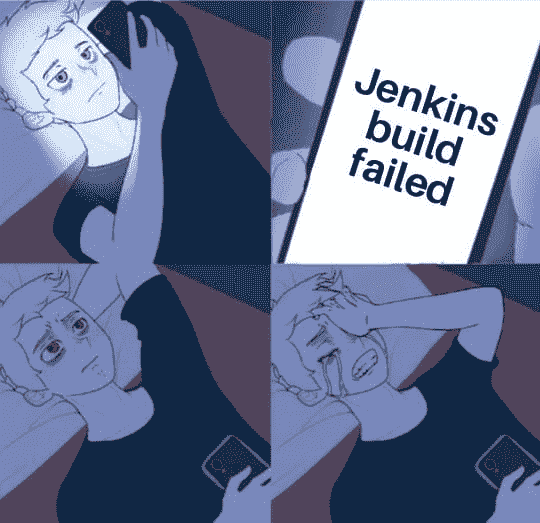

Picture Credit: [https://www.facebook.com/yuva.krishna.memes/](https://www.facebook.com/yuva.krishna.memes/photos/a.105527467815845/466010861767502/)

# 一旦我们进入舒适区…我会死在这个洞里…

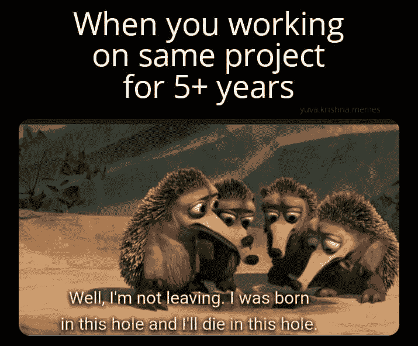

Picture Credit: [https://www.facebook.com/yuva.krishna.memes/](https://www.facebook.com/yuva.krishna.memes/photos/a.105527467815845/466010861767502/)

# 你又回来了吗？

Picture Credit:[https://www.facebook.com/jokesvala](https://www.facebook.com/jokesvala)

# 为什么开发人员要离开公司？

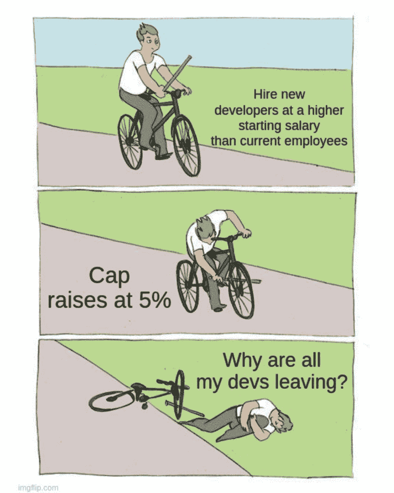

Picture Credit:[https://www.facebook.com/jokesvala](https://www.facebook.com/jokesvala)

# 抱歉，问题无效或被标记为重复…

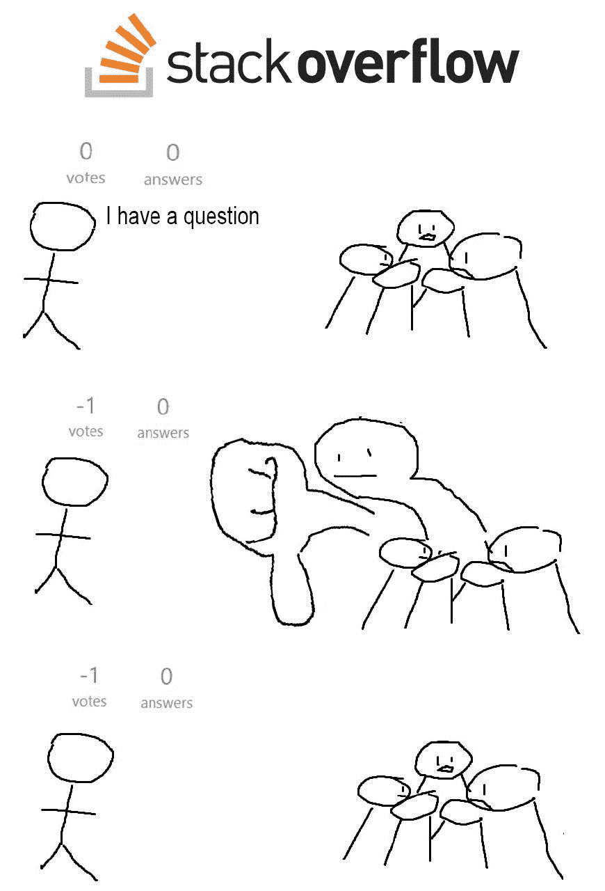

Picture Credit:[https://www.facebook.com/jokesvala](https://www.facebook.com/jokesvala)

# 解决问题后的感受…

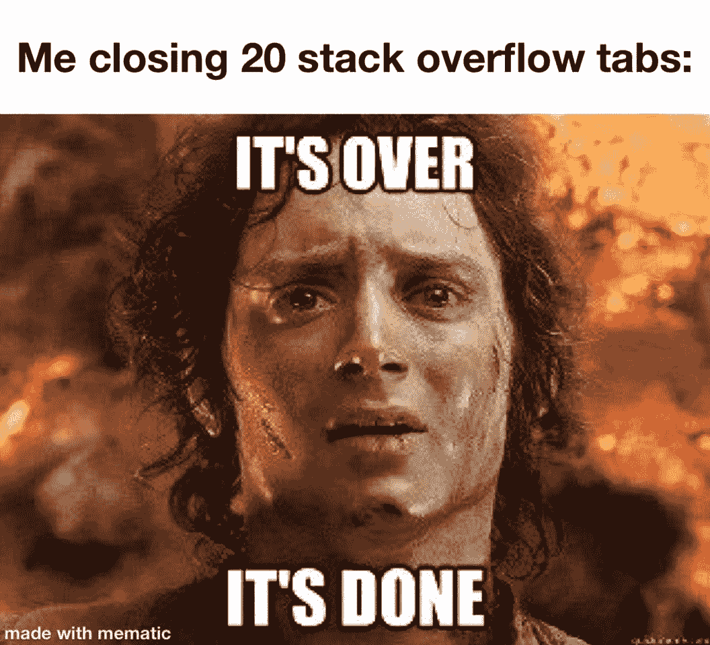

Picture Credit:[https://www.facebook.com/jokesvala](https://www.facebook.com/jokesvala)

# 万一发生火灾…

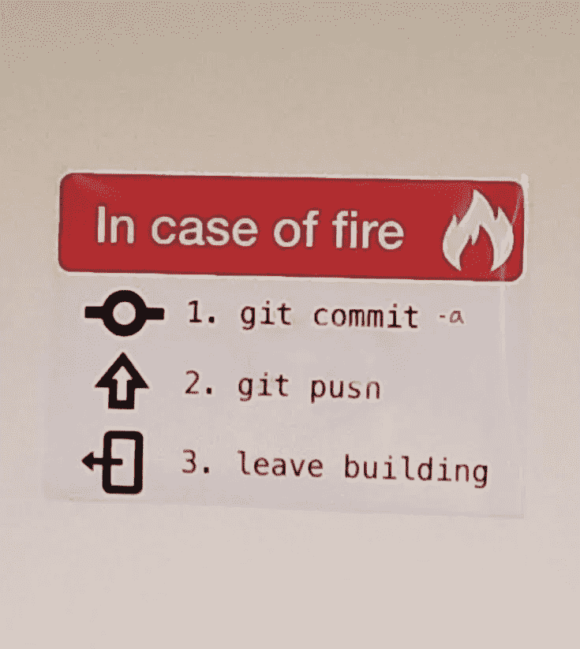

Picture Credit:[https://programmerhumor.io/](https://programmerhumor.io/page/3/)

# 是真的…

Picture Credit:[https://programmerhumor.io/](https://programmerhumor.io/page/3/)

# 那么错误是什么呢？情绪浏览器…

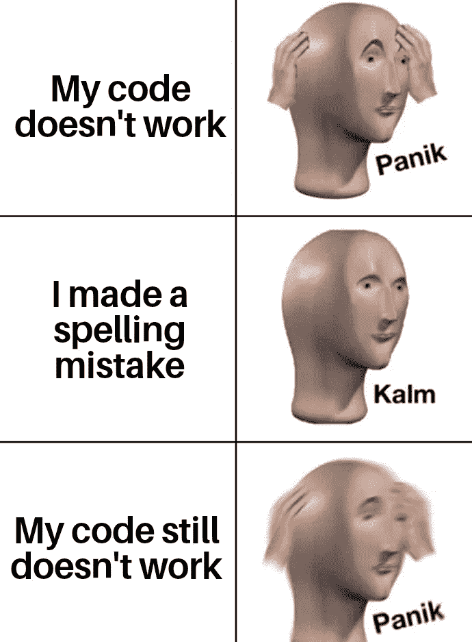

Picture Credit:[https://programmerhumor.io/](https://programmerhumor.io/page/3/)

# 你的语言能做到这一点吗？

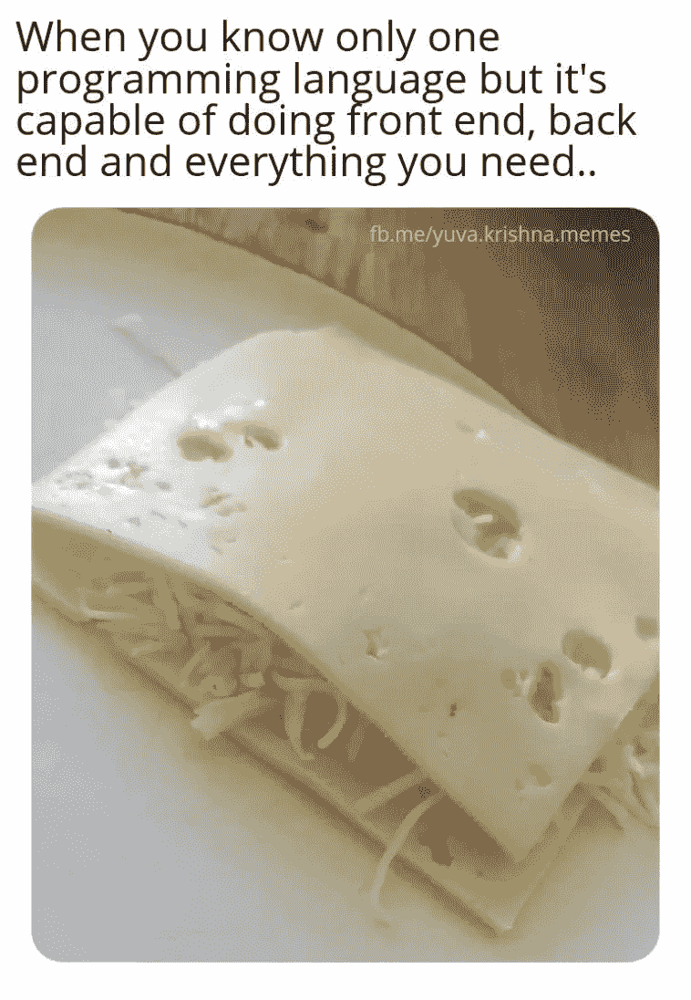

Picture Credit:[https://programmerhumor.io/](https://programmerhumor.io/page/3/)

# 额外的笑声剂量

# 展示自己的作品总是更好… LOL

[https://www.facebook.com/DZoneInc/photos/a.336758034711/10159513354989712](https://www.facebook.com/DZoneInc/photos/a.336758034711/10159513354989712)

# 发生了很多次…我总是去不同的页面…

[https://www.facebook.com/DZoneInc/photos/a.336758034711/10159513354989712](https://www.facebook.com/DZoneInc/photos/a.336758034711/10159513354989712)

# 为什么编译器不够智能，无法自动修复所有问题？

[https://www.facebook.com/DZoneInc/photos/a.336758034711/10159505422369712/](https://www.facebook.com/DZoneInc/photos/a.336758034711/10159505422369712/)

# 看起来很管用…那应该够了…哈哈…

[https://www.facebook.com/DZoneInc/photos/a.336758034711/10159501229644712/](https://www.facebook.com/DZoneInc/photos/a.336758034711/10159501229644712/)

# 我们周一继续吧…

[https://www.facebook.com/photo?fbid=2965577677092733&set=gm.2875612219372995](https://www.facebook.com/photo?fbid=2965577677092733&set=gm.2875612219372995)

# 时间是可以定义的，程序员

[https://www.facebook.com/photo?fbid=352070916544458&set=gm.2875632262704324](https://www.facebook.com/photo?fbid=352070916544458&set=gm.2875632262704324)

# 你身后藏着可怕的东西…

[https://www.facebook.com/DZoneInc/photos/10159479172079712](https://www.facebook.com/DZoneInc/photos/10159479172079712)

# 那种和平是无法想象的…

[https://www.facebook.com/javascriptJS/photos/a.1387402908063976/2251831714954420/](https://www.facebook.com/javascriptJS/photos/a.1387402908063976/2251831714954420/)

# 在家工作…饼图…老实说，不是真的…

[https://www.facebook.com/yuva.krishna.memes](https://www.facebook.com/yuva.krishna.memes)

# 开发与质量保证版本…

[https://www.monkeyuser.com/2018/happy-flow/?sc=true&dir=random](https://www.monkeyuser.com/2018/happy-flow/?sc=true&dir=random)

# 当任务管理器有责任关闭没有响应的东西时…

[https://www.facebook.com/photo?fbid=10159630257979673&set=gm.2870233513227290](https://www.facebook.com/photo?fbid=10159630257979673&set=gm.2870233513227290)

*更多内容看* [***说白了。报名参加我们的***](http://plainenglish.io/) **[***免费每周简讯点击这里***](http://newsletter.plainenglish.io/) ***。*****