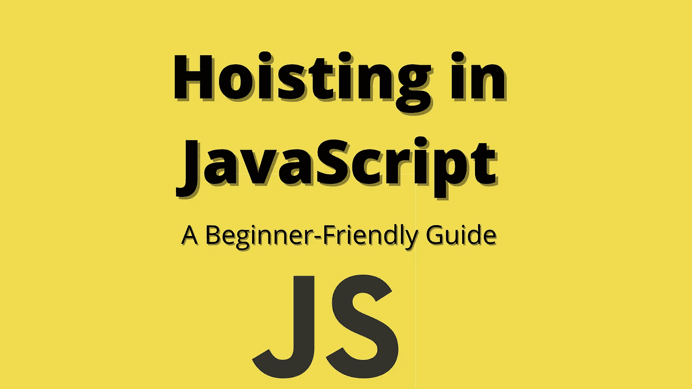

# JavaScript 提升解释:初学者友好指南

> 原文：<https://javascript.plainenglish.io/hoisting-in-javascript-40413882dde7?source=collection_archive---------19----------------------->



> 提升是一种 JavaScript 机制，在代码执行之前，变量和函数声明被移动到它们作用域的顶部。

这意味着无论我们在哪里声明我们的变量，函数，甚至类，它都会被移动到它们作用域的顶部，无论是全局作用域还是局部作用域。请注意，JavaScript 引擎并没有在物理上移动我们的代码，我们的代码停留在我们输入它的地方。让我们用例子来探讨提升:

*   **可变吊装**

JavaScript 引擎将变量声明移动到作用域的顶部。考虑下面的例子:

```
console.log(product); // undefined
var product = “coffee”;
```

在这里，我们甚至在声明变量`product`之前就访问了它，我们得到了`undefined`，这是因为**执行上下文**在 JavaScript 中的工作方式。当我们运行一个程序时，JavaScript 引擎浏览代码，甚至在代码执行之前就用`undefied`初始化变量(用`var`声明)。你可以在我的另一篇博客 [JavaScript 执行上下文](https://theprakashkumar.medium.com/javascript-execution-context-8c62cf88c32a)中读到更多关于执行上下文的内容。

回到例子，由于变量已经用`undefined`初始化，我们的代码就像解释器一样:

```
var product;
console.log(product); // undefined
product = "coffee";
```

**字母关键词**

考虑以下用`let`关键字声明变量的代码:

```
console.log(product); 
let product = "coffee";
```

上面的代码会给出以下错误:

```
ReferenceError: Cannot access 'product' before initialization
```

错误信息说明`product`变量已经在内存中。JavaScript 引擎提升使用`let`关键字的变量声明，但是它不像在`var`的情况下那样用`undefined`初始化这些变量。注意，如果您访问一个不存在的变量，JavaScript 将抛出一个不同的错误:

```
console.log(price); // ReferenceError: price is not defined
let product = "coffee";
```

请注意，由于时间死区(TDZ)，当我们试图在初始化之前获取值时，我们只会得到一个引用错误，如果变量已经初始化，我们仍然会得到`undefined`，因为如果 JavaScript 引擎仍然无法在声明它们的行中找到`let`或`const`变量的值，它将为它们分配值`undefined`或返回一个错误(对于`const`，见下文):

```
let product;
console.log(product); // undefined
product = "coffee";
```

**常量关键字**

`const`的行为很像`let`而不是输出`undefined`，它会通过参考误差:

```
console.log(product); // ReferenceError: Cannot access 'product' before initialization
const product = coffee;
```

如上所述，如果 JavaScript 引擎没有获得用`const`声明的变量的值，它将给出一个错误:

```
const product;// SyntaxError: Missing initializer in const declaration
const product = "coffee";
```

*   **功能提升**

正如我们之前讨论的那样，在变量 JavaScript 引擎使用`undefined`初始化的情况下，但是在函数声明的情况下，执行上下文在代码执行之前存储整个函数。

**功能声明**

函数声明被提升到顶部。考虑下面的例子:

```
getCaffeinated(); // Latte
functin getCaffeinated () {
    console.log("Latte");
};
```

在这里，我们能够在声明之前调用函数，因为执行上下文在代码执行之前存储了整个函数。

**函数表达式**

函数表达式不被提升:

```
getCaffeinated(); // TypeError: getCaffeinated is not a function
var getCaffeinated = function () {
    console.log("Latte");
}
```

在这种情况下，我们无法调用该函数，因为在全局执行上下文的创建阶段，JavaScript 引擎会在内存中创建`getCaffeinated`变量，并使用`undefined`对其进行初始化，因此当我们运行上述程序时，调用的`getCaffeinated`不是函数，因此会出现类型错误。

请注意，在箭头函数的情况下，JavaScript 引擎也会抛出与函数表达式相同的错误，因为箭头函数只是定义函数表达式的语法糖。

这是用 JavaScript 写的。非常感谢你花时间阅读这篇博客。👊🏻再见！

*更多内容请看**[***说白了。*** *报名参加我们的*](http://plainenglish.io/)*[***免费每周简讯这里***](http://newsletter.plainenglish.io/) ***。*****