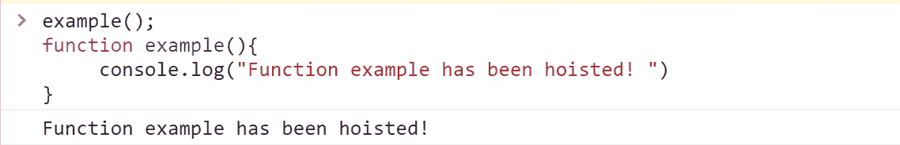

# 理解 JavaScript 中的提升

> 原文：<https://javascript.plainenglish.io/hoisting-in-javascript-4db1f9a9544b?source=collection_archive---------16----------------------->


Photo by [Arnold Francisca](https://unsplash.com/@clark_fransa?utm_source=medium&utm_medium=referral) on [Unsplash](https://unsplash.com?utm_source=medium&utm_medium=referral)

JavaScript 中的提升是一个概念，在执行之前，将所有变量声明和函数声明移动到当前范围内脚本的顶部。

简单地说，提升允许人们在声明变量和函数之前就使用它们和调用它们。对于初学者来说，理解这个概念是绝对必要的。如果不理解，这可能会在您的代码中导致不必要的错误！

**注意**:只提升声明，不提升初始化。

在这篇文章中，我将写提升是如何为函数工作的。我已经在我的文章[*var，let 和 const 的区别*](https://medium.com/nerd-for-tech/difference-between-var-let-and-const-7aec1b81da2) 中写了提升如何影响 var，let 和 const 的用法。

因此，我将不会进入相同的细节。然而，总结如下:

1.  **var:** 只有变量声明被提升到它们当前作用域的顶部，并被赋予一个未定义的值。在声明之前使用它们只会返回 undefined。
2.  let 和 const: 它们也是被提升的，但是与 var 不同，它们没有用任何值初始化。在声明之前使用它们会引发引用错误。

# **带功能吊装**

在 JavaScript 中，我们甚至可以在声明或定义一个函数之前就调用它，而且它运行起来没有任何错误！用另一种编程语言做同样的事情会导致你的代码错误百出！这都是因为吊装。

JavaScript 中的函数可以分为函数声明和函数表达式。两者的提升方式不同。

## **功能声明**

函数声明被提升到全局作用域或包含它的函数的顶部。

示例:

```
example();
function example(){
     console.log(“Function example has been hoisted! ”)
}
```

输出:



## **函数表达式**

JavaScript 中的函数表达式是明确分配给变量的函数。它们具有以下语法:

```
var name= function[name](param1,param2,..){  //here name is optional
      //some code
};
```

函数表达式不被提升。

考虑下面的例子:

```
var addition = sum()
var n1 = 4;
var n2 = 5;
var sum = function(n1,n2){
   return n1+n2;
};
```

输出:


从上面的输出中我们可以看到，我们得到一个错误“TypeError: sum 不是一个函数”。在函数表达式中，这些函数在运行时被赋给变量。但是这里的“sum”是一个变量，因此被提升并被赋值为 undefined。因此，在运行时，sum 已经有了一个未定义的值，因此我们得到错误消息，它不是一个函数。如果将它与 let 一起使用，错误将是“ReferenceError: sum 未定义”。

# **结论**

提升可能会在我们的代码中导致不良影响，为了避免这种情况，最好的做法是在脚本的顶部声明所有变量。对于变量，最好用 let 和 const 代替 var。

## 参考

[](https://developer.mozilla.org/en-US/docs/Glossary/Hoisting) [## 提升- MDN 网络文档词汇表:网络相关术语的定义

### 提升是一个术语，在 ECMAScript 2015 Language 之前的任何规范文章中都找不到使用…

developer.mozilla.org](https://developer.mozilla.org/en-US/docs/Glossary/Hoisting) 

*更内容于* [*通俗地说就是*](http://plainenglish.io/)