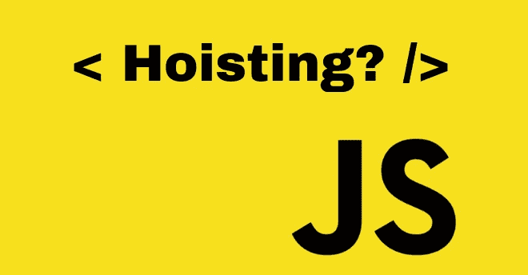

# 在 JavaScript 中提升

> 原文：<https://javascript.plainenglish.io/hoisting-in-javascript-59c4279438db?source=collection_archive---------7----------------------->

我参加奖学金项目已经有一段时间了，最近我偶然发现了这个神奇的吊装概念！在这篇文章中，我将以最简单的方式向你详细解释不同情况下的吊装。所以，喝杯咖啡，带上你的笔记本电脑，让我们一起深入起重的世界吧！



让我们从一个基本的例子开始。我需要声明、初始化并打印一个变量。我是这样做的:

```
var x;
x = 7;
console.log(`Variable x has a value ${x}`);
```

现在，当我运行上面的代码片段时，我得到的输出如下:

> 变量 x 的值是 7

但是如果我改变我写上面代码的方式呢？现在我将编写这样的代码:

```
x=7;
console.log(`Variable x still has a value ${x}`);
var x;
```

我又得到了输出。没有任何错误！

> 变量 x 的值仍然是 7

刚才发生的现象被称为提升。很酷，不是吗？

以典型的形式定义提升，它是 JavaScript 的**行为**(**不是特性**而是行为)，其中 JavaScript 将所有声明移动到当前作用域的顶部。也就是说，无论你在哪里声明变量，你仍然可以在程序的任何地方访问它的值——甚至在声明之前！

我想强调一下术语“**变量声明**”。变量初始化不被提升，但声明被提升。让我们看一个同样的例子:

```
var x;
console.log(`Variable x has a value ${x}`);
x=7;
```

现在，我没有得到正确的 x 值作为我的答案。相反，我得到了“未定义”。

> 变量 x 的值未定义

在这里，我声明了变量，并在使用后初始化它，但在示例 2 中，我在使用前初始化它，在使用后声明它。因此，只有声明被提升，初始化没有被提升。JavaScript 在执行前扫描代码中的变量声明。因此，我们得到了我们使用的变量的值。

干得好！现在，让我们理解提升是如何作用于变量、函数等等的，因为并不是 JavaScript 中的所有东西都是提升的。

# 1.函数声明

这里，我们讨论的是 JavaScript 中的简单函数，而不是函数表达式或箭头函数。**函数声明被提升，它们的初始值是函数的初始值。**让我们看一个例子:

```
console.log(add(5, 7));
function add(i, j) {
    return i + j;
}
```

> **输出** → 12
> 
> **原因:**在这里，我甚至在声明函数之前就调用了它，并且得到了没有任何错误的输出。因此，函数声明被挂起。

# 2.“var”关键字

正如我们在第二个例子中看到的，我们甚至可以在声明之前使用 **x** 的值。**因此，用 var 关键字声明的变量(也称为 var 变量)被提升**。初始值→未定义(如果初始化是在使用之后)。因此，如果变量在变量声明之前没有初始化，var 变量将被提升为初始值 undefined。

例如:

```
console.log(`My Github username is ${me}`);
var me = "Tanmayee-07";
```

> **输出** →我的 Github 用户名未定义
> 
> **原因:**变量“me”被提升了，但由于它在使用后进行了初始化，所以它被初始化为值“undefined”，因为我们知道“声明被提升，初始化没有被提升！”

# 3.Let 和 const 关键字

**用“let”和“const”声明的变量不被提升。**记住这一点很重要，因为很多人可能认为 let 和 const 就像 var 一样被提升，因为这三者都只用于声明变量。但是，它们是**现代 JavaScript**(ES6 版本后的 JS)的一部分，它们没有被挂起！

```
console.log(me);
console.log(blogName);
let me = "Tanmayee";
const blogName = "hoisting";
```

> **输出** →未捕获引用错误:初始化前无法访问‘me’；**原因** → let 和 const 变量没有被提升。所以，我不能在声明前访问它们。

# 4.函数表达式和箭头函数

它们的提升取决于用来声明它们的关键字。如前所述，带有 **let** 和 **const** 的变量不被提升，而带有 **var** 的变量被提升。因此，如果我用“var”关键字声明一个函数表达式/箭头函数，**它们将被提升，但将有一个未定义的初始值。**另一方面，如果我用“let”或“const”关键字声明一个函数表达式/箭头函数，它们不会被提升。让我们用例子来理解这一点。

## 函数表达式示例:

**a .用“var”关键字**

```
console.log(add(3, 5));
var add = function(i, j) {
    return i + j;
};
```

> **输出** →未捕获类型错误:添加不是一个函数
> 
> **原因** →是的，我的函数被提升了，但是输出并不像预期的那样是 8，因为 var 的初始值是 undefined。因此，函数被提升了，但是它的值是 undefined，我们试图在第一行调用" undefined ",这是不可能的！

**b .用“让”关键字**

```
console.log(addFuncExp(4, 5));
let addFuncExp = function(i, j) {
    return i + j;
};
```

> **输出** →初始化前无法访问‘addfuncepx’
> 
> **原因** → let 未吊起。

**c .用“const”关键字**

```
console.log(add(1, 6));
const add = function(i, j) {
    return i + j;
};
```

> **输出** → script.js:2 未捕获的引用错误:初始化前无法访问“add”
> 
> **原因:** const 未吊起。

## 箭头函数示例:

**a .带“var”的**

```
console.log(addArrowFunc(3, 6));
var addArrowFunc = (i, j) => {
    return i + j;
};
```

> **输出** →未捕获类型错误:addArrowFunc 不是函数
> 
> **原因** →用初始值“未定义”吊起。

**b .用“让”**

```
console.log(add(3, 5));
let add = (i, j) => {
    return i + j;
};
```

> **输出** →初始化前无法访问“添加”
> 
> **原因** → let 未吊起。

**c .用“const”**

```
console.log(add(3, 5));
const add = (i, j) => {
      return i + j;
};
```

> **输出** →初始化前无法访问“添加”
> 
> **原因** → const 未吊装。

## 结论

就这样了！这一切都是关于提升和隐藏在下面的概念。我希望这篇文章足够有用。谢谢你的阅读。