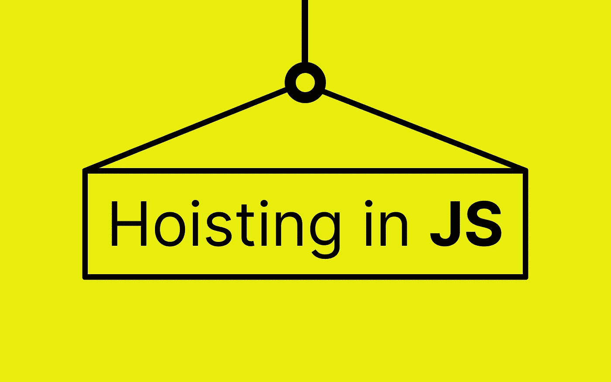
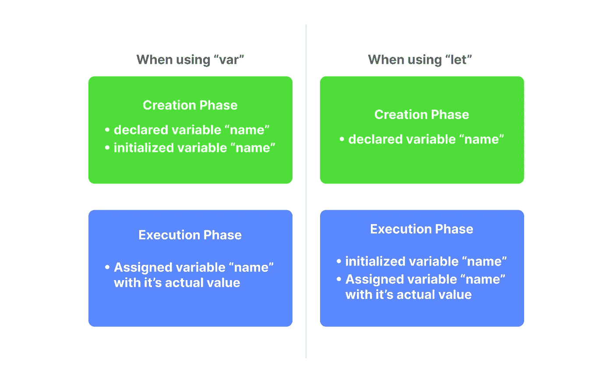

# JavaScript 中的提升:简要而全面的指南

> 原文：<https://javascript.plainenglish.io/hoisting-in-javascript-a-brief-but-comprehensive-guide-4da5e48ab435?source=collection_archive---------5----------------------->



在我解释什么是提升之前，我强烈建议你去看一下我在这个系列的[上一篇](/javascript-execution-context-behind-the-scenes-1463a0ef3dd8)关于 JavaScript 执行上下文的文章，我也将在这篇文章中**简单地**介绍一下。提升与 JavaScript 如何在幕后执行有很大关系，我已经用非常简单的术语解释了它，并在那篇文章中提供了可视化示例，所以请务必查看。

> *我也有一个单独的视频。你可以在这里看*[](https://youtu.be/nnCykighqxI)**。**

## *执行环境:简要回顾*

*每当您在浏览器上运行 JavaScript 文件时，都会创建一个执行上下文。执行上下文只是为当前正在执行的代码块创建的环境。因此，在运行文件时，最初会为整个文件创建一个“**全局执行上下文”**。当 JS 引擎遍历文件并遇到一个函数时，会创建一个单独的**函数执行上下文**。这些上下文中的代码基本上分两个阶段执行。一个“**创建阶段”**和一个“**执行阶段**”。*

*在创建阶段，变量和函数声明首先存储在内存**中，而**没有用它们的实际值初始化。变量改为用名为“**未定义**”的值初始化。在函数的情况下，它们在内存中被原样复制。*

*在执行阶段，变量被赋予它们的原始值，然后脚本被逐行执行。在函数的情况下，如上所述，将创建一个**单独的执行上下文**，其再次经历相同的创建- >执行阶段。*

*同样，为了更清楚地了解这到底是如何工作的，一步一步地举例，去阅读这个播放列表中的[上一篇文章](/javascript-execution-context-behind-the-scenes-1463a0ef3dd8)。*

## *什么是吊装？*

*提升这个词的字面意思是举起或举起某物。在 JavaScript 的上下文中，提升意味着提高或提升变量/函数声明(实际上不是)。让我们看一个简单的例子。*

```
*1\. console.log(name)
2\. var name = "James";
3\. 
4\. getName();
5\. function getName(){
6\.    console.log("My name is " + name)
7\. }*
```

*对于以前使用过编译编程语言的人来说，这可能有点奇怪。在声明变量“ **name”之前，**我们在第一行访问它。类似地，我们在创建函数" **getName"** 之前，在第 4 行调用了它。您可能认为这将抛出一个错误，但它的工作(有点)没有任何错误。这是输出的样子*

```
*undefined
My name is James*
```

*如前所述，javascript 文件通常分两个阶段执行，即创建和执行阶段。在执行之前，变量和函数被分配内存。变量用值“**未定义**初始化，函数直接存储在内存中。因此，在执行第 1 行的 **console.log** 之前，Javascript 引擎已经扫描了整个文件，并用“ **undefined** ”初始化了变量。*

*这个甚至在变量和函数执行之前就给它们分配内存的过程叫做**提升**。*

*当我们执行 getName 函数时，它的声明已经在内存中了，并且在函数之前初始化的 Name 变量在函数内部是可访问的，所以它像预期的那样工作。*

## *怪癖*

## ***1。让** vs **var***

*好的，如果你认为你已经理解了提升是如何工作的，让我们来测试一下。您能预测以下代码的输出吗？*

```
*1\. console.log(name)
2\. let name = "James";
3\. 
4\. getName();
5\. function getName(){
6\.    console.log("My name is " + name)
7\. }*
```

*这里唯一不同的是，我们使用了" **let"** 来声明名称变量，而不是" **var** "。不幸的是，这种微小的变化会导致错误。*

```
*ReferenceError: Cannot access 'name' before initialization*
```

*这是因为“**让**处理**变量初始化**与“**变量初始化**”不同。
当使用" **var** "时，变量声明&初始化发生在创建阶段本身，随后在执行阶段，它被赋予其原始值。
在“ **let** 的情况下，只有变量声明发生在创建阶段。它的初始化发生在执行阶段。因此，当我们试图在执行阶段访问该变量时，它只是被声明了，还没有初始化，因此出现了引用错误。*

**

*Difference between let and var declarations*

## *2.函数表达式*

*尝试预测下面这段代码的输出。*

```
*1\. console.log(name)
2\. var name = "James";
3\. 
4\. getName();
5\. var getName = function(){
6\.    console.log("My name is " + name)
7\. }*
```

*这里唯一的区别是，我们已经使用函数表达式声明了函数 getName。这会给我们带来下面的错误。*

```
*TypeError: getName is not a function*
```

*如果你对提升有正确的理解，你一定知道为什么会这样。当我们用 var 声明一个函数的时候，JS 引擎**把它提升为一个变量**。所以当它在执行阶段执行 getName 函数时，它的内存中没有 getName 函数。它有一个 getName 变量。这就是它给我们一个类型错误的原因，说 getName 不是函数。*

## *关键要点*

*   *JavaScript **并不真正**提升或举起它的变量声明。*
*   *let & const 在创建阶段被**声明**，在执行阶段被**初始化+赋值**。*
*   *var 在创建阶段被**声明+初始化**，在执行阶段被**赋值**。*
*   *始终在作用域的顶部声明变量和函数，以避免不良行为。*
*   *最好使用 const 来避免由于意外的可变性而引起的混乱*
*   *在你想改变变量的情况下，使用 let over var。*

*希望这能清楚 JS 是如何在幕后执行的。我正在将多个高级 Javascript 概念整理成一系列文章。关注我，了解最新动态。欢迎在评论区分享你的见解或疑问。你可以通过我的社交网站与我联系，如下所述。干杯！*

*[LinkedIn](https://www.linkedin.com/in/akilesh-rao-610357137/)
[Twitter](https://twitter.com/themangalorian)
[Github](https://github.com/AkileshRao)*

**更多内容请看*[***plain English . io***](http://plainenglish.io/)*