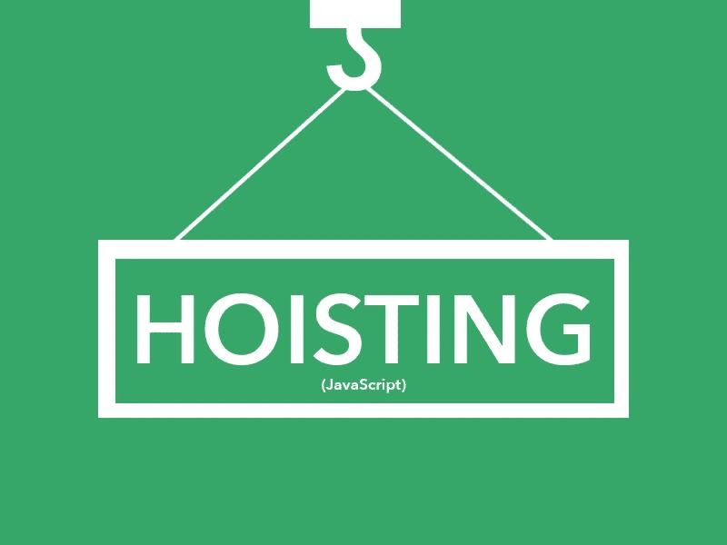
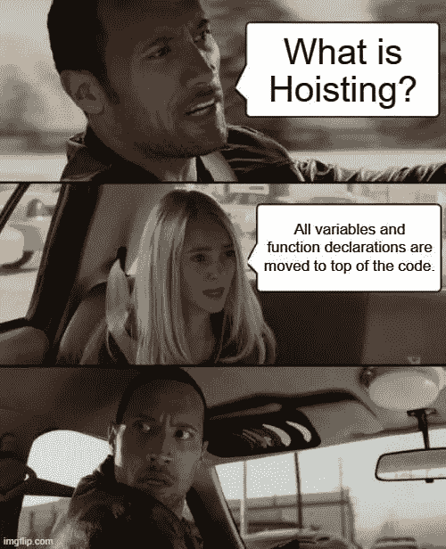
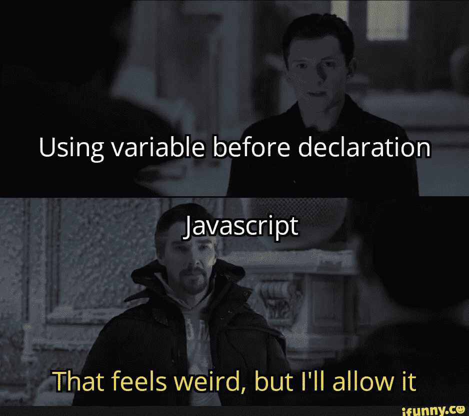

# 深度提升 JavaScript

> 原文：<https://javascript.plainenglish.io/hoisting-in-javascript-a0320bb42921?source=collection_archive---------7----------------------->

## 深入探究 JavaScript 中的提升。

这在 JavaScript 中是一个典型的棘手概念。提升是一种 JavaScript 机制，在代码执行之前，变量和函数声明被移动到它们作用域的顶部。这意味着无论在哪里声明函数和变量，无论它们的作用域是全局的还是局部的，它们都被移动到作用域的顶部。但是，这种机制只移动声明。作业留在原处。

让我们在下面更详细地讨论这些。



[link](https://www.google.com/url?sa=i&url=https%3A%2F%2Fjavascript.plainenglish.io%2Funderstanding-hoisting-in-javascript-11cb313f2a20&psig=AOvVaw27qohq2XBWy2IwZl4fi7Wj&ust=1640707722863000&source=images&cd=vfe&ved=0CAsQjRxqFwoTCLCBiuGuhPUCFQAAAAAdAAAAABAm)

# 可变提升

```
x = 5;
console.log(x) // 5
var x;
```

> **初始化未被提升**

提升也不会将初始化上移。它们被留在原地。

```
console.log(x) // undefined
x = 5;
console.log(x) // 5
var x;
console.log(x) // 5
```

如果试图在变量初始化之前访问它(定义为`var`的变量)，它将返回 undefined 作为值。

这是`var`和`let`的主要区别，因为`let`定义的变量没有被提升，如果你试图在声明和初始化它们之前访问它，它将返回`ReferenceError`。

你可以在这里了解更多信息:

[](/let-vs-var-what-is-the-actual-difference-5acdb1f1c83) [## let' vs 'var ':实际区别是什么？

### 这里有一个关于 JavaScript 中 let 和 var 之间的区别的快速阅读，可能会派上用场。很高兴…

javascript.plainenglish.io](/let-vs-var-what-is-the-actual-difference-5acdb1f1c83) 

***注意****—JavaScript*`strict mode`*不允许使用未声明的变量。*


[link](https://www.google.com/url?sa=i&url=https%3A%2F%2Fmedium.com%2F%40victoreloy%2Flearn-once-for-all-how-js-hoisting-works-bd69f1579d56&psig=AOvVaw1Kii5Syjv3F6hGBXfkyLqE&ust=1640710339662000&source=images&cd=vfe&ved=0CAsQjRxqFwoTCJj1_rq4hPUCFQAAAAAdAAAAABAD)

# 功能提升

像变量一样，JavaScript 引擎也提升函数声明。它将函数声明移到脚本的顶部。

```
let x = 20,     
let y = 10;  
let result = add(x,y); console.log(result);  //30function add(a, b)
{ 
  return a + b; 
}
```

在执行上下文的创建阶段，JavaScript 引擎将`add()`函数声明放在堆内存中。准确地说，JavaScript 引擎创建了一个`[Function](https://www.javascripttutorial.net/javascript-function-type/)`类型的对象和一个引用 function 对象的函数引用`add`。[ [链接](https://www.javascripttutorial.net/javascript-hoisting/)

**注意**——你要记住箭头函数和函数表达式是不吊的。

```
//OUTPUT - "TypeError: add is not a functionlet x = 20,     
let y = 10;  
let result = add(x,y);console.log(result);var add = function (a, b)
{ 
  return a + b; 
}
```

在全局执行上下文的创建阶段，JavaScript 引擎在内存中创建`add`变量，并将其值初始化为`undefined`(就像变量一样)。这个`add`变量只在全局执行上下文的执行阶段被分配给一个匿名函数。如下所示，箭头方法也会发生同样的行为。

```
//OUTPUT - "TypeError: add is not a functionlet x = 20,     
let y = 10;  
let result = add(x,y);console.log(result);var add = (x, y) => x + y;
```

# 优先顺序

1.  变量赋值优先于函数声明
2.  函数声明优先于变量声明

*函数声明挂在变量声明之上，但不挂在变量赋值之上。*

让我们看看这意味着什么。

> **函数声明上的变量赋值**

```
var square = 10;function square(num) {
  return (num*num);
}console.log(typeof square); // Output: number
```

> **函数声明优先于变量声明**

```
var square;function square(num) {
  return (num*num);
}console.log(typeof square); // Output: function
```



[link](https://www.google.com/url?sa=i&url=https%3A%2F%2Fdev.to%2Fnaveenchandar%2Fjavascript-hoisting-2pde&psig=AOvVaw27qohq2XBWy2IwZl4fi7Wj&ust=1640707722863000&source=images&cd=vfe&ved=0CAsQjRxqFwoTCLCBiuGuhPUCFQAAAAAdAAAAABAa)

# 分级提升

这和函数提升很像。类声明被提升，但它们在求值之前保持未初始化状态。这实际上意味着，在使用一个类之前，必须先声明它。

```
var james= new User();
james.name = "James Bond";
james.age = 35;
console.log(james); // Output: ReferenceError: User is not defined

class User {
  constructor(name, age) {
    this.name = name;
    this.age = age;
  }
}
```

因此，就类声明而言，要访问类声明，必须先声明。

***注意****——很像它们的函数对应，类表达式不吊。*

```
var james= new BasicUserInfo();
james.name = "James Bond";
james.age = 35;
console.log(james); // Output: ReferenceError: BasicUserInfo is not defined

var BasicUserInfo = class User {
  constructor(name, age) {
    this.name = name;
    this.age = age;
  }
}ORvar BasicUserInfo = class {
  constructor(name, age) {
    this.name = name;
    this.age = age;
  }
}
```



[link](https://www.google.com/url?sa=i&url=https%3A%2F%2Fifunny.co%2Ftags%2Fhoisting&psig=AOvVaw27qohq2XBWy2IwZl4fi7Wj&ust=1640707722863000&source=images&cd=vfe&ved=0CAsQjRxqFwoTCLCBiuGuhPUCFQAAAAAdAAAAABAV)

# **结论**

在 JavaScript 中进行提升时有很多注意事项，所以总是建议在文件开头声明所有变量，以避免混淆或使用严格模式。

*更多内容看* [*说白了就是*](http://plainenglish.io/) *。报名参加我们的* [*免费每周简讯*](http://newsletter.plainenglish.io/) *。在我们的* [*社区不和谐*](https://discord.gg/GtDtUAvyhW) *获得独家获得写作机会和建议。*