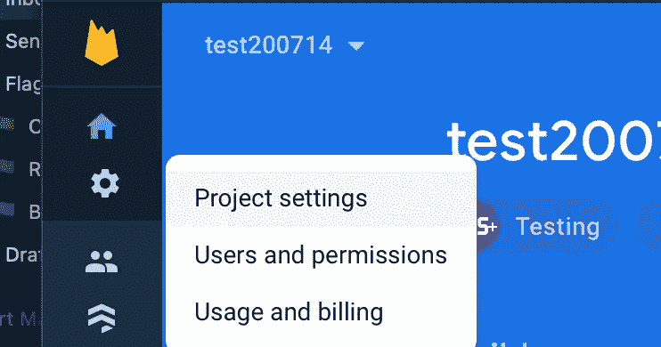

# 如何连接 Firebase v9 进行反应

> 原文：<https://javascript.plainenglish.io/hooking-up-firebase-v9-to-react-be845465f219?source=collection_archive---------4----------------------->

## 随着 Firebase 发布了新的 web 模块化版本 9，将 React 连接到 Firebase 变得前所未有的简单。我们将向你展示如何用一个短钩。

Photo by [Joshua Sortino](https://unsplash.com/@sortino?utm_source=medium&utm_medium=referral) on [Unsplash](https://unsplash.com?utm_source=medium&utm_medium=referral)

为一个应用程序创建一个完整的后端系统，或者仅仅是一个简单的授权，有时会让人力不从心。尤其是如果你像我一样，刚刚开始涉足后端开发的海洋。这就是为什么我的首选之一是 [Firebase](https://firebase.google.com) 。

Firebase 以前被它的尺寸所拖累，增加了相当多的构建和渲染时间。在版本 9 中，Firebase 引入了一个模块化选项来导入和使用 Firebase 提供的不同服务，如授权、firestore 和实时数据库。

在第一篇文章中，我将向你展示如何在你的 React 应用中初始化 Firebase，在下一篇文章中，我将向你展示如何导入包并在你的应用中使用它们。

因此，让我们来看看如何将 Firebase v 9 连接到 React 应用程序。

# 创建新的 React 应用程序(可选)

假设您还没有启动并运行 React 项目，启动新项目的最简单方法是在命令行中运行`npx create-react-app firebase-app`，等待初始化完成，然后通过运行`cd firebase-app`导航到 React 应用程序的新文件夹。

我们还需要安装我们的依赖项。我们将使用 [Firebase NPM 模块](https://www.npmjs.com/package/firebase)连接到我们的 Firebase 数据库，使用 [dotenv NPM 模块](https://www.npmjs.com/package/dotenv)存储我们的配置凭证。在`firebase-app`文件夹中，运行`npm install firebase dotenv --save`，等待安装完成。

在这一点上，你可以随意删除任何你不使用的文件，例如`App.test.js`、`reportWebVitals.js`和`setupTests.js`。如果您选择删除这些，请记住也要删除来自`index.js`的导入。

运行`npm start`以确保一切正常，并且您的应用已经启动并运行！

# 设置 dotenv

Cogwheel > Project settings

在项目的根文件夹中创建一个新文件，名为`.env.development`。这是我们将存储配置凭证的地方，在下一步中，我们将使用这些凭证在我们的应用程序中初始化 Firebase。您的配置凭证可以在 Firebase 控制台中找到，单击左侧菜单上的齿轮，选择项目设置，然后向下滚动(几乎)到底部。

将配置凭证添加到 dotenv 文件并不比遵循语法 NAME=VALUE 更复杂。然而，为了让我们的 React 应用程序获取这些环境变量，我们需要给它们加上前缀`REACT_APP_`，如创建 React 应用程序文档中的[所述。请注意，如果您使用不同的环境，则创建 React App(例如 Gatsby)，环境变量的前缀可能会有所不同(例如`GATSBY_`)。](https://create-react-app.dev/docs/adding-custom-environment-variables/)

如果你计划将这个应用程序也用于生产，或者想要测试构建，创建一个相同的文件，仍然在项目的根文件夹中，命名为`.env.production`。在这里，您可以简单地填写与开发完全相同的配置凭证，或者您可以填写一个单独项目的配置凭证。使用另一个项目的配置凭证将允许您将一个数据库用于开发，而将另一个数据库用于生产*。

**检查你正在运行的进程不比在你的应用的返回语句中放入(或*`*console.log*`*-ing)*`*{process.env.NODE_ENV}*`*并运行你的应用更难！*

# 钩子、线和函数

在项目的`src`中，创建两个文件夹:`hooks`和`services`。在`services`文件夹中，创建一个名为`firebase.js`的文件。在`hooks`文件夹中，创建一个名为`useFirebase.js`的文件。

## 火情网

在这个文件中，我们将初始化 Firebase 应用程序。对于 Firebase v9，这并不比从`"firebase/app"`导入`initializeApp`功能更难。从 Firebase 控制台的项目设置中复制`firebaseConfig`对象，并用 dotenv 文件中声明的环境变量替换所有值，例如`process.env.REACT_APP_FIREBASE_APIKEY`。

我们的默认导出将是一个名为`getFirebase`的函数，它将返回给我们一个 Firebase 客户端的实例。我们将在我们的`useFirebase`钩子中使用这个实例。

## useFirebase.js

我们将用`!!`来转换我们的实例。如果您不熟悉 JavaScript 中`!!`的用法，这是[将非布尔值转换为布尔值的方法之一。在我看来是最简单最有型的一款。那么我们为什么要这样做呢？不仅仅是因为看起来很酷，其实是为了安全措施。记住我们的函数`getFirebase`如何返回给我们整个初始化的 Firebase 客户端，如果我们`console.log`返回给我们什么，我们可以看到我们的配置凭证显示在返回的对象中，在`_options`下。对于我们的应用程序的构建版本来说也是如此，这意味着任何安装了](https://developer.mozilla.org/en-US/docs/Web/JavaScript/Reference/Global_Objects/Boolean) [React devtools](https://chrome.google.com/webstore/detail/react-developer-tools/fmkadmapgofadopljbjfkapdkoienihi?hl=en) 的人都可以看到我们的配置凭证，从而访问我们的数据库。如果我们提供一个 boolean，这是一个安全的使用 firebase 的方法。只要站点上有一个连接的 Firebase 客户端，Firebase 本身并不关心您是否有权访问返回的客户端。

# 测试连接

为了使用我们新的`useFirebase`钩子，我们简单地将它导入到我们在`App.js`中的根组件，并将它赋给一个变量，我发现`firebase`非常直观，但是你当然可以随便叫它什么。

如果我们将变量`console.log`赋给`useFirebase`，我们将看到它最初返回`false`，一旦连接建立，返回`true`。我们将向您展示如何将它与其他 Firebase 功能(如 firestore、存储、身份验证等)一起使用。)下一篇。但是现在，我们可以检查钩子是否工作，要么记录它，要么(我更喜欢的方式)在我们的返回语句中把它和[逻辑 AND 操作符](https://www.joshwcomeau.com/operator-lookup?match=logical-and)以及 React 要呈现的内容一起写出来。

值得注意的是，不管我们是否提供了正确的配置凭证，一旦 Firebase 客户端初始化完毕，我们的钩子就会返回 true。我们真正知道我们是否正确连接了应用程序的唯一方法是尝试访问 Firebase，我们将在下一篇文章中向您展示如何做！

*更多内容请看*[***plain English . io***](http://plainenglish.io/)*。报名参加我们的* [***免费每周简讯点击这里***](http://newsletter.plainenglish.io/) ***。***