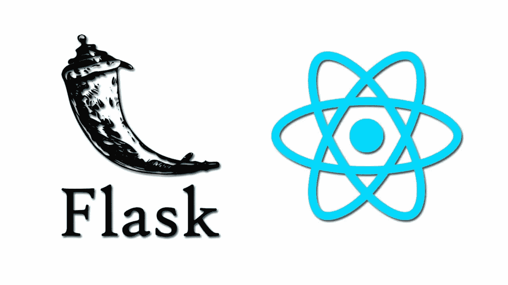

# “挂钩”您的反应前端到您的烧瓶 API

> 原文：<https://javascript.plainenglish.io/hooking-your-react-frontend-to-your-flask-api-fa83b14c9684?source=collection_archive---------0----------------------->



构建一个调用 Flask API 的反应前端非常简单，但是非常强大。您可以访问 Flask 中非常强大的后端，该后端与数据库和存储信息配合良好。

flashboard 是 Python 的一个微框架，它很容易上手，也很容易为一个简单的 CRUD 应用程序设置。flashboard 很容易设置和创建一个小应用程序，但是如果您想扩展您的应用程序，它也很容易扩展。你可以在这里阅读我之前关于在 Flask [中创建 API 的博客帖子。](https://brockbyrdd.medium.com/creating-an-api-with-flask-4431ef2d5d73)

启动一个反应应用程序非常简单，用户友好，如果你正在创建一个单页应用程序，我建议使用`npx create-react-app my-app`，如果你正在寻找更深入的东西，我建议查看[反应文档](https://reactjs.org/docs/create-a-new-react-app.html)。

对于这个博客，我将创建一个小的单页应用程序，通过允许 GET 请求的 fetch 调用来连接到 Flask API。使用`create-react-app`创建您的 React 应用程序后，确保您的 Flask 应用程序已启动并运行，我的 Flask 应用程序将在[上打开 http://localhost:5000。](http://localhost:5000.)

您要做的第一件事是进入您的 package.json 文件，为您的 Flask API 设置一个代理，以避免 CORS 问题，并允许 React 处理提取调用，并将它们代理到正确的服务器。

```
"proxy": "http://localhost:5000"
```

你现在可以去调用你的 Flask API 了。我会在我的 App.js 中调用一个 useEffect 钩子，让我的数据进入顶层。包含我所有数据的路由是[http://localhost:5000/todo，](http://localhost:5000/todos,)所以在我的 useEffect 函数中，我将这样调用“/todo”:

```
useEffect(() => {
  fetch("/todos")
  .then(response => response.json()
  .then(data => {
    console.log(data)
  })
)}, []);
```

这是一个简单的提取调用，我只希望组件先挂载，所以我在函数的末尾添加了一个空数组。然后，我控制台。记录数据，这样我就可以看到我正在处理的数据。这个 fetch 调用返回了一个 todo 数组中包含每个属性的对象，所以我知道当用数据设置我的状态时，我将不得不通过调用`data.todos`进行更深入的研究

我喜欢使用 React 提供给我们的钩子，而不是写出完整的函数，所以我也将在这个应用程序中使用 useState 钩子。如果你想了解更多关于使用钩子的信息，我也写了一篇关于 React 的博客，它正在向使用钩子的方向发展[在这里](https://medium.com/geekculture/react-hooks-and-why-you-should-use-them-ab92ee033e43)。

我将首先从 React 导入 useState 钩子，然后在我的 App 函数组件内部调用它，并将初始状态设置为一个空数组。然后，我将调用 useEffect 中的 setTodos 函数，将 Todos 状态设置为 Flask API 调用的数据。因此，我的完整 App.js 将如下所示:

```
import React, { useEffect, useState } from "react";function App() {
const [todos, setTodos] = useState([]);useEffect(() => {
fetch("/todos").then(response => 
response.json().then(data =>
setTodos(data.todos)
})
);), []};return (
<div className="App">{todos}</div>
```

关于调用 Flask API 的更深入的视频，我推荐查看 Ben Awad 在 YouTube 上的视频[这里](https://www.youtube.com/watch?v=06pWsB_hoD4&t=0s)，他也展示了语义 UI 的一些用法，还展示了向 Flask API 的发布。

## 资源:

本·阿瓦德视频—【https://www.youtube.com/watch?v=06pWsB_hoD4 &t = 0s

react Docs—【https://reactjs.org/docs/create-a-new-react-app.html 