# React 中的挂钩和上下文

> 原文：<https://javascript.plainenglish.io/hooks-context-in-react-1da111da280e?source=collection_archive---------9----------------------->

## 用钩子和上下文构建轻量级组件

React 挂钩和上下文是 React 中的一些基本概念，使用 React 挂钩，我们可以开发更快且易于维护的应用程序。在 ***React 16.8* 但是在 React Hooks 的帮助下，我们可以用几行代码轻松地维护我们组件的状态，因为我们可以制作大规模的 React 应用程序，无论是 React.js 还是 React Native，它都需要使用钩子，因为它以一种漂亮的方式避免了状态管理的复杂性。**

## **为什么要对上下文做出反应？**

如果我们谈论 **React Context** ，它在从多个组件获取数据时开始起作用，并简化 React 组件中的这些获取任务。

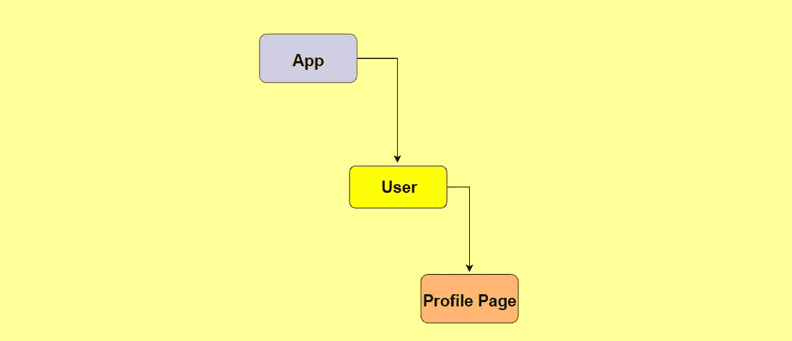

React Context

***例如，*** *假设我们有 3 个组件:*

*   **App:** 每个 React 应用程序中都有的普通 App.js 文件(包含用户的电子邮件)。
*   **用户:**位于 App &档案页面组件之间的组件。
*   **个人资料页面:**在这里我们需要访问用户的电子邮件。

在这个例子中，我们需要在**个人资料页面**组件&中访问用户的电子邮件，为此，我们需要将电子邮件对象传递给用户组件，然后只有我们可以在个人资料页面组件中访问它。这种方法也被称为**道具钻取**，因为我们必须在组件中传递多个道具。但是这种方法会使您的 React 应用程序变慢，并且在不同的情况下会花费更多的时间。

> 为了避免这种性质，我们也有 **Redux** ，但这是我们不打算谈论的东西，因为它需要自己的概念。

## **使用状态挂钩**

在类组件中，我们使用正常的状态管理术语，但是当涉及到功能组件来处理状态时，我们使用 React **钩子。**

在 **useState** 钩子中，有两件事情需要考虑，我们想要为特定动作改变的状态值和负责改变该状态值的函数。

**例如:**

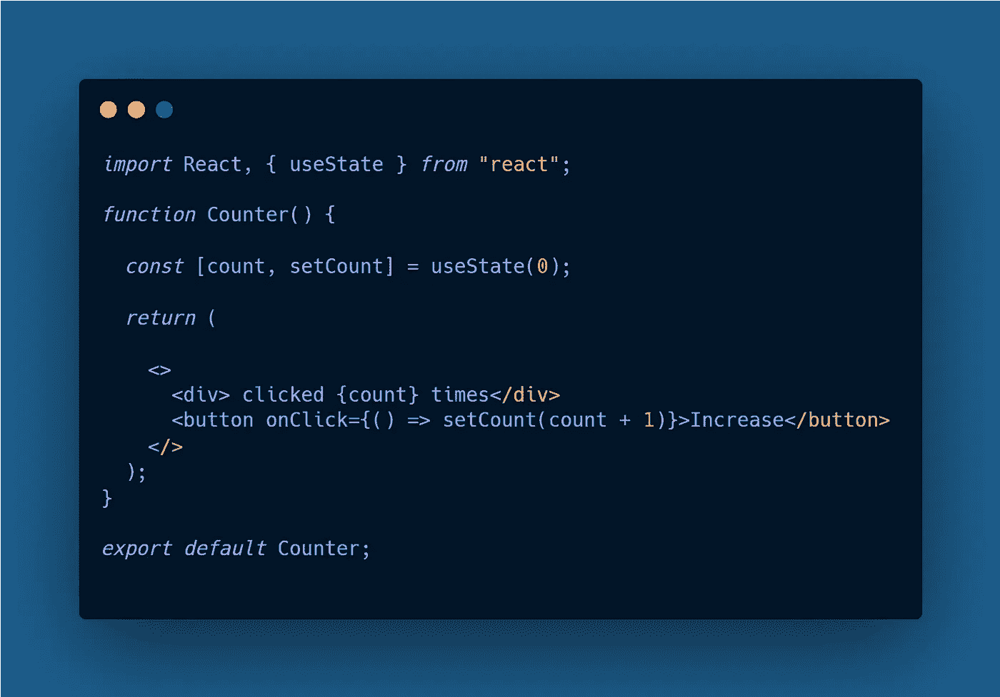

**useState**

*   我们有一个函数组件&使用 useState 钩子我们定义了一个 const 数组( **[count，setCount]** )，我们在 **useState()** 中分配的值与数组中的第一项相关联，这意味着现在 count 的值为 0，因为我们已经定义了 **useState(0)** 。
*   数组中的第二项是负责改变计数值的函数，无论我们在哪里使用 **setCount** 函数，它都可以在每次渲染时改变 count 的值。
*   为了清晰的演示，我在一个 **div** 中添加了**计数**，这样当我们按下使用 **setCount** 函数的按钮时，我们可以看到动态变化。
*   当我们按下按钮时，我们可以很容易地看到计数随着时间的推移而变化，增量为 1。

**useState Result**

## useEffect 挂钩

在类组件中，我们有 3 个生命周期方法**componentidmount()**，**componentiddupdate()**&**componentWillMount()**，当我们使用这些生命周期方法时，我们的逻辑遍布在我们的代码中，我们必须来回管理状态，但是在功能组件中，我们可以使用 **useEffect** 钩子，在那里我们有更干净和最少的实现。

**例如:**

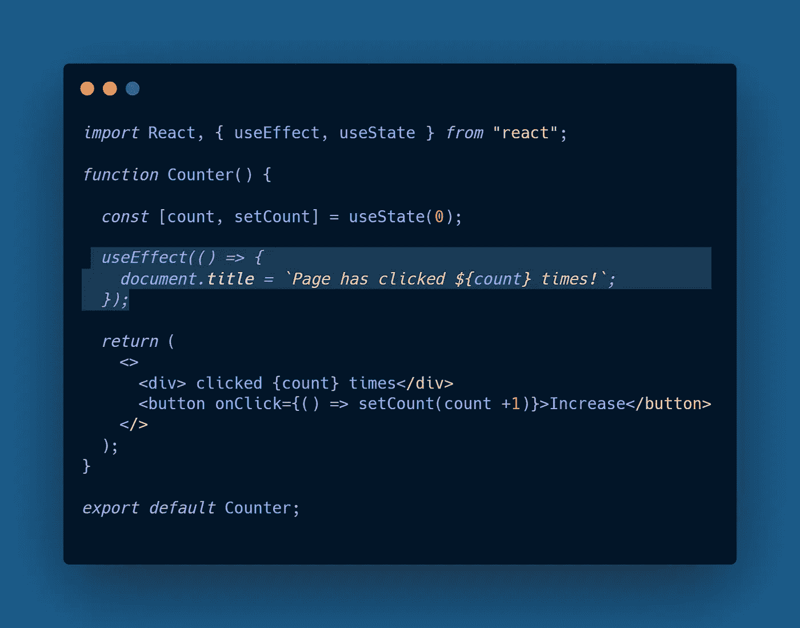

**useEffect**

*   假设我们想在一个特定的动作上改变页面的 **document.title** ，在我们的例子中，每次当我们按下**按钮**时，标题都会改变，并在默认标题中添加 count。
*   为了实现这个特性，我们导入了 ***useEffect*** 钩子，之后我们必须传递一个由 useEffect 钩子要求的 lambda 表达式，在这个表达式中，我们添加了所有我们想要在每次渲染时在网页上实现的更改。
*   现在每次我们按下增加按钮来改变计数值，标题也会在每次渲染时更新。

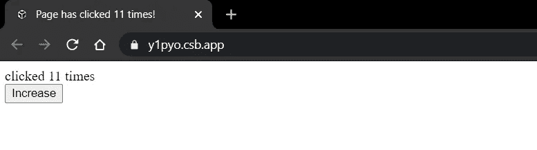

**useEffect Result**

> *在****useEffect****钩子中还有一点我们需要注意，那就是* **依赖关系数组** *，依赖关系数组控制着我们的 use effect 钩子中的更新，如果我们没有在* ***useEffect 函数中传递依赖关系，*** *，那么它就会被跳过，或者我们可以说它就是不会渲染。因此，如果我们需要在 redner 中设置一些条件，我们可以在 useEffect 函数中提供一组依赖项。*

***注意:*** *高亮显示的空数组是我们添加所有依赖项的地方，用于在渲染中设置条件。*

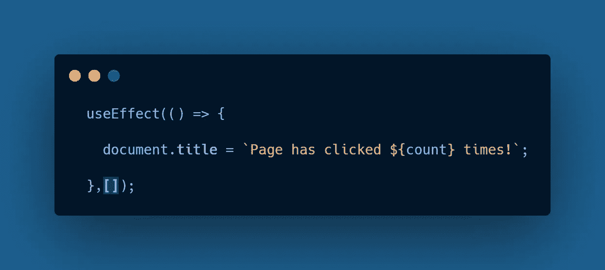

**Array Of Dependencies In useEffect**

## 语境

在功能组件中使用上下文相当容易，但是在类组件中需要一点理解。

## **1。类组件中的上下文:**

我们有一个与上面的例子相似的演示，其中我们解释了对 **useEffect 的需求。**我们有两个类组件**用户** & **ProfilePage** 和 **App.js** 中的一个对象，我们希望将它们传递给 **ProfilePage** 组件。

> *在****app . js****中我们定义了一个对象为****user email****，其中包含了一个我们需要向下传递的对象。*
> 
> *内****User . js****我们有****User****组件，我们必须在****profile page****组件&****profile page****组件中包含从访问电子邮件对象的所有代码*

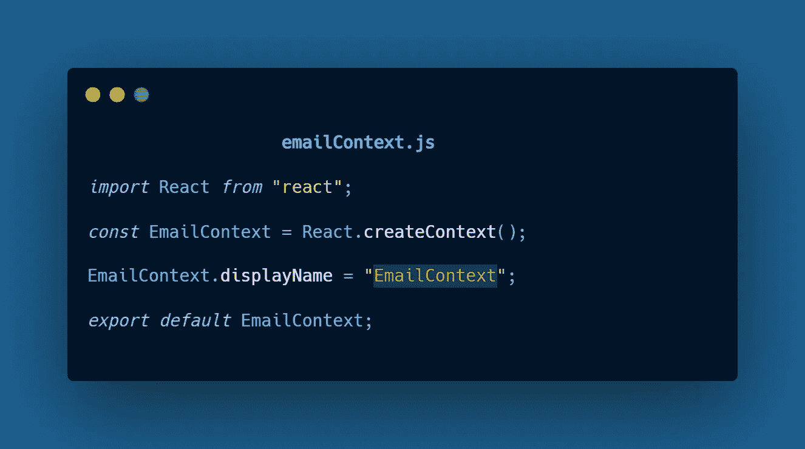

*   为了在 React 中使用上下文，我们必须创建一个包含我们上下文的所有方法的上下文文件，在这个演示中，我们有一个名为 **emailContext.js** (注意，我们可以将我们的上下文命名为任何东西)&使用 **React.createContext** 我们创建了一个新的上下文，并将其存储在一个 const 中，并将其导出为默认值。同样为了清楚地理解组件树，我们可以命名我们的上下文。(在演示中命名为 **EmailContext** )。

> 注意，根据我们的组件树，我们正在传递**用户**组件中的 **ProfilePage** 组件。

*   之后，我们需要查看两件事情，我们上下文中的**提供者**和**消费者**，在我们的例子中，App 组件将是提供者，ProfilePage 将是消费者，因为我们将对象从 *App* 传递到 *ProfilePage* 。
*   为了实现这个提供者和消费者术语，我们可以使用 **EmailContext** 组件，它有两个方法作为提供者和消费者。
*   在我们的例子中，App 组件作为提供者工作，我们使用了 **EmailContext。Provider** 方法，并将我们所有的代码包装在这个组件中。此外，我们有一个 **value** prop，它接受我们想要传递的值(在我们的例子中，我们传递的是 **userEmail** 对象)。

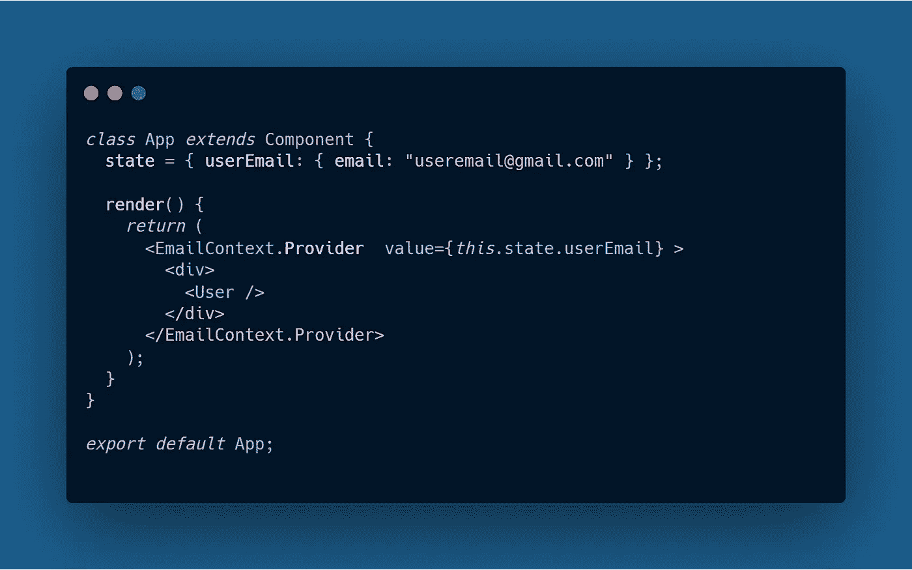

*   类似地，在 **ProfilePage** 组件内部，我们必须使用一个 **EmailContext。消费者**组件。但是在这个组件内部，我们必须使用 lambda 表达式将所有组件作为一个函数传递。
*   现在，使用我们在 lambda 表达式中添加的 **emailContext** 对象(它可以被命名为任何东西),我们只需要渲染 email 对象，因为我们将它添加在了 **div** 元素内的花括号中。

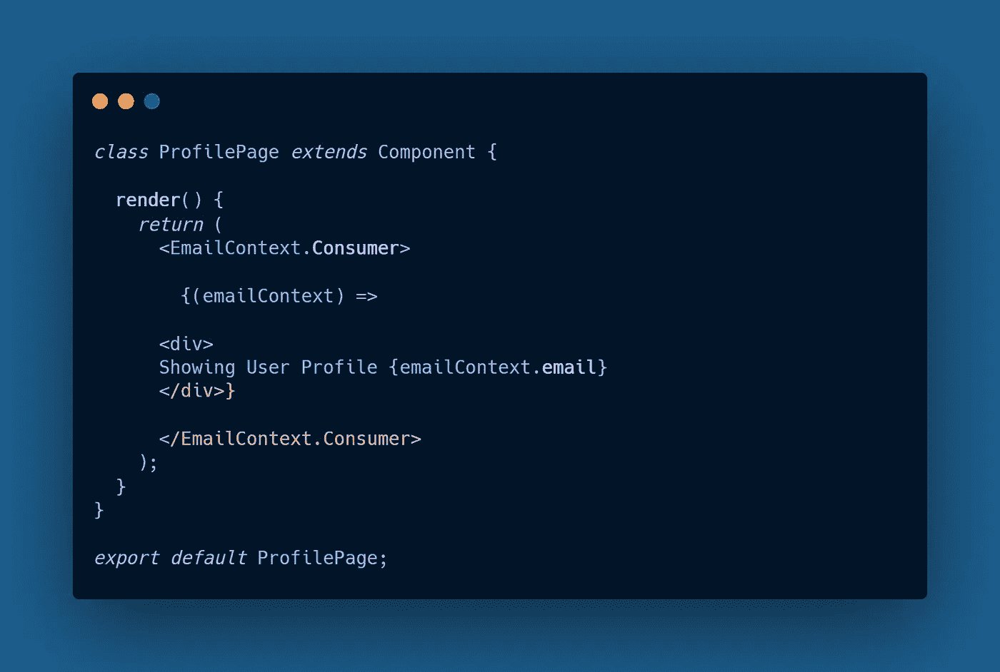

实现之后，我们可以在结果中观察到电子邮件的呈现。

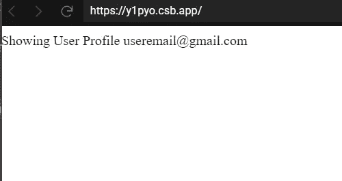

## 2.功能组件中的上下文:

在功能组件的情况下，我们可以很容易地使用上下文，

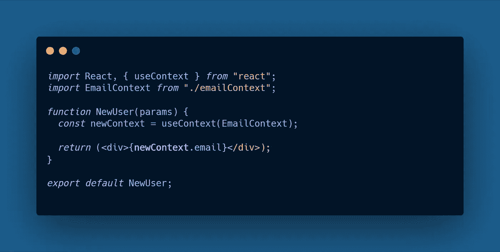

**NewUser.js**

例如，我们创建了一个名为 **NewUser、**的新组件，要访问这个组件中的 email 对象，我们可以使用 **useContext** 钩子。在这里，我们可以添加先前的上下文，并将该上下文存储在一个 **const** 中，并将其命名为 **newContext。**现在使用 **newContext** 变量，我们可以访问之前上下文中的所有值。

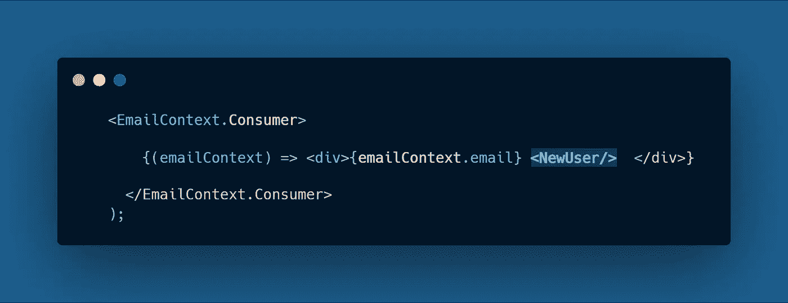

稍后，如果我们在 **ProfilePage** 组件中呈现 **NewUser** 组件，我们可以获得与上面相同的结果。

 [## 在 React Native 与 Formik 中构建表单

### React Native 中带有验证的更好的表单

medium.com](https://medium.com/javascript-in-plain-english/building-forms-in-react-native-with-formik-474be9d54a62)