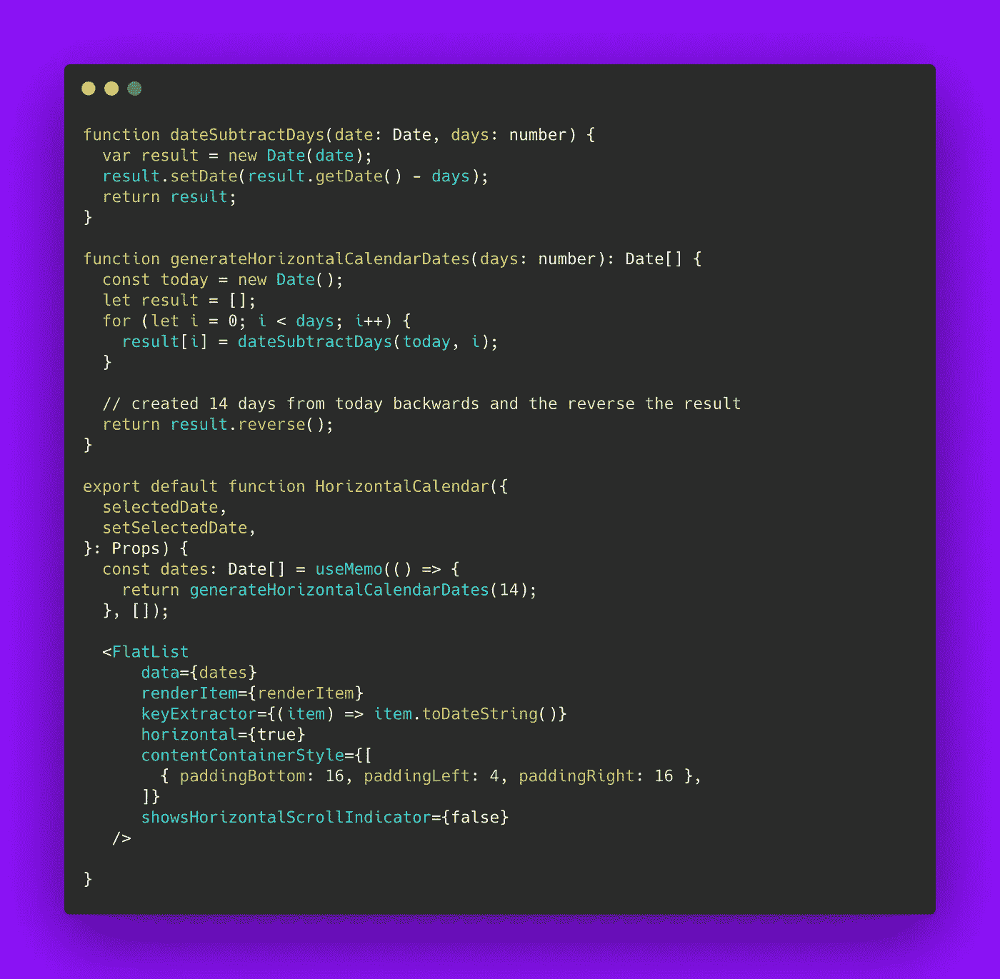
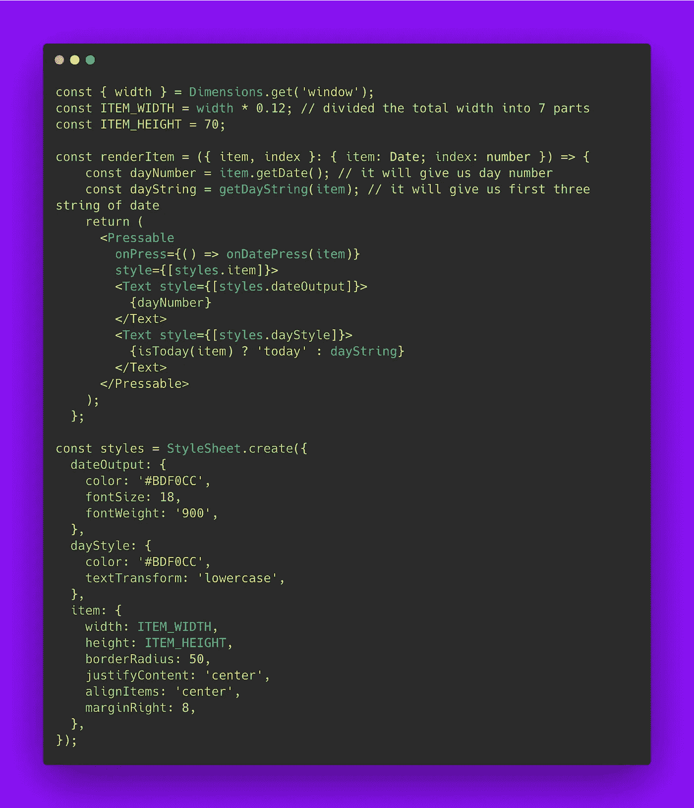
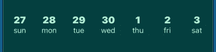
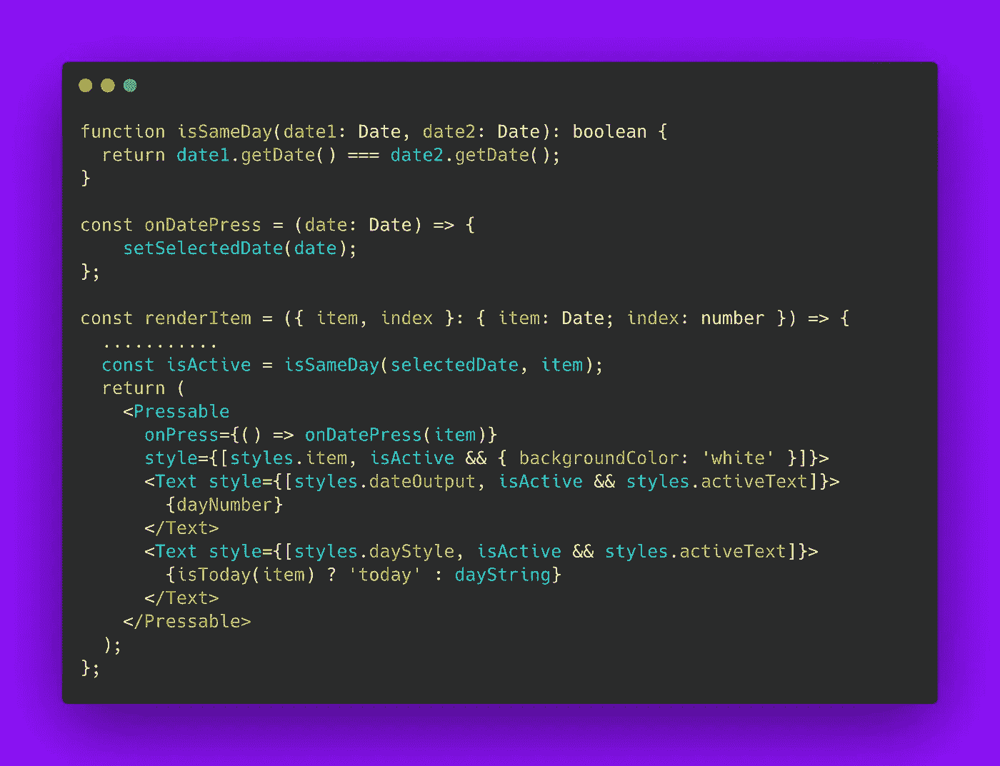
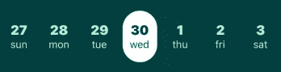

# React Native 中的水平日历组件

> 原文：<https://javascript.plainenglish.io/horizontal-calendar-component-in-react-native-16a4b5ee573f?source=collection_archive---------3----------------------->

## 在 React Native 中构建一个简单的水平日历组件。


Photo by [Estée Janssens](https://unsplash.com/@esteejanssens?utm_source=unsplash&utm_medium=referral&utm_content=creditCopyText) on [Unsplash](https://unsplash.com/s/photos/calendar?utm_source=unsplash&utm_medium=referral&utm_content=creditCopyText)

我最近在 React Native 中建立了一个简单的水平日历。今天在这篇文章中，我将分享我是如何实现的。

我们可以使用水平平面列表来呈现我的水平可滚动日历。首先，我用日期填充平面列表的数据。我生成 14 天(我们可以生成任意数量的日期)并将其填入平面列表。它看起来像下面这样:



这样，我们就可以在 14 天内准备好我们的平面清单。数据数组的类型为 **Date[]** ，其中第一个值是从今天起 14 天之前的一天，最后一个值是今天。现在让我们看看如何呈现列表，以便列表中始终有 7 天。我们需要在这里做一点计算，使它总是这样。这就是我们的渲染项目的样子——



好了，现在有了合适的样式，我们可以正确地渲染日历日期了。我们适当地设置平面列表项的高度、宽度和边距，以便在屏幕上调整 7 个日期。



our flat list of dates

现在，我们想向用户显示本周，而不是上周。我们可以通过正确设置平面列表来做到这一点。

```
*initialScrollIndex*={dates.length - 8}
```

因此它将加载当前周。如果我们想像这样使用 ***initialScrollIndex，*** ，我们需要将***getItemLayout***prop 添加到我们的平面列表中

```
*getItemLayout*={(_, index) => ({ length: ITEM_HEIGHT, offset: ITEM_OFFSET * index, index })}
```

最后，我们希望让用户能够选择日期，并以不同的样式显示所选的活动日期。因此，在呈现项目时，我们可以在印刷机上设置选定的日期，并检查该项目是否等于选定的日期。我们可以相应地使我们的约会活跃起来。



making selected date active

通过上面的检查，我们可以对选定的日期使用这样的样式。



active date

我用这个成分制作了一个简单的点心。这里 *可以找到 [*的链接。*多谢！](https://snack.expo.io/@saad-bashar/horizontal-calendar)*

*更多内容请看*[***plain English . io***](http://plainenglish.io/)