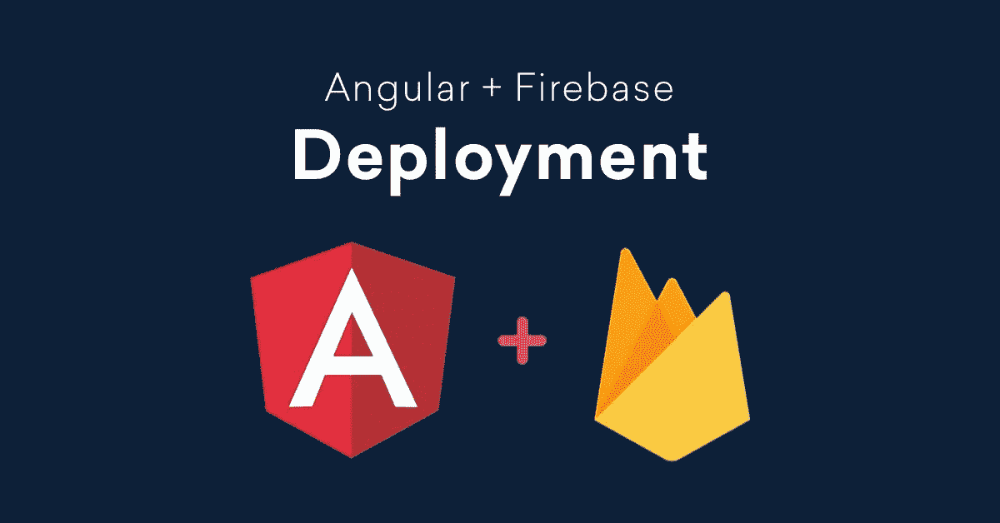
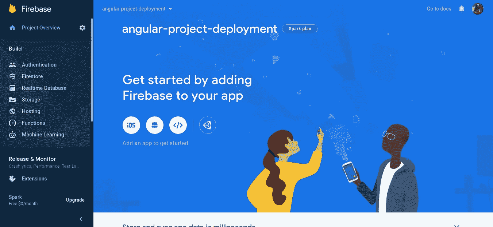
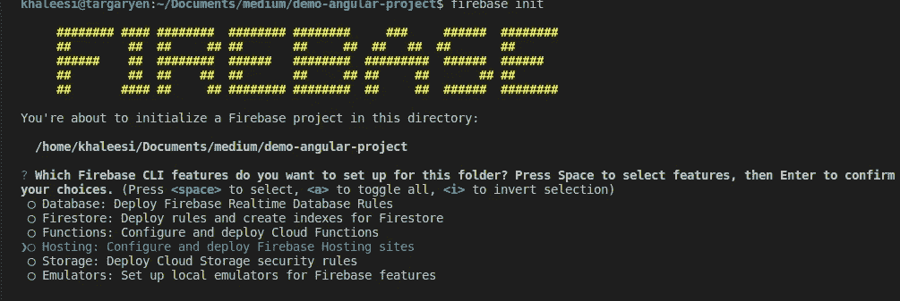
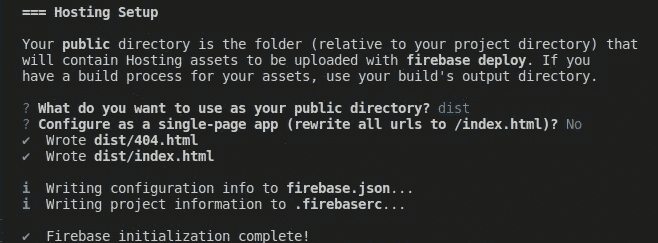
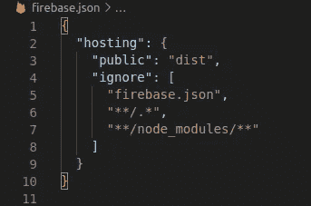
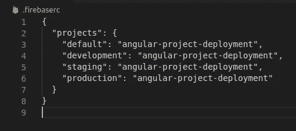

# 在 Firebase 上托管角度应用程序

> 原文：<https://javascript.plainenglish.io/host-angular-application-on-firebase-34944df14e28?source=collection_archive---------12----------------------->



Angular deployment on firebase

Firebase 是谷歌的平台，帮助我们开发移动和网络应用程序。Firebase 上有各种功能，如身份验证、托管、实时数据库、云功能、存储设施以及分析等等。

Angular 应用程序是可以部署在许多地方的 spa，如 GitHub pages、Firebase、AWS S3 或任何其他静态主机。因为 Firebase 在一个地方提供了许多功能，所以很容易管理您的 angular 应用程序。Firebase hosting 还提供了一个全球 CDN，用于更快的应用交付。

在这篇文章中，我们将使用 Angular 项目中的一个特性“托管”。

## 步骤 1: Firebase 项目创建

*   转到[https://console.firebase.google.com/](https://console.firebase.google.com/)并创建一个新项目



Firebase project Dashboard

## 步骤 2:角度项目设置

1.  从 npm 安装 Firebase 工具。我们需要安装 firebase 工具来通过 CLI 访问 firebase 项目。

```
npm install -g firebase-tools
```

2.使用 CLI 登录到您的 Firebase 帐户。这将打开一个窗口，你必须登录到你的谷歌帐户。

```
firebase login
```

3.初始化 Firebase 托管服务并选择托管。

```
firebase init
```



4.选择现有的项目设置，并单击您的项目名称，选择它作为该应用程序的默认项目。

5.您想将什么用作您的公共目录？这是 Firebase 复制和部署托管资产的地方。在 Angular 中，构件在“Dist”文件夹中生成。所以指定“dist”。

```
What do you want to use as your public directory?dist
```

6.配置为单页 app(将所有 URL 重写为/index.html)？如果您的申请是单页申请，请选择是，否则请选择否



Hosting setup in Angular project

你的托管设置是在你的 angular 项目中完成的。这在您的项目 1 中创建了 2 个文件。firebase.json 2。。firebaserc



Firebase.json file



.firebaserc file

Firebase.json 文件包含应用程序部署所需的所有配置。Firebase RC 文件根据您的环境指定不同的项目名称别名。

7.使用生产环境将您的应用程序构建成一个包。这将在您的项目中创建一个“dist”文件夹，生产环境在 environment.prod.ts 文件中指定

```
ng build --prod
```

8.在将应用程序部署到活动项目之前，您可以使用“Firebase serve”命令在本地测试它，然后使用以下命令部署您的应用程序。

```
firebase deploy
```

这将把您的应用程序部署到默认的 Firebase 项目中。为了指定特定的项目，请在命令中添加项目名称。

```
firebase deploy -P production
Or
firebase deploy -P staging
```

如果您想一起部署一个新特性，您可以使用消息来部署它，这样您就可以很容易地识别哪个部署具有哪个特性。

```
firebase deploy -m "Deploying the user contacts module."
```

就是这样。您的 angular 应用程序现在被部署到 Firebase。您可以通过“[https://your-project-name.firebaseapp.com/](https://angular-project-deployment.firebaseapp.com/)”进行访问。

Firebase 会自动为您提供一个 SSL 证书，尽管这可能需要 10 分钟。您可以随时为项目添加自定义域名。验证您的域名，并将 Firebase 提供的记录添加到您的 DNS 服务器，然后就可以了。

您可以通过“https://your-domain.com”访问您的应用程序。自定义域的 SSL 证书也将由 Firebase 免费提供。

*感谢您的阅读。欢迎在评论区寻求帮助。*

*更多内容尽在*[plain English . io](http://plainenglish.io/)