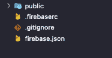
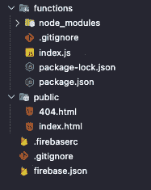

# 在 Firebase 上免费托管一个节点服务器

> 原文：<https://javascript.plainenglish.io/hosting-a-node-server-on-firebase-for-free-82c0d123e369?source=collection_archive---------3----------------------->

## 好吧，也许会有一点点费用，但实际上是免费的。


Photo by [Fernando Hernandez](https://unsplash.com/@_ferh97?utm_source=unsplash&utm_medium=referral&utm_content=creditCopyText) on [Unsplash](https://unsplash.com/s/photos/programming-minimal?utm_source=unsplash&utm_medium=referral&utm_content=creditCopyText)

# 问题是

最近，我开始创建自己的网站(是的，对于一个软件开发人员来说，早就应该这样做了),我立刻遇到了所有这些问题:编码堆栈、托管、模板；仅举几个例子。我最大的问题似乎是托管，因为我不想在托管一个可能不会收到太多流量的网站上超支。

# 解决方案

引入 Firebase 托管。

你不仅可以获得免费的静态网站托管，你还可以免费托管一个节点服务器。

> 这里假设您已经安装了 Firebase CLI，并且在 Firebase 上有一个帐户设置，如果没有，您可以按照[这个](https://firebase.google.com)创建一个配置文件，然后按照[这个](https://firebase.google.com/docs/cli)设置 CLI。

# 创建项目

> 如果你不想经历创建项目和设置 Firebase 的过程，你可以从我的 GitHub repo 这里拉一个模板:[https://github.com/DarrynJ/nodejs-firebase-backend](https://github.com/DarrynJ/nodejs-firebase-backend)

好了，一旦你启动并运行了 Firebase CLI，导航到你的项目文件夹并打开你的终端。

有趣的事情来了！

您希望首先使用以下命令初始化 Firebase 主机:

```
firebase init hosting
```

您应该会遇到类似以下的情况:

```
You're about to initialize a Firebase project in this directory:/{your project directory}/{project name}=== Project SetupFirst, let's associate this project directory with a Firebase project.
You can create multiple project aliases by running firebase use --add, 
but for now we'll just set up a default project.? Please select an option: (Use arrow keys)
❯ Use an existing project 
  Create a new project 
  Add Firebase to an existing Google Cloud Platform project 
  Don't set up a default project
```

如果您已经在控制台中创建了 Firebase 项目，选择**使用现有项目，**否则选择**创建新项目**并按照提示进行操作。

一旦完成，你应该有一个如下的文件夹结构:



VSCode folder structure

现在，您想使用以下命令初始化 Firebase 函数:

```
firebase init functions
```

您应该会遇到以下情况:

```
=== Project SetupFirst, let's associate this project directory with a Firebase project.
You can create multiple project aliases by running firebase use --add, 
but for now we'll just set up a default project.=== Functions SetupA functions directory will be created in your project with a Node.js
package pre-configured. Functions can be deployed with firebase deploy.? What language would you like to use to write Cloud Functions? (Use arrow keys)
❯ JavaScript 
  TypeScript
```

为了简单起见，选择 JavaScript，然而前面提到的 GitHub 项目使用的是 TypeScript。

我想这完全取决于你的喜好。

按照提示操作，直到一切完成，并且您看到了以下更新的文件夹结构:



Updated folder structure.

就这样，您已经设置好了您的主机和功能，并且几乎准备好部署到 Firebase 了。

要设置您的服务器，打开**功能**文件夹下的`index.js`。初始化应该添加几行注释掉的代码。您可以取消对这些行的注释，并使用`firebase serve`运行您的项目，您可以看到您的项目在运行。

您可以继续部署您的项目，并在真实环境中查看它的运行情况，但首先，让我们真正将它变成一个后端服务器。

首先，使用以下命令安装 **express** :

```
npm i express --save
```

一旦安装了 express，在 **index.js** 文件中，添加以下代码行:

```
const functions = require("firebase-functions");const express = require("express");const server = express(); server.get("/some-data", (*request*, *response*) => { *response*.send("Hello world");}); *exports*.app = functions.https.onRequest(server);
```

这只是添加了一个简单的 express 服务器，它处理端点请求并返回 **Hello World** 作为响应。

最后，您希望用以下配置更新 **firebase.json** 文件:

```
"rewrites": [ { "source": "**", "function": "app" }],
```

> 请确保将其置于您的**“公共”**配置设置下。

这样做的目的是指定所有的**重写**都将指向你的**函数** **应用**。

# 部署您的项目

部署您的项目很简单，只需要执行一行命令:

```
firebase deploy
```

这将执行您的主机和功能到您的中的 **Firebase 应用程序**的部署。 **firebaserc** 文件。

在这里，您可能需要将您的计划更新为**现收现付**计划。

> 如果您的请求没有超过该计划规定的最低限额，您最终可能会免费获得所有东西。只是一定要监控你的流量。

# 结论

仅此而已。您已经创建了一个节点服务器项目，并部署到 Firebase，几乎没有任何托管开销。

用 Firebase 托管有一些好处，特别是如果你只是想托管一个静态网站，但是我会让你自己去弄清楚。这样做的目的是向您展示使用 Firebase 作为托管平台来启动和运行节点服务器是多么容易和快速。

请随时关注我在 [GitHub](https://github.com/DarrynJ) 上的文章，查看我添加一个[节点服务器的实现，该服务器使用 Firebase 作为托管平台](https://github.com/DarrynJ/nodejs-firebase-backend)。

感谢您的阅读！

*更多内容请看*[***plain English . io***](http://plainenglish.io)