# 在 Heroku 上托管 Node.js 应用不到 5 分钟

> 原文：<https://javascript.plainenglish.io/hosting-node-js-app-on-heroku-in-less-than-5-mins-bc7ce244c8d0?source=collection_archive---------1----------------------->


Photo by [Juanjo Jaramillo](https://unsplash.com/@juanjodev02?utm_source=medium&utm_medium=referral) on [Unsplash](https://unsplash.com?utm_source=medium&utm_medium=referral)

# **简介**

我还记得，作为一个初学者，我一直想托管我的网站。我只是痴迷于建立一个网站，并拥有一个我可以从任何地方访问的 URL。让我们看看如何免费做。

# **先决条件**

*   对 Node.js 和 GitHub 的基本了解
*   Git 已安装
*   Heroku 免费账户

# **我们正在建造什么**

在这个博客中，我们将用最少的步骤在 Heroku 上托管一个 Node.js 网站。Heroku 文档非常好，但作为一个初学者，我发现它很难，因为它详细地解释了一切，提供了不必要的解释，吓走了我。本博客仅包含托管 Node.js 应用程序的必要且易于遵循的步骤

> 尽管我们将托管一个简单的 Node.js 应用程序，但您可以将其扩展为包含多个路由器、控制器、数据库等的节点应用程序。

如果你的 app 中需要数据库，可以使用 [MongoDB Atlas](https://www.mongodb.com/cloud/atlas/register) 。

# **设置**

*   打开 cmd
*   检查节点是否已安装

```
node -v
```

*   创建一个项目目录并放入 cd。

```
mkdir nodejs-heroku
cd nodejs-heroku
```

*   初始化项目。该命令将在项目根目录下创建一个 package.json。

```
npm init -y
```

*   安装所需的 npm 软件包

```
npm i express
```

*   在项目目录下创建 **index.js** 文件。这就是你的文件夹应该有的样子。

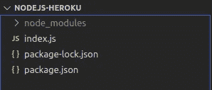

*   将以下代码添加到 index.js 中。基本上，这些代码将运行一个服务器，当我们在浏览器中访问它时，它将显示“Hello World”。

*   cd 到项目目录，并通过在 cmd 中输入以下命令来运行服务器

```
node index.js
```

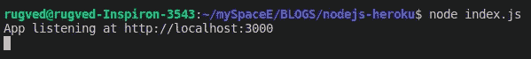

*   现在访问 [http://localhost:3000/](http://localhost:3000/) 查看结果。


*   现在想想吧。你手动执行了“ **node index.js** ”命令，但是当我们将它托管在 Heroku 上时，Heroku 将如何知道需要执行什么脚本。我们来看看怎么做。

打开" **package.json"** 文件，你会看到"**脚本**"键。

```
"scripts": {
    "test": "echo \"Error: no test specified\" && exit 1"
  },
```

替换为:

```
"scripts": {
    "start": "node index.js"
},
```

要理解我们这样做的原因，请阅读以下内容，您将会看到，要告诉 Heroku 要执行什么，我们需要添加 make Procfile 或添加我们要执行的命令到“**package . JSON**中的“ **start** ”标记中。

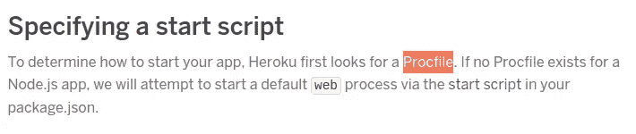

*   我们需要做的另一件事是告诉 Heroku 我们想要使用哪个版本的 Node.js。

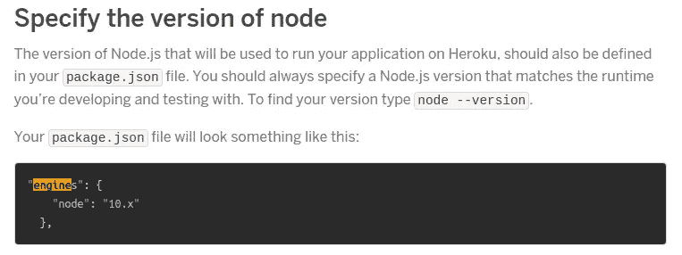

[https://devcenter.heroku.com/articles/deploying-nodejs#prerequisites](https://devcenter.heroku.com/articles/deploying-nodejs#prerequisites)

*   添加上面的"**引擎**"标记，完成后，这就是" **package.json"** 应该的样子。

# 正在初始化 git

这里，我不解释每个命令，因为我假设您知道 git 的基础知识。即使你不知道，现在就执行它们。

```
git init
git add .
git commit -m "first commit"
```

# **Github**

*   访问[https://github.com/](https://github.com/)并登录
*   创建新的存储库。您将看到这样一个页面。

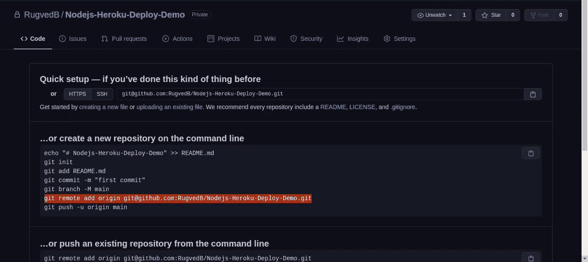

*   复制上图中我高亮显示的线条。根据用户名和项目名称，您的情况会有所不同。对我来说，这是:

```
git remote add origin git@github.com:RugvedB/Nodejs-Heroku-Deploy-Demo.git
```

*   将其粘贴到 cmd 中，然后按回车键。这样做将告诉 git，无论何时我们执行任何动作，比如推送、拉取代码，我们都希望它与我们刚刚提到的这个库相关。
*   现在把代码推给 GitHub。

```
git push origin master
```

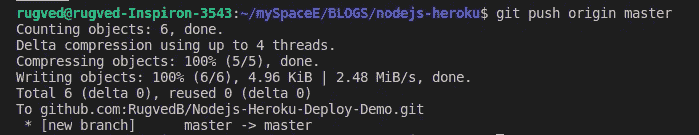

*   成功执行上述命令后，刷新 GitHub 页面，你会看到你的代码已经被推送到 GitHub 了。

*我们这样做是为了以后可以告诉 Heroku 参考这个 GitHub 库的代码。*

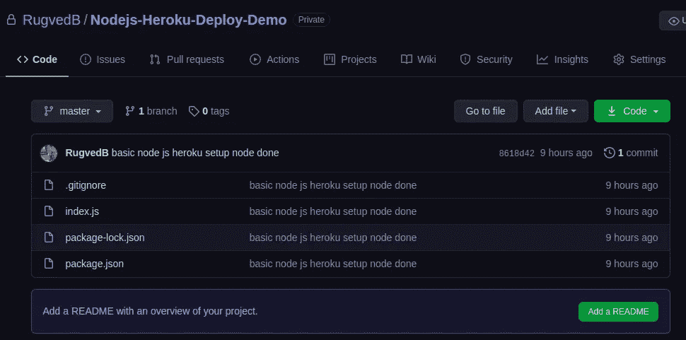

[https://github.com/RugvedB/Nodejs-Heroku-Deploy-Demo](https://github.com/RugvedB/Nodejs-Heroku-Deploy-Demo)

# 赫罗库

*   通过在 cmd 中执行以下命令登录 Heroku。
    如果您没有安装 Heroku CLI，请访问此处的。

```
heroku login
```

*   登录成功后，进入[https://dashboard.heroku.com/apps](https://dashboard.heroku.com/apps)你会看到在这个账号上创建的应用列表。
*   点击右上角的“**新建**”->“**创建新应用**”按钮。
*   为您的应用程序命名，然后单击“**创建应用程序**”。请注意，这需要是一个唯一的名称。

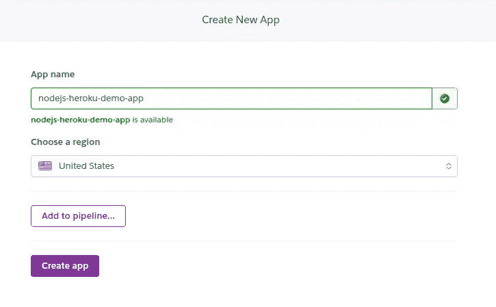

*   您将被重定向到一个新页面，在该页面中找到“**部署方法**”部分，然后单击 **Github** 。
*   输入存储库名称->单击搜索->选择正确的存储库->单击连接。

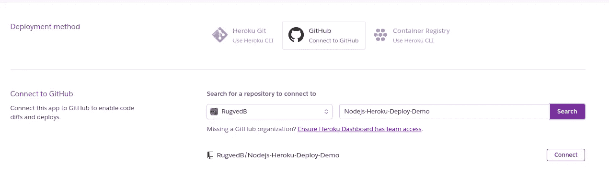

*   点击“**启用自动部署**”按钮，这意味着无论何时你添加任何代码到你的 GitHub 库，Heroku 也会更新你的托管应用。
*   最后，点击“**部署分支**”。等待几分钟，让部署过程完成。
*   成功部署网站后，您将会看到如下所示的成功消息。

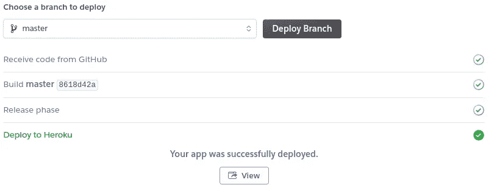

*   点击**查看**访问您主持的网站。


即使这是一个非常简单的应用程序，也可以按照上面的步骤来构建具有复杂结构的应用程序。

耶！这就是托管 Node.js 应用程序所需的全部内容。

# **设置配置变量**

**万事俱备。除非有要求，否则您不需要遵循此操作。**

下面是一个最常见问题的答案。

如果你已经添加了一些秘密，如电子邮件、密码、MongoDB Atlas URI 等，那么在代码中，你不应该直接粘贴它。相反，将以下内容放入代码中，并在 Heroku " **config vars"** 部分[此处](https://dashboard.heroku.com/apps/nodejs-heroku-demo-app/settings)设置其值。

例如:

```
// In the code
process.env.EMAIL_PASSWORD
```

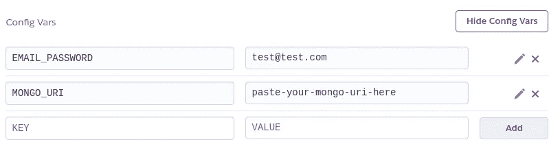

Setting config vars on settings page

**感谢您的阅读！如果你觉得这有帮助，请鼓掌！**

*可选地，您可以使用外部工具* *跟踪* [*Heroku 日志，通过收集 dynos 和 buildpacks 日志来识别应用程序使用和性能的趋势和模式。*](https://www.papertrail.com/solution/heroku-logging/)

# 结论

我们已经成功地学习了如何部署 Node.js 应用程序以及如何在 Heroku 上设置配置变量。

关于该代码，您可以访问:

 [## rug vedb/Nodejs-Heroku-Deploy-Demo

### 此报告用于演示在 heroku 上托管 node.js 应用程序。阅读博客的步骤。…

github.com](https://github.com/RugvedB/Nodejs-Heroku-Deploy-Demo) 

*更多内容请看*[*plain English . io*](http://plainenglish.io/)