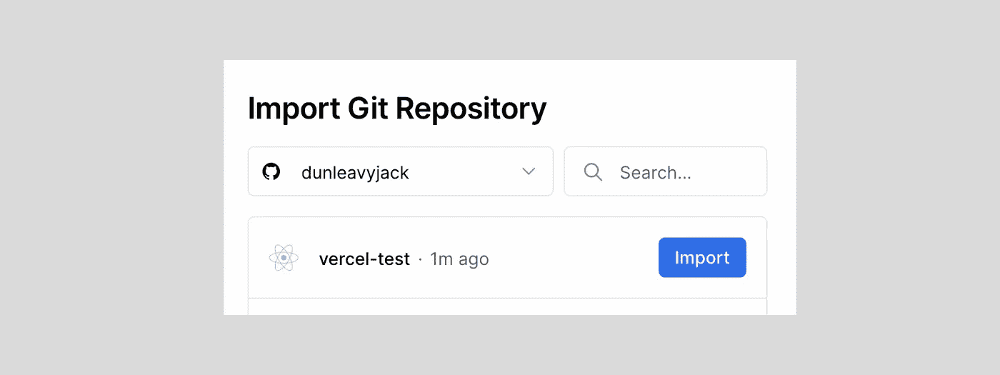
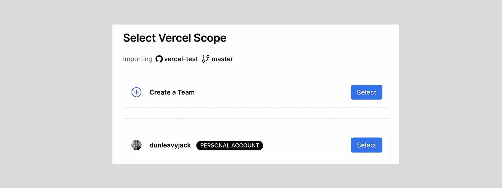
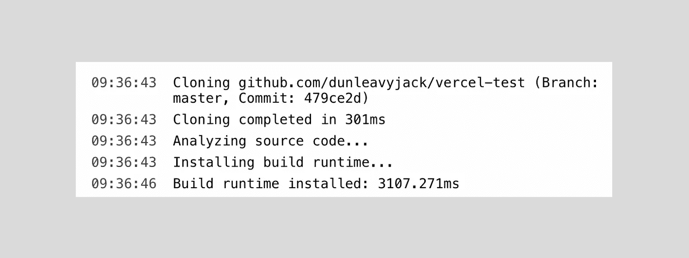
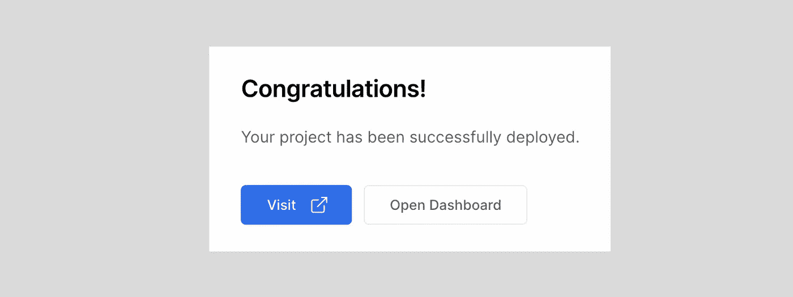

# 使用 Vercel 托管您的 Web 应用程序

> 原文：<https://javascript.plainenglish.io/hosting-your-web-app-with-vercel-8ef3f1fbb5ff?source=collection_archive---------20----------------------->

## 你已经完成了一个想与全世界分享的个人项目。下一步是什么？

有几个选项可以让你的项目真正上线( [Heroku](https://www.heroku.com/) 和 [Netlify](https://www.netlify.com/) 是另外两个大牌)，但我一直使用 [Vercel](https://www.vercel.com/) 来托管我所有的个人项目。**它快速、免费，与 React 配合使用效果很好，设置只需一秒钟。**

# 第一步。初始化 Git 存储库

如果您还没有，您需要将您的 web 应用程序添加到 GitHub 上的存储库中。Vercel 将直接与存储库通信，您最终将能够:

1.  创建应用的预览版和生产版
2.  将更改直接推送到自动构建

# 第二步。与 Vercel 链接

[在 Vercel 上创建一个账户](https://www.vercel.com/)，并从主仪表板上选择**新项目**。如果你还没有，你会被要求链接你的 GitHub 账户并改变它的隐私设置，这样 Vercel 就可以访问你的存储库。

一旦两个帐户连接起来，您将看到一个下拉列表，列出您当前的存储库，看起来像上面的那个。然后，选择项目的名称，并设置其范围，如下所示:

我选择了回购的主分支，因为这只是一个个人项目，我只需要提供对我个人账户的访问。之后，Vercel 可以开始克隆存储库和构建应用程序。

Vercel 工作速度很快，只需要几秒钟。

一旦您的应用程序部署完毕，您就可以像往常一样，通过将更改推送到项目的 GitHub 资源库来更新生产版本。Vercel 会自动更新构建，您会收到一封电子邮件，通知您它已经更新了站点。

相当简单:)

*更多内容请看*[***plain English . io***](https://plainenglish.io/)