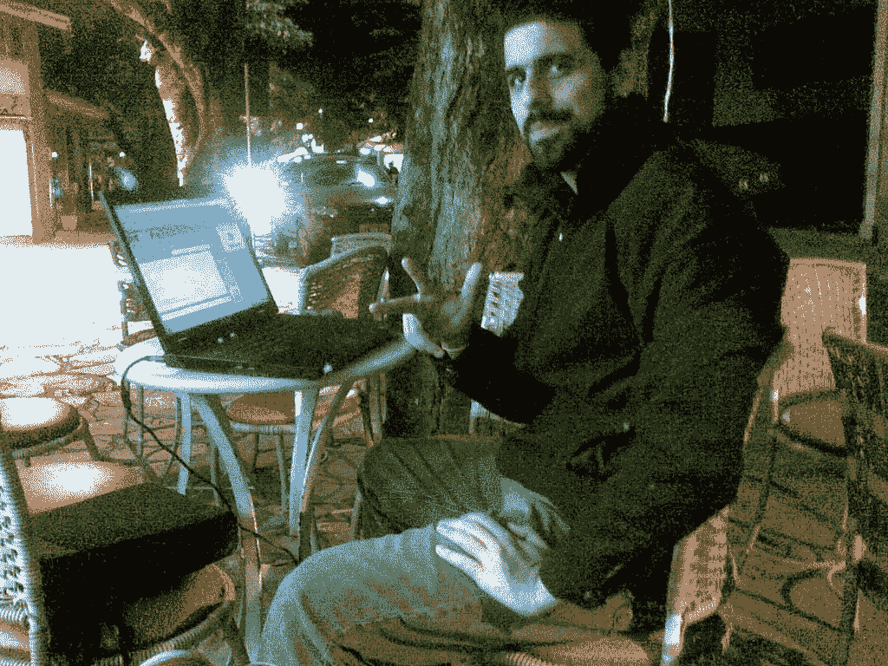
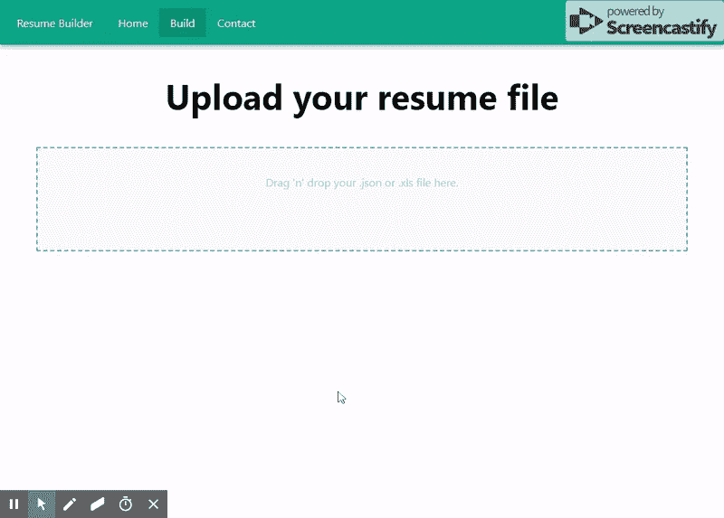

# 一个开源的 React 项目如何让我在国外找到一份工作

> 原文：<https://javascript.plainenglish.io/how-an-open-source-react-project-landed-me-a-job-abroad-e2e863d5920e?source=collection_archive---------11----------------------->

对于科技行业的人来说，为了寻找更好的工作而在全球范围内流动是很正常的，甚至只是为了流动而流动，这就是流行的*数字游牧者*。我不知道我到底想做什么，但我知道最终，我会离开巴西去国外的某个地方生活。

Me nomading back in the days (not really)

# 这一切是如何开始的

大约在 2016 年，我开始从事一些个人项目，并在 GitHub 上发布它们，比如针对 Magento 的 [Magento 聊天机器人](https://github.com/blopa/Magento-Chatbot)扩展和[合同生成器](https://github.com/blopa/Contract-Builder/)，我制作它们是为了试用 VueJs，并帮助一位律师朋友更快地创建新的法律合同。

我也一直在寻找黑客马拉松来参加，只是为了提高我的技能，练习我的英语，并认识业内的新朋友，在那些搜索中我发现了 [VanHackathon](https://blog.vanhack.com/blog/the-vanhackathon/) ，这是由 [VanHack](http://vanhack.com/) 制作的黑客马拉松，所以我和几个朋友决定加入它，并为 Shopify 制作一个[聊天机器人集成(我们甚至为它制作了一个](https://github.com/VanHackathon/botStoreGenesis)[宣传视频](https://www.youtube.com/watch?v=4RnIj8g8vDw))，为此， 我们最终赢得了一个 [VanHack Premium](https://vanhack.com/premium) 账户，这给了我们一些额外津贴和一次独家休息。

# 发现我的“市场价值”

快进到 2018 年，我收到了搬到圣保罗的工作邀请。然而，当时我喜欢我现在的雇主，所以我拒绝了这份工作。我收到了一份工作，这让我想在其他公司测试一下我的面试技巧。

所以我开始申请几个职位空缺，我努力处理我的简历的不同版本，这是为我申请的每个职位量身定制的😫。厌倦了每周多次手动来回修改我的简历，我决定创建一个工具来帮助我，这就是[简历生成器](https://resume-builder.js.org/)的诞生。你可以在这里查看它的源代码[(别忘了启动它)。](https://github.com/blopa/Resume-Builder)

# 与世界分享我的项目

经过几次迭代后，我对结果非常满意，所以我决定添加使用定制模板的选项(不幸的是 v2 上还没有)，并在 VanHack Slack 上分享它，因为我认为它可能对更多人有用。所以我分享了一下，然后就忘记了。

几天后，一位招聘人员联系了我，祝贺简历生成器项目，并问我是否知道 React。简历生成器是用 React 开发的，这是我的第一个 React 应用程序，所以我告诉了她，她很高兴，印象深刻，所以她帮我预约了一些荷兰公司的面试，万岁。我很兴奋。

所有这一切都是因为在成千上万试图在国外找到工作的开发人员中，我能够脱颖而出要感谢一个开源项目，老实说，这个项目甚至没有使用 React 的最佳实践或类似的东西，但它很有用，向招聘人员展示了我擅长解决问题，我在学习新东西方面没有问题，并且我在乎有一份好的简历。

# 被录用了

回到面试，其中一家公司给了我一个 React 挑战，让我构建一个问答单页应用程序。因为我已经用 React 编写了几个星期的代码，所以我能够毫无困难地完成这个挑战。这让我采访了该公司的技术负责人，之后又采访了首席技术官，事情看起来很好。

有一天，我在参加一个黑客马拉松时，收到了一封电子邮件，里面有一份工作邀请我去阿姆斯特丹。那时我并不打算离开我的雇主，我刚刚加薪，而且我在一个很好的项目中，但是我知道这样的机会不要每天都敲你的门，所以我说好，剩下的就是历史了🇳🇱.

# 结论

当我回顾我如何在阿姆斯特丹得到这份工作时，这一切都归结为一个简单的开源项目，代码平平，但它不仅仅是一份写有我名字的简历和一份活动和技能的列表，当所有其他简历都在做同样的事情时，这些活动和技能很难脱颖而出。

如果你想去国外工作，你需要把自己放在那里，不一定只是做一个开源项目，而是以一种对你有意义的方式扩大你的投资组合。

你可以写中型文章，制作 YouTube 视频，个人网站(就像这个)，等等。不要放弃。找一份新工作是一个数字游戏，需要时间，所以为什么不利用这段时间来提高你的一些技能呢？

这就是我今天给你的全部，我希望我的故事能激励你找到你梦想的工作。

*最初发布于*[*https://pablo . gg*](https://pablo.gg/en/blog/coding/how-an-open-source-project-landed-me-a-job-abroad/)*。*

*更多内容看*[***plain English . io***](http://plainenglish.io)